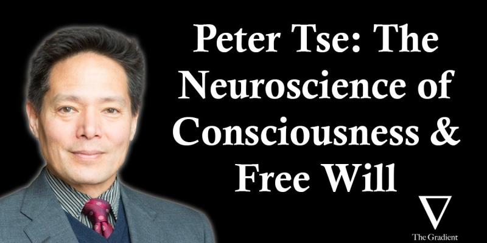

I have listened to many fascinating interviews on The Gradient podcast. This recent dialog between Professor Peter Tse and Daniel Bashir on consciousness from the perspective of neuroscience is especially intriguing! Some rough notes I can remember of:

* Danger of using metaphors in science: neurons as toilets
* "Deadly weapons" in the fights of seeking truths:
  - Mathematical logic: mathematical contradiction
  - Science: falsification
* Unformulatable questions; leap of faith is okay, but is out of bounds of science
* Physical determinism vs. free will; Mental causation exclusion problem, rebuttal to Jaegwon Kim [[1]](#ref-1).
* Bridging the physical world and mental world — mental causation as a filtering process from possibilia to actualia
* Verbs vs. nouns in modeling mind; verbs are largely neglected in AI and (less so) in neuroscience
* Attention is a feature glue — scaffolding — chunking
* Evolution basis of consciousness

A shoutout for The Gradient and especially Daniel Bashir: I can't think of any one episode that I didn't come out amazed by the depth and the breadth of the discussion! I highly recommend the podcast and hope you can enjoy and support them!

*Originally posted on [LinkedIn](https://www.linkedin.com/posts/benjaminhan_peter-tse-the-neuroscience-of-consciousness-activity-7145294773619154944-N4iH).*

---

## References

[1] Internet Encyclopedia of Philosophy. "Mind and the Causal Exclusion Problem." <https://iep.utm.edu/mind-and-the-causal-exclusion-problem/>
