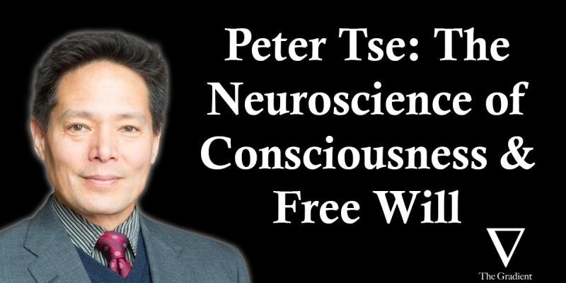

I have listened to many fascinating interviews on [The Gradient Podcast](https://thegradient.pub/). [This recent dialog](https://thegradientpub.substack.com/p/peter-tse-the-neuroscience-of-consciousness) between Professor [Peter Tse](https://sites.dartmouth.edu/peter/) (Cognitive Neuroscience, [Dartmouth](https://en.wikipedia.org/wiki/Dartmouth_College)) and host [Daniel Bashir](https://twitter.com/spaniel_bashir) on consciousness from the perspective of neuroscience is especially intriguing! Some rough notes I can remember of:

* Danger of using metaphors in science: [neurons as toilets](#ch-gestalt-psychology)
* ["Deadly weapons" in the fights of seeking truths](#ch-falsifiability-and-scientific-questions-transition-from-phys):
  - Mathematical logic: mathematical contradiction
  - Science: [falsification](https://en.wikipedia.org/wiki/Falsifiability)
* Unformulatable questions; [leap of faith](#ch-falsifiability-and-scientific-questions-transition-from-phys) is okay, but is out of bounds of science
* Physical [determinism](https://en.wikipedia.org/wiki/Determinism) vs. [free will](https://en.wikipedia.org/wiki/Free_will); [mental causation exclusion problem](#ch-jaegwon-kim-s-exclusion-argument), rebuttal to [Jaegwon Kim](https://en.wikipedia.org/wiki/Jaegwon_Kim) [[1]](#ref-1).
* Bridging the physical world and mental world — [mental causation as a filtering process from possibilia to actualia](#ch-criterial-causation-and-physicalism-mental-causation)
* [Verbs vs. nouns in modeling mind](#ch-prof-tse-s-perspective-on-modern-ai-systems-differences-with); verbs are largely neglected in AI and (less so) in neuroscience
* [Attention as a feature glue](#ch-prof-tse-s-perspective-on-modern-ai-systems-differences-with) ([Anne Treisman](https://en.wikipedia.org/wiki/Anne_Treisman)) — [scaffolding](https://en.wikipedia.org/wiki/Instructional_scaffolding) — [chunking](https://en.wikipedia.org/wiki/Chunking_(psychology))
* [Evolutionary basis of consciousness](#ch-prof-tse-s-perspective-on-modern-ai-systems-differences-with)

A shoutout for The Gradient and especially Daniel Bashir: I can't think of any one episode that I didn't come out amazed by the depth and the breadth of the discussion! I highly recommend the podcast and hope you can enjoy and support them!

---

*Originally posted on [LinkedIn](https://www.linkedin.com/posts/benjaminhan_peter-tse-the-neuroscience-of-consciousness-activity-7145294773619154944-N4iH).*

## Transcript

Below is the full episode dialog, taken from [Substack's auto-generated transcript](https://thegradientpub.substack.com/p/peter-tse-the-neuroscience-of-consciousness) (ASR, speaker-diarized) and reorganised for readability. The dialog is verbatim — no words added, cut, or reworded — but several layers of editorial structure have been added on top:

- **Chapter index** reproducing the Outline from the episode page, with each timestamp anchored to the corresponding section below.
- **H4 subsections** for Bashir→Tse question-and-answer exchanges within chapters, with editorial summary titles derived from Bashir's question.
- **Sentence-level paragraph breaks** so Tse's long monologues are readable as prose rather than run-on blocks.
- **Speaker labels** (`Daniel Bashir` / `Peter Tse`) attached to the diarisation classes — Substack's ASR only assigns anonymous `SPEAKER_00` / `SPEAKER_01` tags.
- **ASR corrections** for proper nouns the transcription service mangled, wrapped in `[[fix: original → corrected]]` markers so the edit is visible rather than silent.
- **First-mention links** on salient philosophers, scientists, concepts, works, institutions, and historical events — routed to the most authoritative source available (personal or lab homepage, institutional faculty page, or Google Scholar profile for living researchers; Wikipedia for historical figures, named events, books, and general concepts).

The ASR itself is unedited beyond the named fixes, so punctuation and occasional dropped words in Tse's longer monologues are preserved as the service produced them.

### Chapter index

- [00:00 — Intro](#ch-intro)
- [01:45 — Prof. Tse's background](#ch-prof-tse-s-background)
- [03:25 — Early experiences in physics/math and philosophy of physics](#ch-early-experiences-in-physics-math-and-philosophy-of-physics)
- [06:10 — Choosing to study neuroscience](#ch-choosing-to-study-neuroscience)
- [07:15 — Prof Tse's commitments about determinism](#ch-prof-tse-s-commitments-about-determinism)
- [10:00 — Quantum theory and determinism](#ch-quantum-theory-and-determinism)
- [13:45 — Biases/preferences in choosing theories](#ch-biases-preferences-in-choosing-theories)
- [20:41 — Falsifiability and scientific questions, transition from physics to neuroscience](#ch-falsifiability-and-scientific-questions-transition-from-phys)
- [30:50 — How neuroscience is unusual among the sciences](#ch-how-neuroscience-is-unusual-among-the-sciences)
- [33:20 — Neuroscience and subjectivity](#ch-neuroscience-and-subjectivity)
- [34:30 — Reductionism](#ch-reductionism)
- [37:30 — Gestalt psychology](#ch-gestalt-psychology)
- [41:30 — Introspection in neuroscience](#ch-introspection-in-neuroscience)
- [45:30 — The preconscious buffer and construction of conscious experience, color constancy](#ch-the-preconscious-buffer-and-construction-of-conscious-experi)
- [53:00 — Perceptual and cognitive inference](#ch-perceptual-and-cognitive-inference)
- [55:00 — AI systems and intrinsic meaning](#ch-ai-systems-and-intrinsic-meaning)
- [57:15 — Information vs. meaning](#ch-information-vs-meaning)
- [1:01:45 — Consciousness and representation of bodily states](#ch-consciousness-and-representation-of-bodily-states)
- [1:05:10 — Our second-order free will](#ch-our-second-order-free-will)
- [1:07:20 — Jaegwon Kim's exclusion argument](#ch-jaegwon-kim-s-exclusion-argument)
- [1:11:45 — Why Kim thought his own argument was wrong](#ch-why-kim-thought-his-own-argument-was-wrong)
- [1:15:00 — Resistance and counterarguments to Kim](#ch-resistance-and-counterarguments-to-kim)
- [1:19:45 — Criterial causation](#ch-criterial-causation)
- [1:23:00 — How neurons evaluate inputs criterially](#ch-how-neurons-evaluate-inputs-criterially)
- [1:24:00 — Concept neurons in the hippocampus](#ch-concept-neurons-in-the-hippocampus)
- [1:31:57 — Criterial causation and physicalism, mental causation](#ch-criterial-causation-and-physicalism-mental-causation)
- [1:40:10 — Daniel makes another attempt to push back](#ch-daniel-makes-another-attempt-to-push-back)
- [1:45:47 — More on AI](#ch-more-on-ai)
- [1:47:05 — Prof Tse's perspective on modern AI systems, differences with human cognition](#ch-prof-tse-s-perspective-on-modern-ai-systems-differences-with)
- [2:17:25 — Consciousness, attention, spirituality](#ch-consciousness-attention-spirituality)
- [2:20:10 — Prof Tse's hopes for AI](#ch-prof-tse-s-hopes-for-ai)
- [2:23:30 — Outro](#ch-outro)

### 00:00 — Intro {#ch-intro}

#### How do neuroscientists think about cognition, consciousness, and many of the other aspects of…

**Daniel Bashir:** How do neuroscientists think about cognition, consciousness, and many of the other aspects of mind that interest those of us who work on and think about AI?

My guest today is very well positioned to answer these questions. Peter Tse is Professor of Cognitive Neuroscience and Chair of the Department of Psychological and Brain Sciences at [Dartmouth College](https://en.wikipedia.org/wiki/Dartmouth_College).

His work looks at the neural bases of our phenomenal experience, and he's especially interested in the processing that goes into the construction of conscious experience prior to our awareness. This was a really fascinating conversation for me. Professor Tse is not just a brilliant scientist, but a very well-rounded intellectual who has thought a great deal about the philosophy of science.

In this episode, you'll hear some of his perspectives on what it is to do science and to form a theory. You'll also get a dose of ideas from his 2013 book, [On the Neural Basis of Free Will](https://mitpress.mit.edu/9780262019101/the-neural-basis-of-free-will/) [[2]](#ref-2). This is The Gradient Podcast, and I am your host, Daniel Bashir.

If you've been listening to the podcast for a while, or if you are new, you may or may not know that The Gradient is a project run by a few engineers, like me, and grad students. The podcast is, at the moment, a one-person effort.

If you like what we're doing, it would mean a lot to us, and to me, if you'd consider supporting us by either writing a review wherever you're listening to this podcast, or upgrading to a paid subscription on Substack. But now, without further ado, Peter Tse.

### 01:45 — Prof. Tse's background {#ch-prof-tse-s-background}

#### Could you tell me a little bit about your background, how you got interested…

**Daniel Bashir:** Professor Tse, you've been doing a lot of very interesting work over many, many years about how different things like the perception of time, for instance, how this is all realized in the human brain.

And I think that for people who purport to be interested in artificial intelligence and replicating something like human cognition and different sorts of substrates, I think it's interesting and will be interesting to dive into a little bit about how you think about the human brain and how that works.

But before we dive into some of your specific work, I'd love to start with the more biographical question. Could you tell me a little bit about your background, how you got interested in starting to pursue the questions that you now research?

**Peter Tse:** All right, well, you know, I was born in the 60s in Manhattan.

My parents were immigrants from Germany and Hong Kong. and they met in England and then what needed to decide where to move and they decided to move to New York. I grew up in the mid and late 60s when America was full of turmoil and then into the 70s and New York City was full of marches, gay rights, civil rights, women's rights, anti-war rights. It was an exciting time to grow up.

And then I guess, let's see, I moved to Dartmouth at the age of 17 in 1980 and started a I thought I was going to go into physics and math and that was those were my majors but I had a very influential mentor named Joe Harris who was a very philosophical physicist and he kind of got me into the philosophy of physics which once I started going down that rabbit hole it really kind of not that it messed me up but it made me question everything

### 03:25 — Early experiences in physics/math and philosophy of physics {#ch-early-experiences-in-physics-math-and-philosophy-of-physics}

**Peter Tse:** and I spent my last year just at that time trying to write a book actually about the interpretation of quantum theory which I never published but That led me to think actually I'm kind of done with academia for now and I just took off in 1984 and I lived two years in Nepal teaching little kids through the [Peace Corps](https://en.wikipedia.org/wiki/Peace_Corps) and then I biked across China with a couple of very good friends and then I went to Germany to study the philosophy of physics for about a year and then I ended up going to Japan of all places because in the mid to late 80s everybody thought Japan was going to take over the world, including Japan itself.

And my brother, who was a karate fanatic, called me from Japan and said, you know, Peter, you got to come here. You're going to make crazy amounts of money, which at the time was true, but he didn't tell me that an apple costs $50, you know, at that exchange rate. But yeah, so I saw the late 80s in Japan, and I ended up working.

I started out like a lot of people teaching English for the first year or so, but I got really into learning Japanese and came to really love the culture. It's just so different from here. And I ended up working at a corporation called [Kobe Steel](https://en.wikipedia.org/wiki/Kobe_Steel) for several years. And I thought, OK, this is a very nice life.

But then the Japanese stock market crashed In 1990-91, the <a href="https://en.wikipedia.org/wiki/Nikkei_225">[[fix: Nikkei Dao → Nikkei]]</a> went from something like 37 or 38,000 to 17,000 and people were jumping out of buildings and I happened to witness the aftermath of two suicides where people had just, you know, seconds before jumped in front of trains and that really messed me up.

I got a kind of PTSD from what I saw and I said, you know what, I got to get out of here. You know, I've been here for four and a half years and this country will never recover.

And so it was, you know, I was lucky in a way, I got a kind of nudge and I had made some money in Japan and I went back to Nepal for three months and I pondered life, you know, I redid a trek described in <a href="https://en.wikipedia.org/wiki/Peter_Matthiessen">Peter [[fix: Matheson → Matthiessen]]</a>'s [The Snow Leopard](https://en.wikipedia.org/wiki/The_Snow_Leopard) [[3]](#ref-3), just me and a couple of Sherpas and I just, okay, what do I want to do with the rest of my life?

### 06:10 — Choosing to study neuroscience {#ch-choosing-to-study-neuroscience}

**Peter Tse:** And I thought, you know, I'm too old at 29 or whatever I was to make a mark in math and physics.

So, you know, what's the kind of the The first greatest mystery is a physics question, you know, why there's something versus nothing. But the second greatest question is how can matter be conscious? And I said, okay, I'm going to zoom in on that question and I'm going to start over completely from scratch and try to make a career in the brain sciences.

So I went back to night school at the [Harvard Extension School](https://en.wikipedia.org/wiki/Harvard_Extension_School) and then got into that PhD program and then After, I guess, seven years at Harvard, they said you got to go, you know, and so I went and did a postdoc at the [Max Planck](https://en.wikipedia.org/wiki/Max_Planck_Institute_for_Biological_Cybernetics), working with monkeys, mostly monkey fMRI in the lab of [Nikos Logothetis](https://scholar.google.com/citations?user=aK4K5e8AAAAJ) in Tübingen, and then I came to Dartmouth as a professor in 2001, right after [9-11](https://en.wikipedia.org/wiki/September_11_attacks), in fact, and I've been here ever since.

I had a family in between and all the rest, so that's where I'm at now.

### 07:15 — Prof Tse's commitments about determinism {#ch-prof-tse-s-commitments-about-determinism}

#### We're going to get into this in a lot more detail later, but maybe…

**Daniel Bashir:** So as you described it just a little bit ago, the question you now kind of find yourself pursuing in your research program is this very fundamental one of how can matter be conscious?

And of course, people in thinking about the science of consciousness have a very different set of commitments about things like [physicalism](https://en.wikipedia.org/wiki/Physicalism), about the relationship between mind and matter.

And we're going to get into this in a lot more detail later, but maybe just as a bit of a primer, could you speak to a bit about how your background perhaps in, for example, the philosophy of physics that you were very interested in earlier, whether that sort of came in and influenced your commitments as you set about pursuing that question?

**Peter Tse:** Well, sure, I mean, I think one of the most fundamental commitments that a philosopher or a, I guess, anybody interested in ontology, namely the nature of nature, is whether nature is deterministic or indeterministic.

And it can't be both, right? Either there is only one possible future, or there are many possible futures, and those are mutually exclusive. So you can be a physicalist, and either of those, you can be The Gradient certainly biased me towards indeterminism. But even, you know, there are people within the philosophy of physics who are determinists, right?

So, for example, someone I met in 1983 named [David Bohm](https://en.wikipedia.org/wiki/David_Bohm) was a determinist, and he came up with a kind of version of quantum theory that involved what he called hidden variables, basically. Anyway, the goal was to try to create a deterministic account of quantum theory.

That is in contrast to the, I would say, more standard Copenhagen interpretation of quantum theory, which argues that Nature is inherently prone to chance events that a given input can result in variable outputs or another way you can think about it is that there's just multiple possible futures.

So quantum theory is actually a deterministic theory but it's a deterministic theory of the evolution of a probability distribution. So you take the standard [[fix: Schrodinger → Schrödinger]] equation and it's describing the Very deterministically, the evolution of a probability distribution.

### 10:00 — Quantum theory and determinism {#ch-quantum-theory-and-determinism}

**Peter Tse:** But that's very different from a deterministic theory of the evolution of actualities.

So you might say, according to the Copenhagen interpretation, what's deterministically described is the evolution of probabilities of possible outcomes upon measurement, whereas You know, under any deterministic theory, what quantum theory is describing is something deterministic ontologically, or rather, I'm sorry, rather, it would be the case that right, so you can either think of the evolution of the probability distribution as an epistemological question, like this is describing evolution of our knowledge or our knowledge about probabilities.

But if you take an ontological sense, it's actually describing something that is the case, the evolution of sort of objective possibilities and probabilities of outcomes upon measurement. Anyway, so yeah, so to answer your question, yeah, I have been biased towards indeterminism, I think, by my background in physics.

I'm sorry, because you can take, you know, a given input as well as you can control it, like, you know, releasing a photon or electron and passing it through a double slit, and it will end up with some probability on a photo emulsion, say, a plate of silver. But whether it will be measured here versus there on that emulsion is really not foreseeable.

And then quantum theory has some really weird findings, right? So for example, just one example, right? In the standard double slit experiment, there's an effect called the Aharonov-Bohm effect, so the same David Bohm.

And if you have between the two holes of the double slit a solenoid that passes magnetic flux through it, and you can contain that solenoid as well as you want, That will shift the diffraction pattern, the pattern on the emulsion plate, even though no photon or electron, let's say electron, could possibly have passed through that solenoid, right?

So, you know, there's a slit above and below, and now you're passing magnetic flux through that. So it's a very weird finding, right?

That even though an electron could never have passed through this magnetic flux, it's nonetheless influenced by that magnetic flux and if you take Feynman's path integral approach to quantum theory seriously he's arguing something seemingly crazy or radical that namely that the flux is passing through a circuit of possible paths one path being possibly you know going through one slit the other through the other and you know if you pass flux through a closed loop you're going to get you know You spoke a little bit earlier about interpretations of quantum mechanics and I think that

#### I won't say that I'm an expert here, but I did think David Albert…

**Daniel Bashir:** I won't say that I'm an expert here, but I did think [David Albert](https://en.wikipedia.org/wiki/David_Albert) kind of put some of the fundamental tensions quite well in speaking about this tension between the dynamics and quantum mechanical laws and then the postulates of collapse and how that yields to various interpretations like what you're talking about.

One thing that I'm thinking about here, perhaps raising an even higher level question for you about commitments, is when you say are searching for a theory of interpretation, my friend Matthew, who I think is this brilliant mathematical physicist, is very committed to the [Everett](https://en.wikipedia.org/wiki/Hugh_Everett_III) interpretation, for instance, the many worlds, and he is

### 13:45 — Biases/preferences in choosing theories {#ch-biases-preferences-in-choosing-theories}

#### I'm curious for you, Pete, when you are setting about in search of a…

**Daniel Bashir:** he's very much recognizes that this is due to kind of a preference on his part for sort of an [Occam's razor](https://en.wikipedia.org/wiki/Occam%27s_razor) like bias, you know, for theories that are simple and explain all the right phenomena.

And so I think he wants his sort of ontological systems as well to be very simple. And I'm curious for you, [[fix: Ben → Pete]], when you are setting about in search of a theory, a scientific theory and interpretation of quantum mechanics, how you think about What are some of the preferences I have for the properties of that theory?

**Peter Tse:** So just in case your listeners don't know, the Everett interpretation is the so-called many worlds interpretation, namely that every possibility in fact happens at the universe and that the universe branches at each point into everything that could happen and into separate universes.

Yeah, it's, you know, that is certainly consistent with the formalism. It seems to me kind of farfetched, I guess, even though it's elegant. And in any case, there's no way to settle the matter, right? Because if the universe branches into multiple universes, we can't climb out of our own universe and observe these other universes.

And it would seem, you know, if the universe itself is branching, if you consider all the universes, together that this would in some sense violate a conservation of energy principle, you know, the first law of thermodynamics, but there's just no way to settle the matter, right? So if there's no way to settle the matter, then why do we make commitments to what we do?

Maybe it's a leap of faith, and maybe that's okay. Maybe, you know, we have reached the limits of what logic and science are capable of answering. It's not to say that we shouldn't keep trying, but If something is in principle unanswerable, or even maybe unthinkable, how should we handle it? So, for example, in that category, you know, what caused the first cause?

Well, that seems to be a contradiction in logic. How can something cause the first cause? What was before the beginning? Well, how can something be before the beginning of the universe? What lies outside of everything? Well, those seem to be contradictory in terms, so maybe they're not even formulatable propositionally. But I'll give you another example, right?

It might not be logically or even empirically settlable whether the universe is deterministic or indeterministic, right? So, you know, how would you possibly settle the matter?

Well, within any subset of the universe, such as the human brain, because it's a subset of the whole, there's going to be influences coming in from the outside, say cosmic rays, and they might influence what's going on inside the brain. And you might say, well, okay, well, I have a commitment to determinism if I just enlarge my set to include the cosmic rays or the sources of the cosmic rays.

You know, ultimately I could settle it. The problem is that in order to settle it, you'd have to basically have information about the whole universe because if you take any, you know, non-complete subset, there's going to be influences coming from the outside.

But you can't observe the whole universe because there's a kind of Gerdalian problem in the sense that you yourself are part of the universe. And therefore, it would entail an act of observation of the Physical Basis of Observation. So there's a circularity problem. And I think because of a very simple girdle problem like that, it's not settlable.

You know, certainly not empirically, but you know, even logically, whether the entire universe is deterministic or not. I mean, certainly we know that the universe is, to some extent, stochastically deterministic. This is how insurance companies make money, right?

The tallest building in most cities is some insurance building, because, you know, Just statistically, let's take the example of dogs, you know, let's say 78 people on average go to the emergency room a day in, I don't know, say, let's just say New York City from dog bites. Well, the next day it might be 79, the previous day it might be 73, but you'll get a nice distribution.

Now, where does that number come from? You know, an average of, say, 78. Well, it emerges from the fact that, you know, the parameters of New York City are constant, the number of people is more or less constant, the number of dogs is more or less constant, and so forth. And so you get this number and it seems as if this is kind of a deterministic outcome, but it's stochastically deterministic.

It's not truly deterministic at a quantum level. You know, and I can have a kind of stochastic determinism that underlies, for example, classical mechanics, or say, the evolution of planets as they, I mean, whatever, the rotation of planets around the sun, for example, I can predict out to probably hundreds of millions of years, when a solar eclipse will happen or and so forth.

Now, that is kind of seemingly determinism, right? But where does that determinism arise? It arises from the fact that You're dealing with huge ensembles, like the number of, you know, strings or whatever is at the bottom most level in the sun or the earth.

And when you average over all of those, you have something very close to a deterministic point because all the variability essentially averages away.

However, just because you have macroscopic Stochastic determinism doesn't mean that the universe itself is deterministic at the microscopic level and all you need really to amplify to get indeterminism at the macroscopic level is even a single event in the whole universe that involves amplification from the microscopic level to the macroscopic level then you've if the microscopic level of strings or quarks or whatever's at the bottom most level is indeterministic and you have a single amplification anywhere in the universe the whole thing becomes Indeterministic.

Well, I can even create such an event. I can, you know, go get myself a Geiger counter and anytime it goes, I will shout, God save the queen, or I can do anything, you know, go shoot a seagull or something. And that quantum domain event has now been amplified up to a level of influencing macroscopic events.

Now, then the question is, are there any such amplification events anywhere in the nervous system? And we can talk about that later if you want.

**Daniel Bashir:** Yeah, I'll be very interested to get to that later.

### 20:41 — [Falsifiability](https://en.wikipedia.org/wiki/Falsifiability) and scientific questions, transition from physics to neuroscience {#ch-falsifiability-and-scientific-questions-transition-from-phys}

#### I suppose, in thinking about that, did that for you, maybe scope out a…

**Daniel Bashir:** So maybe closing up this section then, one of the really important things you mentioned earlier was when we are pursuing certain questions, they aren't even things we can formulate propositionally.

And I ran into this kind of myself with Everett, where you're thinking about, well, maybe there are multiple universes. How do I even cognize that? It doesn't make sense. It doesn't make sense to ask, well, I have universe one and universe two. Where is universe two? That's not even a question that makes sense to articulate because, well, my universe is supposedly everywhere.

So the where question of this other one is kind of weird to formulate. and so one of the kind of important things that popper talks about in the construction of scientific theories right is then this falsifiability which is something exactly that you said we can't necessarily have when we are tackling some of these seemingly very large questions that either we can't directly observe things about, or we can't just even formulate propositions.

And so I suppose, in thinking about that, did that for you, maybe scope out a little bit the types of questions that you thought it was maybe reasonable to pursue over your scientific career?

**Peter Tse:** Yeah, well, the transition from physics and math, and their beauty to neuroscience was kind of lovely and also troubling, right?

Because You lose the cleanness of a mathematical proof and the ability to find a kind of truth in formulas. You realize you're dealing with a different kind of truth. There are many theories of truth. In analytical philosophy and logic and physics, well especially theoretical physics and in math, you're dealing with a kind of coherence notion of truth.

Does this proposition cohere with You know, what's the rest of the, you know, the assumptions, the axioms that go into the construction of that. And neuroscience as a branch of, you know, biology really is dealing with the correspondence notion of truth, which is a very different notion of truth.

Namely, if I say it's raining and it is in fact raining, well then my proposition corresponds with reality and therefore it's true. There's no notion of logical consistency. So these two forms of truth seeking, um, have different sort of deadly weapons. So the deadliest weapon of analytical philosophy is to show logical inconsistency.

So, you know, if they can whip out or find an infinite regress, you know, a [reductio ad absurdum](https://en.wikipedia.org/wiki/Reductio_ad_absurdum), that's their greatest weapon. The greatest weapon of science is falsification, right? So if you say that, you know, it's If I say it's raining outside and you show that it's sunny, well, then I'm just wrong in terms of the correspondence theory.

And then, you know, then there's kinds of arguments that happen in science that are really not a question of settling facts, but settling concepts, right? So if I say Greenland is a continent or Greenland is an island, you know, well, we can't settle that really empirically.

And, you know, whether Greenland is a continent or an island, or whether Pluto is a planet or a planetoid or whether bonobos and chimps are the same species or different species is kind of irrelevant to what they are, right? And so I think we need both notions of truth, right? We need both logical consistency to the extent that we can find it and we need also facts.

And so philosophers, for example, you know, can only go so far. You can sit in your armchair in Portugal and philosophize all you want about, you know, the existence or non-existence of Brazil or, you know, the coastline of Brazil or the kinds of crustaceans that live in the rivers of Brazil. You simply can't settle that in your armchair because it has nothing really to do with logic.

You have to go out and look. So we want our scientific theories to be both logically coherent, consistent, I mean, and corresponding to reality. So falsification is a part of it, for sure, or rather falsifiability.

But getting back to the issue of say, you know, claims that the universe is deterministic or indeterministic or that it's branching at every point and at every moment into some kind of inconceivably crazy multiverse, it's simply not falsifiable. So it ends up becoming not science anymore, I think, but metaphysics. And that's fun.

But if there's no way to settle the matter, one path is simply to take a leap of faith and say, okay, you know, I'm going to go with what seems to me the most plausible option given my life experience. A good example of this is [William James](https://en.wikipedia.org/wiki/William_James).

In the 18, I guess it was 70s or 80s, he He was a medical school student at Harvard and he was living with his mom in Cambridge and he went with Agassiz to Brazil to collect specimens and he went up some river I forget But after the months in Brazil he came back to Cambridge and went into a deep existential despair because he came to accept the standard worldview of science at that time namely that we are simply physical beings who live in a deterministic universe that is playing out like a clock and in that view of reality You are, you know, nothing more than a sort of biochemical puppet.

And there are many people who now still advocate that point of view. In fact, you know, Sapolsky just, [Robert Sapolsky](https://en.wikipedia.org/wiki/Robert_Sapolsky) just came out with a book called Determined [[4]](#ref-4), making that same point. [Sam Harris](https://en.wikipedia.org/wiki/Sam_Harris) wrote Free Will [[5]](#ref-5), making the same point.

The blogger Jerry, what's his name, Coyne, [Jerry Coyne](https://en.wikipedia.org/wiki/Jerry_Coyne) makes similar points. [Yuval Harari](https://en.wikipedia.org/wiki/Yuval_Noah_Harari) makes, you know, a lot of people are still making this point.

Anyway, so what William James came upon during his depression, he really sank into utter despair and his mother took care of him for something like three years and he read an essay by a French philosopher who made the point that actually that you are able, as a human being, as an agent, to govern the contents of your own thoughts by attending to this versus that.

And he said, oh, you know, that seems plausible to me. And he made a kind of decision that, okay, maybe there is some sort of ability to govern what will happen next, not necessarily, we shouldn't think of it as action, but we're able to, you know, shift our attention volitionally here versus there. Anyway, he had a kind of awakening after this event. And he became kind of optimistic in a way.

And he overcame his existential despair. Yeah, but it was a leap of faith, I would say. And that's okay, because in the absence of any way to settle the matter, we have no choice but to take a leap of faith. And either way, it's a leap of faith. If you take a leap of faith into determinism, or a leap of faith into indeterminism, they're both leaps of faith.

So then it becomes a question of, you know, why some people are prone to this set of beliefs versus others. or can even boil down to an argument like, you know, whether my gods are truer than your gods, you know, there might simply be no way to settle the matter. But yeah, I think that it's okay to take a leap of faith, even if you maintain a physicalist scientific worldview, as I do.

If things are not viable, they're no longer in the domain of science.

#### To throw another example onto the heap before we get on to some of…

**Daniel Bashir:** Yeah, to throw another example onto the heap before we get on to some of your work on time, one example I really like on, I guess, Leaps of Faith, this is kind of proto-Kierkegaardian almost, but [Jacobi](https://en.wikipedia.org/wiki/Friedrich_Heinrich_Jacobi), who is this early philosopher who I think influenced much of German idealism in kind of the wake of the [pantheism controversy](https://en.wikipedia.org/wiki/Pantheism_controversy), was writing a criticism of this philosopher, [Moses Mendelssohn](https://en.wikipedia.org/wiki/Moses_Mendelssohn), and in doing so he talked about how one's metaphysics ought to be very consistent one ought to commit to something like the use of of reason of just logical arguments in constructing a metaphysical system and he thought that the the height of this was [[fix: spinicism → Spinozism]] the the monism that basically is just saying that everything is all one substance and in [[fix: spinos's → Spinoza's]] picture of course you don't get something like free will and so [[fix: yacobi → Jacobi]] in his sort of assertions said that he has if any knowledge whatsoever immediate knowledge of his own free will and so putting those two things together if we agree with [Spinoza](https://en.wikipedia.org/wiki/Baruch_Spinoza) and Prior to that, if we think that metaphysics ought to proceed by logical deduction, then we apparently agree with Spinoza.

So from those two steps, we get to no free will. But I have immediate knowledge of my own free will. So kind of turning over that other premise, we have to say no to Spinoza. and therefore no to this way of logical deduction as a way of doing metaphysics, which you might think gets us to very weird places.

But [[fix: Yacobi → Jacobi]] himself kind of described this as his mortal leap out of that tradition of metaphysics, which I always find to be a really interesting example of this sort of thing.

**Peter Tse:** Very Kierkegaardian.

Yes.

### 30:50 — How neuroscience is unusual among the sciences {#ch-how-neuroscience-is-unusual-among-the-sciences}

**Peter Tse:** So, you know, neuroscience is unusual among the sciences in that we're dealing with things that are not publicly observable.

So science has the, let's say, the pretense or assumption that it is objective, and it handles objective phenomena that are publicly observable, that can be publicly verified, or even falsified. And in the case of neuroscience, we have, let's say, two main sources of publicly observable data, and one source that's not publicly observable.

So all the other sciences except neuroscience, zoom in on, you know, something publicly observable, observable through telescopes, observable through microscopes.

And in our field, we look at neurons and things related to neurons, you know, shadows of neural activity, like the bold signal in fMRI, EEG, actually neurophysiology, anything involving actual measurement of neurons or their shadows or side effects, like, you know, brainwaves. Then we also have behavior. And so psychophysics is a very refined set of methods that help us analyze what's going on.

And it's, you know, incredibly informative. I mean, my own students all want to do sexy fMRI in EEG, because you get these, you know, this feeling of doing real science by getting these beautiful brain pictures, or, you know, beautiful time courses and event related potentials of EEG signals.

However, you know, that's what students thought in the early 1990s, late 1980s with PET, positive emission tomography. And that all just kind of got washed away by fMRI. And I think, you know, some greater methods will come along and wash away fMRI. But psychophysics, in contrast, is enduring.

Like if you find something to be the case with psychophysics, you might not know where in the brain it's happening or Neuroscience to get to the main point has to deal with subjectivity, right?

### 33:20 — Neuroscience and subjectivity {#ch-neuroscience-and-subjectivity}

**Peter Tse:** So in addition to publicly observable behavior and neural activity, we have our own experience, our subjective experience, and there are just undeniable facts about it.

I mean, you know, getting going back to [Descartes](https://en.wikipedia.org/wiki/Ren%C3%A9_Descartes), this is the only thing that we actually have access to and know for sure. Everything else could just be, you know, we could be in the matrix, we could be a brain in a vat, who knows what's really the case.

And neuroscience, unlike every branch of science, other branch of science, is dealing with subjectivity. How do we bring subjectivity, consciousness, into a field of science that has the bias of discounting the subjective? I mean, you know, one consequence of this bias to discount it was behaviorism. So if you look at the history of psychology, it's pretty interesting.

Around 1870, say eight or nine, [Wilhelm Wundt](https://en.wikipedia.org/wiki/Wilhelm_Wundt) was in Leipzig, I think, and he started a lab to examine things sort of psychophysically.

### 34:30 — Reductionism {#ch-reductionism}

**Peter Tse:** So what happened in the 1870s that kind of blew people's minds was [Mendeleev](https://en.wikipedia.org/wiki/Dmitri_Mendeleev)'s discovery of the periodic table.

**Daniel Bashir:** That then

**Peter Tse:** could explain the incredible complexity of molecules in terms of a sort of combination of an alphabet of elements that were finite and this led to a kind of notion this was consistent with sort of the reductionistic bias in in western cultures that you know just as words can be reduced to combinations of letters molecules can be reduced to combinations of these elements well maybe The Gradient So this so-called structuralist approach of Wilhelm Wundt, which is the beginning of psychology and neuroscience actually, with the founding of that Leibniz lab in about 1879, was reductionistic and introspectionistic.

And it faced then later two utter rejections. One was American behaviorism, where people like JB Watson, John B. Watson said, that's not science. That's absurd. We can't have a science that's rooted in anything introspectionistic. So they kept the reductionism of Wundt's approach, but rejected, they kept the reductionism, but rejected the subjective element, the introspectionism.

The behaviorist movement played out over a decade. It really wasn't crushed until 1956 with [Chomsky](https://en.wikipedia.org/wiki/Noam_Chomsky)'s Critique of [Skinner](https://en.wikipedia.org/wiki/B._F._Skinner)'s book.

In parallel, around the same time, so around 1910 or 12 or something, there was a converse rejection of structuralism that was [gestalt psychology](https://en.wikipedia.org/wiki/Gestalt_psychology).

So [Max Wertheimer](https://en.wikipedia.org/wiki/Max_Wertheimer) was sitting on a train going to Frankfurt and he was looking at one of these little mirror things that goes around and makes a horse look like it's running. But basically he was looking at what we now call apparent motion.

and he said that's crazy because there's actually no motion in the stimulus there's just a succession of say you know in the simplest case a dot here and then a dot here and yet my my brain seems to construct or create a relationship between those two dots at different space-time locations and create a kind of story or construction of motion and I perceive it as such and so Max Wertheimer and his students <a href="https://en.wikipedia.org/wiki/Kurt_Koffka">[[fix: Kurt Kofka → Kurt Koffka]]</a> and <a href="https://en.wikipedia.org/wiki/Wolfgang_K%C3%B6hler">[[fix: Wolfgang Koerler → Wolfgang Köhler]]</a> founded [[fix: Gestaltpsychology → Gestalt psychology]] that was premised on a kind of holistic approach.

### 37:30 — Gestalt psychology {#ch-gestalt-psychology}

**Peter Tse:** They're famous for saying the whole is greater than the sum of its parts.

So they rejected the reductionism of Wundt but kept the introspectionism.

and these two parallel developments would have gone on but uh in the 1920s and certainly by the 1930s Nazism took over Germany and one of the first acts of the Germans in 1933 as part of the I guess the [enabling act](https://en.wikipedia.org/wiki/Enabling_Act_of_1933) was firing many of the Jewish professors including Max Wertheimer and [[fix: Kafka → Koffka]] who were Jewish [[fix: Koehler → Köhler]], who was not Jewish, actually wrote in April 1933 in the Frankfurter Allgemeine Newspaper a great criticism of this, basically saying we're shooting ourselves in the foot.

Anyway, so Gestalt psychology nearly died out and people like Wertheimer went to the New School in New York City, others went to Colgate and I think [[fix: Wolfgang Koerler → Wolfgang Köhler]] went to Swarthmore, later to Dartmouth. So the history is fascinating.

But you know, can you imagine these people who are arguing for introspectionism as a valid type of science, you know, to investigate the outputs of neural activity, namely consciousness, as a valid source of information about what the brain must be doing operationally. Yeah, so they landed in the middle of behavioristic America and it nearly died out.

And then we had, you know, starting in 56 with Chomsky and [Miller](https://en.wikipedia.org/wiki/George_Armitage_Miller) and, I don't know, [Jerome Brunner](https://en.wikipedia.org/wiki/Jerome_Bruner) and many others, [George Sperling](https://en.wikipedia.org/wiki/George_Sperling), the beginning of the so-called [cognitive revolution](https://en.wikipedia.org/wiki/Cognitive_revolution), in which they said, actually, it's not just stimulus, black box response, there's something in the black box.

And it's very much like a computer. And we still live with this metaphor. of the brain as a computer, even though it's kind of utterly limited and wrong. You know, metaphors are both our friend and our enemy, right? So two things can be very similar and yet different. So metaphors help us understand something we don't understand in terms of something we do understand.

I could say, for example, that a neuron, in fact, I said this in psychology one time, you know, a neuron functions a lot like a toilet, right?

There's a threshold, and there's a point of no return and beyond that there's a ballistic sort of firing of the system and i felt very smug about this perfect metaphor and then a student came up after class and said but what's the little poop that goes down the pipe and i said oh my god what have i done i there is no thing going down the axon it's a disturbance so metaphors are dangerous right because they can mislead us.

And the governing metaphor now of the brain as a computer is, I think, as misleading as that. Because the brain is just manifestly not like an existing computer. Certainly not the von Neumann architecture, but I would say even the neural net architecture.

For example, I mean, we know that, well, we assume, you know, there's no consciousness in computers. of any type, whether dreaming or imagination or, you know, perception. We know that there's a software-hardware distinction in many computer systems. I mean, not in, you know, neural nets, but certainly in standard computers. And the brain does not have a software-hardware distinction.

Computers are not rewiring themselves on a millisecond or faster timescale as neurons effectively are by changing their synaptic weights with the opening and closing of channels. So the governing metaphor of cognitive neuroscience is, I think, you know, useful, but wrong, especially if you take it too literally, and therefore can be very misleading.

**Daniel Bashir:** This was great.

There were a couple of things I wanted to dig out of what you had just said here.

### 41:30 — Introspection in neuroscience {#ch-introspection-in-neuroscience}

#### I am wondering in your own work how you think about, since you mentioned…

**Daniel Bashir:** And I think that we can maybe address each of them in turn.

And I think some will come up later in our conversation as well. The first one was about this component of introspection in doing science. I think this is something that people doing, for example, human computer interaction research face as well, because they're relying on people's introspective judgments about how well do I understand something that I'm interacting with, for example.

So if a researcher says, I developed this explainability method for neural networks, and I want to understand whether my users understand what is actually going on in the neural network, given my explainability method, a lot of what we have to rely on, we can give them surveys and sort of assess in certain ways. But we also do to an extent have to rely on a bit of introspection there.

And so I am wondering in your own work how you think about, since you mentioned that this introspection is a necessary component of doing neuroscience research, how you deal with this tension between the necessity and the reliability or lack thereof?

**Peter Tse:** Well, OK, so who wins an argument if the claim is, well, according to my model of how the brain works, you're not in pain.

And the person says, actually, I'm in pain. My tooth is killing me. Well, they win because they have direct access to this fact. And therefore, our subjective experience takes primacy, I would think, in the formation of correct theories of how the brain works. And we know from our own experience that we can see red, feel pain, and so forth.

And if any philosopher or logician or physicist came along and said, you don't feel pain or you don't see redness, we'd say, Now we know from our own experience that we can imagine multiple possible futures and deliberate among them, you know, even over, you know, concerning something as mundane as what to make for dinner.

And then if somebody says, well, you know, actually, you know, your whole path of deliberation had to follow the course that it did. And you had no choice but to ultimately decide to make spinach lasagna tonight. I think most people would say, well, my subjective experience is that I really was torn between different options and it could have gone this way versus that.

And at the end of the, you know, I kind of flipped a coin and internally and said, OK, tonight I'll make spinach lasagna versus, you know, falafel, whatever.

And so it's kind of odd, I think, that when it comes to claims that, you know, you don't actually experience redness or pain, we would immediately reject that based upon our own experience but when people say actually you're nothing but a biochemical puppet that is deterministic that has actually no options open to you there's only the illusion of options people are more hesitant to reject it even though in their subjective experience I think everybody feels that they have multiple possible futures open to them Yeah, so I'm not quite sure what you mean by reliability.

But in the, you know, I consider myself in the tradition of gestalt psychology, that we really want to understand what the processes are that lead to the outcome of an experience. And so it's really super, super interesting.

I've spent kind of decades zooming in on this particular problem of what happens between, say, in the visual case, retinal activation at time zero and a conscious experience of an event a quarter to about a third of a second later. Let's say a third of a second later. The pre-consciousness effort, correct?

Yeah, so there has to be a lot of stuff going on under the hood before I see, for example, strawberries as red.

### 45:30 — The preconscious buffer and construction of conscious experience, [color constancy](https://en.wikipedia.org/wiki/Color_constancy) {#ch-the-preconscious-buffer-and-construction-of-conscious-experi}

**Peter Tse:** But in this picture, it's actually by [Akihiro Kitaoka](https://en.wikipedia.org/wiki/Akiyoshi_Kitaoka), There's a beautiful photograph of strawberries viewed under bluish light.

And it looks incredibly like the strawberries are red, but they are in the image, in fact, not red, not red at all. This is a phenomenon known as color constancy, which is quite remarkable. And it just has to be seen to be understood because my words simply can't explain how remarkable this is. If you can see that photograph, it's a photograph of strawberries that look red to you.

But in fact, at the image, they're not red. At any given point on the image, there's only grayscale and shades of cyan. Now that's remarkable, I think, that something can look red to you in your conscious experience and yet in the image be gray or blue. And then the question is why that would happen.

Well, something has to be going on between retinal activation at time zero and the conscious experience of red strawberries at time 350 milliseconds. What's going on? Well, one thing that we can infer must be going on is something like the an inference. So this harkens all the way back. Well, it harkens back.

Certainly the [Helmholtz](https://en.wikipedia.org/wiki/Hermann_von_Helmholtz)'s notion of an unconscious inference, which harkens back, I don't know, all the way back. Well, certainly Well, when we detect just say a single point on the retina and you're looking at that image of the strawberries that look red but are in fact cyan in terms of wavelength detected at the retina.

You're detecting some number at a given point on the retina in terms of wavelength and amplitude. Now, from that single number you have to infer seven different numbers. For example, this much of the wavelength I'm detecting is due to the illuminant. This much is due to shadows. This much is due to a transparent filter.

This much is due to the reflectance or pigment properties of the object in question. This much is due to smoke, this much is due to mist, and so forth, right? How do you go from a single number to seven numbers? You can't. You have to have, you know, there's an inferential problem, or rather a backward engineering problem.

You're trying to take this highly ambiguous image and infer the structure of the world. Well, why do you see the strawberries there as red then? Well, what is the goal of consciousness?

It's trying to, at least in the perceptual aspect of consciousness, not the imaginative or dream component of consciousness, but in the perceptual component or type of consciousness, the goal is to recover a world so that you can do things in your world Correctly, you know, you're an animal that is trying to get around the world and there's a perception-action cycle which involves, you know, detection at the retina, then some kind of operations that are happening pre-consciously and unconsciously that result in a conscious experience and the goal of that process is to recover a true representation of the world and by true here I mean what is intrinsically the case.

So what is intrinsically the case about strawberries is that they have certain pigments or reflectances. And what's not intrinsic to strawberries is that they happen to be under blue light versus yellow light versus green light, right?

So consciousness seems to be a construction that involves, you know, a backward inference or an inference about what must have created the image that was detected under certain assumptions. And the goal is to recover what is intrinsically the case. So strawberries have an intrinsic shape, an intrinsic size, an intrinsic pigmentation. Or take the case of something moving, like a white cat.

A cat with white hair can run under blue light. And the light cast upon my retina is blue from the cat. But I don't want to see that cat as a blue cat. I want to see it as a white cat that happens to be under blue light.

So, there are these amazing operations that happen in that third of a second from retinal activation to the construction of a conscious experience that attempts to recover what is intrinsically the case. And this allows me to act in a world of true information about things. Now, you can imagine that evolution would act not only upon our brain, our bodies, but upon our minds.

So if some animal misperceives, you know, a shadow as paint, or vice versa, that that could lead to falling from great heights. So then the question is, what goes into the construction, what kind of operations go into the construction of consciousness? One of them is depicted here in this image, color constancy, to recover the true pigments.

But, you know, actually what goes into the construction of our conscious experience is not only an attempt to recover what's visible, but also what is invisible, right?

What must be the case given the image about things that are not in the image or image sequence so for example um you know i've been studying vision for more than 30 years and you know i now think that most of what we call maybe not most but let's say half of what we call vision is representing what's not visible Causation, the contents of other minds, the backs of things, and so forth.

You know, when a bird, say, flies behind trees, I can see the bird, then I can't see the bird, then I can see the bird, and so forth. Well, if I simply went upon what is visible in the sequence, I'd think there's a new bird, and then it disappears from reality, and there's a new bird, and it goes out of existence. That's what's in the image sequence. But that would be crazy and wrong, right?

Because in reality, Objects persist despite occlusion, so my conscious experience should therefore not be of the bird going into and out of existence. It should be of a single bird passing through periods of invisibility behind the occluder, and that is in fact what has evolved. and any animal that saw it differently probably didn't survive, right?

So we have all kinds of assumptions like, you know, objects continuing to exist despite occlusion that go into the construction of our consciousness because the goal of consciousness, it's for something, namely, to give us a world within which we can act within a perception, evaluation, action cycle, in a cybernetic kind of cycle where we, you know, see something, evaluate it, and then act upon it and hopefully we see things correctly so I mean one way to phrase it is a sort of mantra seeing is seeing as it's fully interpreted so you have to make a distinction I think between let's say two kinds of inference one would be perceptual inference and the other would be cognitive inference

### 53:00 — Perceptual and cognitive inference {#ch-perceptual-and-cognitive-inference}

**Peter Tse:** So, perceptual inferences go into the construction of consciousness.

So they're pre-conscious and unconscious. And they give me an evaluated scene. So let's say I'm in this building now and it happens... Let's say I leave this building and I see that the ground is wet. Well, there's no cement on the retina. There's no wet cement on the retina.

All that there is at the retina is sort of pixel-like detection at photoreceptors and then some initial processing among neurons called ganglion cells that do things like edge enhancement and so forth. When I go outside, I just see the ground as wet. I don't think, oh, well, it's sort of, you know, lighter here and it's sort of shiny there. Oh, therefore it must be wet. No, I just see it as wet.

It's interpreted. The ground is wet. Now, given that conscious experience of the wet cement, I can say, oh, well, it must, it must have rained. Oh, wait a second. The sky is blue. Hmm, can't have been, can't have rained, right? This is an example of cognitive inference, which follows the perceptual experience of seeing the ground as wet. Okay, well, it couldn't have rained. What else could it be?

Maybe, um, maybe a gardener came by and hosed the ground down. But wait a second. Today's Sunday. Hmm. Okay. Can't have been that. And so cognitive inference, unlike perceptual inference, is open ended. It's based upon our mental models. Um, Perceptual inference is, well, at first pass, it's driven by the stimulus and the sort of operations that take place over the stimulus and the image sequence.

But at a second pass, there's also lots of top-down influences that go into the construction of what we will eventually be conscious of.

**Daniel Bashir:** and one one aspect of this you speak about how factors of that perceptual inference are driven by really what are

### 55:00 — AI systems and intrinsic meaning {#ch-ai-systems-and-intrinsic-meaning}

#### Concerns about how do I live and act in the world and how do…

**Daniel Bashir:** concerns about how do I live and act in the world and how do I act appropriately that has been an interesting subject I think of debate for AI people for instance there is this whole debate about can large language models have access to intrinsic meaning via the words they're presented with and this is related to a lot of very famous thought experiments for example [John Searle](https://en.wikipedia.org/wiki/John_Searle)'s [Chinese room](https://en.wikipedia.org/wiki/Chinese_room) argument which famously argued that symbolic AI systems do not have access to intrinsic meaning because in principle John Searle could himself sit inside of this room with a Chinese to Chinese dictionary and not understanding a lick of Chinese produce correct answers to questions that are presented in him to Chinese so he's convinced somebody on the outside Okay, I understand and can speak and respond in Chinese, but I don't know anything myself.

And [Stephen Harnad](https://scholar.google.com/citations?user=_HQz-vEAAAAJ), this cognitive scientist, comes along later, updating this into what he refers to as the symbol grounding problem, which he thinks is still a problem for modern language models.

Essentially, that without a physical sort of grounding, and he also terms this the ability to do the right things with the right things which i think sounds quite similar to this representation evaluation action sequence we can't possess any sort of intrinsic meaning when i am encountered with a symbol that represents something like an apple because i don't have that phenomenal experience and i don't have that sort of, I guess, ability to interact with the thing as it is in the real world and figure out how do I appropriately respond to it.

And I'm curious, I guess, just thinking about the meaning aspect of this, the intrinsic meaning and the representational aspects, how you think about all of that.

**Peter Tse:** Yeah, I guess I would agree with Harned and Cyril.

So where does meaning come from? You know, there's different answers to that question. But one useful distinction I have heard is, you know, what's the difference between information and meaning?

### 57:15 — Information vs. meaning {#ch-information-vs-meaning}

**Peter Tse:** And there's a biologist called, what was his name, who said, you know, information is is some difference, you know, like a reduction in uncertainty, according to [Shannon](https://en.wikipedia.org/wiki/Claude_Shannon)'s model.

But meaning is a difference that makes a difference. [Gregory Bateson](https://en.wikipedia.org/wiki/Gregory_Bateson) said that, I believe. And what does it mean to make a difference? Well, let's think about that. Let's say I'm a frog and I'm hungry. And a cloud passes over the sun. So every single pixel in the image changes from lighter to darker. Well, I don't care. That's irrelevant, right?

Because I'm hungry and I'm looking for a fly. Now, I can have, then a fly goes by. So in terms of the change in the image structure, it's tiny compared to, you know, a cloud passing over the sun. But that's of consequence because I'm hungry and so I can go after the fly. And it's such that you can even have a lack of information becoming meaningful.

One example, well, let me think, what would be an example? There's this famous Sherlock Holmes story, The Silver Bullet or something, I forget the name. Anyway, there's a dead man in a barn and the question is, who killed the man? So Scotland Yard spends, let's say, a month trying to figure this out and they find no evidence whatsoever.

So then they bring in this sort of semi-autistic genius, Sherlock Holmes, who they kind of dislike, but he just stands in the barn for a couple of hours And at the end of it, he says, well, did that dog bark? And they say, no. Ah, OK, well, there you go. And they say, what do you mean?

But the absence of information, the fact that the dog did not bark is informative, given your knowledge or mental model about dogs, that they bark at strangers and don't bark at friends. And now your search space for the murderer is reduced to people who the dog knew. So even an absence of information can be very meaningful.

The other thing is, in terms of meaning, you know, Shannon's conception of information has nothing about meaning in it at all. It's simply a reduction in terms of the number of possibilities to a system. So if I, you know, let me give you an example. If I ask you, Daniel, do you like dogs? And you say yes or no. Let's say that's your only two options.

I didn't know that about you before, and so there was a reduction from two possibilities to one, so that's one bit, or binary digit. But actually, I don't care if you like dogs, or not. And, you know, that entails the updating of my one-node about daniel bashir. Okay, he likes dogs. But let's say you're a woman who I wanted to marry, and I ask you a binary question, will you marry me?

And now, whether you say yes or no, Well, in terms of Shannon's conception is equivalent. It's either it's a reduction of uncertainty from two possibilities to one. But your answer in that case would be of enormous consequence to me. And there's nothing capturing consequentiality in Shannon's conception.

So Shannon's conception is not capturing really what's essential about animals, which are concerned with meaning like finding food and mates and so forth. So how do how would you capture How would you have a mathematical formalism of meaning? Well, in that case, let's say, you know, one pass, first pass might be to create a sort of a graph-like representation of the brain.

Look at the number of nodes that have to be updated whether edges or nodes Well, you know if you were a woman who who I wanted to marry in one case I would have to update my whole future one way or my whole future the other way, you know I want to have children with you, but now you said no so that I have to erase that so, you know in the consequentiality of might be mathematized by looking at the degree to which a graph-like structure needs to be updated.

There's nothing like that in Shannon's conception of information. Yeah, but anyway, getting back to bodies, because consciousness evolved in bodies.

### 1:01:45 — Consciousness and representation of bodily states {#ch-consciousness-and-representation-of-bodily-states}

**Peter Tse:** It's embodied.

Consciousness is embodied in animals that have needs, right? So another part of consciousness is to represent what is intrinsically the case in terms of what's going on in the body, right?

So in the strawberry case, you're trying to recover what's intrinsically true about the world, the shape of the strawberries, the pigments of the strawberries, the size of the strawberries, the distance of the strawberries from you so that you can act upon them.

But in terms of the body, You're trying to figure out what the needs of your body is, and so that's encapsulated in your consciousness as, I'm hungry, or I need salt. Now, that means that consciousness is inherently teleological.

imposes upon us a desire structure so that we will fulfill the needs of the body and we all feel all of the desires you know that are human desires and we feel emotions and these are inherently teleological they seem to have some goal about them whether to find a mate to find shelter to find salt food Love and so consciousness has a kind of well multiple roles but one role is to represent what's the case in the environment but also what's the case in the body intrinsically such that we can do things to fulfill our needs and desires So even with, you know, if you want to talk about [qualia](https://en.wikipedia.org/wiki/Qualia), well, there's some qualia that seem to be non teleological, like say redness.

There's, you know, I don't, I don't think redness is necessarily associated with any goal. On the other hand, hunger is associated with some kind of goal. Now, I'm not a slave to my desires, right? I mean, I might feel really hungry, but then I'd say, Oh, well, it's Ramadan. So I'm gonna have to wait till after sunset, right? I can have reasons to govern my desire structure.

Yeah, so the desire systems lead to then, they're very essential to the perception action, perception evaluation action cycle that is at the core of what consciousness is and is for because animals can control their future input simply by moving their eyes or moving their bodies to get them closer to their goals.

And, you know, take a standard mammal like a tiger, It might see a tapir in the Sumatran jungle and feel hungry and it has as its goal the desire, you know, the intention to kill that tapir, but it can then consider possible paths and say, well, I can go along that path, which is a little longer, but quieter.

And I can go along that path, which is, you know, more difficult or louder, but it's shorter. And, you know, I think even a tiger can internally weigh its options in its own tiger-like imagination. Humans can go beyond this kind of, you know, concrete imagination of a tiger, which concerns the nature of the real world, because we can imagine worlds that don't even exist or could exist.

So I think that, you know, getting back to the issue of free will, we have a freer free will than a tiger. You might say that a tiger has a type one free will in the sense that it can consider options, deliberate, weigh them and select among them for its own reasons.

but all of those possibilities concern the concrete world of its actual existence whereas we have this sort of second-order free will that allows us to consider options among non-concrete possibilities including abstract possibilities and including especially interestingly future possible selves such that I can say well you know I can't do X now say speak a foreign language but I can

### 1:05:10 — Our second-order free will {#ch-our-second-order-free-will}

**Peter Tse:** Peter Tse choose or I can actually transform my nervous system into a new kind of nervous system that can process Tibetan through various processes, neural processes that underlie learning.

And I don't think that any tiger says to itself ever, in fact, any other animal that I know of next year, I want to be a different kind of animal, right? If you look at the lives of tigers or raccoons or octopuses or anything, they're kind of just like the lives of those same animals 10,000 years ago or a million years ago.

Whereas we have this sort of meta-free will, the capacity to change the basis of our future volitional actions. Like I can become a Tibetan speaker. I can even become perhaps a person with a different kind of character if I practice.

So this all harkens back to [Aristotle](https://en.wikipedia.org/wiki/Aristotle)'s [Nicomachean Ethics](https://en.wikipedia.org/wiki/Nicomachean_Ethics) [[6]](#ref-6) in which his main point was that Excellence or excellence of character, say, is not a virtue. It is a practice. It's a matter of practice.

And if you practice enough, you actually transform your nervous system to be a different kind of nervous system that becomes one such that you couldn't lie or wouldn't kill someone for, you know, except out of self-defense. Yeah, so I think, you know, in our brains, we're dealing with something very different kind of sort of architecture than even that of a bonobo or chimp.

### 1:07:20 — [Jaegwon Kim](https://en.wikipedia.org/wiki/Jaegwon_Kim)'s exclusion argument {#ch-jaegwon-kim-s-exclusion-argument}

#### Since you've begun to mention free will, I think maybe this is a good…

**Daniel Bashir:** Since you've begun to mention free will, I think maybe this is a good segue towards constructing some of the components of The View and how you get there.

And perhaps a place to start is you've spoken before about [[fix: J. Kwon Kim → Jaegwon Kim]]'s causal exclusion argument and how initially this was quite troubling for you. And so I'd love for you to maybe characterize that argument, what really struck you about it initially.

**Peter Tse:** and maybe just explain sort of what was going on there yeah well it's the epitome of a sort of reductionistic argument but the argument it boils down to the idea that all causation seeps down to the root most level and if you know let's say atom upon atom or even quark upon quark or even string upon string whatever is at the root most level is sufficient to account for what will happen next than anything else at a higher level is not necessary.

It is simply as causal as, say, shadows. You know, if I have my, you know, I can make my shadows on the table look as if they're bouncing off each other, but that's not real causation. That's the appearance of causation.

So on [[fix: Jagwan Kim → Jaegwon Kim]]'s exclusion argument, All seemingly higher level causation, like for example that I go to the dentist because my tooth hurts, seeps all the way down to causation at the level of the root most level, which is sufficient to explain what happens next. You know, when I say I'm going to the dentist because my tooth hurts, that's completely illusory.

And under that account, all causation at any level above the root most level is epiphenomenal. It looks like it's causal, but it's actually not. And that would be true, you know, of neural causation, it would be true of genetic causation, it would be true, certainly of mental causation.

So if I felt, you know, [[fix: Jagwan Kim → Jaegwon Kim]]'s argument were correct, this would be Grounds for an Existential Crisis and I reached the conclusion that actually Kim's basic argument which you know is actually it holds if determinism is the case because an event at time one is sufficient to account for its outcome say the event at time two if there's only one possible future but Kim's argument does not hold if indeterminism is the case because event at time 1 might lead to an event at time 2 or a different event at time 2 or even a multiple of possible events.

So the sufficiency of the argument falls apart under indeterminism. So actually I would say that just given Kim's argument that If determinism is the case, there really isn't anything like the kind of free will we think we have.

So I do think that we have to commit ourselves to indeterminism in order to get the kind of free will we want, which is one in which there are multiple possible outcomes and in which our own thoughts and actions now can bias which of those possibilities will happen.

Yeah, but for me, this was, you know, kind of a, I wouldn't say a crisis, but I, as I was getting more and more into the philosophy of, you know, neuroscience, in addition to neuroscience that I was doing every day, I really hit upon, you know, the doubt that came with reading, you know, Kim's book, Mental Causation [[7]](#ref-7).

And so I, you know, I contacted him and he invited me down and I spent a day with him. at [Brown University](https://en.wikipedia.org/wiki/Brown_University) and he said, you know, you know, you need to calm down because you're getting really fixated on the argument, but And this is so rare among philosophers or neuroscientists or any scientists.

He said Because I must be wrong there's there's a there's a fly in the ointment of a flaw in my argument in that conscious experience is not easily reducible to the

### 1:11:45 — Why Kim thought his own argument was wrong {#ch-why-kim-thought-his-own-argument-was-wrong}

**Peter Tse:** you know, within a physicalist description of reality.

And therefore, there must be more going on. But this is why he ended up, you know, advocating materialism or physical physicalism, or what he called physicalism near enough.

But I mean, I think it's a, you know, it's very nice for It's very easy for people to want to reject the causal efficacy of a conscious experience like pain because it really messes up the nice clockwork view of causation that people presume is coming out of physics. But in fact, I don't think that the view of physics entails determinism necessarily.

But it's very common for people, I think [Daniel Dennett](https://en.wikipedia.org/wiki/Daniel_Dennett) did this in his book [Consciousness Explained](https://en.wikipedia.org/wiki/Consciousness_Explained) [[8]](#ref-8), he essentially explained it away and you know, we only act as if we're in pain, you know, but I know from my own experience I'm in pain That's an irreducible fact and the reason I call the dentist is not because of strings or quantum effect.

It's because I'm in pain Here's a simple sort of village idiot level question How can it be that? Consciousness has no causal efficacy Within the physical universe.

Well, I can say okay describe to me Daniel the Whatever you're experiencing right now, and you might say oh my nose is itching and my lower back hurts and I'm a bit hungry Now, how is it that that description of the contents of your own consciousness?

Has no causal efficacy in say the movement of the calcium atoms in the bones of your jaw as you're speaking So it seems just on the face of it that our conscious experience, when we talk about it, does affect the universe. So, you know, I think there's a desire within science to keep things as clean and simple as possible.

But if that leads to absurd conclusions, we have to then, like, you know, for example, that consciousness does not exist, or that consciousness has no causal efficacy, as I took, you know, the conclusion of Dennett's book, Consciousness Explained to Be, I think, who wins? Well, I think, you know, conscious experience itself wins.

So we shouldn't let our desire for simplicity and consistency eliminate the only thing that we know in fact to be the case, right? So, you know, getting back to Descartes' argument, the only thing I know for sure is my conscious experience. Everything else, that's the only thing I know.

And it seems paradoxical or even ironic, I guess is the right word, that on the basis of the only thing that I know for sure, I reached the conclusion that that doesn't exist or has no causal efficacy. No, I think that we have to be more modest and say, okay, we know for sure that we feel pain, and that it drives our behavior. And therefore it affects the universe.

How is that neuronally realized, you know, and this gets down to the issue of, you know, the hard problem, and you know, why we see the sky as blue versus tasted as salty.

#### I think this also gets us to different to what you said about well…

**Daniel Bashir:** yeah and i think this also gets us to different to what you said about well again we start from kim's exclusion argument and then we end up at this place where we're not able to account for mental causation in the world and that must be wrong just in principle

### 1:15:00 — Resistance and counterarguments to Kim {#ch-resistance-and-counterarguments-to-kim}

#### I think that leads us to some different ways to begin resisting this argument…

**Daniel Bashir:** I think that leads us to some different ways to begin resisting this argument, and we're going to get into yours.

But I have noticed a couple of other ways that people seem to go about this. I think one kind of obvious one that might stick out is you mentioned that in Kim's picture, There's really no room left in the causal picture for mental causation to come in if physical events are sufficient to cause things.

And so the mental event, if I assert that it plays some causal role, that's just sort of something extra along for the ride. And if I want a simple account for causation, The Gradient This first mental event is absent, but the physical event that it [supervenes](https://en.wikipedia.org/wiki/Supervenience) on is the same.

But this is according to the response kind of conceptually impossible to imagine. And so they're basically saying that Kim is kind of violating a rule of causal reasoning here. I've also seen another response that's kind of more logical along the lines of, well, just articulating [causal closure](https://en.wikipedia.org/wiki/Causal_closure) turns out to be really difficult.

And you end up between this sort of scala and correctness of asserting an argument that is maybe circular in favor of physicalism. But then on the other hand, if you're not specific enough about it, then you kind of end up with something that allows for certain... It's compatible with non-physical causation as well.

And so it seems like there's a few different avenues of resistance that one could conceptualize to Kim's argument here. And as you've mentioned, if ontological indeterminism is the case, then we end up with an undermining of Kim's argument.

And so I'm curious, just thinking about, I want to get into a little bit of like the neuroscience and how that factors into the argument here, how you begin to think about that resistance and a little more detail.

**Peter Tse:** Right.

So just because Kim's argument is undermined, if indeterminism is the case because of the failure of causal sufficiency, doesn't mean that you've at all solved any of the problems that are, you know, this is just the beginning. Now you have to come up with a picture of how causation works in the brain that gets you through the scala incorruptus.

I mean, you know, this stuff goes all the way back to, let's say, [David Hume](https://en.wikipedia.org/wiki/David_Hume), who argued that there's nothing betwixt the possibility of determinism and utter randomness. And under each of those scenarios, you have no agency.

So I guess [compatibilist](https://en.wikipedia.org/wiki/Compatibilism) philosophers of free will would argue that even under determinism you, of course, do have some kind of agency. But the problem with that, I think, is that, you know, at the Big Bang, what you would decide was kind of predetermined, right?

So it seems that it's a little odd to say, well, I have some agency, but what I would choose agentically was Not a matter of my free choice, but it was set in stone I mean the deterministic picture is something like the movie reel like the old-fashioned movie reels and you know once you hit play How the movie would play out was set in stone so to speak [Woody Allen](https://en.wikipedia.org/wiki/Woody_Allen) might jump up and down say yeah, I have free will I have free will but you know it was kind of built into the reel so at what extreme you have determinism that seems to take away human agency in the sense that You don't really have options open to you.

It just seems that way. At the other extreme is utter randomness, in which case, well, just random stuff happens for, you know, no reason. And under that case, also, there seems to be no agency. And the question I think really is, is there a middle path between those two? And this is what I push for in the 2013 book, Criterial Causation. The Neural Basis of Free Will, Criteria of Causation.

So to get at this idea, let me just give you some examples to build an intuition. I could just say, you know, I could say, you know, think of something and you'll blurt out something like, I don't know, Hickory or something.

### 1:19:45 — Criterial causation {#ch-criterial-causation}

**Peter Tse:** Well, that might have been truly random, but I can set parameters or constraints or criteria that you would then have to meet.

Okay, I could say, for example, name me a woman and you'd say, I don't know, your mom. Okay, name me a woman politician and you'd be like, well, I don't know, [Hillary Clinton](https://en.wikipedia.org/wiki/Hillary_Clinton). I say, okay, let's narrow it down. Name me a European woman politician and you might have said Victoria May.

So that you said, Victoria May, the question was that predetermined or set in stone since the Big Bang? I would say no, because there's an enormous variability in, you know, neural firing rates for constant, for a fixed identical input neurons will fire variably. And there's a lot of amplification of what you might call noise at many levels within the nervous system.

So if I could, you know, carry out the thought experiment that we would rewind the universe to the moment when I gave you those three criteria to be fulfilled, a woman European politician, you might have then, in an alternative universe, said [Margaret Thatcher](https://en.wikipedia.org/wiki/Margaret_Thatcher) or [Angela Merkel](https://en.wikipedia.org/wiki/Angela_Merkel).

Now, that was random within those constraints or parameters, but it's not utterly random, right? You didn't say table, you know, it would be very weird if I said name you a European woman politician and you said ostrich or something. So, this is the beginning of an understanding of what we mean by a constrained or parameterized randomness. Now, what might that have to do with causation?

Well, I think the neural code itself is criterial. And I think the first person to really understand this, although he was not a neuroscientist and didn't care really even about causation, I guess, was [Ludwig Wittgenstein](https://en.wikipedia.org/wiki/Ludwig_Wittgenstein) in the book [Philosophische Untersuchungen](https://en.wikipedia.org/wiki/Philosophical_Investigations) [[9]](#ref-9).

He asked questions like, what counts as a game? Or what counts as a bird? Or what counts as anything? Well, I can ask you a question like, you know, I don't know, let me just arbitrarily say, you know, what makes somebody look Middle Eastern? Well, there might be, you know, 10 criteria, let's just say, some finite number of criteria. And you might say, well, they tend to be dark haired.

Well, that one's blonde. Okay, well, they tend to have aquiline noses. Well, that one doesn't have an aquiline nose. Okay. Well, they tend to have, you know, darker skin. Well, that was very fair, or that one, and so forth, right? So there's no necessary or sufficient conditions, you know, contra Aristotle for the definition of membership in a set.

Rather, there are criteria that have to be met to a certain degree.

And so what you end up with is what Wittgenstein called [family resemblances](https://en.wikipedia.org/wiki/Family_resemblance), in which all the members of You know, those people who look Middle Eastern kind of resemble each other, sort of, you know, but this person might meet those five criteria and that person might meet those five criteria.

And, you know, there might be a threshold for counting as looking Middle Eastern, but it might also be a fuzzy boundary. So there you end up with a kind of fuzzy representation of what counts as anything. Now, what does that have to do with a neural code?

I would argue that neurons are evaluating their inputs criterially, you know, so you might have in the anterior inferior temporal lobe, a neuron that's tuned to faces, or, you know, even cat faces, let's say it's, you know, it tends to fire a lot to frontal views of cat faces.

### 1:23:00 — How neurons evaluate inputs criterially {#ch-how-neurons-evaluate-inputs-criterially}

**Peter Tse:** I mean, there really are, you know, people like [Charlie Gross](https://en.wikipedia.org/wiki/Charles_G._Gross).

And anyway, at Princeton, they, you know, [Edmund Rolls](https://scholar.google.com/citations?user=4tIgOKsAAAAJ), they looked at these face detecting neurons, and they, they respond to all different kinds of faces.

So it wasn't like, if I was listening to that given neuron, I wouldn't actually know what was going on out there in the world, because it might fire, let's say, you know, it's a cat detector. Well, you know, it might fire, as far as I could tell equivalently, whether it's I'm looking at a tiger, or my tabby cat or a bobcat or a picture of a cat.

Now the you know, the work of <a href="https://scholar.google.com/citations?user=5LkDgzkAAAAJ">[[fix: Kiroga → Quiroga]]</a>, [Christoph Koch](https://en.wikipedia.org/wiki/Christof_Koch) and [Itzhak Fried](https://en.wikipedia.org/wiki/Itzhak_Fried) and others looking at the [hippocampal](https://en.wikipedia.org/wiki/Hippocampus) neurons that are seemingly tuned to ideas is quite striking, right?

So you can show some of these so-called concept neurons in the hippocampus a picture of [Oprah Winfrey](https://en.wikipedia.org/wiki/Oprah_Winfrey) or you can play the voice of Oprah Winfrey or show them the words Oprah Winfrey and the neuron fires, right?

### 1:24:00 — Concept neurons in the hippocampus {#ch-concept-neurons-in-the-hippocampus}

**Peter Tse:** So what's actually driving that neuron?

It seems to be something very conceptual like Oprah Winfrey-ness. Now, So how might neurons be driven criterially? Well, they're evaluating their inputs, right? Neurons, let's say neurons that are tuned to the visual world, are actually not responding to the world. They're responding to their inputs. So they, you know, it's all happening in the complete darkness of your skull.

I mean, this reminds me of a koan I once heard, which was, you know, what's the, what lies beyond the farthest constellation that you can see? And the answer is your skull. because it's all happening in the context of your utterly light-free, you know, cortex and brain. Okay, so a neuron now, let's say, has some criteria to respond, say, as a face detector.

You might need, you know, two darker blobs here and a darker blob here, defining the mouth, on a roundish background. Well, there are infinitely many inputs that could meet those criteria.

Now, let's push it further and say, okay, what if the neural code is not simply sort of a quasi-Newtonian code, like billiard ball A hitting billiard ball B, which is the way most neuroscientists think about it even now, I think. [Action potentials](https://en.wikipedia.org/wiki/Action_potential) or firings of neurons trigger subsequent action potentials or firing of neurons.

What if the neural code is not solely an action potential code, but is also a criterial code realized in Synaptic Weights Moreover, let's say those synaptic weights can change on a millisecond timescale because of the opening and closing of channels, right?

So typically, and I believe this is still the case in AI, people think of synaptic weight changes in the old-fashioned sort of Pitts and McCulloch way, you know, so like a 1940-something, you know, [Walter Pitts](https://en.wikipedia.org/wiki/Walter_Pitts) and [Warren McCulloch](https://en.wikipedia.org/wiki/Warren_Sturgis_McCulloch) who were respectively a logician and a neurologist came together and they said well actually you know actually neurons are sort of like on off logic gates and you know they're connected to each other those synaptic weights change And in fact, you know, synaptic weights do change through slow processes like [long term potentiation](https://en.wikipedia.org/wiki/Long-term_potentiation), growing new spines, you know, all of this takes proteins being generated via, you know, communication with the nucleus.

So it takes hours, maybe days, you know, to change synaptic weights in that way. But there's a whole other way to change synaptic weights, which is the opening and closing of channels like [AMPA channels](https://en.wikipedia.org/wiki/AMPA_receptor) and [NMDA channels](https://en.wikipedia.org/wiki/NMDA_receptor).

And those kinds of synaptic weight changes can happen on a millisecond timescale or faster. So now let's say the neural code is not solely an action potential code, but is a rapid synaptic reweighting code.

Well, in that case, neurons can change their criteria very rapidly, so that neuron A might change neuron B, not by necessarily even making it fire, but by changing its synaptic weight, such that in the future it's no longer a cat detector, but a dog detector.

So, you know, this harkens back to the notion of causation of [Judea Pearl](https://en.wikipedia.org/wiki/Judea_Pearl) and [Jim Woodward](https://en.wikipedia.org/wiki/James_Woodward_(philosopher), either called the manipulationist, well, let's just call it the manipulationist model of causation. Well, you know, those guys are kind of describing causation the way most scientists think about it.

Namely, you screen off or hold constant all variables, and then you just manipulate one causal variable, right? and then look at the outcome well that i'm not saying that that's wrong i think that that is certainly part of the story of causation but what if now um event a doesn't cause event b in a way that even B kind of passively has to follow, like a billiard ball.

If billiard ball A hits billiard ball B, it doesn't have much say in the matter of where it's going to go. But now, let's say billiard ball B imposes informational criteria upon its input such that, for example, if it's an even number and striped, I'll do this path in my billiard ball. And if it's even numbered and solid, I'll do that. And if it's odd and striped, I'll do that.

Well, that would be a very non-Newtonian kind of causal billiard ball game, right?

But I would argue that neurons are in fact imposing informational constraints upon their inputs and that neurons can, that are not, they're not only just making each other fire, they're also rewiring each other's criteria for firing and also, you know, via kind of negative feedback, changing their own responses, response criteria to future inputs. So, you know, one analogy would be this.

There's sort of a yin and a yang to causation. If I were to measure the yang of causation concerning your speech, I would measure the vibration or the energy passing through your mouth. You know, I could even measure the vocal cords vibrating. And if I only measured the vibrations in the air or measured the vibrations of your vocal cords, I would hear something like this.

In addition to that, you've got the yin of causation, which is the formation of the filtering of your mouth. But if I were only to measure that, I would get this. Namely, silence. I can change the filtering of my mouth by changing the shape of my mouth before the energy ever passes through, and you need both for communication. You need the yang and the yin.

You need the energy passing through the system, and the filtering of that. So getting back to neurons, that would be like action potentials being the energy passing through the system, but the synaptic weights are, depending on what they are, are saying, well, this neuron is now responding to inputs from those neurons.

But if I turn those weights down, you know, it's not, it's not, it's not on or off. It's more like a dimmer switch. I can change what its inputs will count as. or what its outputs will count as by changing these synaptic weights, and that is analogous to the filtering of your mouth.

So to really understand the neural code in terms of communication among neurons, we have to understand both the neural code in terms of a sequence of action potentials and also the yin-like rapid synaptic reweighting that happens.

So the neural code seems to be criterial in the sense that there is this yin-like aspect of rapid synaptic weight changes and slower synaptic weight changes that determine whether a neuron will be sensitive or tuned to this versus that. And given that the set of criteria that drive a neuron, for counting as a cat face, are finite, What we end up with is a neural code that is criterial.

It's Wittgensteinian or late Wittgensteinian in the sense that there's lots of possible ways to meet a given set of criteria. And there's a kind of fuzziness to the whole process.

### 1:31:57 — Criterial causation and physicalism, mental causation {#ch-criterial-causation-and-physicalism-mental-causation}

#### I want to take this description and maybe tie it a little bit more…

**Daniel Bashir:** I want to take this description and maybe tie it a little bit more explicitly to the free will discussion.

And here I want to attempt to articulate something somebody might be listening to this and thinking about at this point. And maybe you can kind of tell me if it makes sense or not, or if it's based off of a misunderstanding, but maybe just for me to kind of rehearse what you've just said here.

Our account, and I think you sort of in your book tie this to mental causation and free will, depending on the capacities of neurons to basically choose new criteria threshold for future inputs to meet. And this is sort of reweighting.

In this picture, you also say that information itself, we talk about how this factors into the criteria, that is something that is itself, I think, on your picture physically realized.

And I think somebody listening to this, I might be wondering, for example, how precisely this gets us out of causal closure, because I think that causal closure would say, Determinism or indeterminism we're still talking about things that are physically realized and causal closure would say that it is that physical realization that counts in this activity and so somebody kind of thinking about this argument at the beginning might be thinking okay i'm still not sure how we get to mental causation from this so i'm wondering if you could maybe draw that line a little bit more so you know you can have a monistic picture

**Peter Tse:** and there's different kinds of monisms, you know, everything is energy in space-time would be one version of physicalism.

Within that physicalist picture, you still have to make a distinction between actualia and possibilia, you know, so there's physical possibilities in the future, but that's different from the actuality that is now. and we want to make a distinction between those two things.

So one way to think about this is that what can happen has to be possible and in order to be able to make a difference to the future that will happen I have to be able to bias the likelihoods of which possibilia will become actualized through my present thoughts and actions.

One way to do that would be to impose criteria upon future possible inputs, which could be again met in multiple ways, so that what becomes actualized is not random, it is a sculpting out of possibilities into those actualities that I want to happen. and I can affect the likelihoods of what will happen by changing the synaptic weights such that, you know, what is consistent with my intention is more likely to happen than not.

And so under this picture, what is possible is subject to, you know, let's say the deterministic laws that describe the evolution of the probability function in [[fix: Schrodinger → Schrödinger]]'s equation.

but neurons impose certain parameters upon what can happen by imposing their informational criteria upon you know what they happen to be tuned to and a subset of everything that's physically possible is also consistent with those informational parameters such that what happens is a physically possible event at the level of the root most level of quarks or strings or whatever and in addition is a member of that tiny subset of all things that are possible at the level of particles.

There's a tiny subset which is also a possible satisfaction of those informational criteria. So it's not the case that what happens violates the laws of physics. It's rather that what happens is that only those things that are consistent with my preset synaptic weights can happen, so that mental causation doesn't really operate as a force but as a filter.

It doesn't have, it's not really a kind of impact, you know, we have to let go of the Newtonian metaphor of causation, but rather it's a filter that says of all things that are possible at the root most level, this subset, which is consistent with my informational synaptic weights, will result, could happen.

So that I can, you know, you know, I could give you those criteria, like I think of a woman, European politician, and you change your synaptic weights, including volitionally and poof, something pops into your head. Now, if there's only one outcome, like I say, what's your mom's maiden name? Well, that's okay. That's not that that's deterministic, but there's only one way to meet that.

And we're constantly doing this to ourselves where we're, um, You know, you're not usually just answering weird questions like, you know, think of a woman European politician, you're thinking, God, I'm hungry. Or, you know, I want to think about, you know, someone to marry, you know, and some of these criteria are imposed upon us genetically, right?

And some of them are like, nobody's going to be able to volitionally choose to find vomit.

Appealing right and any animal that could take volitional control of that probably would then do so and then eat vomit and die, you know But we're so some of it is imposed genetically some of it is imposed Through our you know our own for our own reasons, right so we might say for whatever reason that you know You know, I'm sleepy, but I have to stay awake or I'm hungry, but it's I have to fast or today's the Sabbath.

You know, therefore I should look for this kind of restaurant versus another. I can have higher level reasons like, you know, I love the taste of meat, but I don't want to kill conscious beings and therefore I'm going to be a vegetarian. So despite my desire structure, which is, you know, genetically given, I can impose filters and additional filters which are due to higher level reasons.

So yeah, I think of, you know, indeterminism at the level of quarks, you know, incredibly much as possible. But once you start imposing criteria upon what counts as a valid satisfaction of those criteria, you greatly constrain what can happen.

And so it's, it's not that under indeterminism, You know, take the [double-slit experiment](https://en.wikipedia.org/wiki/Double-slit_experiment), whether an electron goes through this slit or that slit or both slits, whatever that means, or ends up here versus there on the emulsion plate, there's no violation of the laws of physics, right?

There's conservation of energy, momentum, spin, and so forth. Yet, under indeterminism, it might end up here or there. So even at the level of the root-most level, whatever is down there, there's multiple possibilities. Well, but we don't want things to happen utterly randomly, right? We want things to happen in a way that we bias what can happen.

And we do bias what can happen by setting our criteria as such. So we're essentially sculpting out of the possibilia, or the incredibly branching possibilia at the root most level, a tiny, tiny subset, which is also consistent with what's going on at the root most level in terms of what's possible, but it also meets informational criteria. Yeah, so it doesn't violate physicalism at all.

### 1:40:10 — Daniel makes another attempt to push back {#ch-daniel-makes-another-attempt-to-push-back}

**Peter Tse:** Sure.

#### Does that worry make sense at all

**Daniel Bashir:** Yeah, I think kind of going off of what the way you just articulated this, what kind of sticks out to me is we are talking about things that may be two different levels.

So when I'm talking about constraining criteria for for future actions what might come to my mind when posed with a certain question there is this level of the person asking me the question and so sort of the information this person gives to me in order to guide what my thoughts are eventually going to be and then at the neuronal level we have the physical realization of that and so when i think about somebody who's really committed to the picture of mental causation right it's like how do i go from mental event one at that first higher level to mental event two at still that first higher level and i think that when we're committed to physicalism This is me just kind of trying to make sure I fully understand and parse what you've been saying.

The first mental event is still physically realized in the neuronal activity. And the second event is still physically realized in the neuronal activity. And so if I say something like, okay, well, I, like me, this higher level being, is putting some constraints on future mental activity, in the criterial sense that you're talking about.

my physicalist is saying what's going on really and maybe a reductionist sense as well is just all of that physical stuff going on in my neurons that are doing the criteria of studying for future you know thresholds for firing or something of that sort and so again i think somebody maybe approaching this argument is still i can imagine somebody kind of hearing that explanation and still wondering like If I'm really committed to, in both cases, whether things are criterial, whether there's determinism or indeterminism at the physical level, if I really believe that all that matters is the physical level of things, the neurons, setting, resetting things, then it feels weird for me to still be able to say, okay, my like mental event A is influencing mental event B, because again, in that physical picture, I'm still talking about neurons, setting criteria for future firing and doing this reweighting.

And so I think that even in that picture, I feel like I can imagine somebody still being a little bit worried here. Does that worry make sense at all?

**Peter Tse:** By getting back to the earlier part of our conversation, you might have an ultra-physicalist picture in which there should be no subjectivity and certainly no causality due to subjectivity and yet you yourself know that you feel pain and that you call the dentist because you have a toothache, right?

And not because of what a bunch of [[fix: quirks → quarks]] are doing. Um, so we, we have to accept the fact that we know for sure that consciousness exists as a brute fact and that it seems to be causal. Now, what will have to change? Well, something's going to have to change, right?

Because under the ultra physicalist picture, the goal is to reduce everything to physical events that account for everything sufficiently. But we know that there are these other events in the universe. In fact, they're the only ones we know for sure, namely, subjective events like pain.

So my guess is that science is going to have trouble creating an account of subjective experience that's purely based upon objective events. I mean, that's certainly my bias, I think of most scientists, because Because despite our biases, we know that, you know, we see red and we assume and I assume that redness and pain and so forth are realized in neural activity.

You know, I'd like to come back in 500 years and see how science has handled this, right? Because neuroscience and psychology are dealing with the subjective in a way that no other aspect of science is.

And, you know, it could be that in order to fully incorporate the subjective, the premises of science themselves have to change. you know, and I'm speaking beyond falsifiability and public observability, there might be, it might be required to bring in some notion of subjectivity into our account.

So by getting back to the neural code, you know, with this metaphor of the formation of the mouth, right, if I shape my mouth in the ooh shape versus the ah shape, before any energy comes through the system, I could actually know what my mouth would say if energy did come the system Through the system because my mouth is shaped like ooh, and when energy does come into the system.

I say ooh so in a way the The criteria have to be set for the detection of something or the response of something before the input ever comes in so yeah, and I do think we're our brains are you know such that neurons or Are able to rewire themselves?

**Daniel Bashir:** Yeah, this is a really interesting picture, and thank you for taking the time to elaborate on it.

### 1:45:47 — More on AI {#ch-more-on-ai}

#### I think maybe a good last section for us to begin closing things up…

**Daniel Bashir:** I think maybe a good last section for us to begin closing things up on would be a little bit more directly on AI, and we touched on aspects of this conversation earlier.

You did comment, I want to say about six years ago, that you were skeptical that AI systems, the deep learning paradigm, could really achieve something like human level cognition. And you've kind of reiterated that today.

And the AI community itself is at this very interesting point where we have systems that could, according to standard definitions, perhaps pass a very simplistic text based definition of what we might consider the [Turing test](https://en.wikipedia.org/wiki/Turing_test).

And at the same time, we've got these debates over grounding and whether language models actually learn and possess world models. And at the same time, AGI has become a kind of commonly used term again, which rather annoys me. But I'd love to hear your thoughts, I suppose, on this more recent wave of AI advances in terms of language.

You brought up the letter Wittgenstein earlier, who I know has kind of invoked a lot in this conversation about language models, whether they possess meaning. But I'm curious how you begin to approach just thinking about the systems we have today that seem to be really good at language.

**Peter Tse:** Okay, there's a lot there.

### 1:47:05 — Prof Tse's perspective on modern AI systems, differences with human cognition {#ch-prof-tse-s-perspective-on-modern-ai-systems-differences-with}

**Peter Tse:** So there's a big difference between something being as if it's something else and it actually being that thing.

So, you know, I mean, the Turing test is essentially, I think, any variant of it is looking is capturing that something acts as if it were conscious, but that doesn't mean it's conscious. So this raises a whole bunch of issues like how would you know if something really were conscious?

Let's just speak for a moment about the body again because consciousness evolved to solve a problem and in fact it probably evolved first in the pre-cambrian among very simple animals like morella maybe that were sensing their environment chemically but there's a biologist here at Dartmouth called [Kevin Peterson](https://scholar.google.com/citations?user=Dz7zeEMAAAAJ) who has the kind of cool idea you know what happened to cause the Cambrian explosion so the [Cambrian explosion](https://en.wikipedia.org/wiki/Cambrian_explosion) that happened like 541 million years ago or and you know within a few million years an incredible number of phyla emerged and some of those have persisted like arthropods mollusks and chordates many others have gone extinct but what was it that triggered the Cambrian explosion so you have this vast you know whatever like the oldest fossils are of bacterial mats called stromatoliths that they find in Australia and Greenland and places like that that are pretty close to 3.8 billion years old.

I mean if the earth is 4.5 billion years old and was a kind of haitian lava ball hell with a methane-esque atmosphere for the first hundreds of millions of years, life kind of emerged almost as soon as they could have emerged on earth.

So the fossil record, going back from these stromatolith fossils, let's say 3.7 billion years ago, to the first life forms that I think plausibly could have been conscious, at least in a metazoan way, happens especially in the Precambrian, but especially in the Cambrian.

So Kevin Peterson's idea is that what happened was that these animals that previously would glom onto each other and start digesting each other evolved to have a gut or they could engulf. Well, that was a game changer because that triggered the need for prey to get out of dodge before the predator even got close.

And so now you have an arms race of perceptual systems such that Animals have to see what's coming or hear what's coming at a distance and and they have to get out of dodge and not just you know slither along the seabed but start to use the water column and swim and that that arms race of perceptual and systems whether you know and motor systems led to the evolution of complex Perceptual systems and motor systems that could, and then ultimately the construction of representations of the world that I think we would argue is the basis of perceptual consciousness.

So I think, you know, you can only understand consciousness in the context of evolution and a perception evaluation action cycle that is goal oriented, like getting away from a predator. Now, you want me to turn to AI. It seems to me that AI is still essentially using the view of neural interaction that was kind of in Pitts and McCulloch in the 1940s, namely synaptic weight changes.

But, you know, there's a lot of things that are missing from this. Well, I mean, I guess AI doesn't really model action potentials, you know, it's using sort of floating point numbers, but there's some real differences, right?

So if neurons are changing their synaptic weights on the fly, that's very different from the synaptic weight changes that are realized in a deep neural net, which at any given point are not changing dynamically. I mean, they're changing as a function of the input, but So that's one distinction.

I think another distinction is that it seems to me that the connectivity among neurons in neural nets is primarily sort of feed forward or there's like a one-way connectivity and there's much less sort of feedback and or circular causation or cybernetics you know such the neuron can The Gradient There's a big difference between a model of a thing and the thing itself.

So I can have a model of the weather and in my model of the weather it's raining, but that's very different from rain. I can have a beautiful mathematical model of say, I don't know, peristalsis in the esophagus and use beautiful differential equations, but I wouldn't want to then say, well, actually, you know, my esophagus is solving differential equations, right? There's a difference.

And yeah, I mean, I don't know, but it seems to me that, you know, we want to make sure that we're not modeling aspects of the brain, that in the brain, it's essential that they're realized in the actual physical basis of the brain. So for example, neurons, you know, there's an old argument of functionalism that In a way, the material instantiation is not as important as the function.

And in some ways, that's true, right? Like a pipe can function as a pipe, whether it's made of gold or platinum or ceramics and still pipe-like. However, among neurons, it really might be important that they have the physical basis that they do. For example, you know, it turns out that the synaptic cleft is on the order of 25 to 40 nanometers. is tiny, but it's still a gap.

Now, why is it that versus, you know, 300 nanometers or one nanometer? Well, you know, if it were one nanometer wide, all of the presynaptic vesicle release would arrive at the postsynaptic neuron pretty much instantaneously.

But if it were 300 nanometers wide, it might not arrive or might, you know, so maybe given the viscosity of, you know, essentially the saltwater that our neurons are bathed in, And given the temperature of the brain, there might actually be an optimal distance between neurons, such that the variability in the arrival of, say, you know, a neurotransmitter like glutamate or GABA is optimized.

So it could be that some event like, you know, that it could be that Variability among the responses of post-synaptic neurons is something that's very valuable for the generation of novelty and being unpredictable. It's very important for animals to be unpredictable or predators would simply wait to where they're predictably going, was selected for.

And so it could be that function cannot be so easily divorced from the material basis of something that's realizing. Somehow, right. So my one worry might be that, you know, a lot of what is being regarded as, you know, brain-like is actually happening within a model of the brain rather than something that's realizing brain-like activity itself.

And also, I mean, you know, there's just a fundamental difference in the architecture, right? At least in that sort of von Neumann architecture, you've got a CPU, which takes a thread of input and makes a kind of binary decision, yes, no. And that fundamental unit of processing is just utterly different than what a neuron does, which gets hundreds of inputs and is not making a binary decision.

I mean, it's either firing or not, but it's evaluating potentially hundreds of inputs criterially, and then it fires. That's true, yes or no, it fires. But it's firing rate or it's firing pattern might vary.

with the same input and it might also be indistinguishable as far as other neurons are concerned given lots of very very different inputs getting back to this criterial sort of wittgensteinian aspect of the whole encoding and then you know it's it's not like a cpu is sending a you know a a response to you know either there or there whereas a neuron is sending hundreds of um potentially hundreds of The I mean, maybe you don't want to worry too much about what the brain does.

I, you know, I was at this [World Science Festival](https://en.wikipedia.org/wiki/World_Science_Festival). I was sort of debating, what was his name?

<a href="https://scholar.google.com/citations?user=WLN3QrAAAAAJ">[[fix: Jan LeCun → Yann LeCun]]</a>, I think was his name.

He's a big AI guy from Facebook, a very nice guy.

And I was making the point that you know evolution has made birds and birds fly a certain way and what he's trying to do is kind of build airplanes and it's true you know airplanes can fly higher and faster and in some ways better than birds but what i want to understand as a neuroscientist is you know how birds fly And I think his point was like, yeah, I want to build better airplanes.

And so I mean, that, you know, in one way, the goal is different, right? I, of course, understanding how airplanes fly and birds fly inform each other. But at the end of the day, it could be that, you know, Understanding the brain could inform AI and maybe even in reverse, but the the goals might be might be different. And that's, that's okay.

But you know, the only systems that we know of that are that have consciousness and that function truly intelligently seem to be biological ones. And so it makes more sense to actually look at what biology came up with. So, you know, there's a couple of ways to think about that. One is, let's look at convergent evolution.

Well, if you want to understand flying among animals, well, let's just take vertebrates, right? Among chordates, flying evolved in the pterodonts or pterodactyls, the bats and the birds, and they did it differently. You know, pterodactyls had giant pinkies and bats spread their all fingers out and birds, you know, basically have the two first bones, but they have things in common, right?

They have wings that are, that are typically, that involve, that have membranes that are, involve flapping. So that convergent evolution can teach you something about, um, what's necessary for flying because evolution just finds whatever works. Same with brains. So complex brains, interestingly, have only really evolved in three lineages.

Um, Cordates, us and birds and so forth, and then arthropods like praying mantises and honeybees, and then mollusks like octopuses.

and everything else is super simple it's like hydras or jellyfish or planaria that have you know really really simple sort of ganglia or neural nets that are so really if you want to understand processing what's necessary to create a complex brain that seems to be i i would say you know based upon their behavior conscious, as far as we can tell, we should look at those brains, you know, in fact, I started in octopus lab to begin to try to do this.

So that's, that's another approach is to look at what evolution came up with. And what evolution came up with, I think, very interestingly, at least in our case is Mental operations, and I see that also as fundamentally lacking from AI as it presently is instantiated in a sort of McCulloch and Pitts model of weight changes that are sort of static.

Because mental operations are different from that, right? They involve processing of inputs that's flexible. I mean, Take attention for example. I can pay attention to this versus that.

I might even have [locked-in syndrome](https://en.wikipedia.org/wiki/Locked-in_syndrome) and I'm lying down in bed and I can't move any muscle in my body but I can shift my attention around to the radio and then to the television and then to the thoughts of the or the memories of the accident that gave me locked-in syndrome.

So those kinds of mental operations operate over mental operands and they're sort of like the verbs of the mind versus the nouns of the mind. Even in my own field of cognitive neuroscience, people are very much consumed with the nouns of the mind, much more so than the verbs of the mind.

So there's a lot of work on, you know, the neural basis of face perception, of object perception, the blue dress versus the white dress, We did a study one time in which we wanted to see if people, if we can create a decoder um that could tell if so let me put it this way uh like i'll have somebody physically rotate a certain shape left right forward backwards or imagine that now can i create a decoder over the motoric actions and use that to decode what they're imagining and vice versa and the answer is yes in certain brain areas which meant to me that Our mental operations are very much a result of our having used our bodies, you know, and I think that the mental operations that we carry out in the internal virtual reality of our own imagination might actually be the same operations or an adapted form, an abstracted form of, you know, physical hand rotation, if I want to mentally rotate something, and that our mental dexterity which is enormously greater than that of a cow might have something to do with the evolution of our hands and grasping because of the evolution of our niche, which involved tool making.

So, you know, imagine if you had an incredibly dexterous mind as a cow. Oh, and then you're like, oh, well, I got these hooves. What am I going to do about that? Nothing, right?

So probably our amazing mental dexterity, the application of mental operations that affords humans this crazy creativity is rooted ultimately in operations that were originally motoric and in fact they might get wired up in childhood by playing physically and by not allowing our children to play and sit in front of a screen all day we're undermining their future ability to imagine but i i would say this capacity to imagine actually is at the root of free will in fact i have a book coming out i have two books coming out next year one is called a neurophilosophy of libertarian free will with oxford and the other is called um free imagination also with oxford they'll be out soon the issue of free will is really an issue of the freedom of our imaginations and our the freedom of our imaginations is rooted in our ability to carry out operations over internal operands within imagination or a kind of working memory or an internal virtual reality and this gives us this crazy freedom that's so far beyond that of a bonobo or a champion When I was at Max Planck in Tübingen, I would often go up to Stuttgart and watch the bonobo colony up there, the Stuttgart Zoo.

And they're amazing. They're so human-like. You know, they just look at you and you feel like I'm looking at a person. And yet, when it rained, I'll tell you what they did. They did nothing. They looked miserable. Any human is going to come up with a raincoat or, you know, some kind of umbrella or something. across cultures. And what is it that makes us so different from a bonobo?

Well, it seems that we're carrying out sort of operations internally in our internal virtual reality. And then we go and build it in the world. A good example of that would be, you know, say, [Orville Wright](https://en.wikipedia.org/wiki/Wright_brothers). He and his brother Wilbur ran a bicycle shop in Dayton, Ohio, in the 1890s.

So these are just regular guys who were good at building stuff. they um they in their mental workspace they said well we maybe we don't need to have something that flaps like an ornithopter you know maybe that's the wrong model we don't want to recreate a bird what if we put a fan in front a propeller up front and suck a wing forward well maybe that could fly and then they tried to build it and they built it They made lots of mistakes, but eventually they built it.

And then in 1903, which is not very long ago, they flew actually flew at [Kitty Hawk](https://en.wikipedia.org/wiki/Wright_brothers#First_powered_flight) and changed the world, right? So the internal freedom of their imaginations in which they're applying operations, like putting a propeller onto a wing, led to them changing physical reality.

And I would say that this capacity to apply mental operations over internal mental operands is essential to what gives human beings not only free will, but our tremendous creativity. And getting back to AI, I don't claim to be an expert in AI, but I don't see anything like true operations.

So when my friend who does these language models says, well, we've instantiated attention, and he shows me what he means, which is essentially just a weighting function over, you know, the words in terms of distance. That's not attention at all. I mean, that's, you know, to call something attention when it's not is, you know, just, I don't know, a ruse.

Real attention is, you know, truly remarkable. I mean, real attention plays so many functions.

I would say, actually, Attention is really the essence of who we are and what we experience because what we pay attention to affects what we experience so for example if i'm listening to a symphony and i pay attention to the violin it sounds a certain way if i can rewind it now pay attention to the oboe it sounds completely different like a different piece of music right so with attention i bring something to the fore versus the background i can keep track of something you know i can like say look at my nose and i you know And I say, okay, pay attention to that seagull among these 20 seagulls, and you can keep your attentional track to be on it.

And I say, which one was it? And you say, Oh, it was that one, right? So attention is a process that involves selection, filtering, ignoring, tracking, and so forth. And what it really seems to involve is a capacity to link features up into sort of objects that So something comes to exist for us through attention.

And this gets to the idea, I guess it's Anne Treisman's idea of attention as a sort of feature glue. And by virtue of, you know, so there's this famous movie of, everyone's seen it, I think by now, of the white clothing wearing team and the black clothing wearing team and your job. And this is the video made by [Dan Simons](https://scholar.google.com/citations?user=LWomwUUAAAAJ) at Harvard.

They're passing basketballs, and you can look at this on YouTube, you know, and if you're, you know, if your task is to count the number of ball passes among the white team, people, you know, half the time, they don't see this gorilla that walks right in front of them. And they're quite shocked that they missed it.

Well, in the apps, it's not that they didn't experience anything where the gorilla was, they probably were experiencing black moving stuff in the background.

but in their consciousness there was a foreground or a figure which was comprised of the white team and that's where the action is in terms of experience the rest of it is sort of something like feature soup so what they experienced was say black moving stuff but if they had attended to the gorilla regardless of where they were fixating attention would have glued together those features of black moving stuff into a figure and you would have had a gorilla so now a mental operation like attention like real attention has this amazing capacity which is unlike what AI pretends to be attention it gives us events like there's a gorilla there versus not and this affects what we then remember and then you know if we stick with the metaphor of attention as a sort of feature glue it's a glue that can harden and then get stored as a unit so we can talk now about chunking Meta-chunking and meta-meta-chunking, right?

So for example, I don't know, take somebody like the baby [Vladimir Horowitz](https://en.wikipedia.org/wiki/Vladimir_Horowitz). You know, he's just a baby. He didn't know how to play the piano. And he had very good scaffolding, let's say. So let's say to build a building, I need scaffolding. But once the building is built, I can take the scaffolding away and it is as if it had never been there.

The same goes with brain, applies to brains, right? So there's a lot of scaffolding that goes into the construction of the operations possible within a brain or a mind. For example, you didn't grow up with English. I mean, I'm sorry, you did grow up with English, but you didn't create English, right? So it existed around you and scaffolded your brain.

So now you could live on an island and you have internalized English and the operations afforded by those grammatical operations. and you have the freedom afforded by those internalized operations. Scaffolding operates in many ways, right? So good parenting, good coaching, and so forth, make sure that you chunk things appropriately and store good things versus mistakes.

So you can imagine Vladimir Horowitz's mom, you know, saying, okay, Vladimir, study the piano. He's like, I don't want to, mom.

Do it. and so he looks at the three little black dots and they mean nothing but he practices the finger position and so then he with practice by attending to those three black dots he creates a chunk which gets stored as a unit now that's a C chord and that's translated into a motoric pattern of his fingers on the keys now you can create chunks of chunks so maybe Vladimir Horowitz then creates a meta chunk of a certain chord sequence and the same here and mastery unfolds as we create chunks and meta chunks and meta meta meta meta meta meta chunks at an ever higher level such that we automatize that which is good and it's very important to do that because anybody who plays an instrument like myself included If you automatize a mistake as a chunk, then it's very hard to unlearn that.

I used to play classical guitar and I would make the same mistake on a piece by Bach every time at the same place because I had learned a mistake. Now what if the mistakes that we're learning are things like stereotypes and schemas that are incorrect? You know, so another thing that AI might learn from the brain sciences is how this process of chunking unfolds.

So for example, if I were to build, say, you know, like I'm on the Dartmouth campus now, Well, let's say I built the campus and I didn't know where to put the sidewalks. Well, what I could do is I could just put grass everywhere. And I'd say to the first students, just go wherever you need to go. And they would define based upon, you know, what's easiest, trails.

And then I say, ah, okay, that's where you need to put the sidewalks. And then I lay them down. What evolution has done is something quite similar to that.

Peter Tse, The Gradient There's an associated sort of exploratoriness or playfulness in which the animal tries things, everything possible, and then it wears down the paths that were best used, and this is realized in various actual neuronal processes like [Hebbian learning](https://en.wikipedia.org/wiki/Hebbian_theory), you know, fire together, wire together, and other, you know, building synapses and spines and synaptic spines and so forth.

But ultimately, once you get to the end of the critical period, boom, There's a commitment that's like laying down the sidewalks and then the playfulness of the critical period typically passes. Now, one problem with that strategy, though, is you might learn a mistake and those might be, you know, motoric mistakes in which you've chunked and chunked incorrectly.

Could also be conceptual mistakes like, oh, I'm such a loser or, oh, to be loved means to be beaten, you know.

And so very interestingly, recently there's been some papers I would say, look at the work of <a href="https://scholar.google.com/citations?user=2CXCvh0AAAAJ">[[fix: Gould Dolan → Gül Dölen]]</a> at Hopkins, in which the argument is that psilocybin can put animals back into the critical period.

So one aspect of the commitment, you know, sort of the putting down of the sidewalks stage is the formation of what's called [PNNs, perineural nets](https://en.wikipedia.org/wiki/Perineuronal_net), sort of these proteins that actually block, you know, reformation of synapses.

One argument is that psilocybin plays a role in the sort of the melting of that perineuronal net, which then leads to the possibility of the reconformability of synaptic weights. And you know, I don't know what the limits of this will be, but I think it's a very exciting development.

Because it might, I mean, if this is true, you know, something like psilocybin or DMT could be truly transformative of the world, right?

Because if so many of the problems in the world are rooted in false conceptions of reality, like it's an us versus them, or, you know, a kind of tribalism realized in the kind of way you grew up, and then how do you transcend that if that has become hardwired into you? I think it's a wide open future. And I, you know, I think AI has a long way to go.

There's, there's nothing that I That said, I mean, it's amazing what AI has accomplished. And we ourselves are evidence that physical systems can be conscious because we are conscious. And so, you know, perhaps eventually this will be realized by AI.

You know, I just I'm old enough now to have seen the whole hype associated with, you know, parallel distributed processing in the first wave of all this stuff in the 80s and 90s. And then it kind of pooped out. And, you know, now there's a lot of hype surrounding, you know, [[fix: chat GPT → ChatGPT]] and all this other stuff.

I think it's really important to maintain modesty and not get all caught up in the hype. I think, you know, AI has a long way to go, but I don't doubt that, you know, physical systems can be conscious because we are. And, yeah, so, you know, I'm hopeful.

I'm actually hopeful. for the world actually in the sense that i think that you know we can end on this but you know we're very lucky to live in a time in which

### 2:17:25 — Consciousness, attention, spirituality {#ch-consciousness-attention-spirituality}

**Peter Tse:** For example, all these global traditions that evolved quite separately are now our traditions, right?

So like when I was a kid, nobody did yoga or meditation. Now, pretty much everybody I know has done yoga or meditation. And what's going on there, people are actually reforming their own nervous system to become more attentive, right? When I was a boy in New York City, to be religious meant to believe certain things.

Now, people are focused upon practices like yoga and meditation or taking psilocybin. You know, so our brains and minds are incredibly plastic. Our culture is transforming right under our feet in good and bad ways. I think it's very exciting that spirituality has moved to a notion of practices as opposed to beliefs. And then the question is, what are the correct practices?

Well, I would argue that most of them that are most valuable are centered on transforming consciousness. Well, how do you transform consciousness?

Well, consciousness and volitional attention are deeply The Gradient attention is very heartening and i suspect that you know um just as i would like to come back in 500 years to see what science has become in terms of integrating the subjective i'd like to come back in 500 years or even 100 years to see what religion has become um my guess is that it's going to become much more practice centered attention centered consciousness centered and if you know because our minds are inherently sort of metaphorical back when we were animists you know when we're dealing with animals suddenly you know we just have animal spirits everywhere and when the first towns formed with a ruling family well poof you know the gods are a ruling family and then when the first Emperor comes along, I guess, [Akhenaten](https://en.wikipedia.org/wiki/Akhenaten), you know, the pharaoh, you have the first kind of monotheism in which he, in his case, you know, said the sun is the sole God.

And that metaphor of the God, of God as emperor has kind of broken down, I think, because that's how people's experiences anymore. Now you have all the information in the palm of your hand. And so my guess is that, you know, given the metaphoricalness of our nature, that, you know, people are going to start to conceive of the divine in terms of consciousness and information being everywhere.

### 2:20:10 — Prof Tse's hopes for AI {#ch-prof-tse-s-hopes-for-ai}

**Peter Tse:** And, you know, who knows what will happen, but it's very exciting times to be alive.

And, you know, my hope for AI, because, you know, I'm not an AI scientist, but my hope for AI is that it won't be ultimately driven by the business guys who just want to make a lot of money.

but by people who really care such that it enhances human life rather than comes to replace us or harm us and that takes intentionality and it takes really a spiritual approach to life in which you realize that the most fundamentally important things in life are not Wealth in terms of money, but wealth in terms of connection and love. You know, the data from psychology are very clear.

What people find most meaningful, getting back to the issue of meaning, is connection. And that can be connection to your family, your friends, but also to yourself and to nature. And that entails paying attention. So attention is sort of a portal It's sort of the queen of mental operations. It's a portal that opens up the possibility of forming a connection.

And if you're not paying attention, you're in a sort of zombie mode in which you're using schemas and scripts. So attention is fundamental, I think, also to forming a spiritual life.

And forming a spiritual life is fundamental to, you know, even, you know, AI engineers, I would say, because, you know, they could solely focus on making a lot of money, or they can be focused on how to use this tool for good versus evil. And this is the problem with, you know, it happens every time with every technology, right?

A hammer can be used to build a house, which is good, or to kill babies, which is bad. Airplanes can be used for human transport, for tourism, which is good. But it can be used for bombing people, which is bad, right? So AI has the possibility to be used both for good and bad. And ultimately, it's going to come down to people just choosing to use it for good.

And, you know, individual people in AI now will be faced with this. Oh, wait, the the whatever, you know, some three letter agencies asked me to use my ability to use AI to create some kind of thing that will harm human life or life on earth. You know what? No, I'm not going to do that. You know, we have a kind of free will that allows us to choose this possible future versus others.

#### Before closing off, I guess first, let me just say I really appreciate your…

**Daniel Bashir:** Before closing off, I guess first, let me just say I really appreciate your hope and vision for that future.

I share a lot of that with you and I want to thank you for taking so much time out of your day to speak with me. I really appreciate your work and this conversation.

**Peter Tse:** It's a real pleasure and I think, you know, again, you know, this amazing tool that you AI people are developing, use it for good, you know, Use it to enhance life and love and don't allow those who are driven by power and control to take control of it such that they win because if they do it could be the end of life on earth.

### 2:23:30 — Outro {#ch-outro}

**Daniel Bashir:** That is all we have for today's episode.

Thank you so much for listening. Again, if you enjoy what we're doing, there are multiple ways to support us. If you like the podcast, you should make sure that you're subscribed on whatever podcast player you're using to listen to this. And finally, you can find our other articles and newsletters by subscribing to us on Substack and at thegradient.pub.

---

## References

**Podcast and transcript**

- [The Gradient Podcast Episode: Peter Tse — The Neuroscience of Consciousness](https://thegradientpub.substack.com/p/peter-tse-the-neuroscience-of-consciousness) (2 hr 25 min)
- [The Gradient](https://thegradient.pub/) — the publication

**People**

- [Peter Tse](https://sites.dartmouth.edu/peter/) — Cognitive Neuroscience, Dartmouth; the guest
- [Daniel Bashir](https://twitter.com/spaniel_bashir) — host of The Gradient Podcast
- [Jaegwon Kim](https://en.wikipedia.org/wiki/Jaegwon_Kim) — philosopher of mind; central interlocutor for the exclusion-argument discussion
- [Daniel Dennett](https://en.wikipedia.org/wiki/Daniel_Dennett) — *Consciousness Explained*
- [David Albert](https://en.wikipedia.org/wiki/David_Albert) — philosophy of physics, Columbia
- [David Bohm](https://en.wikipedia.org/wiki/David_Bohm) — pilot-wave interpretation
- [Hugh Everett III](https://en.wikipedia.org/wiki/Hugh_Everett_III) — many-worlds interpretation
- [William James](https://en.wikipedia.org/wiki/William_James) — referenced for his existential leap-of-faith on free will
- [Robert Sapolsky](https://en.wikipedia.org/wiki/Robert_Sapolsky), [Sam Harris](https://en.wikipedia.org/wiki/Sam_Harris), [Jerry Coyne](https://en.wikipedia.org/wiki/Jerry_Coyne), [Yuval Harari](https://en.wikipedia.org/wiki/Yuval_Noah_Harari) — contemporary determinist authors Tse names
- [Friedrich Heinrich Jacobi](https://en.wikipedia.org/wiki/Friedrich_Heinrich_Jacobi), [Moses Mendelssohn](https://en.wikipedia.org/wiki/Moses_Mendelssohn), [Baruch Spinoza](https://en.wikipedia.org/wiki/Baruch_Spinoza) — pantheism-controversy figures Daniel cites
- [René Descartes](https://en.wikipedia.org/wiki/Ren%C3%A9_Descartes), [David Hume](https://en.wikipedia.org/wiki/David_Hume), [Ludwig Wittgenstein](https://en.wikipedia.org/wiki/Ludwig_Wittgenstein) — historical philosophers
- [Wilhelm Wundt](https://en.wikipedia.org/wiki/Wilhelm_Wundt) — founder of experimental psychology
- [Dmitri Mendeleev](https://en.wikipedia.org/wiki/Dmitri_Mendeleev) — periodic table
- [Noam Chomsky](https://en.wikipedia.org/wiki/Noam_Chomsky), [B. F. Skinner](https://en.wikipedia.org/wiki/B._F._Skinner) — cognitive revolution and behaviorism
- [Max Wertheimer](https://en.wikipedia.org/wiki/Max_Wertheimer) — Gestalt psychology
- [George Armitage Miller](https://en.wikipedia.org/wiki/George_Armitage_Miller), [Jerome Bruner](https://en.wikipedia.org/wiki/Jerome_Bruner), [George Sperling](https://en.wikipedia.org/wiki/George_Sperling) — cognitive-revolution figures
- [Hermann von Helmholtz](https://en.wikipedia.org/wiki/Hermann_von_Helmholtz) — perceptual inference
- [Akiyoshi Kitaoka](https://en.wikipedia.org/wiki/Akiyoshi_Kitaoka) — visual illusions
- [John Searle](https://en.wikipedia.org/wiki/John_Searle) — Chinese-room thought experiment
- [Stephen Harnad](https://scholar.google.com/citations?user=_HQz-vEAAAAJ) — symbol-grounding problem
- [Claude Shannon](https://en.wikipedia.org/wiki/Claude_Shannon) — information theory
- [Gregory Bateson](https://en.wikipedia.org/wiki/Gregory_Bateson) — "a difference that makes a difference"
- [Anne Treisman](https://en.wikipedia.org/wiki/Anne_Treisman) — feature-integration theory of attention
- [Charles G. Gross](https://en.wikipedia.org/wiki/Charles_G._Gross) — face-selective neurons in inferior temporal cortex
- [Edmund Rolls](https://scholar.google.com/citations?user=4tIgOKsAAAAJ) — single-cell recording in primates
- [Christof Koch](https://en.wikipedia.org/wiki/Christof_Koch), [Itzhak Fried](https://en.wikipedia.org/wiki/Itzhak_Fried) — concept-cell research in human hippocampus
- [Nikos Logothetis](https://scholar.google.com/citations?user=aK4K5e8AAAAJ) — Tse's postdoctoral mentor
- [Walter Pitts](https://en.wikipedia.org/wiki/Walter_Pitts) and [Warren McCulloch](https://en.wikipedia.org/wiki/Warren_Sturgis_McCulloch) — early neural-network theory
- [Judea Pearl](https://en.wikipedia.org/wiki/Judea_Pearl), [James Woodward](https://en.wikipedia.org/wiki/James_Woodward_(philosopher)) — causal inference
- [Kevin Peterson](https://scholar.google.com/citations?user=Dz7zeEMAAAAJ) — Cambrian-explosion paleontology
- [Dan Simons](https://scholar.google.com/citations?user=LWomwUUAAAAJ) — change blindness, attention
- [Wright brothers](https://en.wikipedia.org/wiki/Wright_brothers) — Tse's flight-vs-bird-flight analogy
- [Vladimir Horowitz](https://en.wikipedia.org/wiki/Vladimir_Horowitz), [Akhenaten](https://en.wikipedia.org/wiki/Akhenaten), [Woody Allen](https://en.wikipedia.org/wiki/Woody_Allen), [Hillary Clinton](https://en.wikipedia.org/wiki/Hillary_Clinton), [Margaret Thatcher](https://en.wikipedia.org/wiki/Margaret_Thatcher), [Angela Merkel](https://en.wikipedia.org/wiki/Angela_Merkel), [Oprah Winfrey](https://en.wikipedia.org/wiki/Oprah_Winfrey) — figures referenced in concept-cell or family-resemblance examples

**Institutions, venues, and other works**

- [Dartmouth College](https://en.wikipedia.org/wiki/Dartmouth_College) — Tse's home institution
- [Brown University](https://en.wikipedia.org/wiki/Brown_University) — Tse's PhD institution
- [Harvard Extension School](https://en.wikipedia.org/wiki/Harvard_Extension_School)
- [Max Planck Institute for Biological Cybernetics](https://en.wikipedia.org/wiki/Max_Planck_Institute_for_Biological_Cybernetics) — Tse's postdoc
- [Kobe Steel](https://en.wikipedia.org/wiki/Kobe_Steel) — Tse's pre-PhD employer in Japan
- [World Science Festival](https://en.wikipedia.org/wiki/World_Science_Festival)
- [MIT Press](https://mitpress.mit.edu/9780262019101/the-neural-basis-of-free-will/) — publisher of Tse's *Neural Basis of Free Will*

**Background concepts**

- [Falsifiability](https://en.wikipedia.org/wiki/Falsifiability) and [reductio ad absurdum](https://en.wikipedia.org/wiki/Reductio_ad_absurdum) — the "deadly weapons" of science vs. analytical philosophy
- [Determinism](https://en.wikipedia.org/wiki/Determinism), [free will](https://en.wikipedia.org/wiki/Free_will), [compatibilism](https://en.wikipedia.org/wiki/Compatibilism), [physicalism](https://en.wikipedia.org/wiki/Physicalism)
- [Supervenience](https://en.wikipedia.org/wiki/Supervenience) and [causal closure](https://en.wikipedia.org/wiki/Causal_closure) — central terms in Kim's exclusion argument
- [Occam's razor](https://en.wikipedia.org/wiki/Occam%27s_razor)
- [Pantheism controversy](https://en.wikipedia.org/wiki/Pantheism_controversy)
- [Double-slit experiment](https://en.wikipedia.org/wiki/Double-slit_experiment)
- [Gestalt psychology](https://en.wikipedia.org/wiki/Gestalt_psychology) and the [cognitive revolution](https://en.wikipedia.org/wiki/Cognitive_revolution)
- [Color constancy](https://en.wikipedia.org/wiki/Color_constancy)
- [Chinese room](https://en.wikipedia.org/wiki/Chinese_room) and [qualia](https://en.wikipedia.org/wiki/Qualia)
- [Family resemblance](https://en.wikipedia.org/wiki/Family_resemblance) (Wittgenstein)
- [Hippocampus](https://en.wikipedia.org/wiki/Hippocampus), [action potentials](https://en.wikipedia.org/wiki/Action_potential), [long-term potentiation](https://en.wikipedia.org/wiki/Long-term_potentiation), [AMPA](https://en.wikipedia.org/wiki/AMPA_receptor) and [NMDA receptors](https://en.wikipedia.org/wiki/NMDA_receptor), [Hebbian learning](https://en.wikipedia.org/wiki/Hebbian_theory), [perineuronal nets](https://en.wikipedia.org/wiki/Perineuronal_net)
- [Instructional scaffolding](https://en.wikipedia.org/wiki/Instructional_scaffolding) and [chunking](https://en.wikipedia.org/wiki/Chunking_(psychology))
- [Turing test](https://en.wikipedia.org/wiki/Turing_test)
- [Cambrian explosion](https://en.wikipedia.org/wiki/Cambrian_explosion)
- [Locked-in syndrome](https://en.wikipedia.org/wiki/Locked-in_syndrome)
- [Enabling Act of 1933](https://en.wikipedia.org/wiki/Enabling_Act_of_1933) — historical reference in the Gestalt-psychology context
- [September 11 attacks](https://en.wikipedia.org/wiki/September_11_attacks) — Tse's autobiographical reference
- [Peace Corps](https://en.wikipedia.org/wiki/Peace_Corps) and [Kitty Hawk](https://en.wikipedia.org/wiki/Wright_brothers#First_powered_flight)

**Books and references**

1. Internet Encyclopedia of Philosophy. "Mind and the Causal Exclusion Problem." <https://iep.utm.edu/mind-and-the-causal-exclusion-problem/>
2. Tse, Peter U. *The Neural Basis of Free Will: Criterial Causation*. MIT Press, 2013. <https://mitpress.mit.edu/9780262019101/the-neural-basis-of-free-will/>
3. Matthiessen, Peter. *[The Snow Leopard](https://en.wikipedia.org/wiki/The_Snow_Leopard)*. Viking Press, 1978.
4. Sapolsky, Robert M. *[Determined: A Science of Life Without Free Will](https://en.wikipedia.org/wiki/Determined:_A_Science_of_Life_Without_Free_Will)*. Penguin Press, 2023.
5. Harris, Sam. *[Free Will](https://en.wikipedia.org/wiki/Free_Will_(book))*. Free Press, 2012.
6. Aristotle. *[Nicomachean Ethics](https://en.wikipedia.org/wiki/Nicomachean_Ethics)*. (Trans. various; c. 340 BCE.)
7. Kim, Jaegwon. *[Mind in a Physical World: An Essay on the Mind-Body Problem and Mental Causation](https://en.wikipedia.org/wiki/Mind_in_a_Physical_World)*. MIT Press, 1998.
8. Dennett, Daniel C. *[Consciousness Explained](https://en.wikipedia.org/wiki/Consciousness_Explained)*. Little, Brown and Company, 1991.
9. Wittgenstein, Ludwig. *[Philosophische Untersuchungen / Philosophical Investigations](https://en.wikipedia.org/wiki/Philosophical_Investigations)*. Basil Blackwell, 1953.