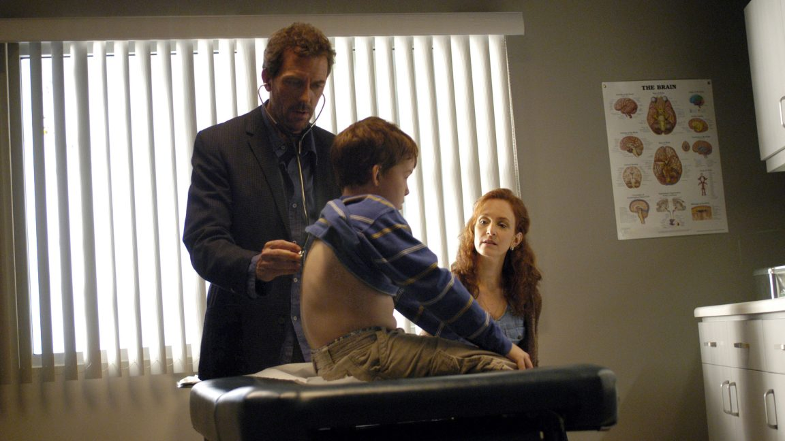

Parents beware.

"In the new study conducted by researchers at Cohen Children's Medical Center in New York, ChatGPT-4 showed it isn't ready for pediatric diagnoses yet.
…
For the study, the researchers put the chatbot up against 100 pediatric case challenges published in JAMA Pediatrics and NEJM between 2013 and 2023. These are medical cases published as challenges or quizzes. Physicians reading along are invited to try to come up with the correct diagnosis of a complex or unusual case based on the information that attending doctors had at the time.
…
Overall, ChatGPT got the right answer in just 17 of the 100 cases. It was plainly wrong in 72 cases, and did not fully capture the diagnosis of the remaining 11 cases. Among the 83 wrong diagnoses, 47 (57 percent) were in the same organ system."

ChatGPT bombs test on diagnosing kids' medical cases with 83% error rate [[1]](#ref-1)

*Originally posted on [LinkedIn](https://www.linkedin.com/posts/benjaminhan_chatgpt-bombs-test-on-diagnosing-kids-medical-activity-7148469962079109120-0VTU).*

---

## References

[1] Beth Mole. "Don't Use ChatGPT to Diagnose Your Kid's Illness, Study Finds 83% Error Rate." *Ars Technica*, January 2024. <https://arstechnica.com/science/2024/01/dont-use-chatgpt-to-diagnose-your-kids-illness-study-finds-83-error-rate/>
