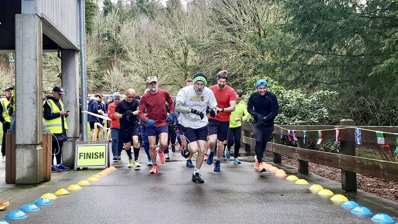
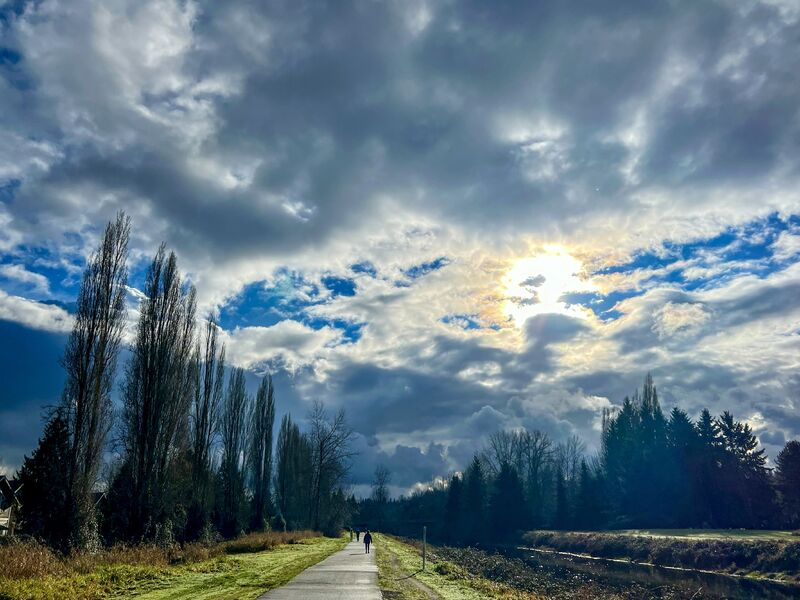
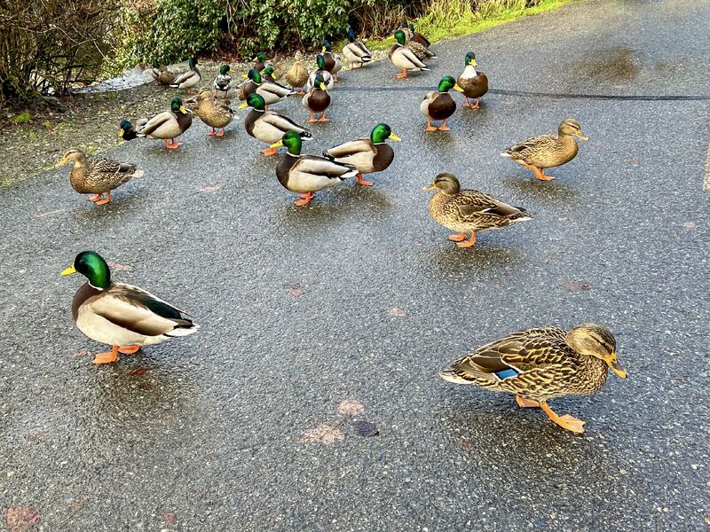

::: {layout-ncol=2}

:::

Saturday was my first Parkrun 5K in 2024 (time 23:50, pace 7'40"), and Sunday was my 10.31-mile run along the beautiful Sammamish River Trail. As usual, mother Nature rewarded me with a wonderful show!

My 2024 goals:

* 40 miles run per week (both trail and treadmill).
* 160 miles run per month.
* Parkrun 5K: 3+ PRs, and annual average below 23:59.
* 1+ official half Marathons.
* 1 official full Marathon.

Let's run!

*Originally posted on [LinkedIn](https://www.linkedin.com/posts/benjaminhan_parkrun-marathons-marathon-activity-7149970193073455105-pE8f).*
