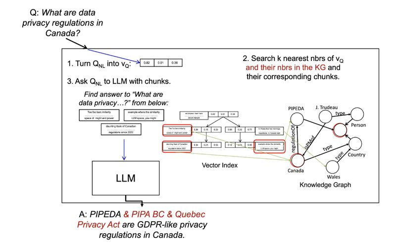

Professor Semih Salihoğlu wrote a very informative two-part blog posts about a very popular topic these days, RAG, or Retrieval Augmented Generation, especially when implemented with knowledgeGraphs (KGs) [[1]](#ref-1). He dissected components involved in a RAG system — language models used to embed queries and data, databases used to store and retrieve relevant information including KGs, and LLMs used to generate the final answers. More interestingly is the list of 6 important future works, which I summarize below in three buckets:

* Important future work 1: how do we embed/represent/index queries and data to improve the accuracy of the retrieval?

* Important future work 2-4: what’s the impact and ideal techniques in using KGs to connect unstructured data? How do we rigorously evaluate the proposals?

* Important future work 5 (perennial) & 6: how do we construct high-quality KGs, especially in an automated way? How do we address the underwhelming performance of LLMs in this task? And how do we make it more economic and practical?

These are all exciting topics that are nearest and dearest in my heart! What are your thoughts on them and what role of KGs do you think it should play in the realm of RAG?

REFERENCE

*Originally posted on [LinkedIn](https://www.linkedin.com/posts/benjaminhan_rag-knowledgegraphs-kgs-activity-7153449420129193984-uv8K).*

---

## References

[1] Semih Salihoğlu. "RAG Using Unstructured Data & Role of Knowledge Graphs." 2024. <https://kuzudb.com/docusaurus/blog/llms-graphs-part-2/>
