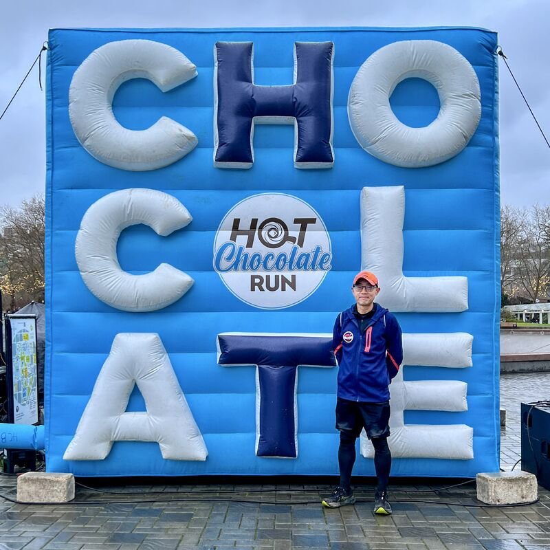
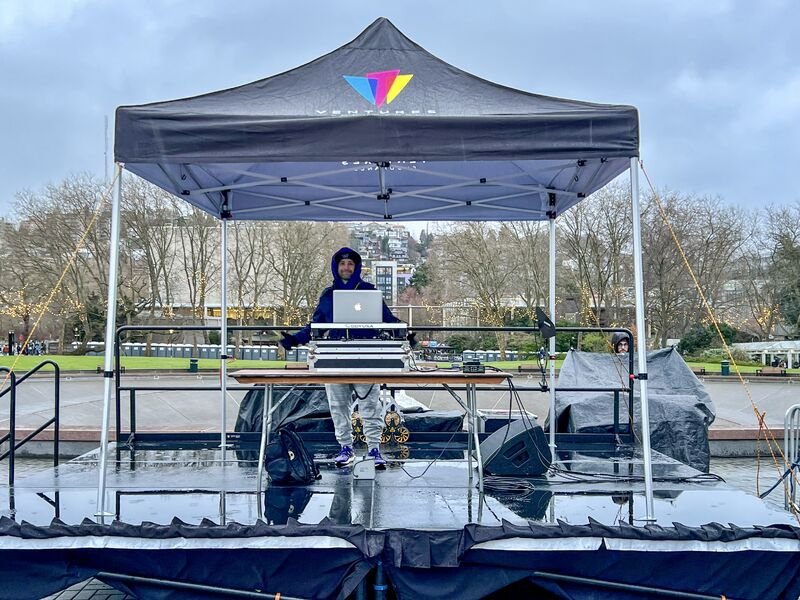
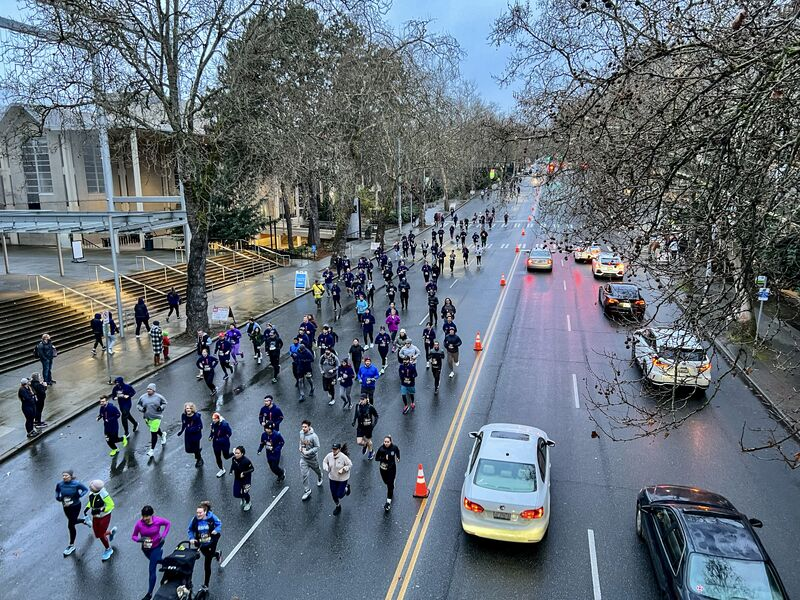
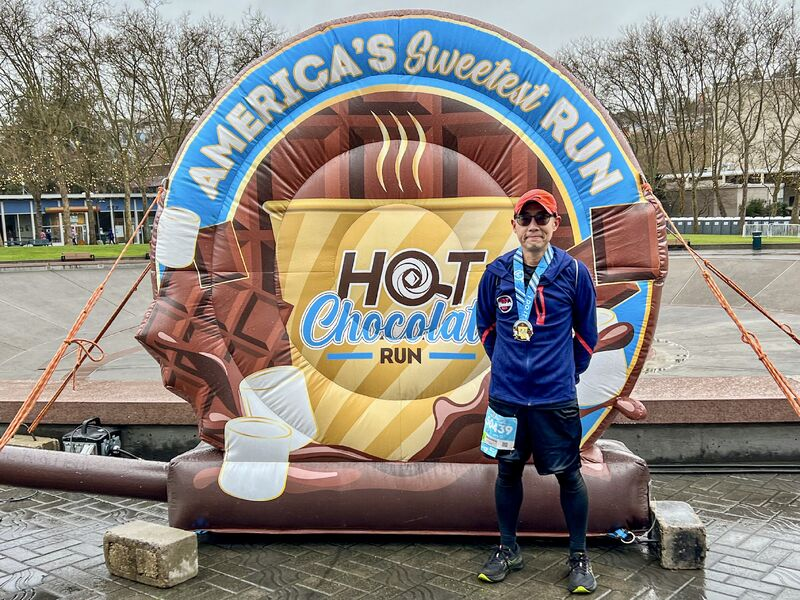
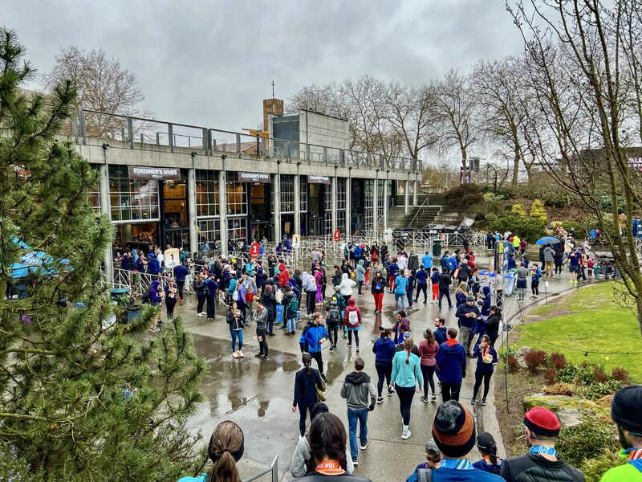
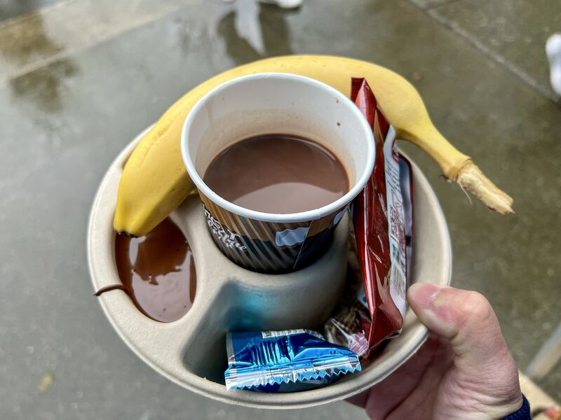
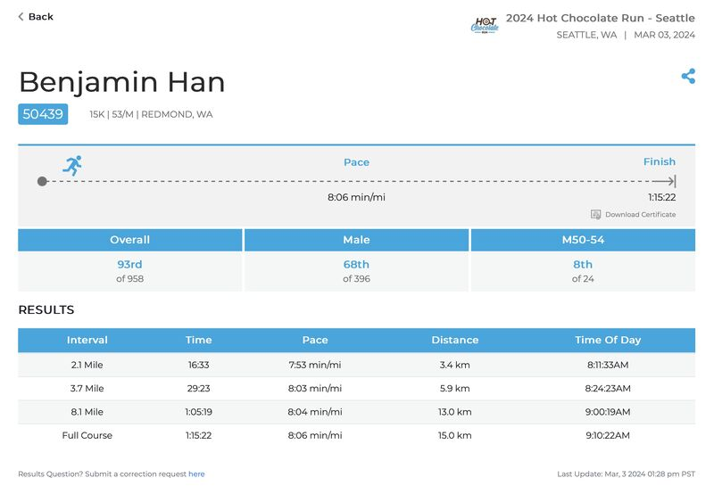
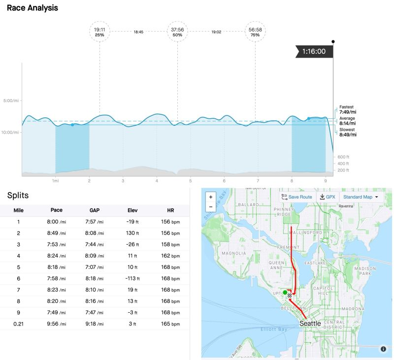

::: {layout-ncol=2}

:::

Woke up 5:30am and got my Hot Chocolate Run 15K done! Going in, my expectation was 1:20:00 and my practice PR was 1:17:51, and I beat both of them: time was 1:15:22 (pace 8'06"/mile)! I also made my 10k PR at 50:49 (funny the pace was slower than my 15k)!

I'm at 93rd out 958 runners -- first time to be within the top 10%! According to runninglevel.com, I'm now squarely between "Intermediate" and "Advanced" level in my age group.

The course was challenging for me: right off the bat at 1~2 mile there was ~130ft climb, and once we're on 99 towards Aurora Bridge there were two long stretches of climbs ~170ft each until summit. Weather-wise it was 35F feels like 29F (-1.67C) with wind 7.5 mph SSE. In the second half it started raining -- but I was trained for this (even with wet shoes)!

The encouraging sign: I felt I could've run another continuous 15K after the finish line! Next 15K goal: get my pace under 8 minutes!

*Originally posted on [LinkedIn](https://www.linkedin.com/posts/benjaminhan_hotchocolaterun-running-race-activity-7170186999276953600-nd3r).*
