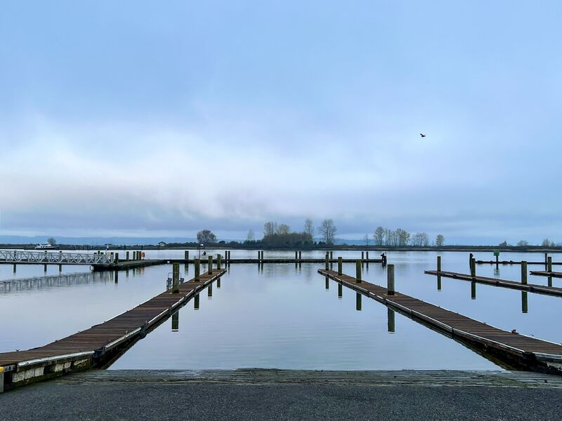
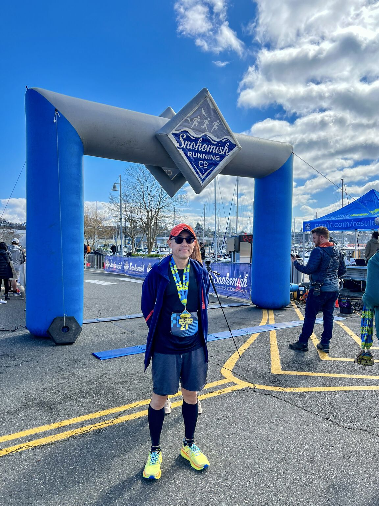
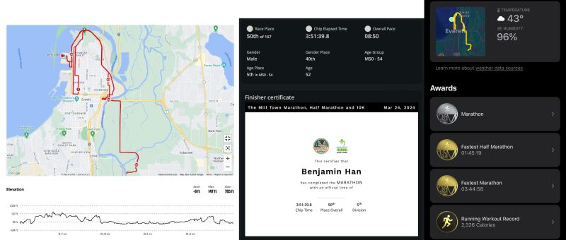
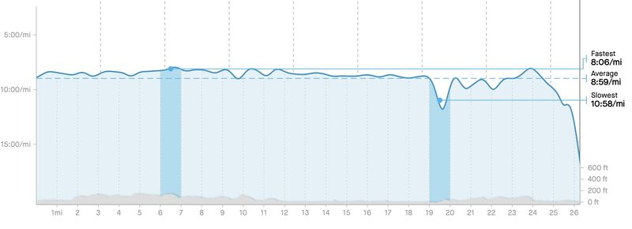

::: {layout-ncol=2}

:::

My first marathon race, done! Official result was 3:51:39.8, pace 8'50"/mile. I was ranked overall 50/167, in males 40/102, or in my age group 5/9. This is slightly slower than my PR in practice (3:50:33, pace 8'48").

But the official time didn't account for the three times I was lost (!) and had to either backtrack or ask people (I was not the only one). According to my watch I earned PR on marathon: 3:44:58, pace 8'35", and half marathon: 1:45:19, pace 8'02".

The course can be best described as "a thousand paper cuts" as there are many ups/downs -- super challenging for me! I actually walked in two occasions: one was climbing a long bridge (we had 6 bridges each way!), and the other was towards the end, out of fatigue and frustration that the route was not clearly marked. But otherwise I kept my pace pretty steady except after mile 19. Weather was super nice though: cloudy and felt like 43F.

One of my goals in 2024 is now done!

*Originally posted on [LinkedIn](https://www.linkedin.com/posts/benjaminhan_marathon-halfmarathon-running-activity-7177820420312633345-FuDJ).*
