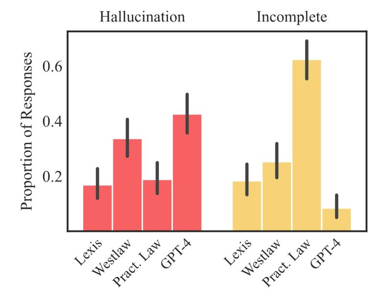

AI on Trial: Legal Models Hallucinate in 1 out of 6 (or More) Benchmarking Queries [[1]](#ref-1)

Paper:
Varun Magesh, Faiz Surani, Matthew Dahl, Mirac Suzgun, Christopher Manning and Daniel E. Ho. 2024. "Hallucination-Free? Assessing the Reliability of Leading AI Legal Research Tools." Stanford Law School. [[2]](#ref-2)

Abstract:

> Legal practice has witnessed a sharp rise in products incorporating artificial intelligence (AI). Such tools are designed to assist with a wide range of core legal tasks, from search and summarization of caselaw to document drafting. But the large language models used in these tools are prone to "hallucinate," or make up false information, making their use risky in high-stakes domains. Recently, certain legal research providers have touted methods such as retrieval-augmented generation (RAG) as "eliminating" (Casetext, 2023) or "avoid[ing]" hallucinations (Thomson Reuters, 2023), or guaranteeing "hallucination-free" legal citations (LexisNexis, 2023). Because of the closed nature of these systems, systematically assessing these claims is challenging. In this article, we design and report on the first preregistered empirical evaluation of AI-driven legal research tools. We demonstrate that the providers' claims are overstated. While hallucinations are reduced relative to general-purpose chatbots (GPT4), we find that the AI research tools made by LexisNexis and Thomson Reuters each hallucinate more than 17% of the time. We also document substantial differences between systems in responsiveness and accuracy. Our article makes four key contributions. It is the first to assess and report the performance of RAG-based proprietary legal AI tools. Second, it introduces a comprehensive, preregistered dataset for identifying and understanding vulnerabilities in these systems. Third, it proposes a clear typology for differentiating between hallucinations and accurate legal responses. Last, it provides evidence to inform the responsibilities of legal professionals in supervising and verifying AI outputs, which remains a central open question for the responsible integration of AI into law.

*Originally posted on [LinkedIn](https://www.linkedin.com/posts/benjaminhan_ai-legal-rag-activity-7202375493369667585-nQxL).*

---

## References

[1] Stanford HAI. "AI on Trial: Legal Models Hallucinate in 1 out of 6 (or More) Benchmarking Queries." <https://hai.stanford.edu/news/ai-trial-legal-models-hallucinate-1-out-6-or-more-benchmarking-queries>

[2] Varun Magesh, Faiz Surani, Matthew Dahl, Mirac Suzgun, Christopher Manning, and Daniel E. Ho. "Hallucination-Free? Assessing the Reliability of Leading AI Legal Research Tools." Stanford Law School, 2024. <https://law.stanford.edu/wp-content/uploads/2024/05/Legal_RAG_Hallucinations.pdf>
