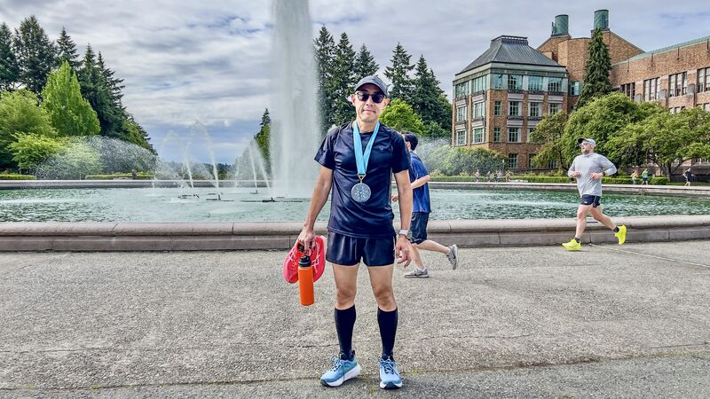
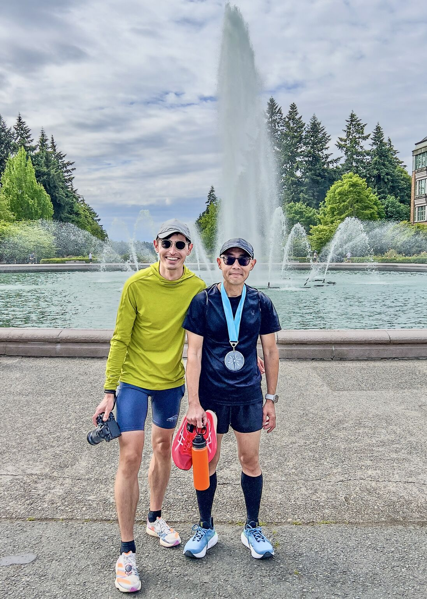
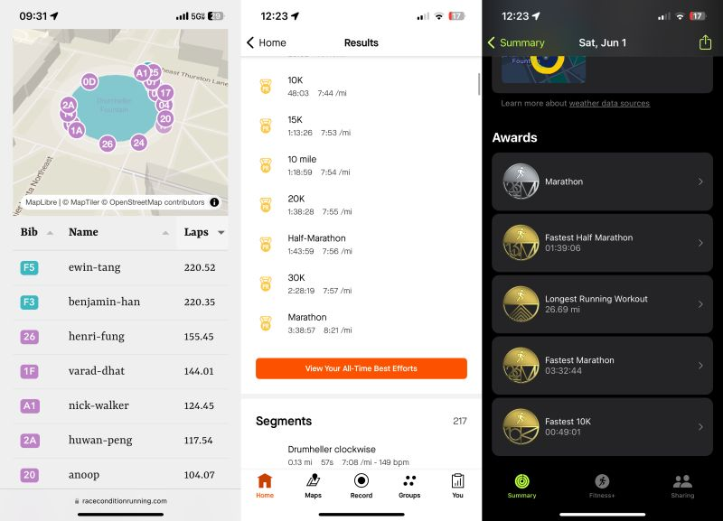
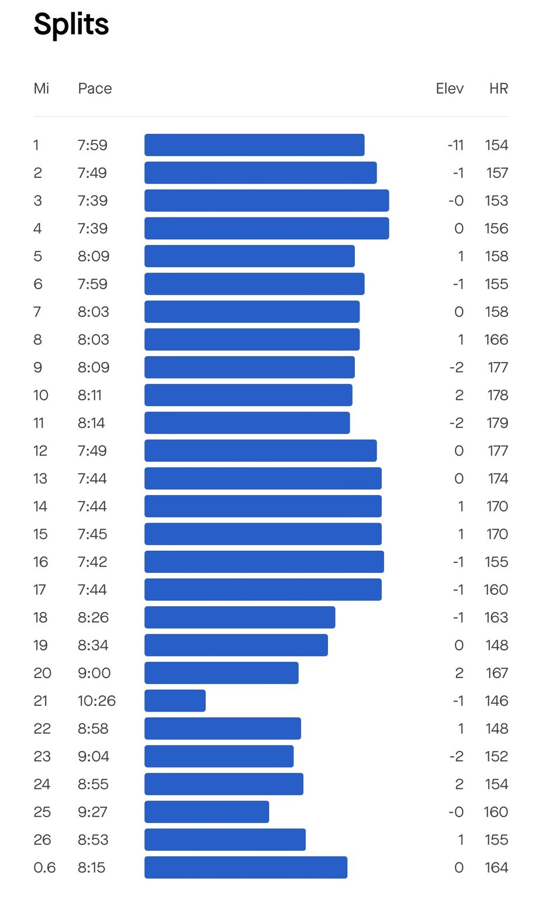
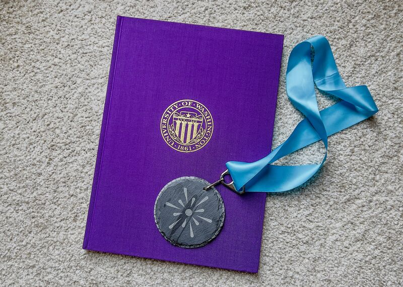
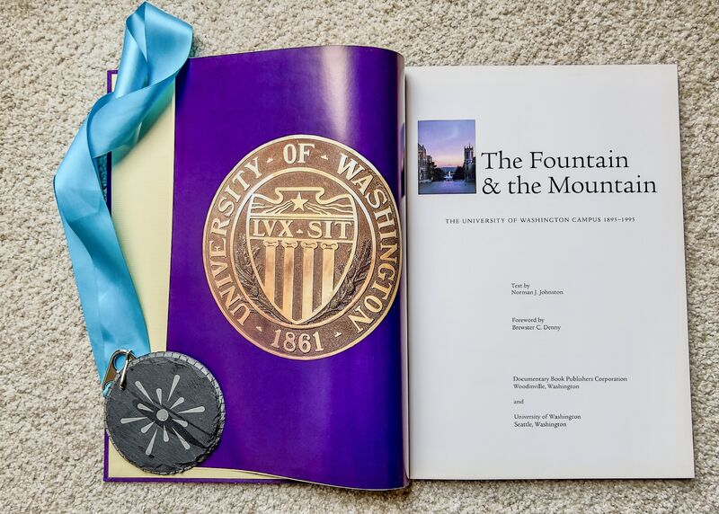

::: {layout-ncol=2}

:::

Drumheller Marathon day (<https://raceconditionrunning.com/drumheller-marathon-24>): I woke up at 3:30am, left home to University of Washington at 4:30, and started running at 5:30. 220 laps later, I made a new PR in marathon: 3:38:57 pace 8'21"/mile (and a bunch of others)!

The first 19 miles were easy, but at mile 20 I started to have trouble with left ankle. Switching to more cushioned shoes got me through the remainder of the run.

This is actually the first time full marathon was included in the Drumheller race, so in addition to the very pretty medal we got a nice book about the university's history.

This marked my 2nd official marathon race, and the 8th if including practice runs. One more race and I'll hit the 2024 goal -- and I actually have three coming up (Aug, Oct and Dec)!

Thank you again Nick Walker for organizing the event!

*Originally posted on [LinkedIn](https://www.linkedin.com/posts/benjaminhan_drumheller-marathon-running-activity-7202800740141027328-zx5x).*
