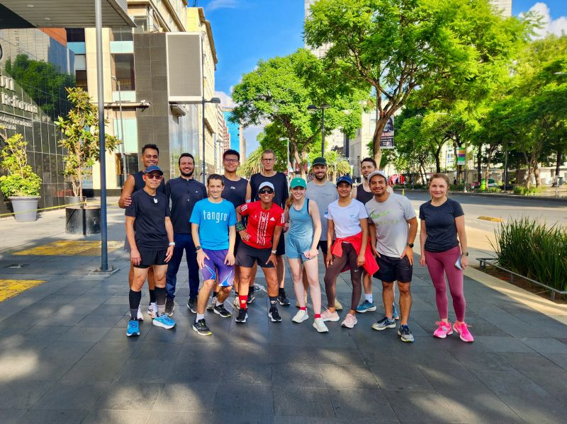
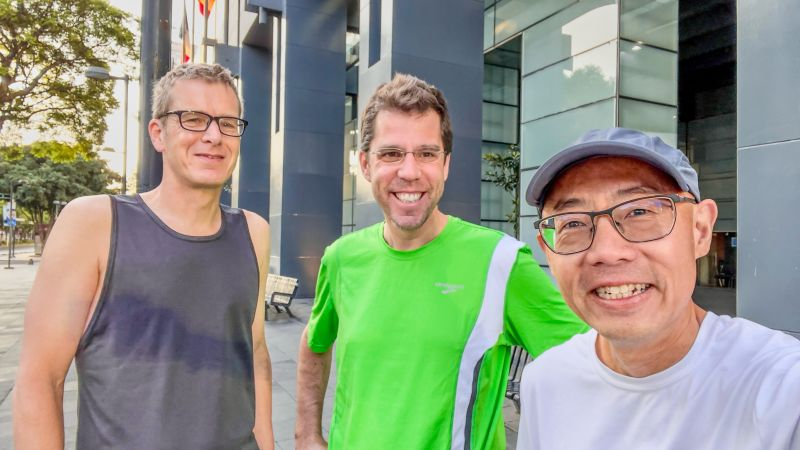
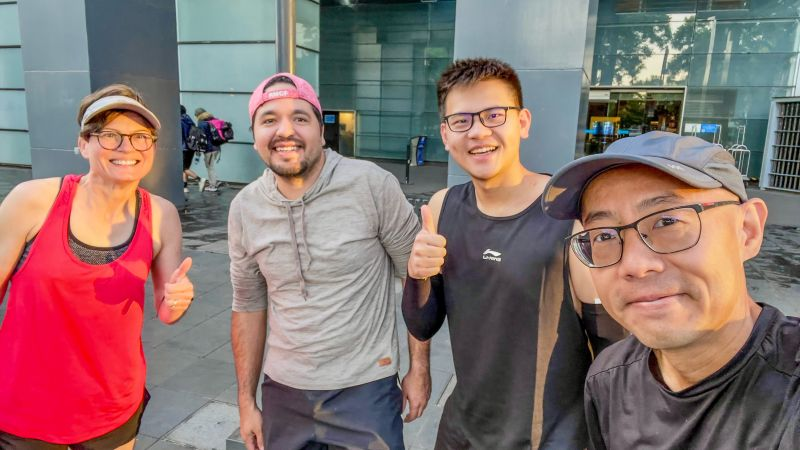
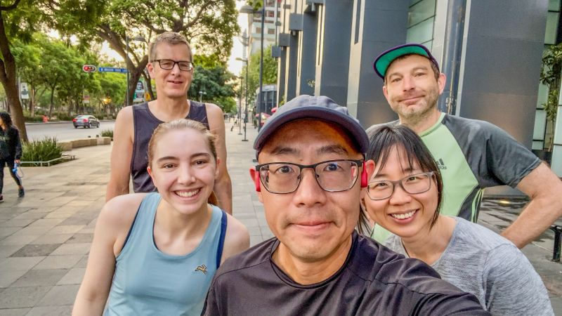
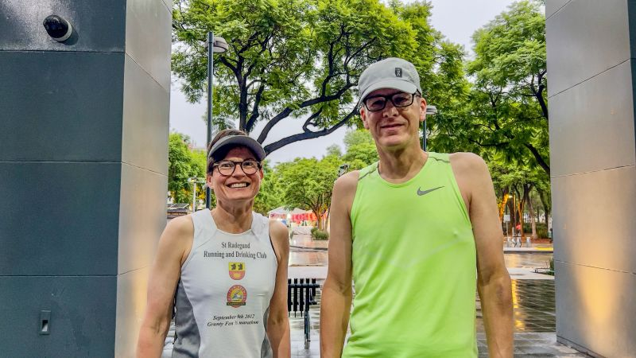
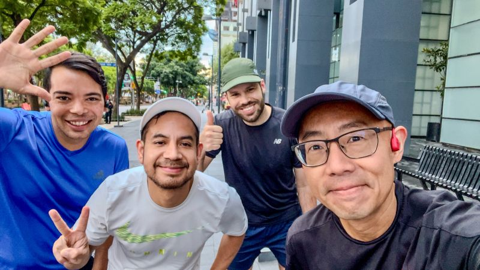
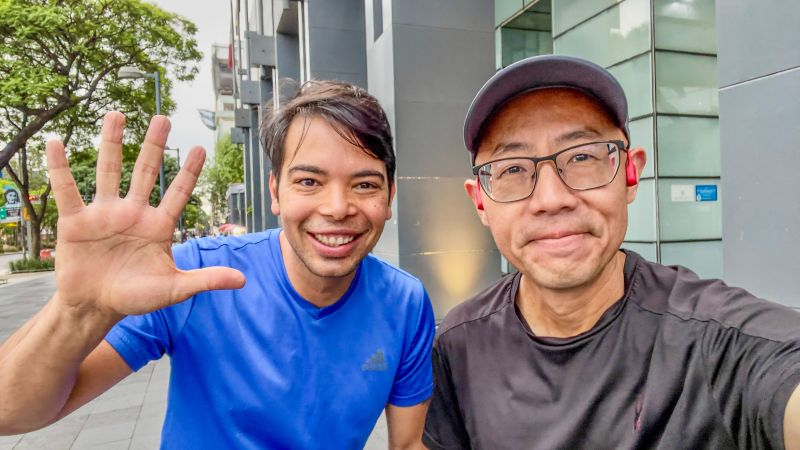
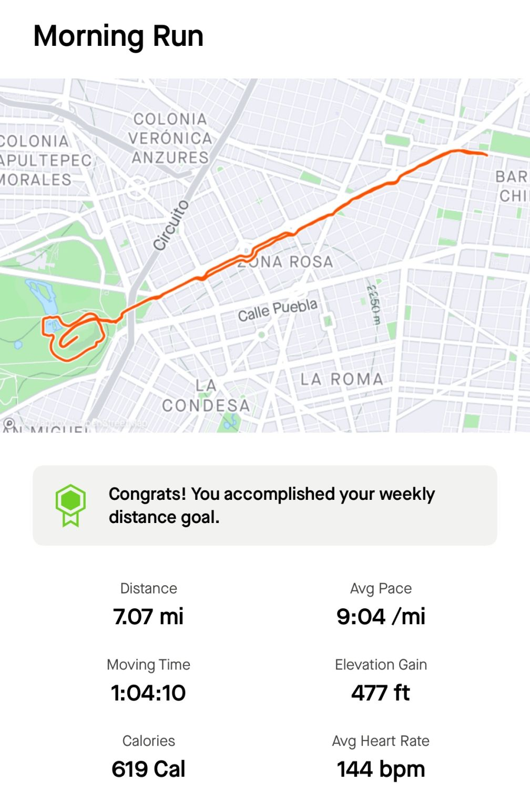

::: {layout-ncol=2}

:::

We did it! In addition to many stimulating talks, discussions and reading in NAACL 2024, we ran 10K for 7 days in the early mornings of Mexico City, elevation 2,240 m (7,350 ft)!

Thank you Helena Gómez Adorno for organizing the [first-day tourism version](https://youtu.be/3tKEjTDDtP8), and thank you Michael Strube, Eduardo Blanco, Kate Knill, Carlos Moreno-Garcia, Xuansheng Wu, Lena Strobl, Junyi Jessy Li, Gavin Abercrombie, Patrice Bechard, Orlando E Marquez, Juan Pablo Pajaro, Zoher Kachwala, Anum Afzal, Thomas Caputo, Vladimir Solovyev, Edison Jair B. and others for running with me!

See you when I "run" into you, and keep running!

---

The first day's "tourism 10K" is on YouTube:

](video-tourism-10k.jpg){fig-align="center"}

*Originally posted on [LinkedIn](https://www.linkedin.com/posts/benjaminhan_naacl2024-running-conference-activity-7210371960927584256-yPjQ).*
