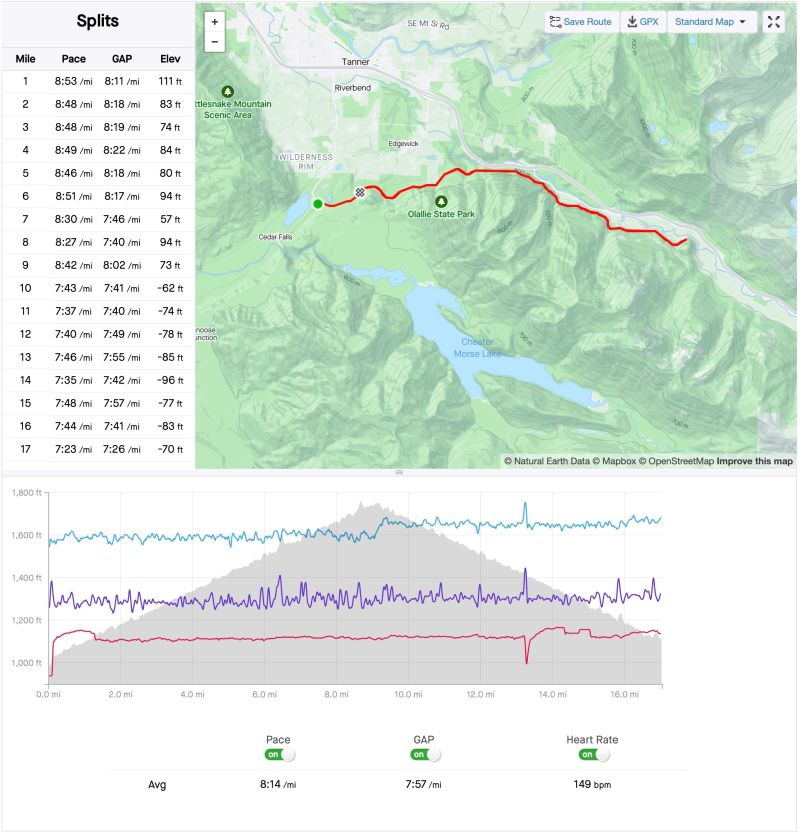
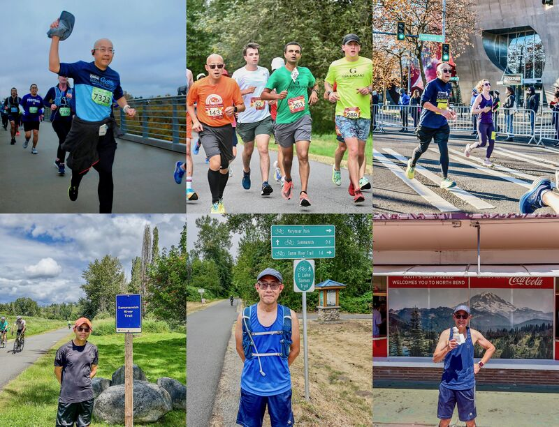

::: {layout-ncol=2}

:::

Another running milestone today: I ran my 30th half marathon (HM) on Iron Horse Trail! 9 miles climbing up 1,287ft/392m and 8 miles down, totaling 17 miles (~4 miles longer than HM):

* Up: first 9 miles, time 1:18:34, pace 8'44"/mi
* Down: last 8 miles, time 1:01:16, pace 7'40"/mi
* HM: first 13.2 miles, time 1:51:6 using avg pace 8'25".

This is to prepare for my 3rd official marathon race in August, which will take place on this course but starting from east, downhill all the way. My hope is to get BQ (Boston qualifying), and my target is 3:25:00 pace 7'49"/mi. From today it looks like it's doable now that my downhill pace is at 7'40" -- I just need to keep it steady for the whole 26.2 miles!

Looking back, I started running HM since fall 2022 (Parkrun since September 2022), and participated in my first official HM (Seattle Marathon) finishing at 2:07:45 pace 9'45"/mi. Over time I improved myself to the current PR 1:43:06 pace 7'48". You can see me running various HMs over the past 2 years in the photos below -- yes I lost more than 17 lbs! 🙂

*Originally posted on [LinkedIn](https://www.linkedin.com/posts/benjaminhan_running-marathon-parkrun-activity-7223494770847838208-JA4a).*
