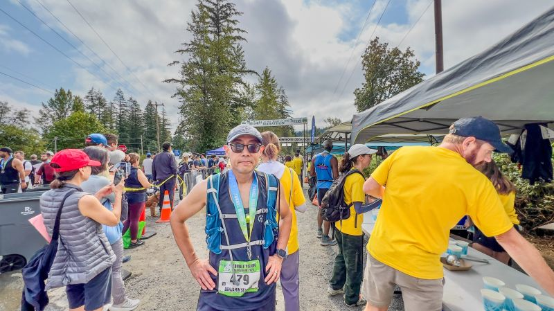
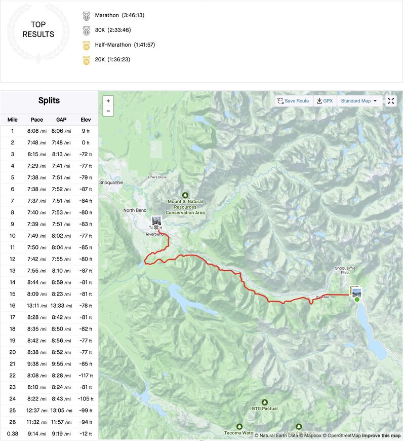
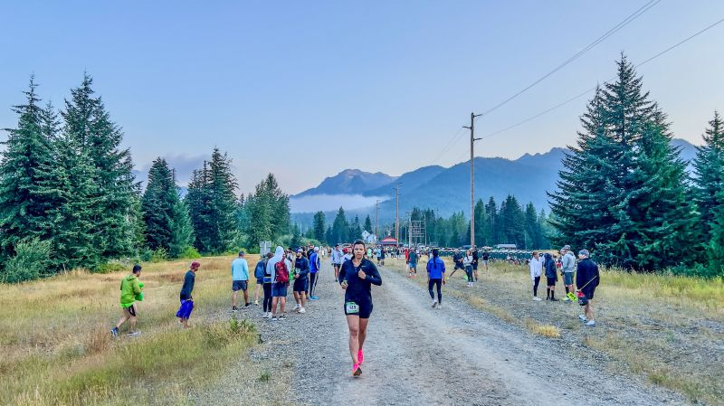

::: {layout-ncol=2}

:::

Running update: today is the day for Tunnel Vision marathon race! I got up at 4:30am, left home at 5:30, arrived at the starting point 6:45 at Snoqualmie Pass, and started running 7:10 sharp! Official results are not out yet, but here are the ones according to Strava:

* I got PRs on 10K (47:13), 15K (1:11:24) and half marathon (1:41:57).
* But I only made it to my 2nd fastest marathon: time 3:46:13 pace 8'38"/mi. Obviously this is way slower than the BQ time for me (3:25:00).

Three things went wrong after I crossed the midpoint:

1. Bathroom emergency. :-(
2. My slightly larger shoes revealed their evil past this point, and started to wreck my toes as they repeatedly hit the front of the shoes in this all-downhill course.
3. My quads were spent, starting at mile-16, and especially in the last 2 miles, to the point I could only walk-run to finish the course.

Moral of the story: too much of good things (downhill) is actually bad for you, especially if you haven't trained adequately for them! To use machine learning concepts: I'm essentially suffering from OOD (out-of-domain) testing: my training and testing conditions do not exactly match, and when the "good things" repeatedly hammered my less well-trained parts (shoes and leg muscles), they failed.

But hey — I finished it! This also completes two of my three 2024 running goals: earn at least 3 PRs in the weekly Parkrun 5K (got 4), and run 3 marathon races (this is the third)! But there are more fun this year: one half marathon race in September, and two marathon races in October and December are waiting!

*Originally posted on [LinkedIn](https://www.linkedin.com/posts/benjaminhan_running-marathon-strava-activity-7228594820154372096-7eMR).*
