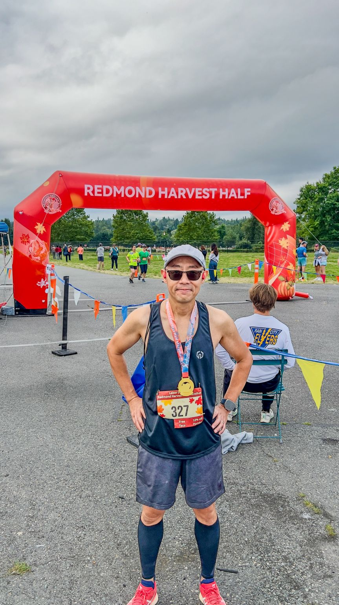
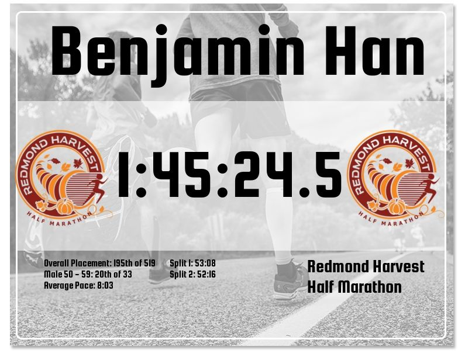
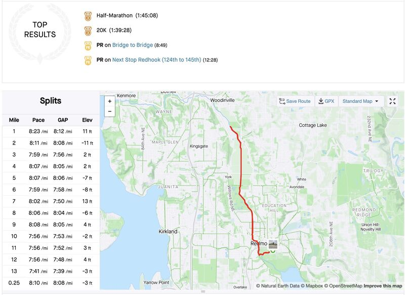

::: {layout-ncol=2}

:::

Running update: done with Redmond Harvest Half Marathon today (Labor Day in US)!

This was much better than I expected, given that in August I had to recover from that horrible but PR-making marathon, and a flu just a few days ago. I was aiming just under 1:50.00, but the official chip time was 1:45:24 pace 8'03"/mi, and Strava recorded 1:45:08 pace 8'01"/mi. This is no PR, but is 12 minutes faster than the last year when I ran this same race!

Most importantly is I felt *great* throughout the run! The last 4 miles were all sub-8', and I even felt "runner's high" at ~ 11-mile mark! Thinking back I could've run a bit faster from the get go!

I feel there's another "phase change" for me coming up. Here is to my last two marathon races in 2024!

*Originally posted on [LinkedIn](https://www.linkedin.com/posts/benjaminhan_running-redmond-marathon-activity-7236512413917847552-lLcR).*
