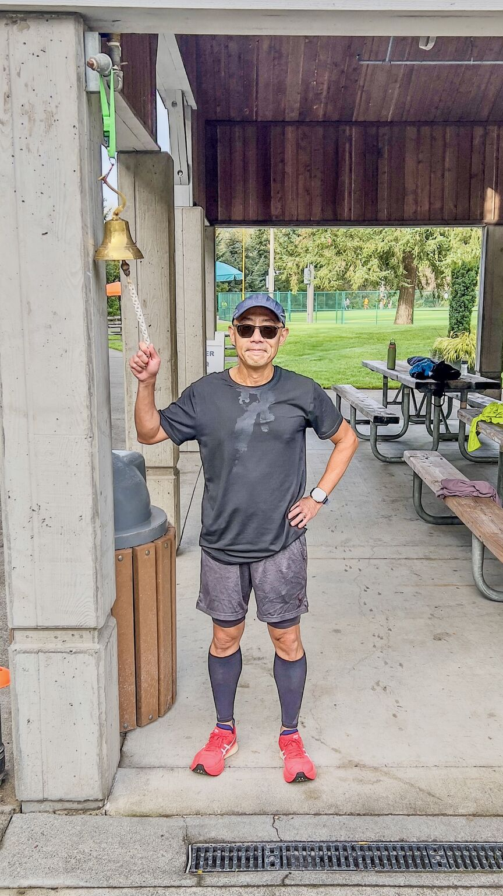
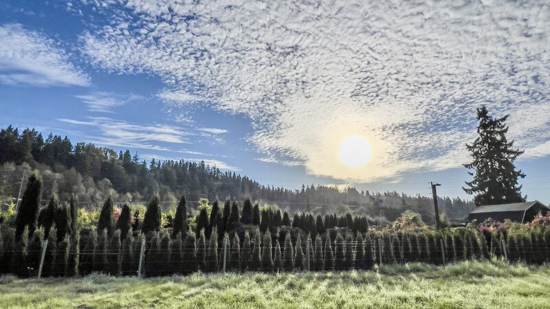
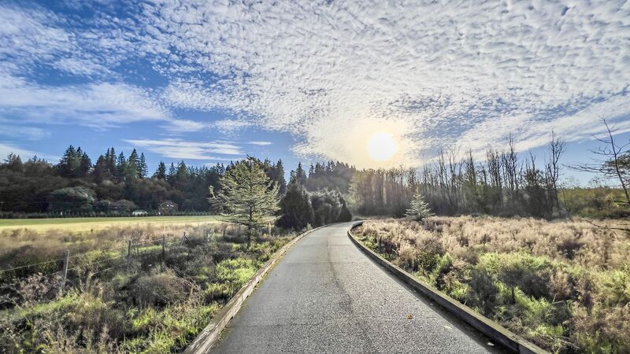
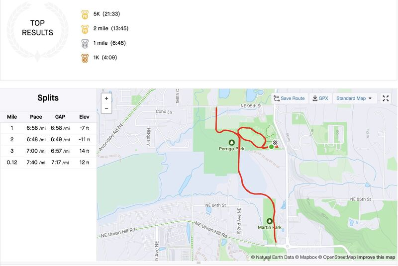
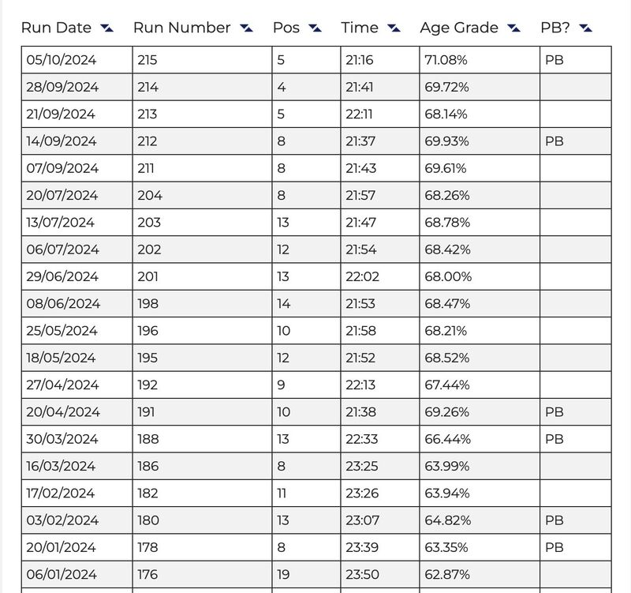

::: {layout-ncol=2}

:::

Running update: I finally nailed my 6th PR this year in Parkrun 5K: 21:16 — 21 seconds off of my last PR! We also switched to the winter course here, so it's a tad shorter, but watch/Strava reported 21:33 pace 6'56"/mi, also a PR for me!

This completed my 3 stretch goals for 2024:

1. ✅ Sub-7' pace in Parkrun 5K: 4 out 20 runs reached sub-7'/mi pace.
2. ✅ 6 Parkrun 5K PRs: 6 as of October 5.
3. ✅ 3 full marathon race: 3 as of October (2 more coming).

Those are on top of my original 2024 goals:

1. 👍 40 miles/week: 45.24 miles/week as of week 40.
2. 👍 160 miles/month: 197.99 miles/month as of September.
3. ✅ 3 Parkrun 5K PRs: 6 as of October 5.
4. ✅ 1+ half marathon race: 1 as of October (Redmond Harvest Half).
5. ✅ 1 full marathon race: 3 as of October (Mill Town, Drumheller, Tunnel Vision)

Feeling proud!

*Originally posted on [LinkedIn](https://www.linkedin.com/posts/benjaminhan_running-parkrun-strava-activity-7248418527387230208-mxBH).*
