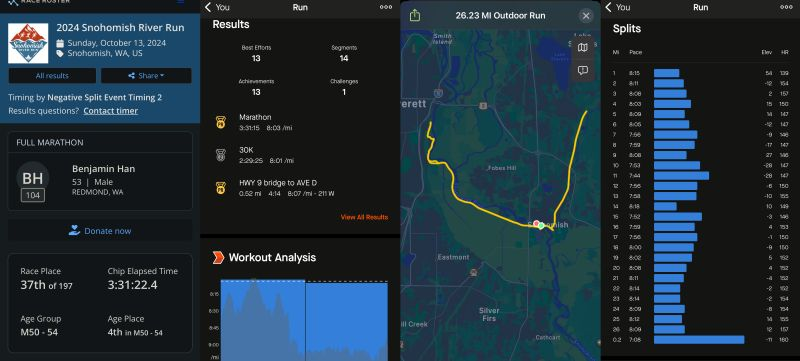
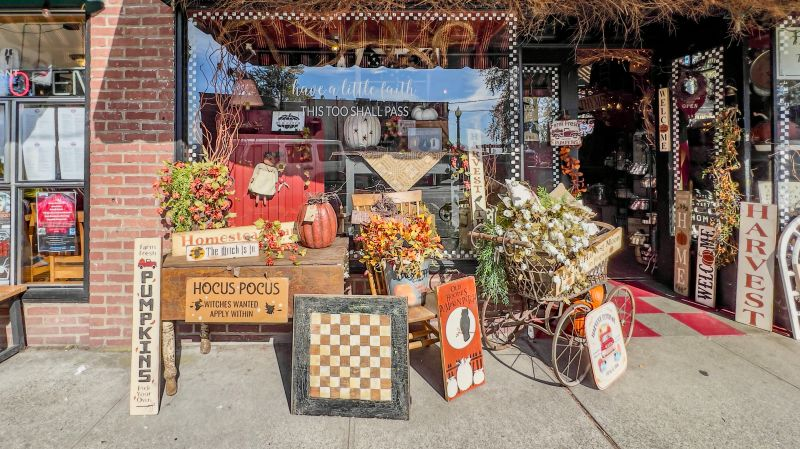
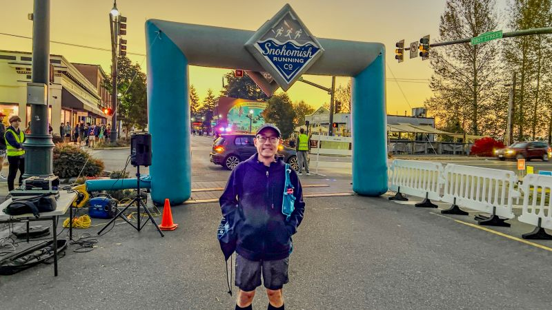
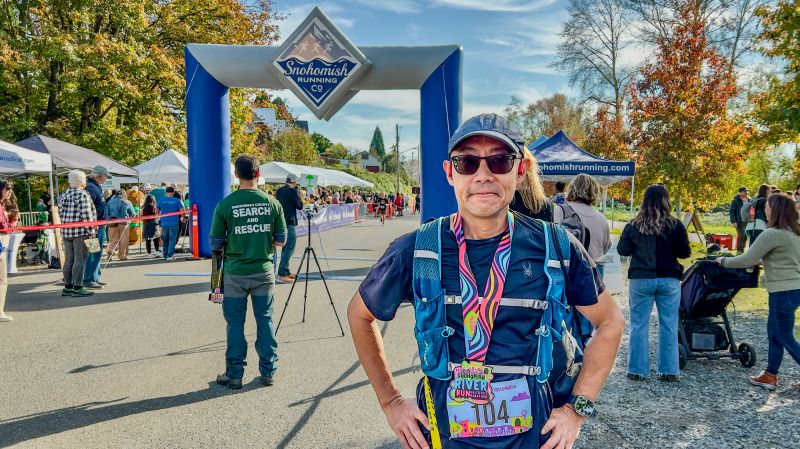

::: {layout-ncol=2}

:::

Running milestone: Snohomish marathon today -- I got up at 4:30am, left home at 6, and started running at 7:30. My watch/Strava reports time was 3:31:15 pace 8'03"/mi, and the official time was 3:31:22 pace 8'04"/mi. Both are my PR (7 minutes faster)!

Sharing what may have helped in this PR:

1. Training: slower slow runs and NO skipping of interval/speed training! +Yoga!
2. Better pre-race diet and in-race fueling: carb loading w/ low fiber pre-race, and one liquid gel per 4 miles during the race (love it!).
3. Pace management: I followed decent runners for the first ~8 miles then judiciously sped up. At 14-mile realizing I was slowing down, I put on 180-bpm playlist and it worked like magic!
4. When time is tough, remember: THIS IS EXACTLY WHERE I WANT TO BE!

This is my 4th marathon race this year (or ever) -- one more to go!

*Originally posted on [LinkedIn](https://www.linkedin.com/posts/benjaminhan_running-marathon-activity-7251383496181522432-Qp9v).*
