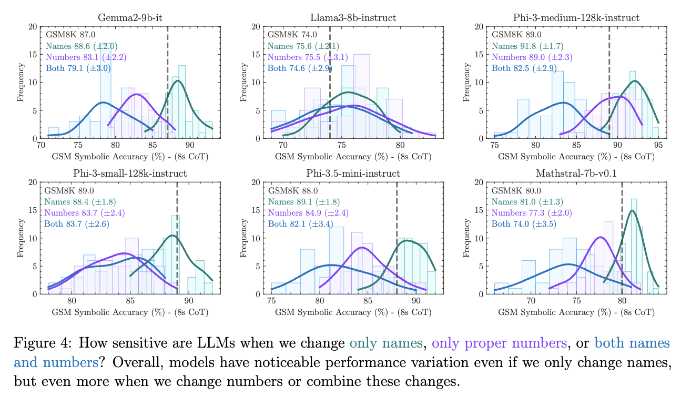
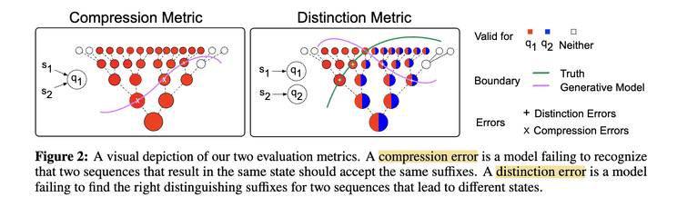
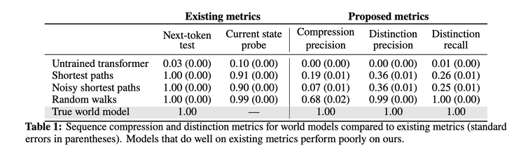
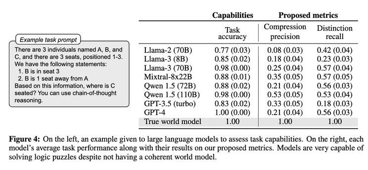

)](cover.jpg){fig-align="center"}

Large Language Models (LLMs) are statistical in nature. By learning from enormous corpora, do they actually learn "world models" latent behind the texts? Can next-token prediction really learn the principles governing the environment it operates in?

One recent work from colleagues in Apple gives negative results on math reasoning [[1]](#ref-1). They show on GSM8K benchmark — a test set on grade-school-level math questions — SOTA transformer models perform significantly worse when they simply change the names, numbers, or both in the problems (picture 1). This clearly demonstrates these models don't really learn the math principles behind the problems.

{fig-align="center"}

Another interesting work to test if transformers really build world models is by reducing problems into Deterministic Finite Automata (DFA) — graphs depicting possible states and transitions among them when consuming input — and see if these models really learn them [[2]](#ref-2). The authors introduce two new metrics: compression precision and distinction precision (picture 2). The compression precision measures how well a model can conclude that the same state, no matter what input sequences are used to reach it, should lead to the same accepted sequences. The distinction precision, on the other hand, measures how well a model can recognize input sequences that lead to different states.

{fig-align="center"}

The authors then tested two instances of DFA: navigating streets in New York City and playing the board game Othello. They found big gaps both between the conventional metrics (next-token test and current state probe) and the new metrics (picture 3 and 4), and model performance (measured by the new metrics) when the "world" changes, e.g., randomly increasing cost on certain roads in the city ("noisy shortest paths" in picture 3). Another interesting find is that random walks actually yield far better performance, because the models get to explore all corners of the world, albeit at a much higher cost.

{fig-align="center"}

{fig-align="center"}

There are many interesting questions to be explored from here: are these new metrics sufficient to capture models' ability to learn world models? What about the problems that can't be reduced to DFA? How can we map next-token prediction to learning the deeper and more holistic representation of the world, or should we find new ways?

---

## References

[1] Mirzadeh, Iman, Keivan Alizadeh-Vahid, Hooman Shahrokhi, Oncel Tuzel, Samy Bengio, and Mehrdad Farajtabar. "GSM-Symbolic: Understanding the Limitations of Mathematical Reasoning in Large Language Models." 2024. <https://arxiv.org/abs/2410.05229>

[2] Vafa, Keyon, Justin Y. Chen, Jon Kleinberg, Sendhil Mullainathan, and Ashesh Rambachan. "Evaluating the World Model Implicit in a Generative Model." 2024. <https://arxiv.org/abs/2406.03689>

*Originally posted on [LinkedIn](https://www.linkedin.com/pulse/how-well-can-transformers-build-world-models-benjamin-han-eoqzc/).*
