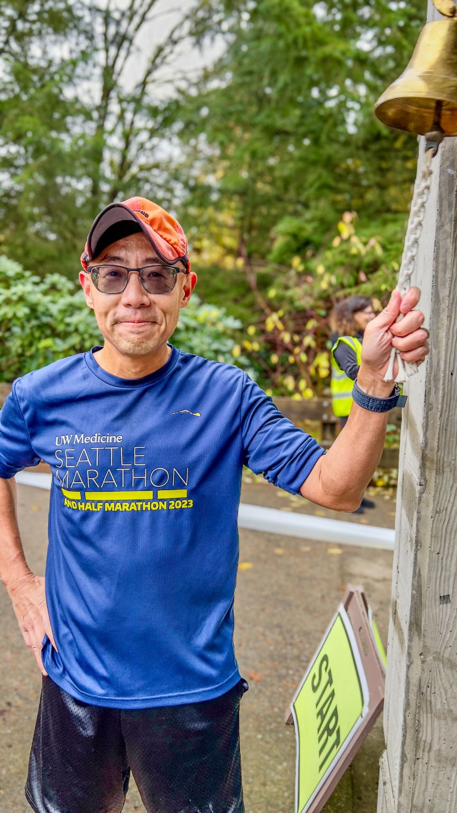
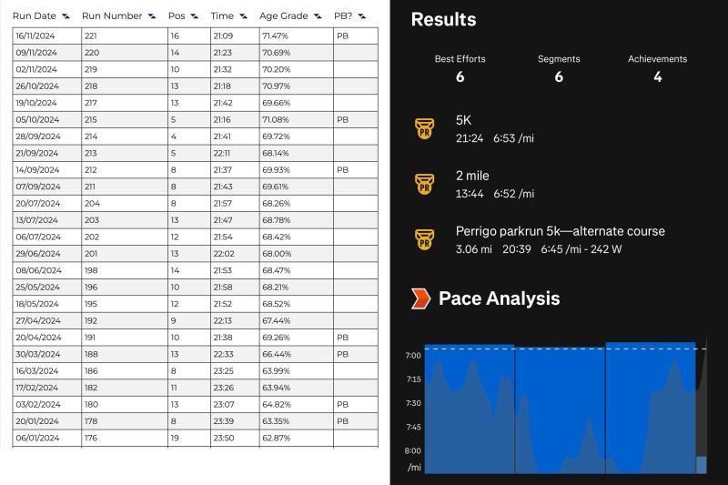
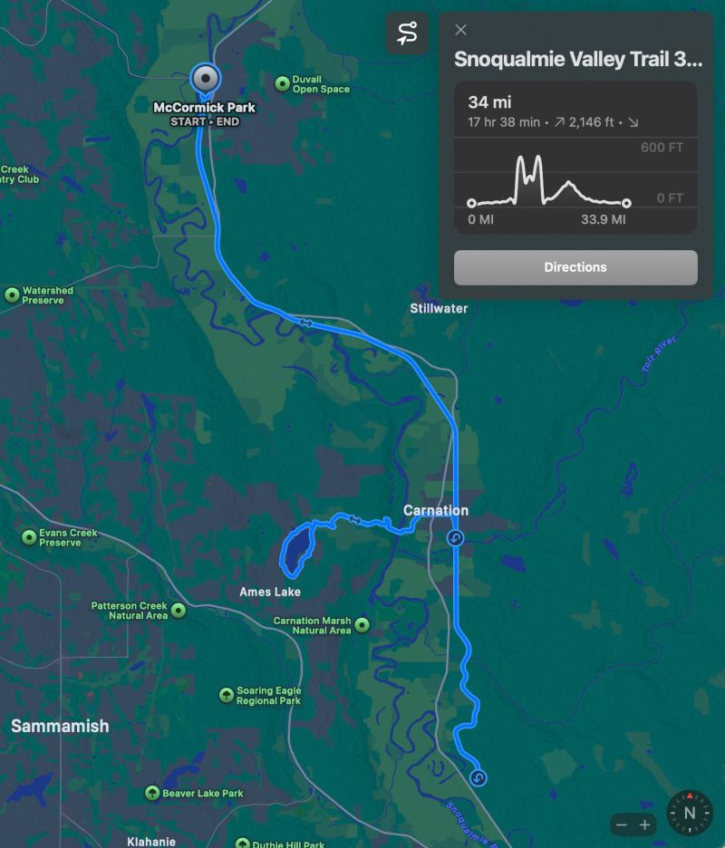
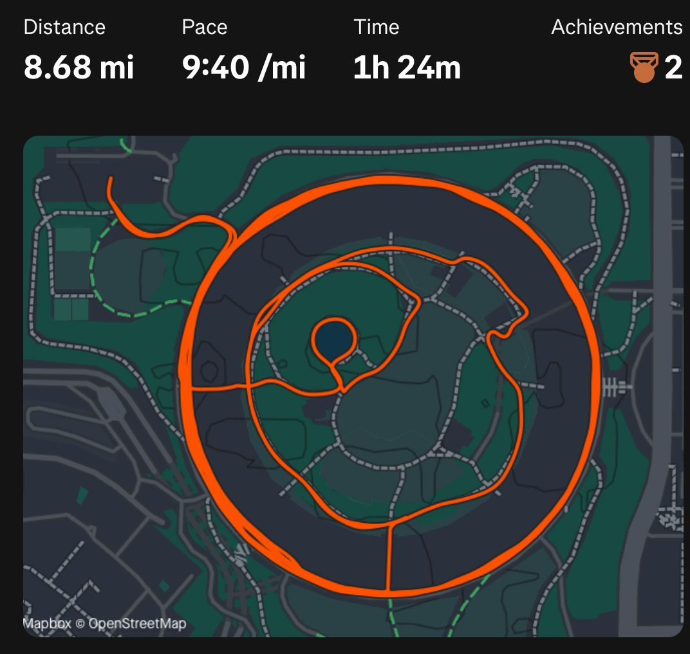
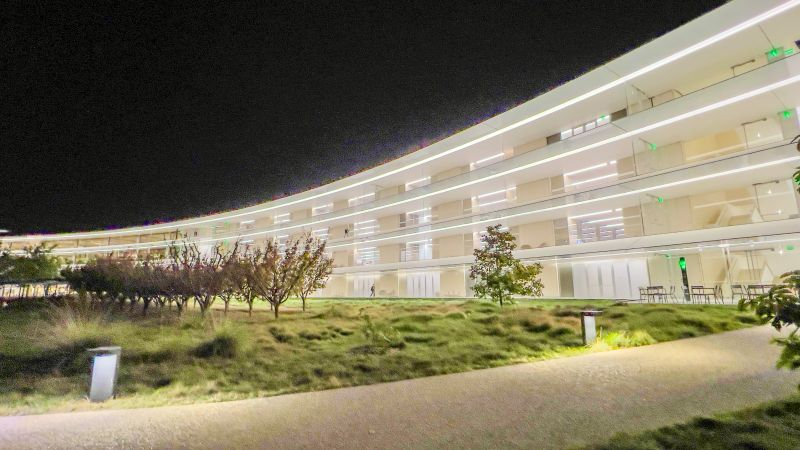
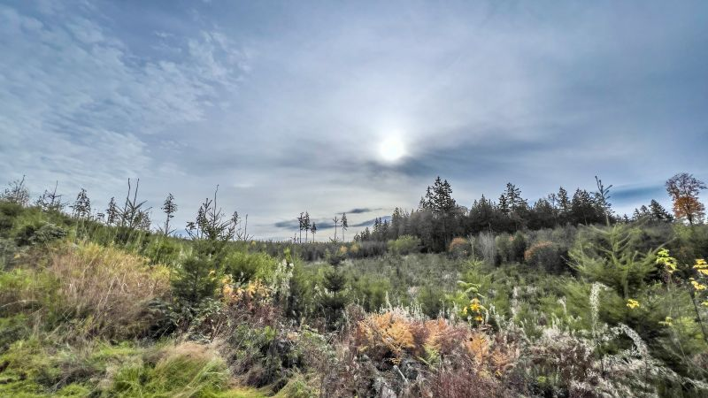

::: {layout-ncol=2}

:::

Running update: Parkrun 5K PR today with official time 21:09 and watch time 21:24 -- my 7th PR this year! And my longest run -- 34-mile ultramarathon -- with PR moving time 5:01:30 last Sunday, plus 23.56 miles spent spinning at nights when visiting Apple Park the week before!

](video-ddqlDTSuOVA.jpg){fig-align="center"}

1-min video recap of the 34-mile run on Snoqualmie Valley Trail, elevation gain 2,146ft: <https://youtu.be/ddqlDTSuOVA>

*Originally posted on [LinkedIn](https://www.linkedin.com/posts/benjaminhan_running-parkrun-ultramarathon-activity-7263718989527199744-r6HL).*
