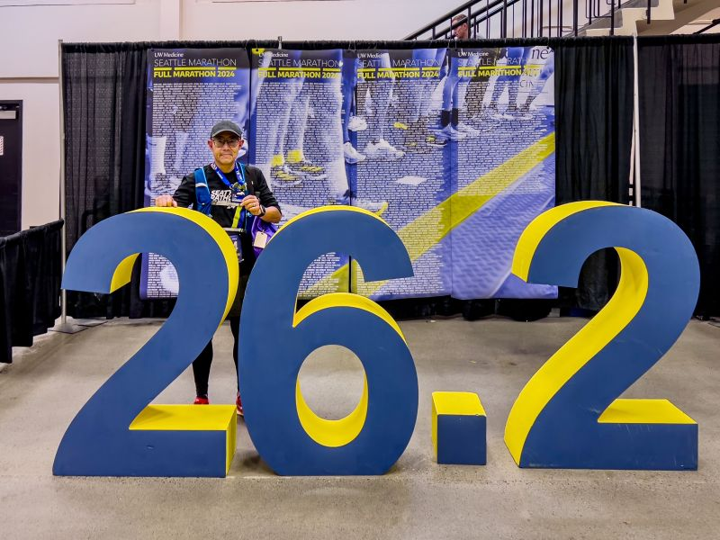
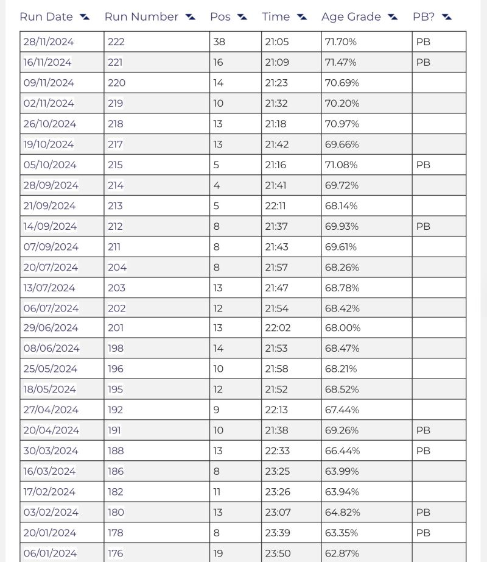
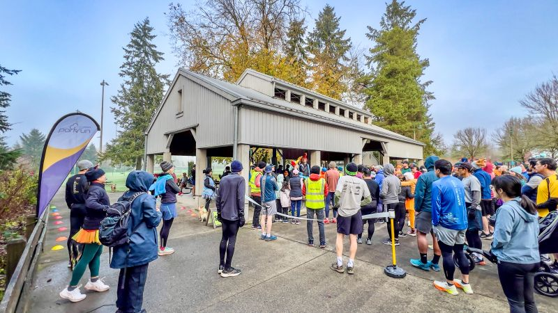
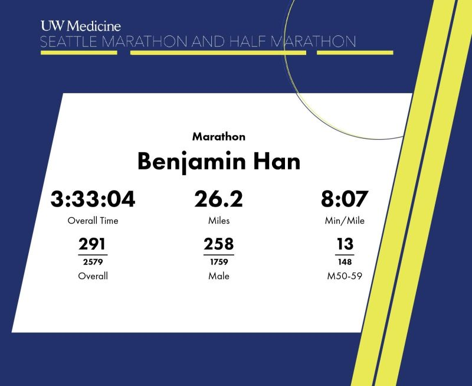
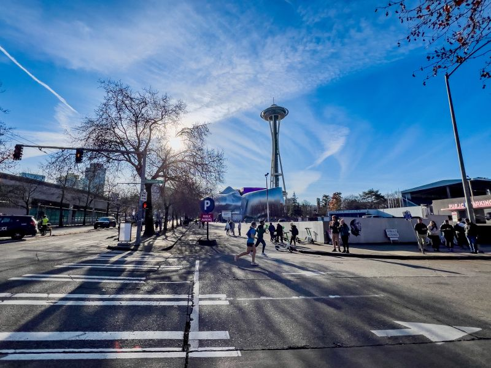
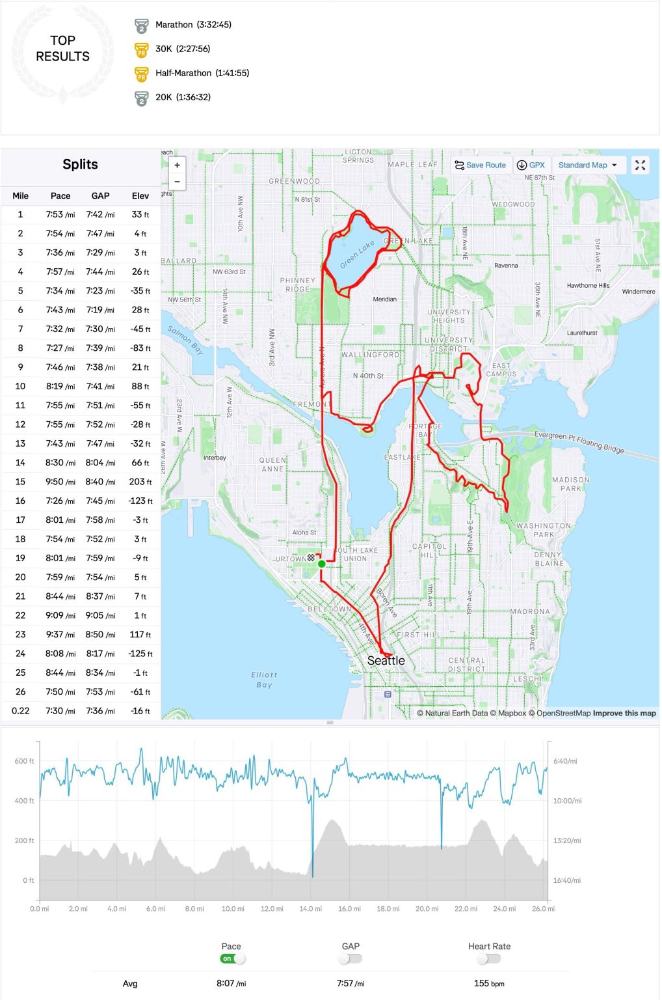

::: {layout-ncol=2}

:::

Running update: today is the last day of the Thanksgiving week, and I ran my 5th (and final) marathon race and 18th marathon run this year at Seattle Marathon 2024! Results: official time 3:33:04 pace 8'07"/mi, 1:49 short from my PR 3:31:15!

](video-3KiBtEpe9DQ.jpg){fig-align="center"}

(video at the starting line: <https://youtu.be/3KiBtEpe9DQ>)

BUT:

1. I got PR in half marathon: 2 seconds faster -- 1:41:55 pace 7'46"/mi!

2. This is a much hillier course with EG (elevation gain) 1,766ft by my watch. The GAP (grade-adjusted pace) is actually 7'57"/mi, 6 seconds faster than my PR at Snohomish River Run in October with EG ~200ft and GAP 8'03"/mi. Had I run that marathon today, I would have scored a faster 3:28:22!

3. And I finally made it to top 9% in my age group! 🙂

Bonus: 3 days earlier I also earned my 8th PR at the special Parkrun 5K Turkey Trot edition, with finish time 21:05!

*Originally posted on [LinkedIn](https://www.linkedin.com/posts/benjaminhan_running-thanksgiving-seattle-activity-7269164056370958336-1Gmd).*
