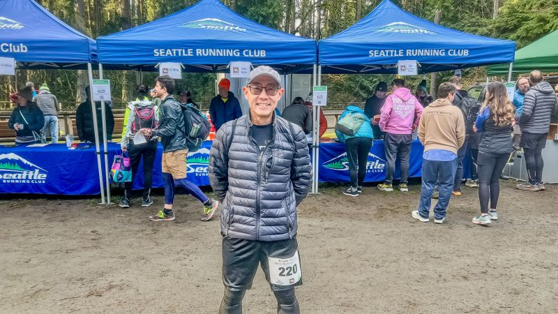
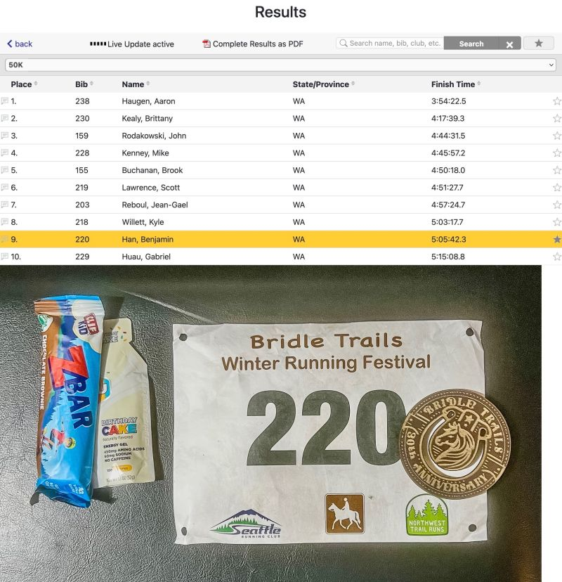
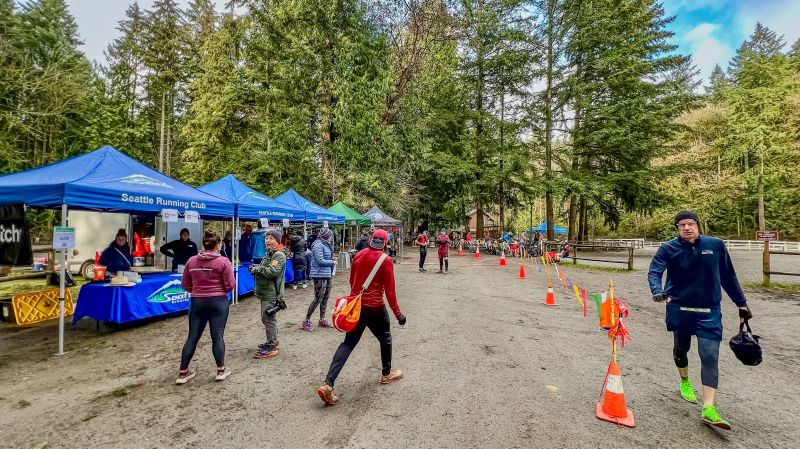
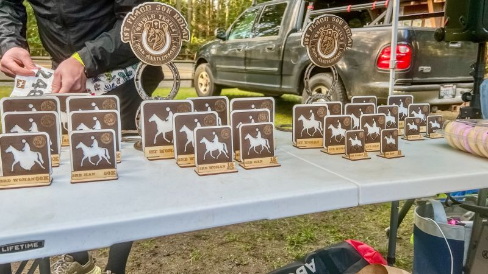
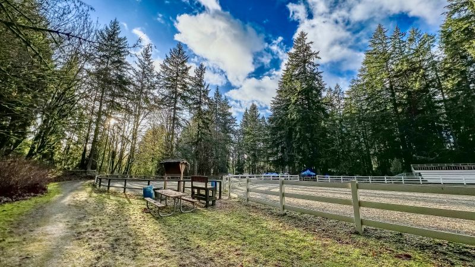
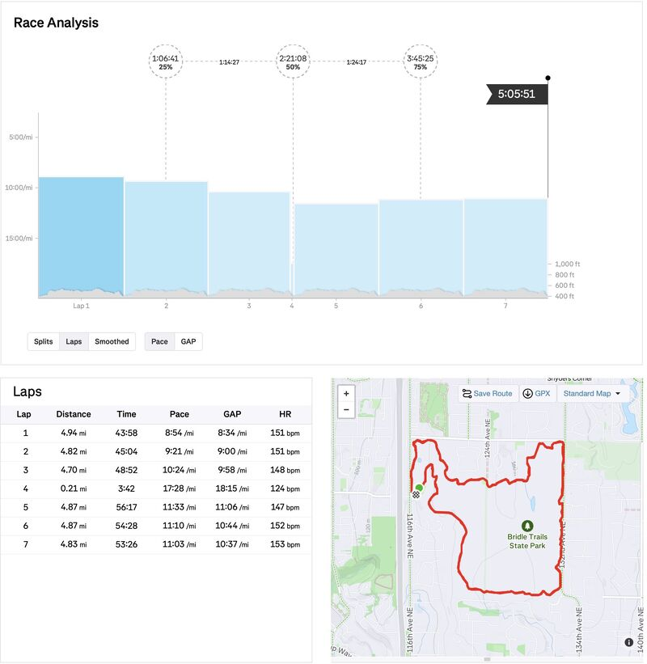

::: {layout-ncol=2}

:::

Running milestone: My 1st 50K race at Bridle Trails Winter Running Festival was done yesterday! The race started at 3:10pm, with 2,493ft EG and 3+ hours run in the dark (also my first), my official result came at 5:05:42.3, 9th place out of 45 runners!

This is 5 minutes slower than what my expectation was, but given what happened on the course (later), this is much better than what it could have been!

The weather was surprisingly nice, 45F and sunny. But there was substantial rain the morning before, so the trails were still muddy and squishy, with protruding rocks and tree roots.

](video-rk_4p-haLv4.jpg){fig-align="center"}

(short video of the course captured during my practice <https://www.youtube.com/watch?v=rk_4p-haLv4>)

Just when sun was setting at the end of my 3rd loop, I fell *uphill* less than a mile away from aid station. A smooth rock tricked me and I didn't lift my left foot high enough to clear the added height from my newly acquired Exospikes! Goes to show the problem of using new gear in a race!

(I got Exospikes a week before because I fell downhill during one practice run there)

I almost gave up due to left knee pain from hitting a rock. After limping back to the aid station and resting for ~5min, I tried to restart and magically the pain was not that bad anymore! So I persisted with a much lower pace.

So what did I learn?

1. No new gear in a race without at least a month of practice!

2. Exospikes are great for running fullspeed downhill, but the added height, weight and rigidity can pose challenges with endurance running on path with protruding rocks and roots.

3. Sometimes finishing a race is not even the point. You need to ask your body: at what cost and will it prevent me from running more?

One goal in 2025 is done. Onward!

*Originally posted on [LinkedIn](https://www.linkedin.com/posts/benjaminhan_running-running-ultralmarathon-activity-7284321122412589056-2FVn).*
