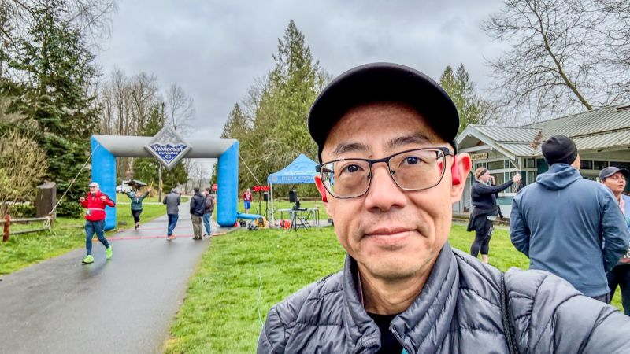
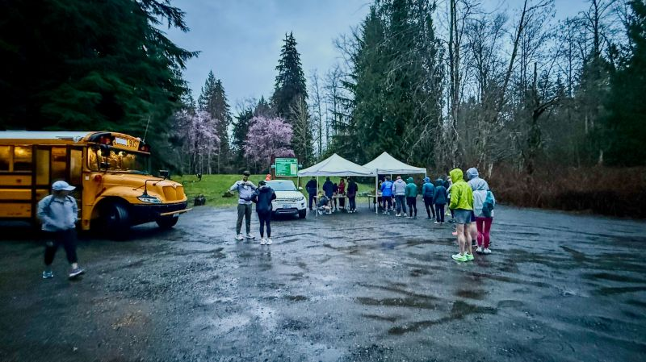
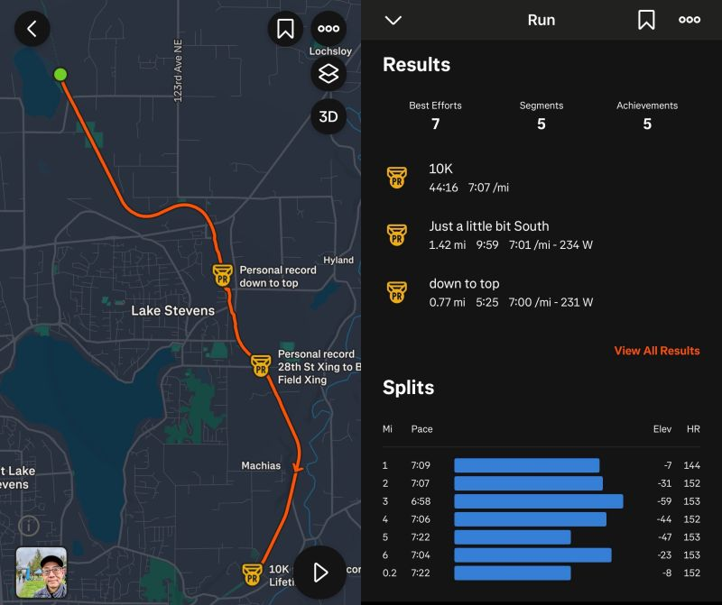
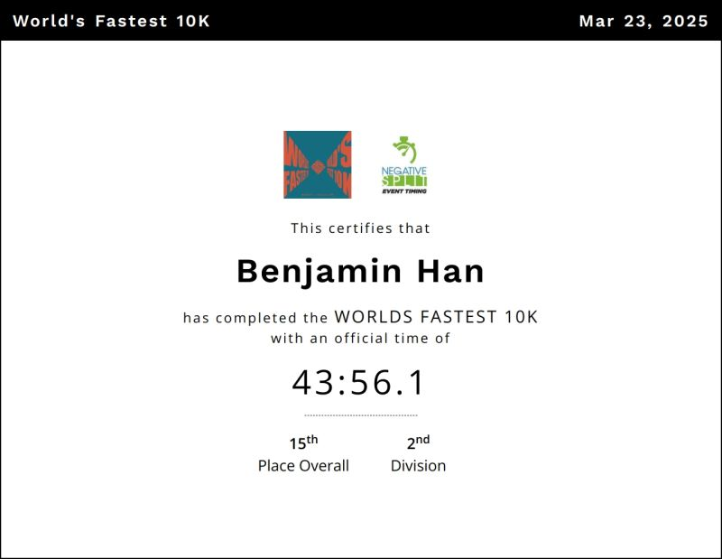
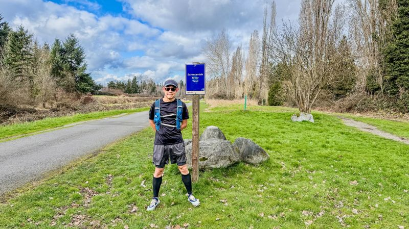
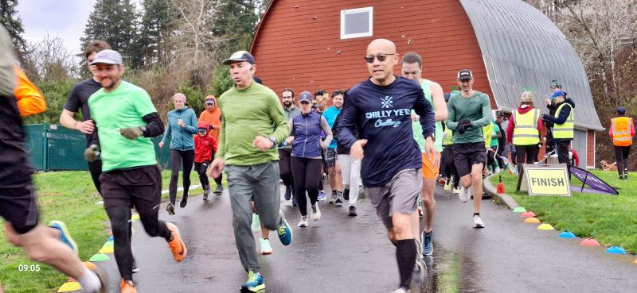

::: {layout-ncol=2}

:::

Multiple running milestones to report for the past couple weeks! 🙂 Today I earned PR in "World's Fastest 10K" race (0.7%-grade downslope) with chip time 43:56.1 and watch time 44:16 (pace 7'07"/mi)! I placed 15th of 172, 11th of 74 males, and 2nd in my age/gender division!

I also earned 5K PR in Parkrun yesterday, time 21:23 pace 6'53"/mi, and PR in half marathon last week on Sammamish River Trail with time 1:39:07 pace 7'34"/mi!

My goal this year is to earn my BQ (3:20:00), and the first marathon race is coming in mid-April -- onward!

*Originally posted on [LinkedIn](https://www.linkedin.com/posts/benjaminhan_running-parkrun-marathon-activity-7309747635307823104-Lbdm).*
