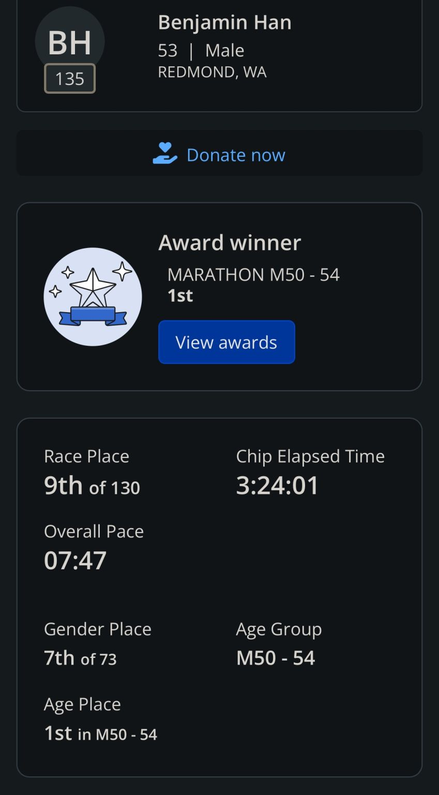
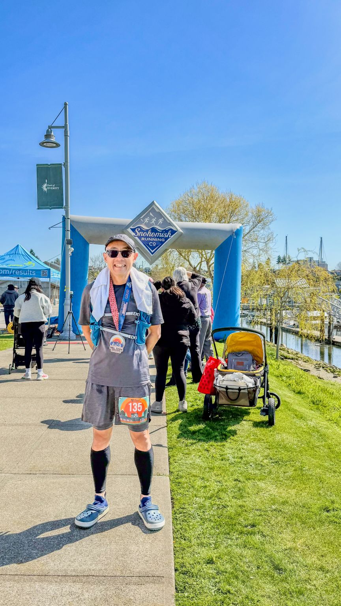
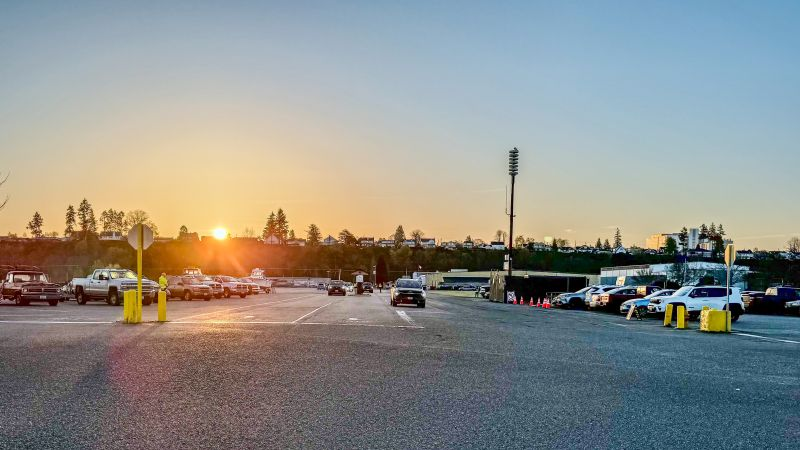
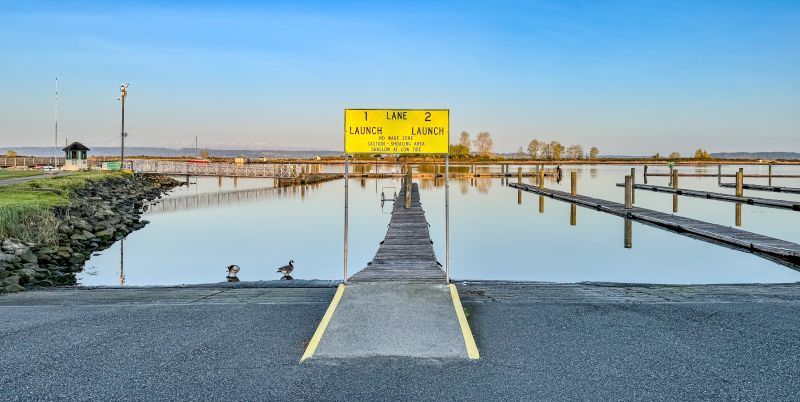
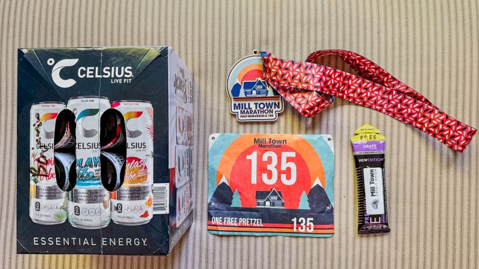

::: {layout-ncol=2}

:::

Another running milestone achieved: I ran Mill Town Marathon race today with chip time 3:24:01 pace 7'47"/mi, and was 9th place out of 130, and the first in my age/gender division! I ran this same course last year as my first-ever marathon race, and this time I shaved off 27 minutes! This is also a ~6min reduction from my previous marathon PR!

I'm pretty happy w/ the result: I was expecting just under 3:30 with this EG (~800ft)! I'm now much closer to BQ time 3:20:00, and my next marathon race will be the crazy 220-laps around UW Drumheller in June -- but hey it's flat!

*Originally posted on [LinkedIn](https://www.linkedin.com/posts/benjaminhan_running-marathon-uw-activity-7317361238097739788-MRnj).*
