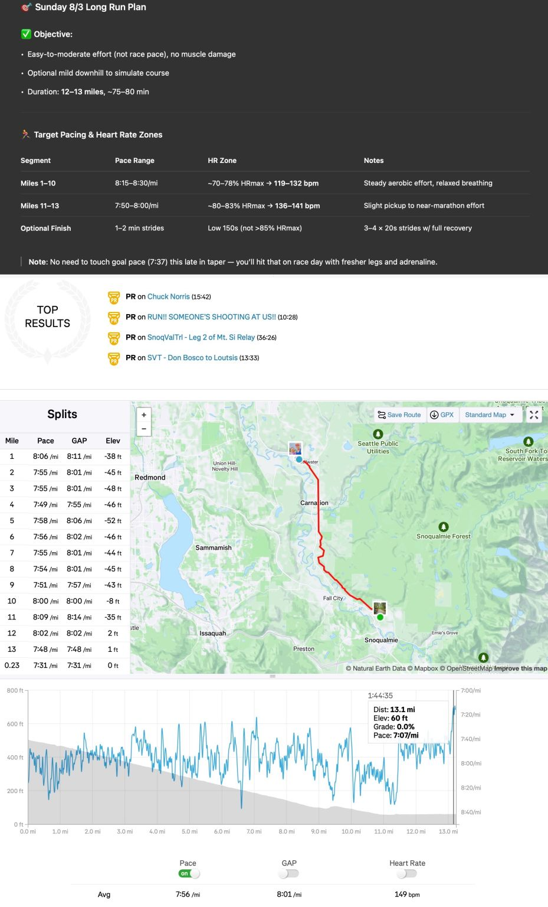
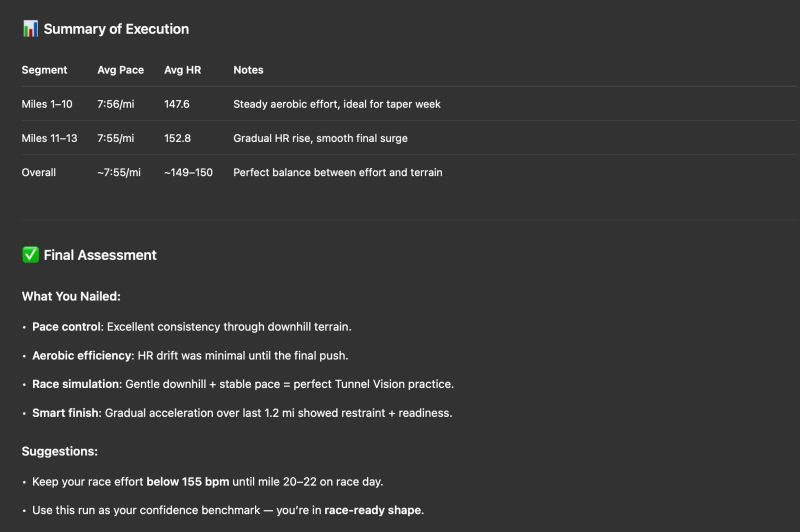
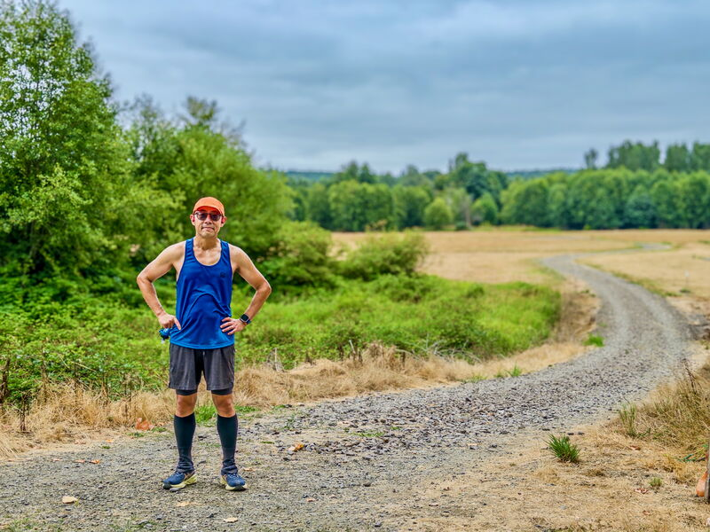
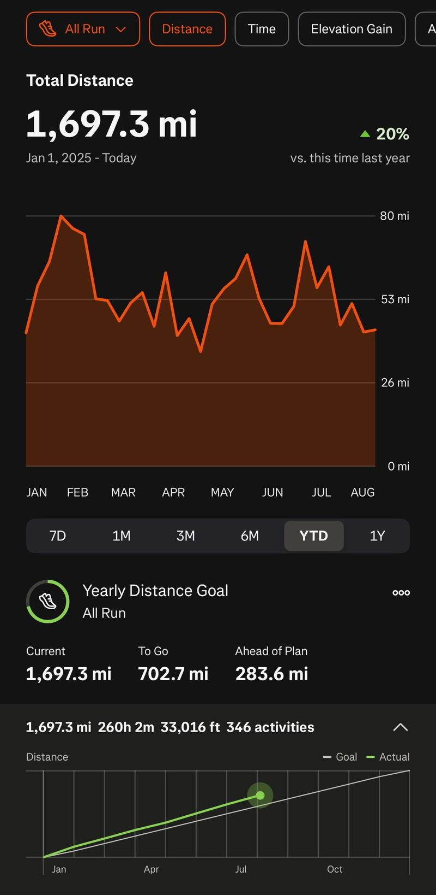
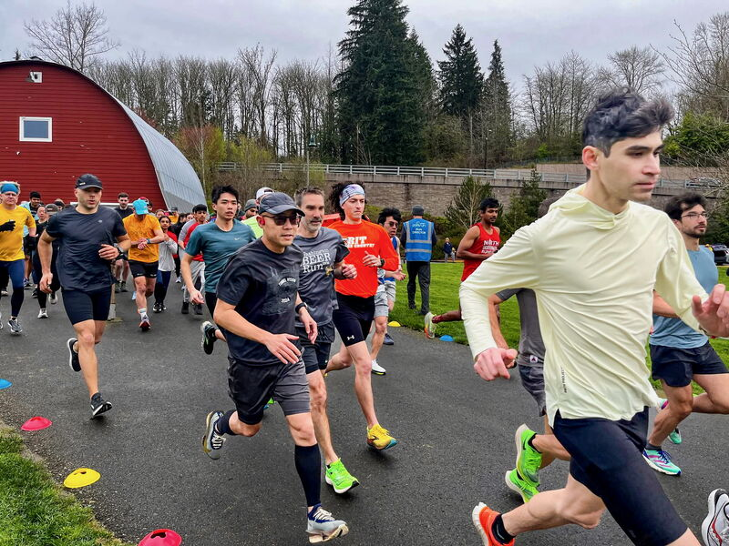
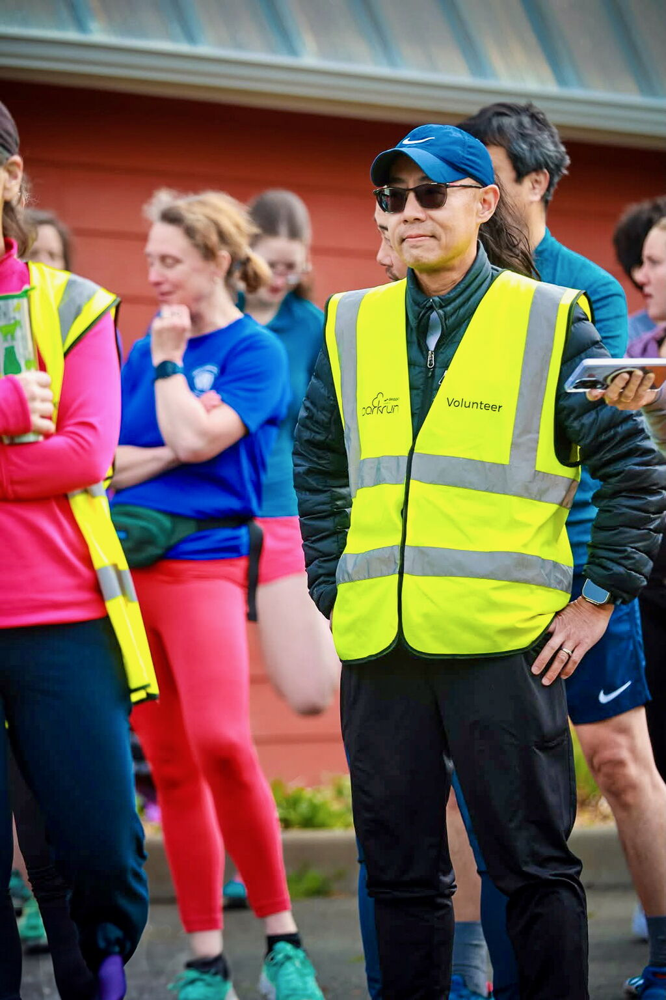
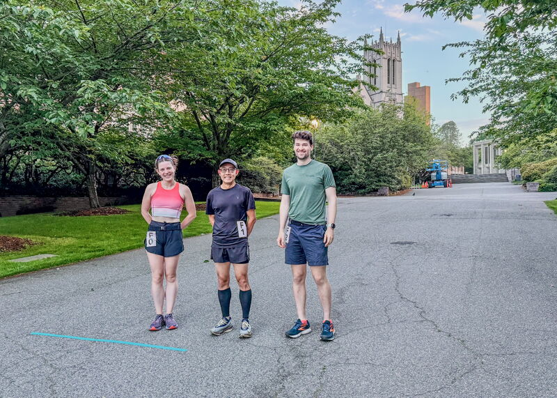

::: {layout-ncol=2}

:::
All systems checked and good to go! Today I ran my 61st half marathon (since 2022) on the Snoqualmie Valley Trail, clocking in at 1:45:04, pace 7'56"/mi. This was a controlled descent simulating the full all-downhill marathon race ["Tunnel Vision"](https://www.tunnelmarathon.com) coming up next Sunday. As an experiment, I created a training plan for this final week using ChatGPT, and it gave me flying colors for today's practice run! 🙂

Picture 1: Today's training plan and result
Picture 2: Coach ChatGPT's analysis of today's run
Picture 3: Me after today's run

Yes, you're reading my mid-year running recap! As of August 3, I've logged 1,697.3 miles -- 283.6 miles ahead of my yearly plan of 2,400. That's 54.75 miles/week and a 20% increase from a year ago.

Picture 4: Running mileage YTD

I'm happy to report that I've broken my PR at every distance this year! I'm now sub-45 for 10K, sub-1:10 for 15K, and sub-1:40 for half marathon. Still chasing that sub-21 for 5K (currently 11 seconds short), and 3:20:00 BQ for marathon (5 minutes off)!

Picture 5: Personal records YTD (runs are counted since 2018)

There have been some truly memorable runs these past few months. Beyond the weekly Parkruns (90 since 2022), I ran the "World's Fastest 10K" race where I earned my 10K PR, did the crazy UW water fountain marathon race again (222 laps), ran a few gorgeous long runs from Snoqualmie Pass (including 2 full marathons), and completed the beach route from West Point Lighthouse to Elliott Bay Trail that Strava claimed only two others have done before me!

Pictures 6 & 7: Parkruns
Picture 8: The only 3 runners for the [2025 UW Drumheller marathon](https://raceconditionrunning.com/drumheller-marathon-25/)!

Here are a few short running recap videos for you to enjoy:

](video-DZRPuDzm1mw.jpg){fig-align="center"}

▶️ [East to West of Lake Washington and Back, 35.28mi](https://youtu.be/DZRPuDzm1mw)

](video-3ZcwYY3xZq0.jpg){fig-align="center"}

▶️ [Snoqualmie Pass Southbound, 31.3mi](https://youtu.be/3ZcwYY3xZq0)

](video-SkgCG51Cg2o.jpg){fig-align="center"}

▶️ [Beach Run from West Point Lighthouse to Elliott Bay, 9.42mi](https://youtu.be/SkgCG51Cg2o)

📺 More on my [running recap video playlist](https://youtube.com/playlist?list=PLz7qd_EMlRkR4hTs6HgmqK_LMgALFvemt).

---

*Originally posted on [LinkedIn](https://www.linkedin.com/posts/benjaminhan_marathon-race-chatgpt-activity-7357955843738259456-yHP6).*
