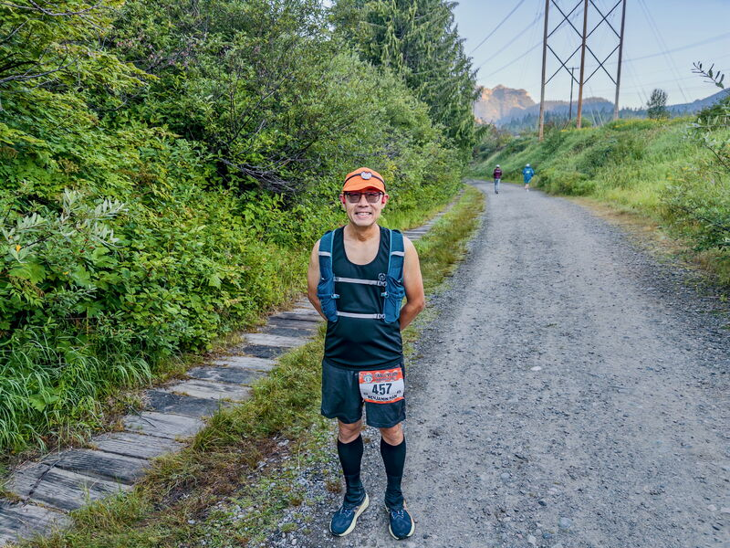
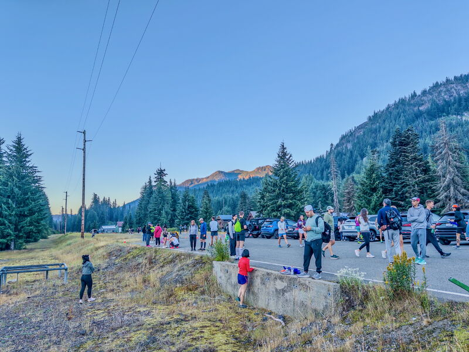
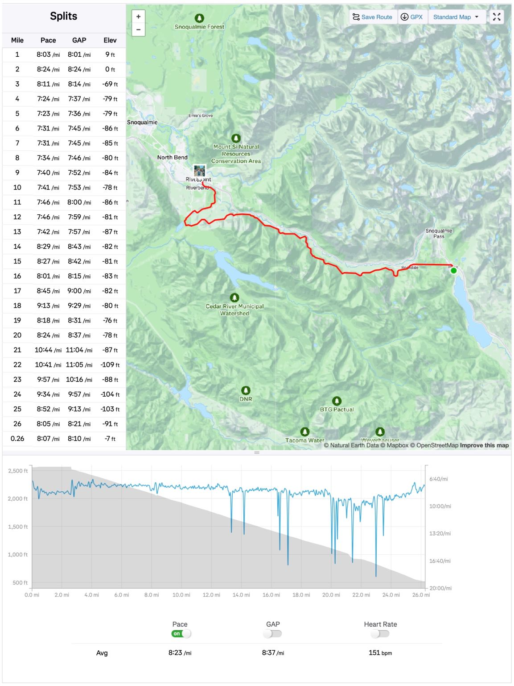
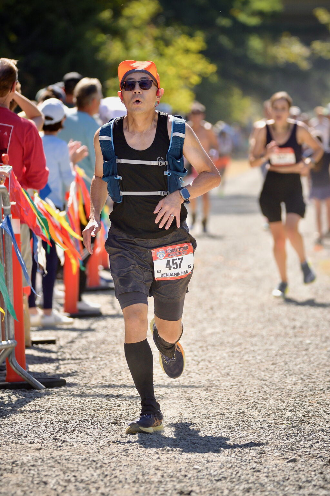
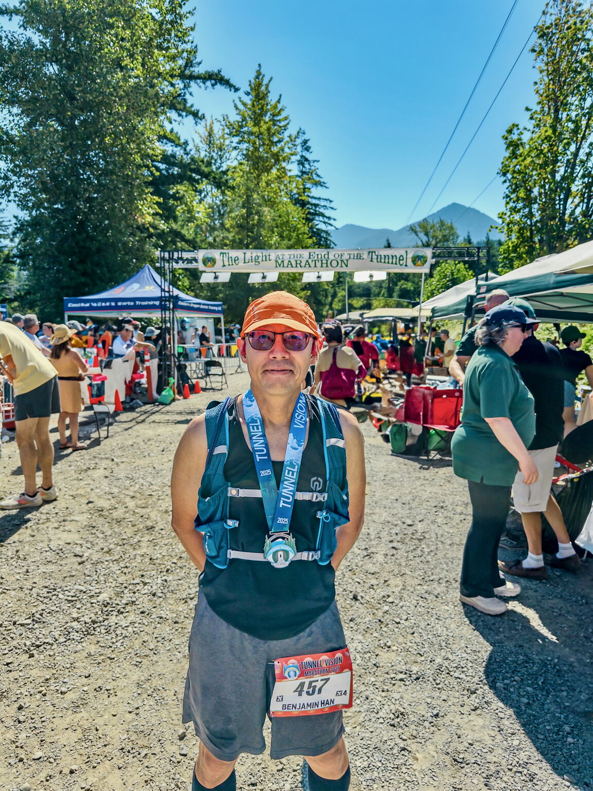
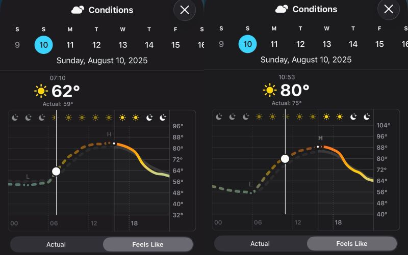
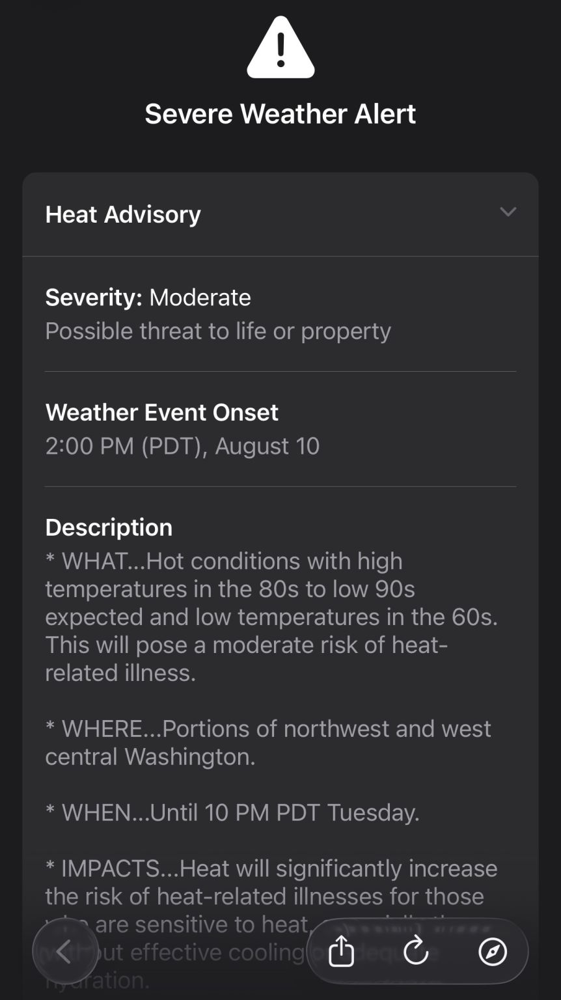
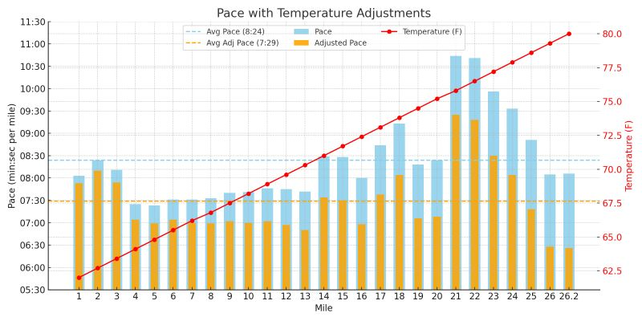

::: {layout-ncol=2}

:::

Yesterday I got up at 4am and ran the Tunnel Vision marathon race as my 28th marathon since 2023. It took me the whole day today to take stock of what had happened.

First, the bottom line: my chip time was 3:40:01, pace 8'24"/mi, with 2,036 ft negative EG — all downhill. This was a 7.5 min improvement from my run last year (3:47:33), but it's far from the BQ time I was hoping for (3:20). In fact, it is worse than the Mill Town marathon I ran this April with a chip time of 3:24:01, which has ~800 ft EG!

My training and pre-race condition were both decent, so what went wrong?

📸 Picture 1: nervous energy at warmup
📸 Picture 2: pre-race crowd
📸 Picture 3: my race stats

The first half actually went according to plan: I finished 13.2 mi in 1:40:44. But then disasters started to strike:

1. Mile 17 — my quads started complaining, especially the left one.
2. Mile 20 — it started threatening to quit (cramp).
3. Then my left big toe started complaining too (black toe AGAIN).
4. Shortly afterward, I started to have a side stitch.

It was so bad that I actually doubted if I could finish. Well, I persisted with walking and easy running, then tried my best to have a strong-ish finish — at least as fast as how I started.

📸 Picture 4: struggling at the final stretch
📸 Picture 5: after the run

I was sad for some hours after the run, until an experienced trail runner sent me this article from runnersworld.com: [How Much Does Heat Affect Running Pace?](https://www.runnersworld.com/training/a65351982/heat-impact-on-running-pace/), which can be summed up in one sentence: a runner can expect to add 20–30 sec/mile for every 5°F increase above 60°F! Then it dawned on me: we started the race from Snoqualmie Pass at ~62°F (16.7°C) and finished at North Bend at ~80°F (26.7°C). There was actually a heat advisory out on Sunday! 🫠

So I adjusted my pace stats from yesterday, assuming a linear temperature change throughout the run, starting from 62°F and ending at 80°F, and subtracting 25 sec per 5°F from my pace. Result: adjusted finish time 3:16:12, pace 7'29"/mi — I could have BQ'ed!!! 😆

📸 Picture 6: starting/finishing temperature
📸 Picture 7: heat advisory
📸 Picture 8: temperature-adjusted pace

The same trail runner also shared his words of wisdom: whenever we face situations like this, the best course of action is to adjust the goal. What I should have done was to forget about my initial BQ goal (pace 7'39"/mi) and pace myself adequately slower in the first half. This way I could have run a bit faster than what I have now, and recovered faster from this run!

(there's a life lesson there somewhere)

My next marathon race in October is a flat one (~200 ft) – onward!

*Originally posted on [LinkedIn](https://www.linkedin.com/posts/benjaminhan_running-marathon-activity-7360924907767021569-zdJv).*
