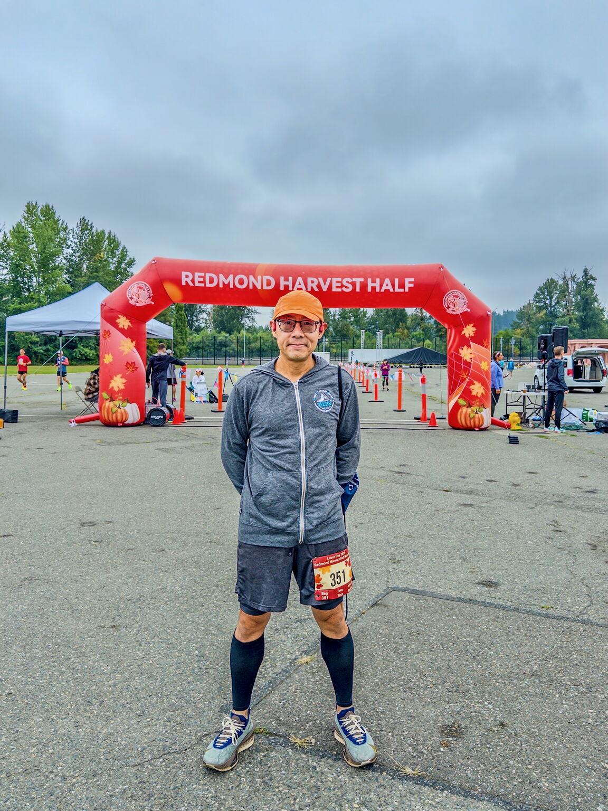
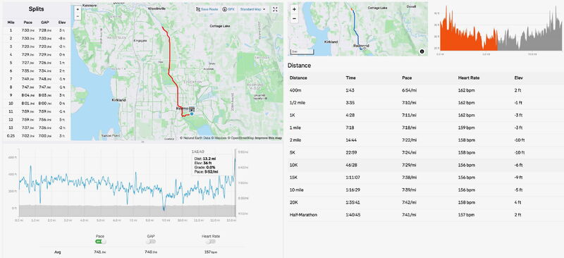
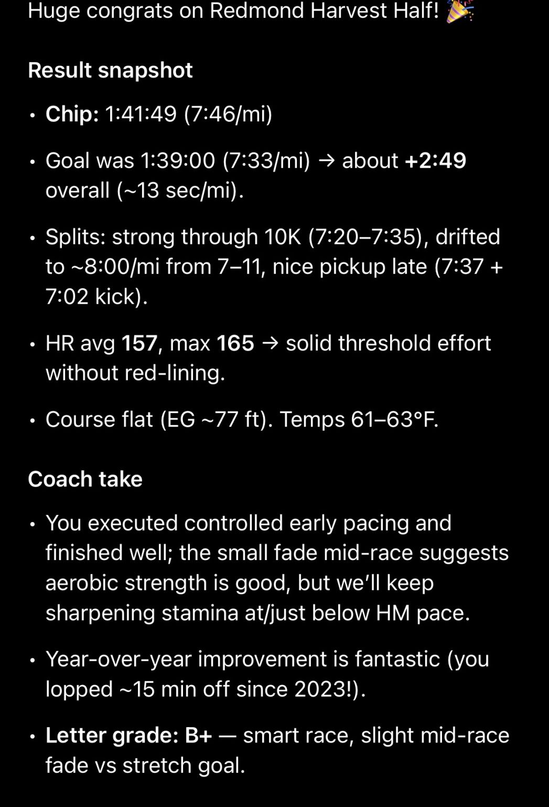
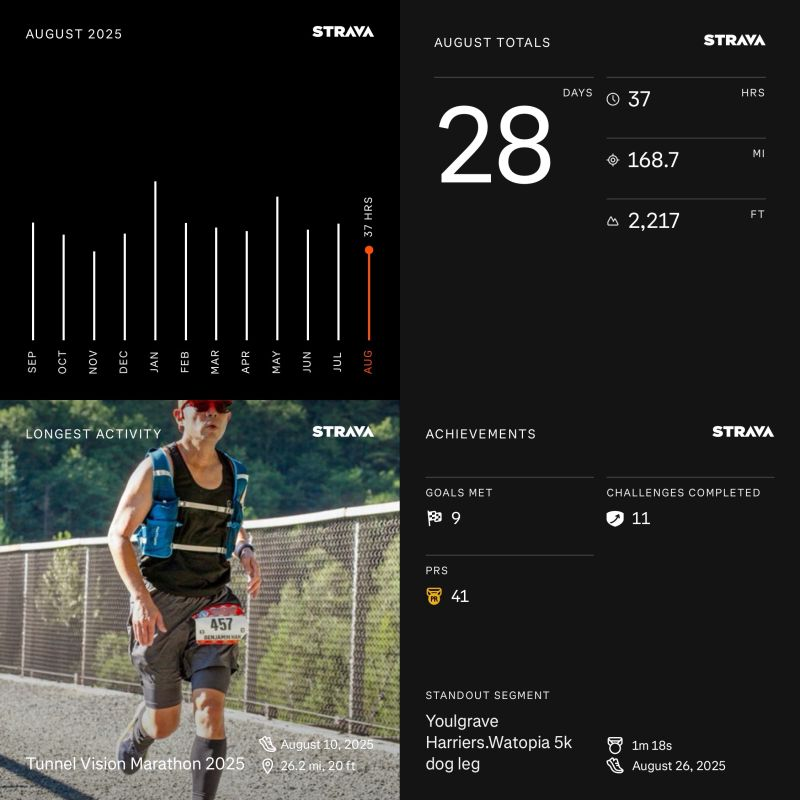
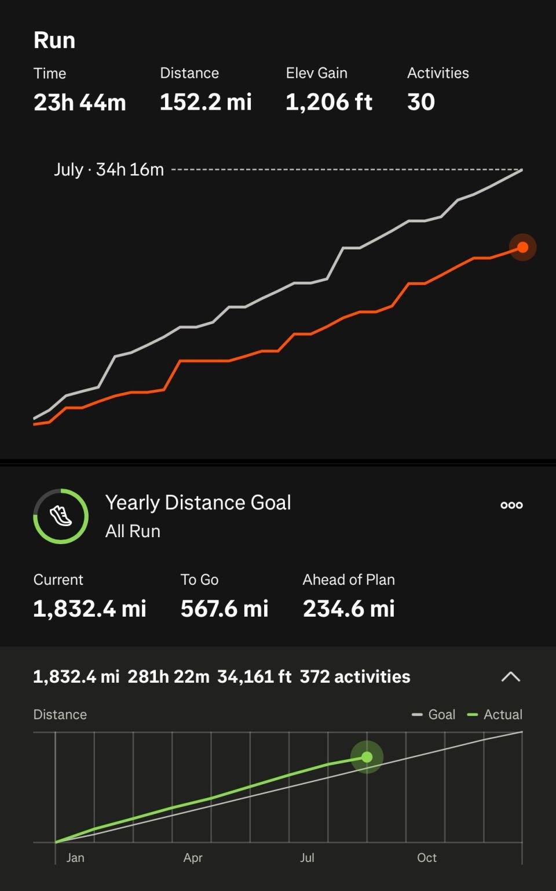

::: {layout-ncol=2}

:::

I ran Redmond Harvest Half Marathon on this Labor Day Monday (also my 64th HM since 2022): Strava time 1:40:45 pace 7'41"/mi, chip time 1:41:49 7'46"/mi. I was placed 219/699 overall and 11/29 in my age group.

I was hoping for 1:39:00 and the first half went with the plan (sounds familiar). Lost steam after that, and picked myself up and ended w/ peak 5'52"/mi.

I've run this race since 2023, with time progression 1:56:05 → 1:45:08 → 1:40:45. Progress made. But CoachGPT wasn't too happy! 😆

Picture 1: me @ Redmond Harvest Half starting line
Picture 2: today's pace
Picture 3: CoachGPT's comments

Also my August running recap: compared to July I have 225.4 → 152.2mi (168.7 w/ walking), EG 4,419 → 1,206ft, 34 → 24hr running.

This was down significantly from July, due to tapering/recovering for the two races: [Tunnel Vision Marathon](../20250811-tunnel-vision-marathon/) and today's half (3 weeks apart). My VO2Max via AppleWatch is also consistently above 51 now!

I'm at 1,832.4 of yearly goal 2,400mi, 234.6 ahead. My next marathon race is in October (last chance to BQ this year)! Onward!

Picture 4 & 5: August running stats

*Originally posted on [LinkedIn](https://www.linkedin.com/posts/benjaminhan_running-coachgpt-marathon-activity-7368416030261481472-VgU1).*
