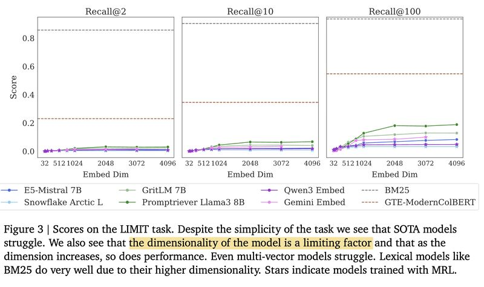
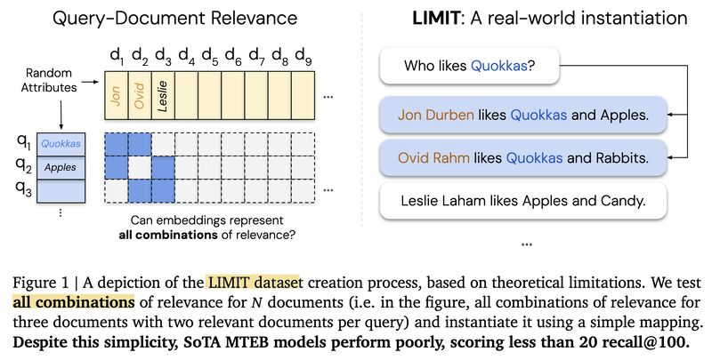

)](cover.jpg){fig-align="center"}

A follow-up to [Embeddings Hit a Theoretical Ceiling](../20250831-embedding-retrieval-limits/).

An important callout about this paper: many posts miss that the proof of limitation rests on a basic linear algebra fact: rank(AB) ≤ min(rank(A), rank(B)). This is a constraint of using dot product / cosine similarity for relevance scoring, not an inherent limit of embeddings themselves. Even bilinear models or learned similarity matrices still fall under this bound.

The paper suggests several ways out: multi-vector representations, late interaction models, and cross-encoders. And I'll add one more: classic ML offers kernel tricks like Gaussian RBF that can break the embedding dimension bottleneck.

Curious to hear: how would the field tackle the bottleneck?

---

*Originally posted on [LinkedIn](https://www.linkedin.com/posts/benjaminhan_ai-llm-rag-activity-7369011679533125633-oMKw).*
