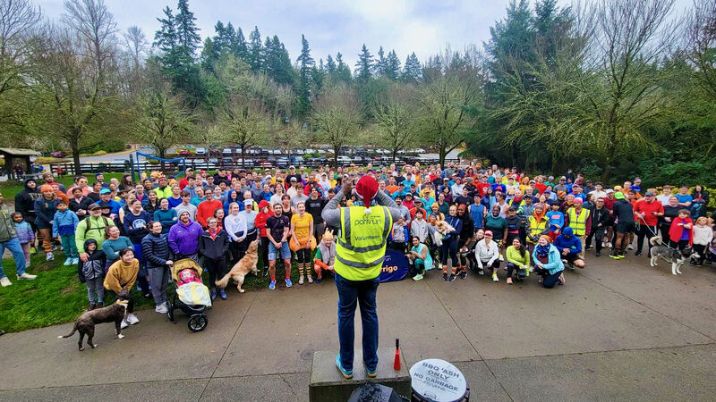
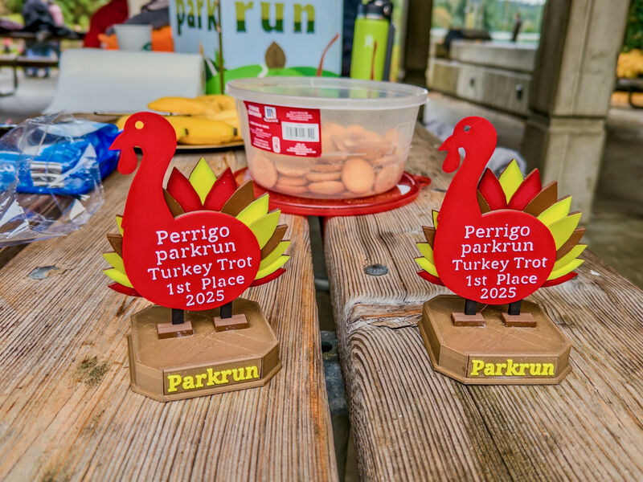
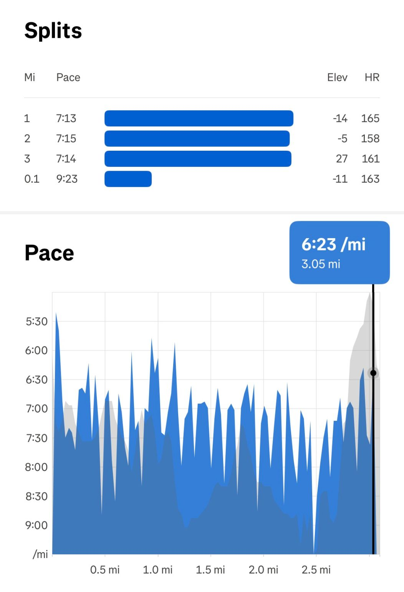

::: {layout-ncol=2}

:::

Parkrun Turkey Trot today! A record 270+ runners showed up! I ran a 22:09 — not a PR, but felt strong and in control the whole way!

On this Thanksgiving: huge thanks to Parkrun and all the volunteers for creating such a wonderful community where anyone can join in, lift each other up, and become healthier and happier together. If you haven't tried one yet, check out your local Parkrun and come run with us!

*Originally posted on [LinkedIn](https://www.linkedin.com/posts/benjaminhan_running-parkrun-turkeytrot-activity-7399943898061537280-jr2j).*
