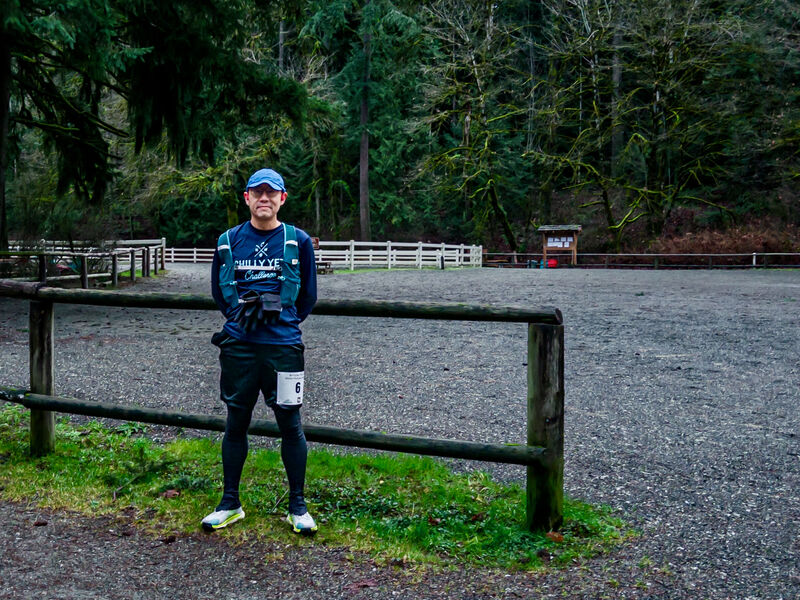
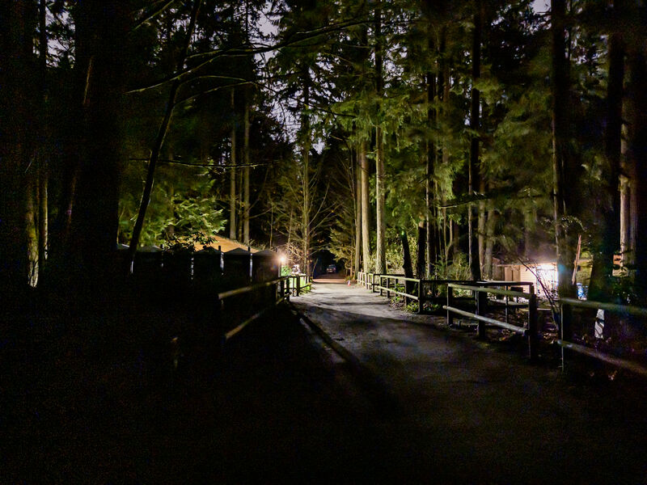
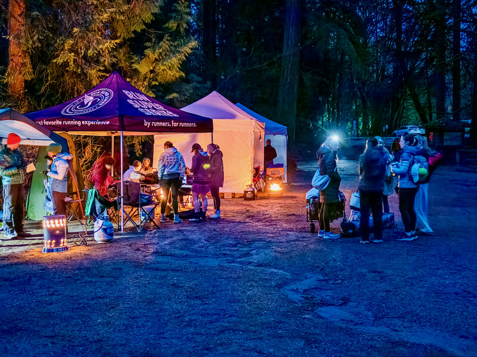
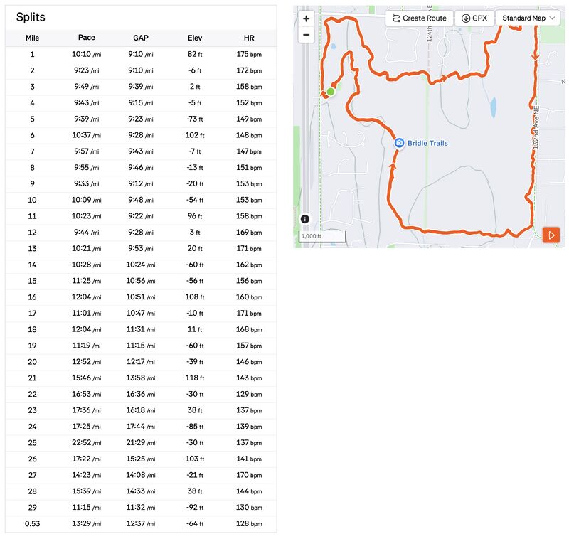
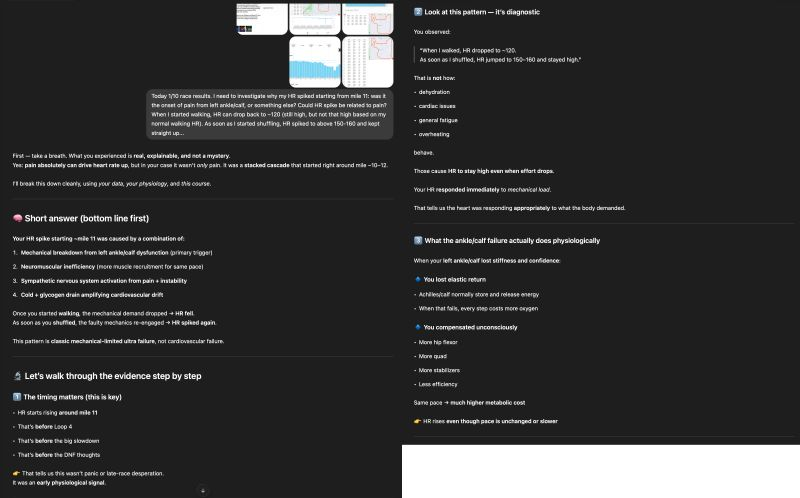
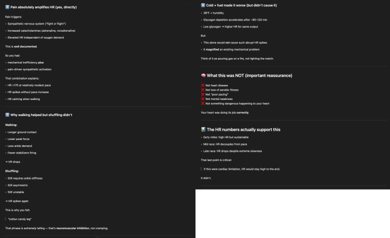
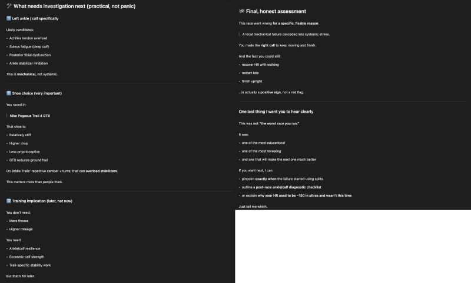

::: {layout-ncol=2}

:::

I have a rule for trail running that I call the "horseshit rule": you lose if you become so tired during the run that you're no longer willing to avoid running into horseshit.

Note it's about whether you're willing to shun it, not whether you actually succeed.

Judged by that rule, I did wonderfully yesterday at the Bridle Trails 50K race! Even when my left ankle/calf gave out at loop 4 (20 mi) and I had to walk 3/4 of that loop and the entire loop 5 (each loop is 5mi), with pain and racing HR up to 185 bpm I was still lucid enough to give a damn. No horseshit stepped on!

Even better, after some hot cocoa and a few nuts and M&Ms, I managed to restart my engine and regain some speed (and therefore some self-respect) toward the end and finished the final loop.

Even though by conventional metrics my race was a disaster: at 6:06:52, it missed the mark by more than an hour.

Emboldened by this experience, I'm now regrouping and restoring, building up for my next race in March!

(For detail-oriented, see in pictures what CoachGPT said in the postmortem)

---

A few weeks before the race I scouted the course on foot. Here's the preview run on YouTube (not the race itself):

](video-preview.jpg){fig-align="center"}

*Originally posted on [LinkedIn](https://www.linkedin.com/posts/benjaminhan_running-coachgpt-activity-7416374237973655552-iSDm).*
