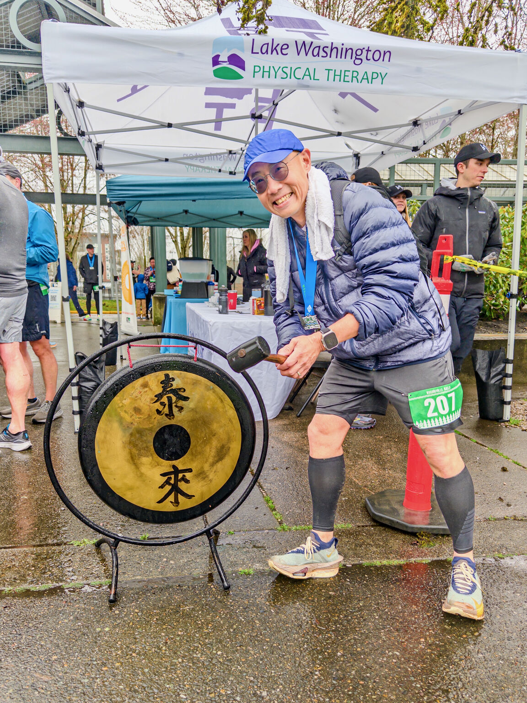
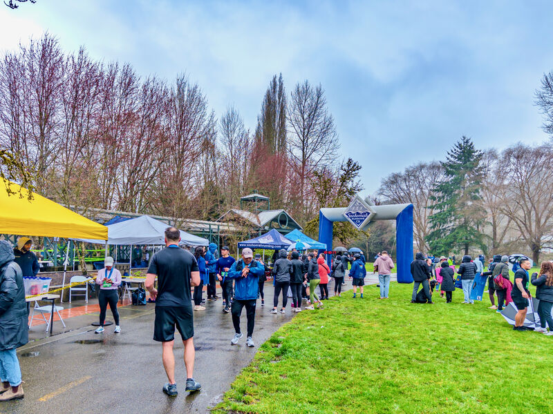
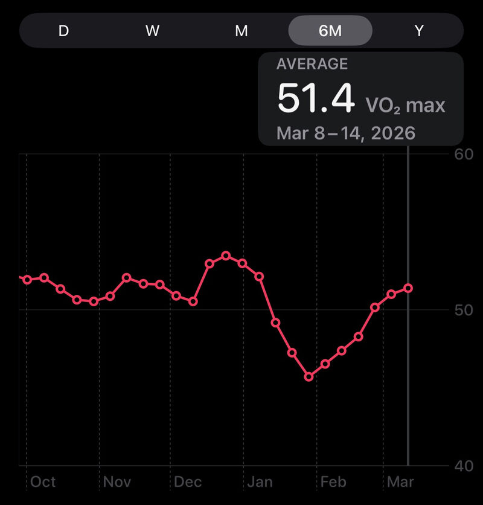
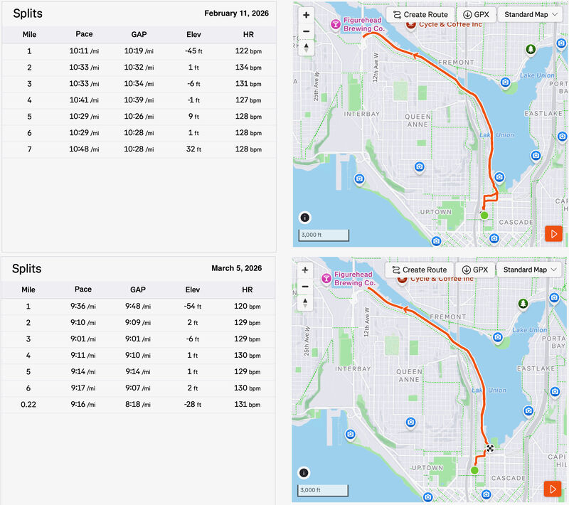

::: {layout-ncol=2}

:::

I ran my HM #76 today (since 2023) at the Woodinville Half. Chip time matched my watch: 1:44:20 (7:57/mi). I finished 58/554 overall, 45/216 men, 5/29 AG. Felt like I still had gas left at the end!

Course surprise: the gravel section on the Eastrail wasn't where the map suggested. I expected it around mile ~2, but they changed the ordering so it ran from mile 8 to 11. Rain left puddles, so we had to run on rougher gravel parts to avoid them, which cost more pace. Those miles were a bit over 8:00/mi, but the rest were sub-8, and I finished faster than I started!

Weather was rainy and cold (felt like ~40F at the start with ~9mph wind). Also today was the DST change, so we lost an hour of sleep.

Pretty happy with this one, even though it's not a PR (1:39:07). A month or so ago I was at rock bottom after the [disastrous 50K trail race in January](../20260112-bridle-trails-50k/) and a cough that lasted over a month. Today felt like I finally made it back: VO₂max recovered from 45.9 to 51.5 since February, and my <130 bpm easy pace improved from 10:30/mi to 9:15/mi.

Happy International Women's Day!

---

A few weeks before the race I scouted the course on foot. Here's the preview run on YouTube (not the race itself):

](video-preview.jpg){fig-align="center"}

*Originally posted on [LinkedIn](https://www.linkedin.com/posts/benjaminhan_running-activity-7436545314745987072-2-XY).*
