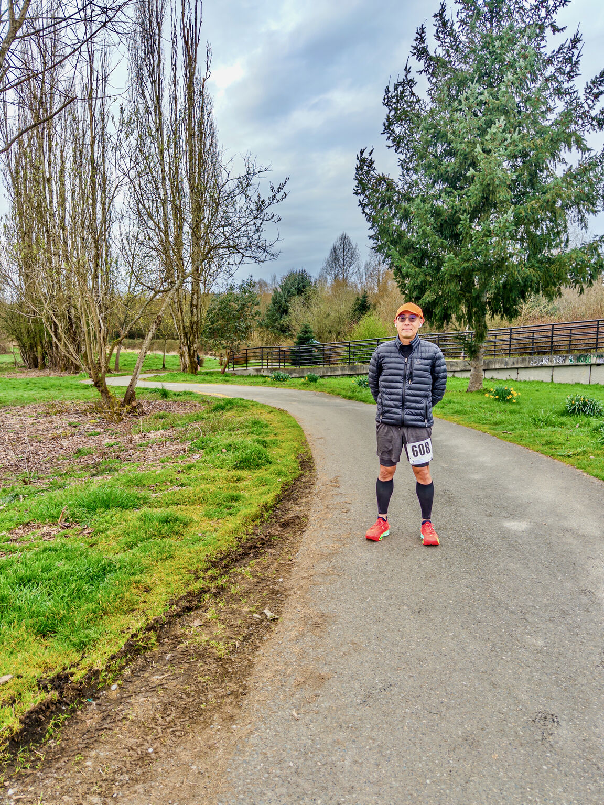
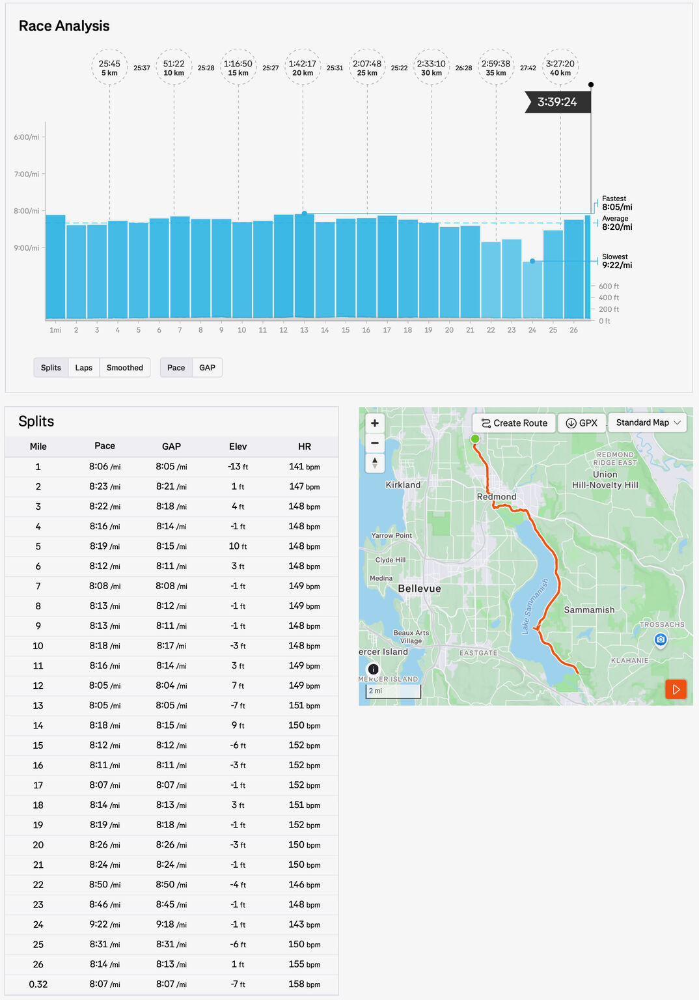

::: {layout-ncol=2}

:::

Today I ran my 30th marathon (since 2024) at the Redmond City Marathon race, finishing in 3:38:33 (watch time) with pace 8'20"/mi. It also extended an unusual streak for me: 7 straight weeks of running HM or longer!

This was my first marathon raced by HR, and that part mostly went to plan: I got avg/max HR of 149/159 bpm. The bigger challenge in the second half was actually not keeping my HR down, but getting it up. My legs were prematurely tired mainly due to a very silly mistake happened early in the race: I stored gels in the shallow part of my vest pockets, and they went flying at ~2.6mi mark! I stepped onto the unpaved edge to retrieve them, and proceeded to spraining my left ankle!

Running on it didn't feel too bad and I thought I had cheated disaster. It started to rear its ugly head around the famous mile 20. Well, this is what it is -- at least I managed to have a strong-ish finish in the last 2+mi!

Not the race I originally imagined, but sometimes sh*t happens (okay, most of the times). My next marathon is ~24 weeks out –- a lot of training to do, but I have the time! Onward!

*Originally posted on [LinkedIn](https://www.linkedin.com/posts/benjaminhan_running-marathon-activity-7444201961870077952-Fl0o).*
