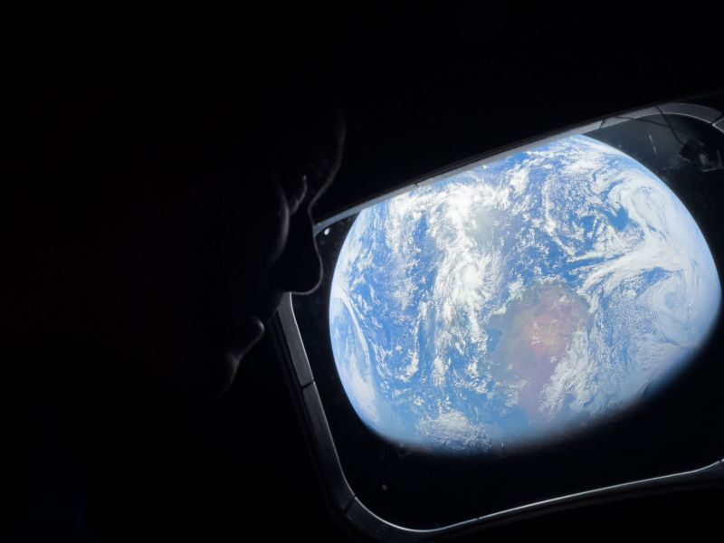
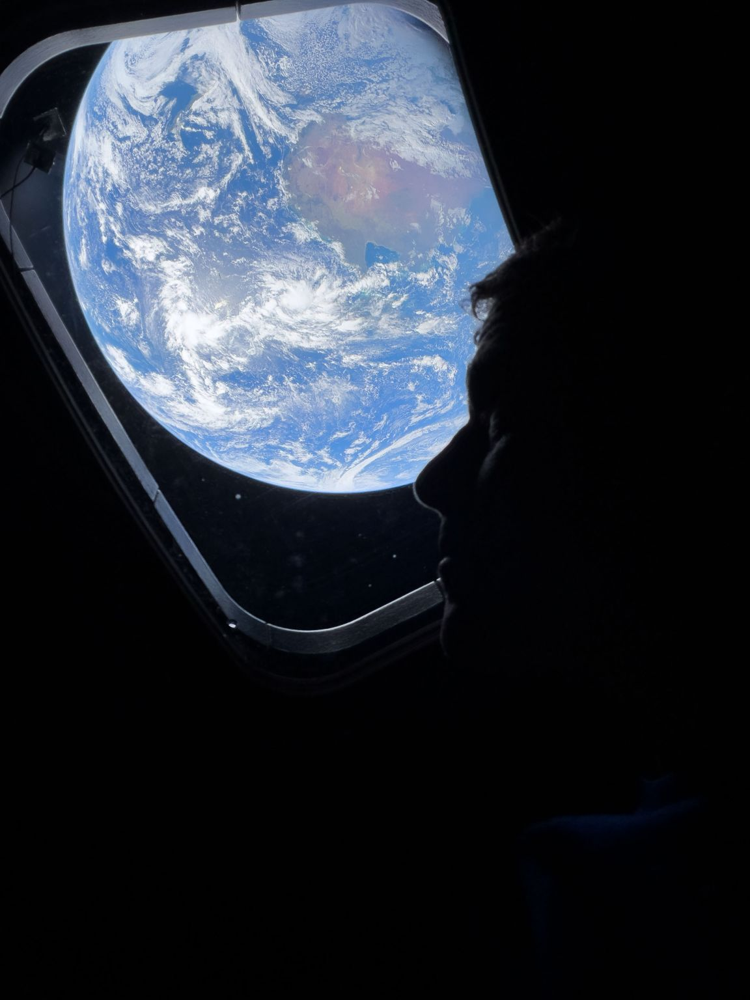

)](earth-from-orion.jpg){fig-align="center"}

Astronauts onboard Artemis II took pictures with iPhone 17 Pro Max [[1]](#ref-1).

---

## References

[1] NASA. "Home, Seen from Orion." *Flickr (NASA2Explore)*, April 4, 2026. <https://www.flickr.com/photos/nasa2explore/55187189317/>

---

*Originally posted on [LinkedIn](https://www.linkedin.com/posts/benjaminhan_iphone-artemisii-moon-activity-7446990804394590208-06EG).*
