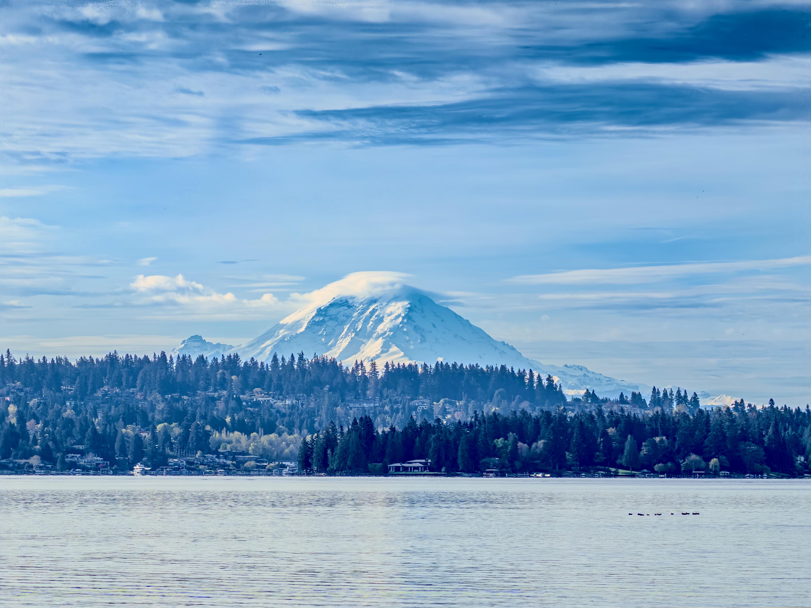
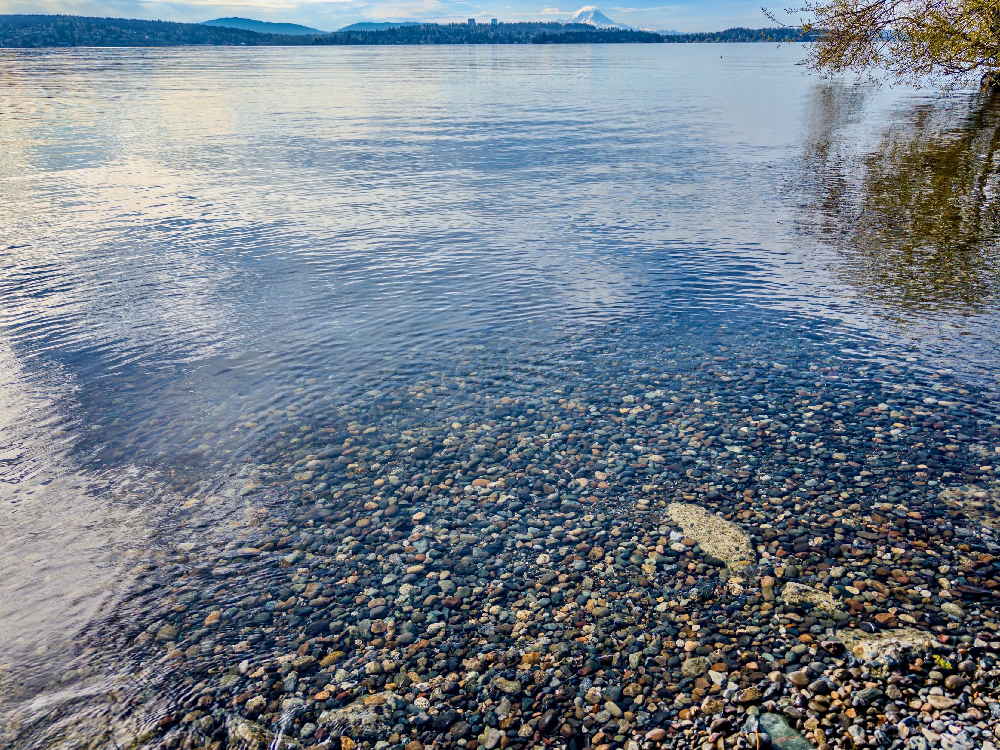
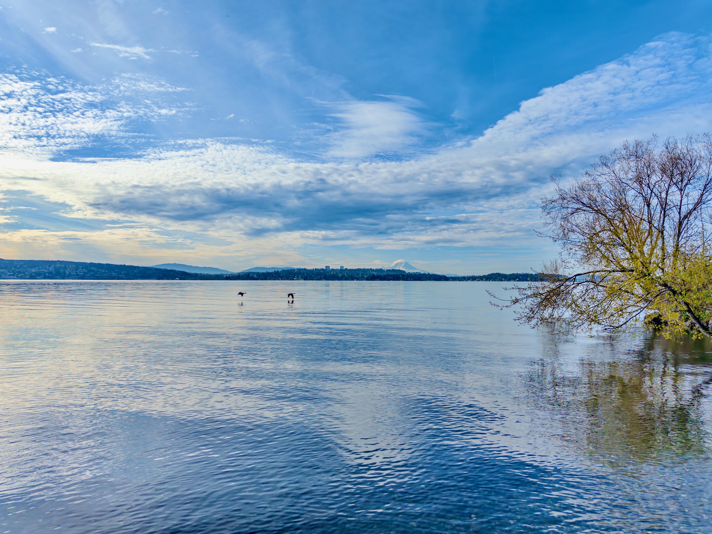
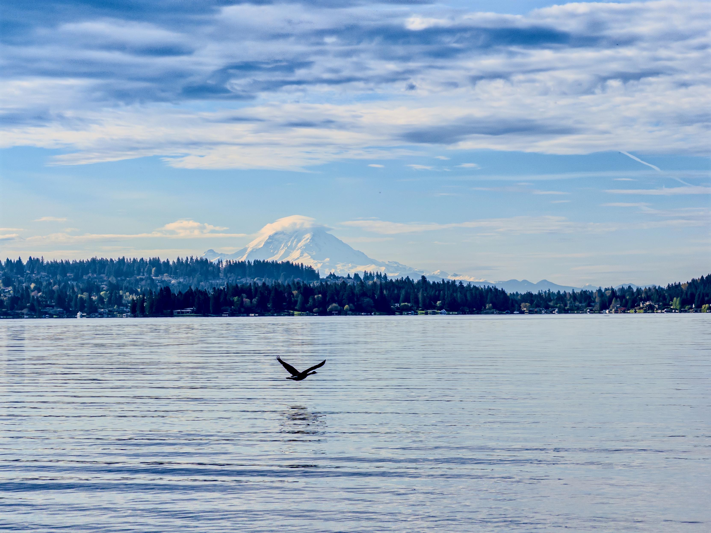
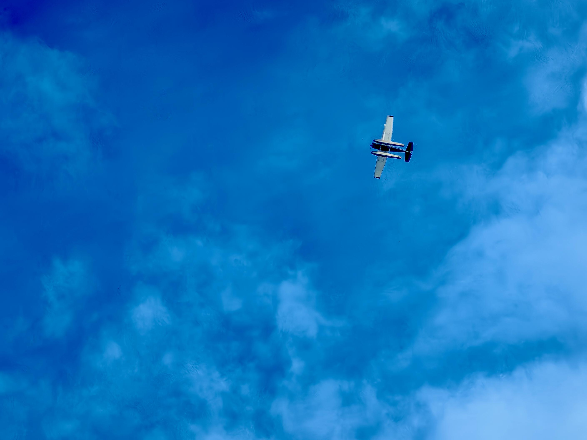
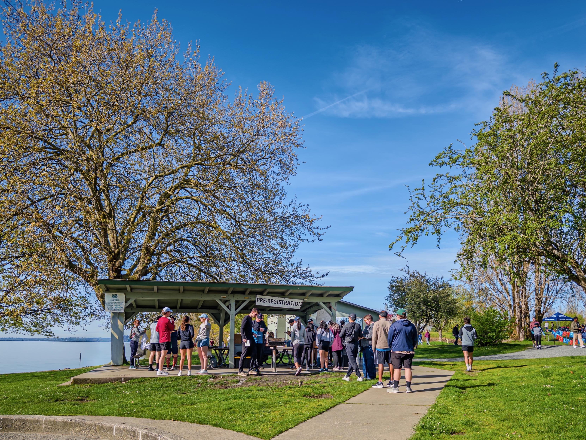
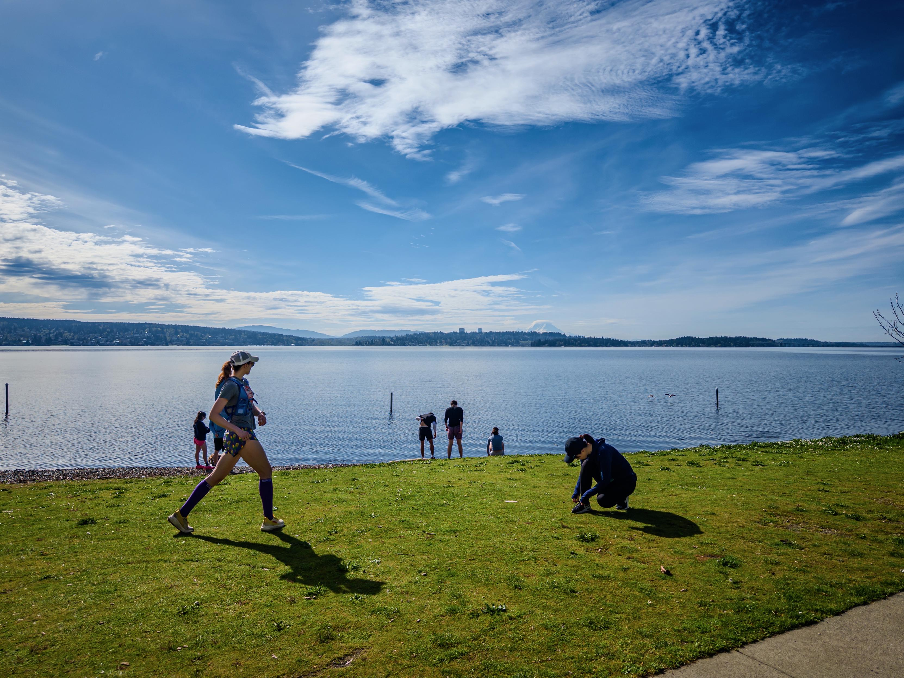
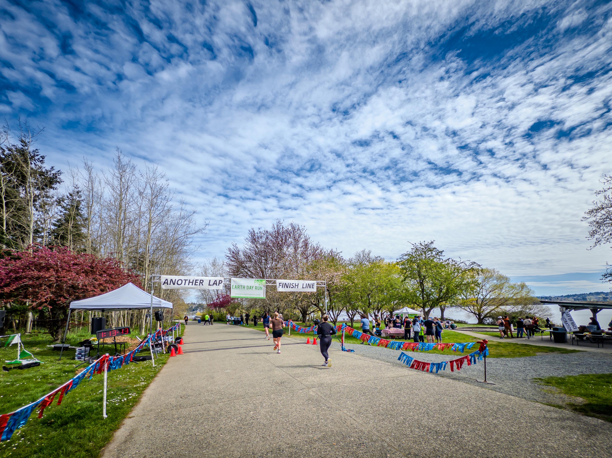

::: {layout-ncol=2}

:::

Earth Day 10K race today! My daughter and I ran as a team ("Speedy Swine & Bovine" anyone?): her time was 49:36:31 ranked 11 (of 102), and my time was 55:37:32 ranked 25. We both earned our #1 in our respective age groups!

::: {layout-ncol=2}

:::

Coming from 3 days of no running due to ankle/knee problem, and only 2-hour sleep two nights ago (hooked with work), I was planning to just *walk* this race. But no, that type-A me just said go ahead! I did try to stay easy-ish pace, and in the end I didn't feel too taxing. But my HR disagreed: avg/max 155/173 bpm at this pace! Terrible!

Next race is in June — time to recover and rebuild!

*Originally posted on [Mastodon](https://sigmoid.social/@BenjaminHan/116431843411259407).*
