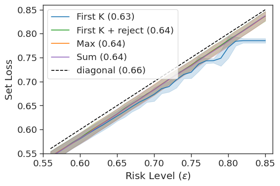
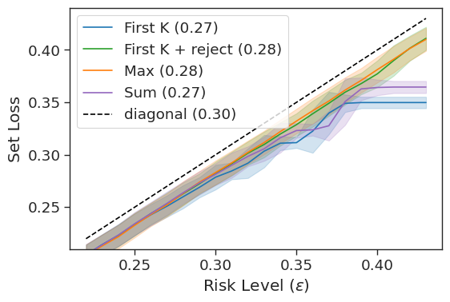
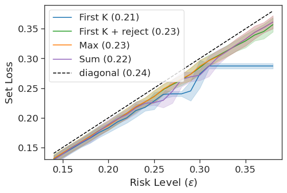
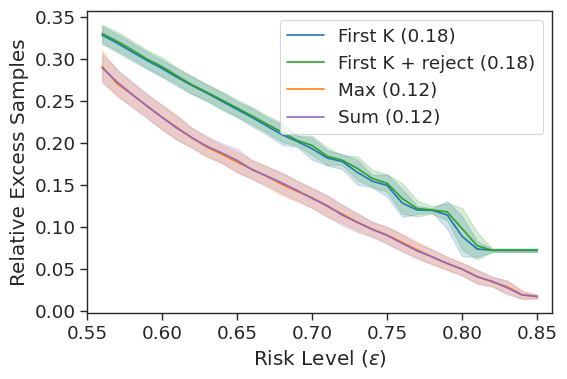
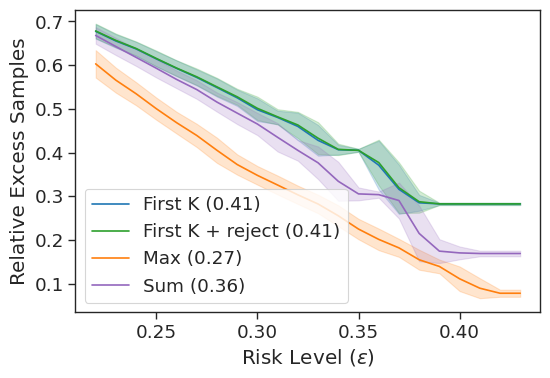
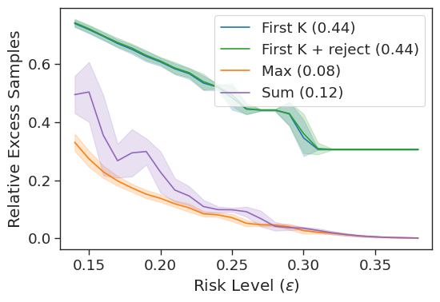
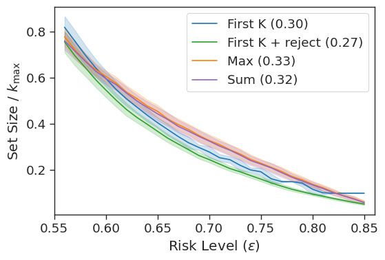
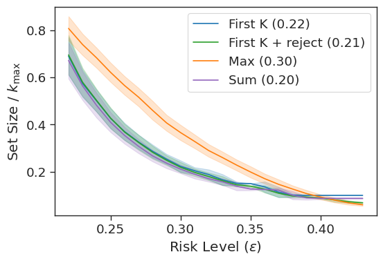
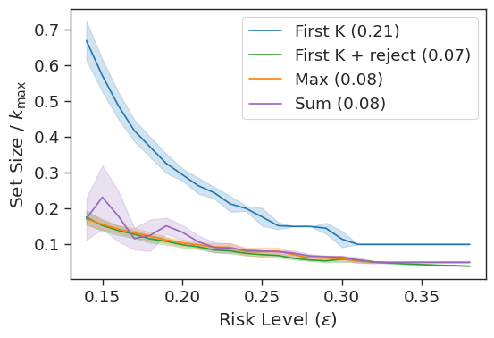

![Schematic of the conformal sampling procedure. A black-box language model emits candidates one by one; each is added to the growing output set only if it clears a minimum-quality threshold and a diversity criterion; the loop halts when the calibrated stopping rule certifies the set likely contains an acceptable answer. Figure 1 from the paper [[1]](#ref-1).](cover.jpg){fig-align="center" data-lightbox-src="cover-full.jpg"}

In *Conformal Language Modeling* [[1]](#ref-1) (ICLR 2024), [Victor Quach](https://vquach.com/), [Adam Fisch](https://people.csail.mit.edu/fisch/), [Tal Schuster](https://people.csail.mit.edu/tals/), Adam Yala, Jae Ho Sohn, [Tommi Jaakkola](https://people.csail.mit.edu/tommi/tommi.html), and [Regina Barzilay](https://www.regina.csail.mit.edu/) (MIT, Google Research, UC Berkeley, and others) adapt [conformal prediction](/posts/20260505-conformal-prediction-primer/) to generative language models (LMs) by calibrating a sampling stopping rule plus a candidate-rejection rule so the returned output set provably contains an acceptable answer with user-chosen probability.

> We propose a novel approach to **conformal prediction for generative language models (LMs)**. Standard conformal prediction produces prediction sets — in place of single predictions — that have rigorous, statistical performance guarantees. LM responses are typically sampled from the model's predicted distribution over the large, combinatorial output space of natural language. Translating this process to conformal prediction, we **calibrate a stopping rule for sampling different outputs from the LM that get added to a growing set of candidates until we are confident that the output set is sufficient**. Since some samples may be low-quality, we also simultaneously calibrate and apply **a rejection rule for removing candidates from the output set to reduce noise**. Similar to conformal prediction, we prove that the sampled set returned by our procedure **contains at least one acceptable answer with high probability**, while still being empirically precise (i.e., small) on average. Furthermore, within this set of candidate responses, we show that we can also accurately **identify subsets of individual components — such as phrases or sentences — that are each independently correct** (e.g., that are not "hallucinations"), again with statistical guarantees.

## Method

The method treats the LM as a black box. The set predictor $\mathcal{C}_\lambda$ is built by sampling candidates one at a time: each candidate is added if it clears a learned quality threshold and a diversity check against what is already in the set, and sampling halts once a calibrated statistic certifies the set likely covers an acceptable answer. The subscript $\lambda$ collects the calibration-time hyperparameters: stopping threshold, rejection threshold, diversity threshold.

A second conformal layer operates inside the final set, selecting subsets of *components* (individual phrases or sentences) that are each independently likely to be correct, so users can keep guaranteed claims and drop the rest. Joint calibration of all these thresholds uses the Learn-then-Test (LTT) framework of [[2]](#ref-2), which tunes multiple parameters at once with finite-sample validity via multiple-testing correction.

Unlike standard conformal prediction, the guarantee is a *nested* probability with two user parameters. $\epsilon$ is the familiar coverage level (miss rate at most $\epsilon$ across fresh prompts). $\delta$ is new: because LTT tunes multiple hyperparameters jointly, a second probabilistic budget covers the randomness of the calibration set itself. Formally,

$$\mathbb{P}\Big(\mathbb{P}\big(\exists y \in \mathcal{C}_\lambda(X_{\text{test}}): A(y) = 1 \mid \mathcal{D}_{\text{cal}}\big) \geq 1-\epsilon\Big) \geq 1-\delta,$$

where $A(y) = 1$ means $y$ is acceptable under the user's per-task scoring rule. The inner probability (over fresh test prompts, given the calibration set) says the returned set covers an acceptable answer at least $1-\epsilon$ of the time. The outer probability (over draws of the calibration set itself) says this inner bound holds for at least a $1-\delta$ fraction of calibration draws.

In practice the two probabilities apply at two different moments. At calibration time, the random draw of the calibration data determines whether the tuned hyperparameter $\lambda$ is good, and this happens with probability $1-\delta$. At deployment time, given a good $\lambda$, the miss rate across fresh prompts is at most $\epsilon$ in expectation. There is no runtime signal to tell you whether your $\lambda$ was one of the good ones. Concretely, with $\epsilon = 0.1$, $\delta = 0.05$, and 1,000 calibration prompts: 95% of calibration runs produce a usable $\lambda$; when they do, about 9,000 of the next 10,000 deployment prompts are expected to be covered.

The guarantee is marginal across prompts, not conditional on any one: per-prompt coverage can be much better or much worse than $1-\epsilon$ depending on difficulty. Exchangeability is the critical assumption; calibrate on 2023 clinical notes and deploy on 2026 notes, and all bets are off. And at inference time there is no per-element signal saying which output in the returned set is the acceptable one; the component-level layer is the paper's partial answer.

## Results

Experiments cover open-domain question answering (TriviaQA), text summarization (CNN/DailyMail), and radiology report generation (MIMIC-CXR) across several LM backbones. The four scoring functions compared are FIRST-K (keep the first $K$ samples unconditionally), FIRST-K+REJECT (same but filter with the quality threshold), MAX (keep candidates whose score exceeds the running max), and SUM (keep candidates until the summed score crosses a threshold).

Figure 2 serves two purposes. The top row is a validity check: if the conformal theory holds, every method's empirical set loss should track or fall below the $y = \epsilon$ diagonal across the risk range. All four scoring functions pass on all three tasks. The middle and bottom rows compare efficiency — middle row for how many LM forward passes each method consumes, bottom row for how large the returned set grows at matched coverage. Uniform sampling (FIRST-K) is the worst performer across nearly every task and metric. The three rejection-based variants (FIRST-K+REJECT, MAX, SUM) all improve on it, with no single variant dominating across tasks. The paper treats the scoring function as a task-specific design choice rather than declaring a winner.

Three patterns in the figure are worth naming beyond that basic read. First, the validity check is near-tight: the set-loss curves sit close to the $y = \epsilon$ diagonal rather than well below it, meaning the procedure isn't silently over-conservative, and efficiency gains aren't bought by hidden extra margin. Second, the rejection-vs-uniform gap is task-dependent. TriviaQA shows the largest improvement of rejection methods over FIRST-K. MIMIC-CXR shows the smallest. One plausible reason: when acceptable answers span a wider semantic range (radiology reports have many valid phrasings for the same findings), the LM's likelihood signal that the rejection methods exploit is less informative. Clinical text is harder to rank well than trivia answers. Third, rejection methods separate most at moderate $\epsilon$, roughly 0.2–0.4 in these plots. At tight $\epsilon$ all methods converge toward nearly-trivial "everything" sets, and at loose $\epsilon$ the gaps also narrow, which means the practical window where scoring-function choice matters most is the middle of the risk range.

Figure 2 from the paper [[1]](#ref-1), reproduced below as a 3×3 grid. Solid lines show the mean over 100 trials; shaded bands are $\pm 1$ SD. Numbers in the legends are the AUC over achievable $\epsilon$.

::: {layout-ncol="3"}

:::

## My Notes

- **Applying conformal prediction to generative LMs has three obstacles; the paper motivates only one.**
  - Obstacle 1 is the infinite output space: unlike $K$-class classification, the set of possible LM outputs is combinatorial and can't be enumerated. The paper solves this with sampling plus a calibrated stopping rule, and explicitly names it as the motivating challenge in its introduction.
  - Obstacle 2 is score quality: raw sequence probability is a bad non-conformity score on generative output because of length bias, exposure bias, and semantic incoherence on long text. The paper solves this with four alternative scoring functions (FIRST-K, FIRST-K+REJECT, MAX, SUM), whose empirical wins appear in Figure 2's bottom row. But the paper never names raw likelihood as the problem the alternatives exist to solve.
  - Obstacle 3 is semantic equivalence: "George Washington" and "Washington" are both correct answers, and paraphrases would otherwise inflate the returned set. The paper solves this with a user-supplied admission function $A(y)$ plus a diversity check at sampling time. But both are presented as algorithmic choices rather than as the solution to semantic equivalence per se.
  - Consequence: readers outside conformal prediction have to reverse-engineer why the method's design choices exist. A review post that surfaces the three obstacles makes the paper's contributions easier to assess.
- **The component-level filter is the more interesting half, and its scope matters.**
  - The component-level layer (Proposition 4.4 in the paper) upgrades set-level coverage to per-phrase coverage, closer to what practitioners actually want for hallucination control. Same lineage as [Linguistic Calibration of Long-Form Generations](/posts/20260505-linguistic-calibration/) [[3]](#ref-3) and the [conformal-factuality](/posts/20260505-conformal-factuality/) line from the Hashimoto group [[4]](#ref-4).
  - Retained components each carry a coverage guarantee but no calibrated probability, so the layer does not recover the posterior the background flagged as missing. It gives per-component admissibility instead, which addresses hallucination flagging but not candidate ranking.
  - Two composition questions remain open: whether conformal components compose cleanly with downstream retrieval-augmented generation (RAG) pipelines, and whether a posterior method (temperature-scaled likelihoods for ranking, or a Bayesian head on top of the LM) layered on top of CLM recovers the per-candidate probability information the method discards.
- **[Conformal Factuality](/posts/20260505-conformal-factuality/) [[4]](#ref-4) narrows this framework to factuality via sub-claim decomposition.** The [CF post's comparison bullet](/posts/20260505-conformal-factuality/#vs-clm) has the side-by-side: sub-claim back-off vs. candidate sampling, single-threshold conformal vs. LTT's nested $(\epsilon, \delta)$, entailment-implicit coverage vs. set-level coverage.
- **Swapping CLM's default non-conformity score for a P(True) signal would likely tighten the sets.** Kadavath et al. [[5]](#ref-5) report that LMs have usable internal correctness signals (raw logits, and a P(True) self-evaluation prompt) that are reasonably calibrated at scale. CLM uses raw sequence probability by default, but any monotone-in-relevance score works, and cleaner ranks mean smaller sets at the same $\epsilon$. A natural swap to try.
- **The "coverage hull, not a posterior" limitation matters less because LMs can't verbalize their distribution anyway.** [SelfReflect](/posts/20260430-selfreflect-internal-distribution/) [[6]](#ref-6) shows verbal uncertainty doesn't match the sampling distribution. A natural workaround for CLM's missing posterior, asking the LM which candidate in the returned set is most likely, doesn't work, so the gap isn't one a simpler alternative would close.
- **Three deployment patterns follow from the component-level guarantee.**
  - **Hallucination flagging at the sentence level (the paper's framing).** The Appendix H radiology example bolds the sentences the method has vetted and leaves hallucinated findings unbolded. A clinician reads the bolded set as a reliable shortlist and the unbolded remainder as the part worth checking.
  - **Fact-verification pipelines (my reading, unevaluated in the paper).** When some phrases carry a coverage guarantee and others don't, a downstream verifier (human or automated) can prioritize the unguaranteed ones. The paper doesn't measure verifier effort saved, but the per-component guarantee structure supports the workflow.
  - **Empty-bolding as an escalation trigger (my reading).** The Table H.2 failure case, where low cross-sample overlap leaves no sentences selected, is a legible signal that the LM couldn't produce a confident output at any granularity and the query should be routed to a human. The paper describes this outcome but doesn't frame it as a deployment recommendation.
- **Cost shifts from training to inference samples.** Because the method is post-hoc over a frozen LM, the expense shows up as extra forward passes per query. That trade is acceptable when a single wrong answer is expensive (medical, legal) but unattractive for high-throughput chat. A natural follow-up is to learn a cheaper per-query sampler budget that preserves the guarantee, perhaps by conditioning on an internal uncertainty signal rather than a uniform stopping rule.
- **Deployment drift stresses the outer-$\delta$ bound more than the paper's experiments probe.** Beyond the general exchangeability caveat in the body, what stays unexamined is how gracefully the LTT [[2]](#ref-2) bounds degrade when calibration and deployment distributions drift moderately rather than breaking entirely. That matters more for clinical text (evolving protocols, new procedures) than for TriviaQA (stable trivia facts); the paper's experiments do not probe the intermediate regime.

---

## References

1. [Quach, V.](https://vquach.com/), [Fisch, A.](https://people.csail.mit.edu/fisch/), [Schuster, T.](https://people.csail.mit.edu/tals/), Yala, A., Sohn, J. H., [Jaakkola, T. S.](https://people.csail.mit.edu/tommi/tommi.html), and [Barzilay, R.](https://www.regina.csail.mit.edu/) "Conformal Language Modeling." *International Conference on Learning Representations (ICLR)*, 2024. <https://arxiv.org/abs/2306.10193>
2. [Angelopoulos, A. N.](https://people.eecs.berkeley.edu/~angelopoulos/), Bates, S., Candès, E. J., Jordan, M. I., and Lei, L. "Learn then Test: Calibrating Predictive Algorithms to Achieve Risk Control." *arXiv preprint* (arXiv:2110.01052), October 3, 2021. <https://arxiv.org/abs/2110.01052>
3. [Band, N.](https://nband.github.io/), Li, X., [Ma, T.](https://tengyuma.github.io/), and [Hashimoto, T.](https://thashim.github.io/) "Linguistic Calibration of Long-Form Generations." *arXiv preprint* (arXiv:2404.00474), March 30, 2024. <https://arxiv.org/abs/2404.00474>
4. [Mohri, C.](https://cmohri.github.io/) and [Hashimoto, T.](https://thashim.github.io/) "Language Models with Conformal Factuality Guarantees." *Proceedings of the 41st International Conference on Machine Learning* (ICML 2024). arXiv:2402.10978, February 16, 2024. <https://arxiv.org/abs/2402.10978>
5. Kadavath, S., Conerly, T., Askell, A., Henighan, T., Drain, D., Perez, E., Schiefer, N., Hatfield-Dodds, Z., DasSarma, N., Tran-Johnson, E., et al. "Language Models (Mostly) Know What They Know." *arXiv preprint* (arXiv:2207.05221), July 11, 2022. <https://arxiv.org/abs/2207.05221>
6. Kirchhof, M., Füger, L., Goliński, A., Dhekane, E. G., Blaas, A., Oh, S. J., and Williamson, S. "SelfReflect: Can LLMs Communicate Their Internal Answer Distribution?" *International Conference on Learning Representations (ICLR)*, 2026. arXiv:2505.20295. <https://arxiv.org/abs/2505.20295>
