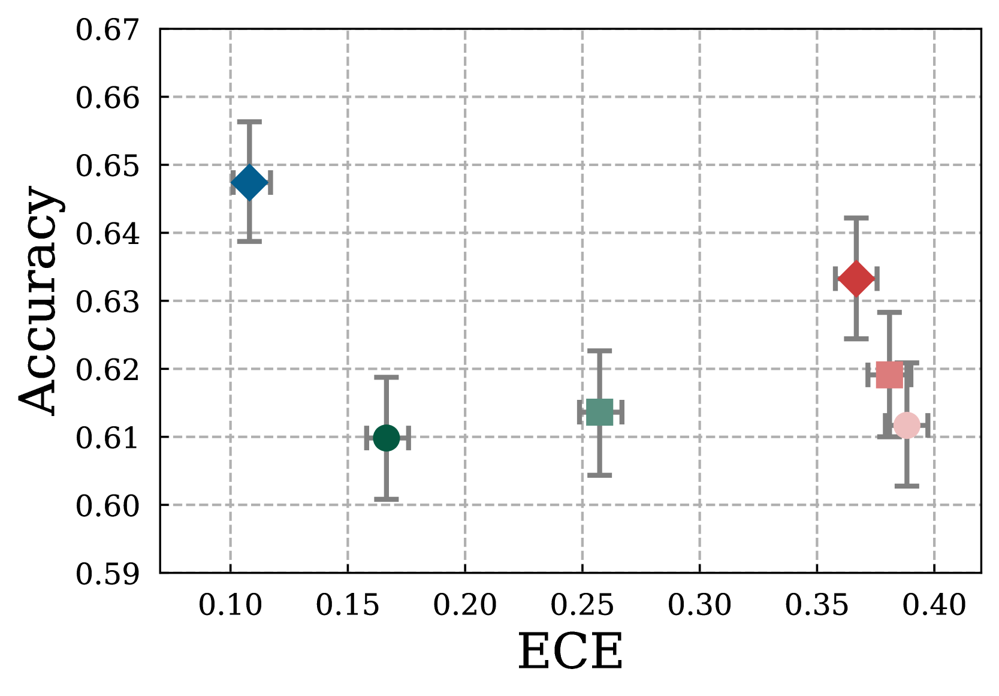
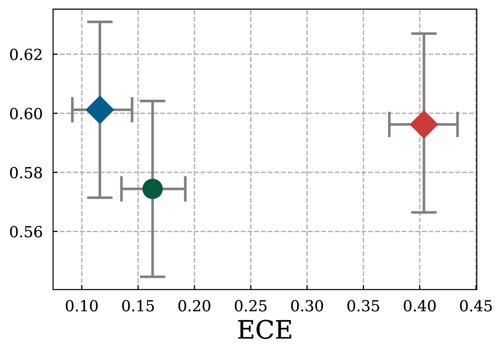
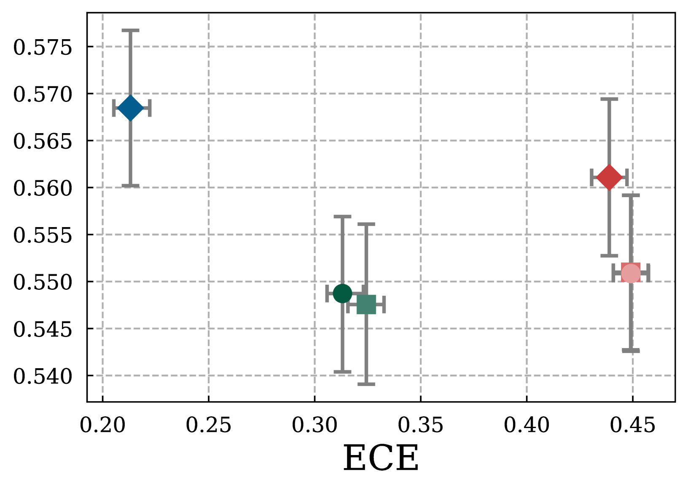

![The linguistic calibration (LC) training framework: a summary-distillation supervised-finetuning (SFT) step bootstraps the language model to emit confidence phrases, and a decision-based reinforcement-learning (RL) step rewards generations that let a downstream reader produce calibrated forecasts on related questions. Figure 2 from the paper [[1]](#ref-1).](cover.jpg){fig-align="center" data-lightbox-src="cover-full.jpg"}

In *Linguistic Calibration of Long-Form Generations* [[1]](#ref-1) (ICML 2024), [Neil Band](https://nband.github.io/), Xuechen Li, [Tengyu Ma](https://tengyuma.github.io/), and [Tatsunori Hashimoto](https://thashim.github.io/) (Stanford) define linguistic calibration in decision-theoretic terms: a language model (LM) is linguistically calibrated if its long-form generations enable a downstream reader to make calibrated probabilistic predictions. They train Llama 2 7B [[2]](#ref-2) to emit paragraphs with confidence statements ("I estimate a 30% chance of...", "I am certain that...") that satisfy that property.

> Language models (LMs) may lead their users to make suboptimal downstream decisions when they confidently hallucinate. This issue can be mitigated by having the LM verbally convey the probability that its claims are correct, but existing models cannot produce long-form text with calibrated confidence statements. Through the lens of decision-making, we define **linguistic calibration for long-form generations: an LM is linguistically calibrated if its generations enable its users to make calibrated probabilistic predictions**. This definition enables a training framework where **a supervised finetuning step bootstraps an LM to emit long-form generations with confidence statements** such as "I estimate a 30% chance of..." or "I am certain that...", followed by **a reinforcement learning step which rewards generations that enable a user to provide calibrated answers to related questions**. We linguistically calibrate **Llama 2 7B** and find in automated and human evaluations of long-form generations that it is **significantly more calibrated than strong finetuned factuality baselines with comparable accuracy**. These findings generalize under significant domain shifts to scientific and biomedical questions and to an entirely held-out person biography generation task. Our results demonstrate that long-form generations may be calibrated end-to-end by **constructing an objective in the space of the predictions that users make in downstream decision-making**.

## Method

The framework has two stages. Both operate on queries $q$ derived upstream from QA benchmark items: an API-based LLM rewrites each question $x$ (from TriviaQA, Jeopardy, SciQ, BioASQ) into a paragraph-generation prompt $q$ (e.g., "Write a paragraph about {topic of $x$}"). The question $x$ and its ground-truth answer $y$ are carried through the pipeline, but only RL consumes them.

- **Summary distillation (SFT).** For each $q$, the base LM samples $M$ paragraph responses; a stronger summarizer LM (Claude 2) condenses them into one paragraph $s$ whose embedded confidence phrases reflect how often each claim appears across the $M$ samples. The base LM is finetuned on the resulting $(q, s)$ pairs. Neither $x$ nor $y$ enters the SFT loss; confidence phrases come from sampling frequency alone.
- **Decision-based reinforcement learning (RL).** The policy $\pi_\theta(z \mid q)$ samples a paragraph $z$. A downstream reader then sees only $z$ and $x$ (never $q$), forecasts an answer distribution for $x$, and the reward is the calibration of that forecast against $y$. PPO updates the policy. For the reader's forecast to be calibrated, the paragraph has to convey the LM's uncertainty on its own. A paragraph that leans on the topic framing in $q$, rather than naming what the model knows and doesn't, wouldn't help a reader who can't see $q$.

Evaluation uses both simulated readers (LMs conditioned on the generation) and real human readers, and factuality is scored at the claim level with a retrieval plus large-language-model (LLM) verifier pipeline in the style of FActScore [[3]](#ref-3) [[3]](#ref-3).

To make the data flow concrete, here is one RL-stage training item from the paper's Appendix A.13 (TriviaQA):

| Variable | Value |
|----------|-------|
| $x$ (QA question) | Which classic novel features a boy hiding in a barrel of apples on a ship? |
| $y$ (ground truth) | *Treasure Island* |
| $q$ (derived query) | "Write a paragraph about the classic book in which a boy hides in a ship's barrel of apples." |
| $z$ (LC RL policy output) | "Based on my understanding, the classic book in which a boy hides in a ship's barrel of apples is most likely *Treasure Island* by Robert Louis Stevenson. I estimate there is a 75% chance it is *Treasure Island*, a 15% chance it is *The Wonderful Wizard of Oz* by L. Frank Baum, a 5% chance it is *The Adventures of Tom Sawyer* by Mark Twain, and a 5% chance it is another book..." |

The SFT target $s$ (Claude 2's summary) has the same surface shape, with confidence phrases distributed over candidate answers, but is produced by prompting Claude 2 with $M$ base-LM samples for the same $q$ and asking it to verbalize their empirical frequency. The paper does not publish verbatim Claude 2 summaries.

## Results

On TriviaQA [[4]](#ref-4) (in-distribution), SciQ, biomedical questions, and a held-out person-biography generation task, the LC-trained Llama 2 7B improves expected calibration error (ECE) by a wide margin over strong factuality-finetuning baselines at matched accuracy. The RL stage reduces ECE from 0.163 (LC SFT) to 0.116 with human readers and from 0.166 to 0.108 with simulated readers, and the gains generalize across all four out-of-distribution settings.

Figure 3 plots the accuracy-ECE frontier for the three QA conditions. LC RL (blue diamond) sits in the upper-left corner on all three panels, meaning higher accuracy and lower ECE than every baseline. The jump from LC SFT (green) to LC RL (blue) captures the incremental value of the decision-based RL stage on top of summary-distillation SFT.

::: {layout-ncol="3"}

:::

Figure 3 from the paper [[1]](#ref-1): *Accuracy-ECE Frontier for Question-Answering (upper left is better). LC RL pareto-dominates Factuality RL and SFT, with significantly better reader ECE while matching or exceeding their accuracy.*

## My Notes

- **Calibration is defined through downstream reader forecasts.** Prior verbalized-uncertainty work such as Teaching Models to Express Their Uncertainty in Words [[5]](#ref-5) [[5]](#ref-5) scored the model's own emitted probability against the ground-truth answer it produced, which pins calibration to a single question. By scoring against a downstream reader's forecast on a *related* question, the paper forces the generation to convey useful uncertainty rather than just report it. The resulting objective is harder to game with generic hedging, since hedged text that does not help the reader does not improve the reader's forecast.
- **Summary distillation substitutes for labeled calibration data.** Human-labeled "this paragraph should say 30% chance" data does not exist at scale. LC's workaround uses sampling frequency as a self-label and Claude 2 as a translator into prose: the base LM's distribution over claims is already the target, and Claude 2 just verbalizes it. The same trick should work for other verbalization targets (e.g., scope hedging, answer plurality) where ground truth is computable from sampling statistics but not annotatable by humans.
- **Summary distillation mirrors [SelfReflect](/posts/20260430-selfreflect-internal-distribution/)'s [[7]](#ref-7) sample-then-summarize workaround, but across models.** SelfReflect found modern LLMs cannot write faithful summaries of their own answer distribution through prompting, SFT, or DPO; the fix that works is sampling $N$ outputs and summarizing those. LC's SFT target is exactly that: Claude 2 summarizing Llama 2's $M$ samples, so the supervision is reliable. At inference, though, Llama 2 emits summaries *without* seeing its own samples, which is the regime SelfReflect declared broken for SFT. LC sidesteps the contradiction because the RL reward scores reader forecasts, not the summary's fidelity to Llama 2's post-training distribution. A follow-up check: run SelfReflect on the trained policy.
- **Both the RL reward and the headline ECE numbers route through the same FActScore-family verifier [[3]](#ref-3).** That verifier's retrieval has weaker evidence on biomedical and long-tail-person topics, so absolute ECE on BioASQ and biography generation should be read with the verifier's own noise folded in. The ordering of methods is still informative; the magnitudes less so.
- **LC trains end-to-end against reader-forecast calibration, which Lin 2022 and CLM did not.** Lin et al. 2022 [[5]](#ref-5) learned verbalized confidence for short answers, scored against the answer itself. [Conformal Language Modeling](/posts/20260505-conformal-language-modeling/) [[6]](#ref-6) (ICLR 2024) added set-level and component-level statistical guarantees but left surface form untreated. A natural next step would be conformal guarantees over claim subsets with aligned surface-form confidence phrases.

---

## References

1. [Band, N.](https://nband.github.io/), Li, X., [Ma, T.](https://tengyuma.github.io/), and [Hashimoto, T.](https://thashim.github.io/) "Linguistic Calibration of Long-Form Generations." *International Conference on Machine Learning (ICML)*, 2024. arXiv:2404.00474. <https://arxiv.org/abs/2404.00474>
2. Touvron, H., Martin, L., Stone, K., Albert, P., Almahairi, A., Babaei, Y., et al. "Llama 2: Open Foundation and Fine-Tuned Chat Models." *arXiv preprint* (arXiv:2307.09288), July 19, 2023. <https://arxiv.org/abs/2307.09288>
3. [Min, S.](https://shmsw25.github.io/), Krishna, K., Lyu, X., [Lewis, M.](https://www.michaellewis.dev/), [Yih, W.](https://scottyih.org/), [Koh, P. W.](https://koh.pw/), Iyyer, M., [Zettlemoyer, L.](https://www.cs.washington.edu/people/faculty/lsz), and [Hajishirzi, H.](https://homes.cs.washington.edu/~hannaneh/) "FActScore: Fine-grained Atomic Evaluation of Factual Precision in Long Form Text Generation." *Empirical Methods in Natural Language Processing (EMNLP)*, 2023. <https://arxiv.org/abs/2305.14251>
4. [Mandar Joshi](https://mandarjoshi90.github.io/), [Eunsol Choi](https://eunsol.github.io/), [Daniel S. Weld](https://www.cs.washington.edu/people/faculty/weld), and [Luke Zettlemoyer](https://www.cs.washington.edu/people/faculty/lsz). "TriviaQA: A Large Scale Distantly Supervised Challenge Dataset for Reading Comprehension." *ACL 2017*, arXiv:1705.03551. <https://arxiv.org/abs/1705.03551>
5. [Lin, S.](https://sylinrl.github.io/), [Hilton, J.](https://www.jacobh.co.uk/), and [Evans, O.](https://owainevans.github.io/) "Teaching Models to Express Their Uncertainty in Words." *arXiv preprint* (arXiv:2205.14334), May 28, 2022. <https://arxiv.org/abs/2205.14334>
6. [Quach, V.](https://vquach.com/), [Fisch, A.](https://people.csail.mit.edu/fisch/), [Schuster, T.](https://people.csail.mit.edu/tals/), Yala, A., Sohn, J. H., [Jaakkola, T. S.](https://people.csail.mit.edu/tommi/tommi.html), and [Barzilay, R.](https://www.regina.csail.mit.edu/) "Conformal Language Modeling." *International Conference on Learning Representations (ICLR)*, 2024. <https://arxiv.org/abs/2306.10193>
7. [Kirchhof, M.](https://mkirchhof.github.io/), Füger, L., Goliński, A., Dhekane, E. G., Blaas, A., Oh, S. J., and Williamson, S. "SelfReflect: Can LLMs Communicate Their Internal Answer Distribution?" *International Conference on Learning Representations (ICLR)*, 2026. arXiv:2505.20295. <https://arxiv.org/abs/2505.20295>
