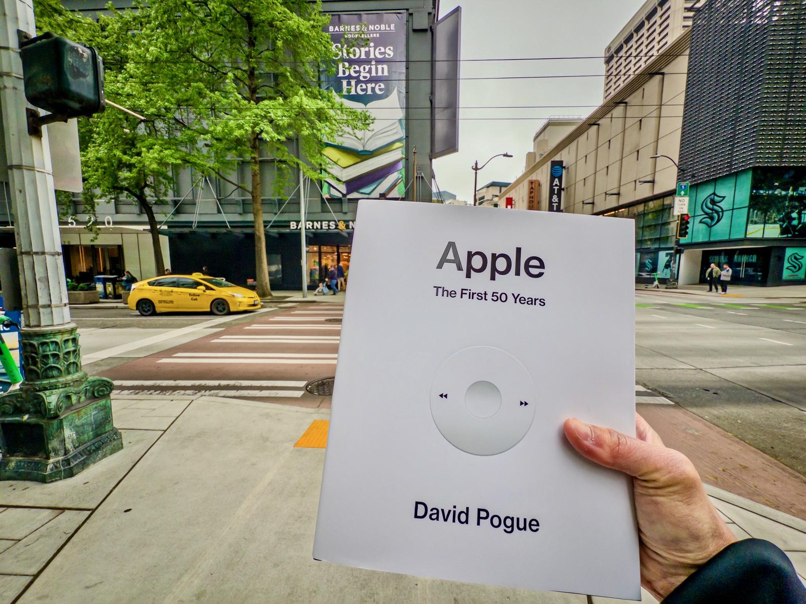

::: {layout-ncol=3}
{data-lightbox-src="01-full.jpg"}

{data-lightbox-src="02-full.jpg"}

{data-lightbox-src="03-full.jpg"}
:::

A Barnes & Noble opened shop today near office, so I grabbed my copy!

---

*Originally posted on [Mastodon](https://sigmoid.social/@BenjaminHan/116529230837787675).*

## Related Posts

- [Artemis II Launches on Apple's 50th Anniversary](/posts/20260402-artemis-launch/): the same 50th-anniversary milestone this commemorative book marks, seen from the launch-pad side.
- [How Apple Became Apple](/posts/20260330-apple-oral-history/): an oral history of the company whose 50 years this book collects.
- [My Love Letter to Macintosh](/posts/20221002-macintosh-love-letter/): a personal reflection on the same Apple history the book documents.
- [Inside the M5: As Big as New Jersey](/posts/20260119-m5-chip-new-jersey/): the present-day Apple the 50-year arc has led to, on the silicon side.
