This site is a static blog. No comments, no like button, no email-capture popup, no newsletter overlay — just HTML, CSS, and enough JavaScript to keep the reading experience pleasant.

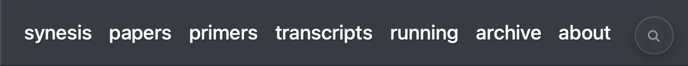{fig-align="center"}

Everything works with a mouse on the desktop and by tap on phones. On top of that, desktop readers get a keyboard shortcut for almost every feature. Press `?` on any page to see the map.

Below is a tour of what's here. The conventions carry across every page, so learning them once covers the whole corpus.

## Search

Click the magnifying glass in the navbar, or press `/`, to open the full-text search overlay. It indexes every post title, body, and code block. Results land with term highlights in place, and `Esc` clears them.

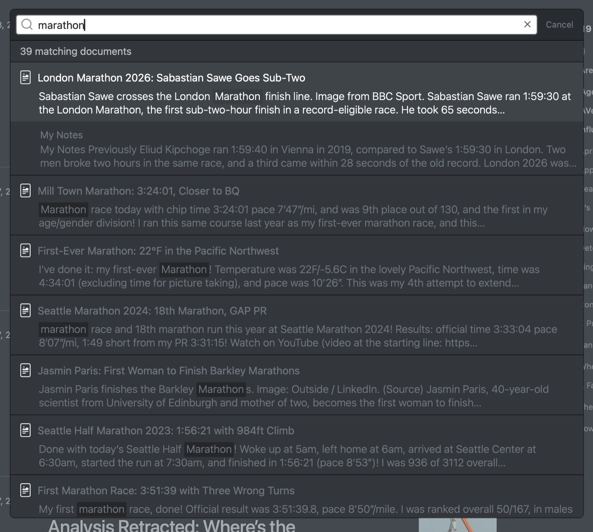{fig-align="center" data-lightbox-src="02-search-full.jpg"}

Search runs entirely in your browser. No network round-trip per keystroke, and it keeps working if you lose connectivity mid-session.

## Ask AI

A small "Ask AI" button sits next to the search icon. Clicking it (or pressing `q`) opens a popover that deep-links your question plus the current page's context into Claude, ChatGPT, Gemini, or Perplexity.

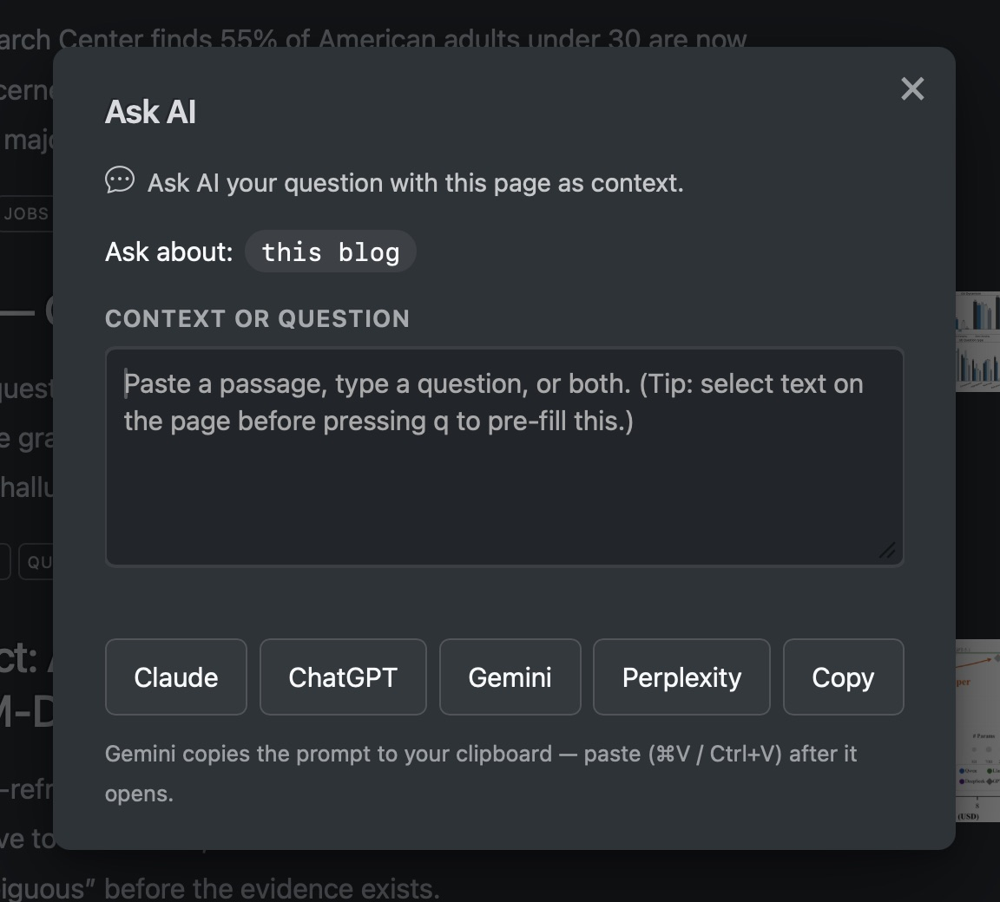{fig-align="center"}

Scope is detected automatically. On a post, the popover asks about that post. On the archive with a tag filter active, it asks about posts with that tag. On the home page, it asks about the whole blog.

If you select a passage on the page before opening the popover (or paste one in once it's open), a separate "Your question" field appears below the context. The split keeps the chatbot answering your question instead of just commenting on the passage. Without context, the single field is your question.

Each provider opens in a new tab with your question pre-filled. Gemini is the exception, because its web UI does not accept a pre-filled question. The site copies the prompt to your clipboard and opens the app instead. Paste to submit.

## Jump to a tag

The third button in the top-right pill — a small `#` icon, between the Ask-AI bubble and the search magnifier — opens a tag picker. Pressing `#` does the same. Type any part of a tag name, hit Enter, and you land on the archive filtered to that tag. Use it when you already know what you're looking for and don't want to scroll the tag cloud.

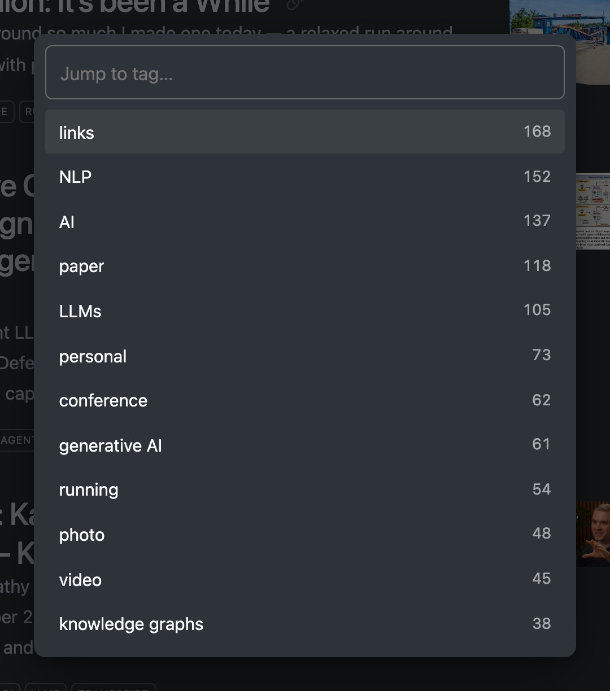{fig-align="center"}

The list ranks matches in four tiers (exact name, name starts with what you typed, any word starts with it, anywhere in the name) and breaks ties by post count. Up to twelve results appear at a time. Arrow keys move the highlight; `Esc` cancels.

## Browsing by kind

Four navbar items each list one kind of post: **Papers** (write-ups of individual papers), **Primers** (longer explainers), **Transcripts** (talks and interviews as readable transcripts), and **Running** (the running log).

Each page is a card listing like the home page, with its own pagination, so you can page back through one kind of post without the others mixed in. The archive filters on the same tags, but it shows a dense table meant for lookup. These pages are meant for reading. Keyboard shortcuts are `p`, `m`, `c`, and `r`, and each page has its own RSS feed (see [For agents and feed readers](#for-agents-and-feed-readers)).

A post can appear on more than one of them. A conference talk about a paper is both a transcript and a paper write-up, and it shows up under both.

## Browsing the archive

The archive page lists every post in one scrollable table. Clicking a tag chip filters the table in place, and the URL updates so the filtered view is shareable.

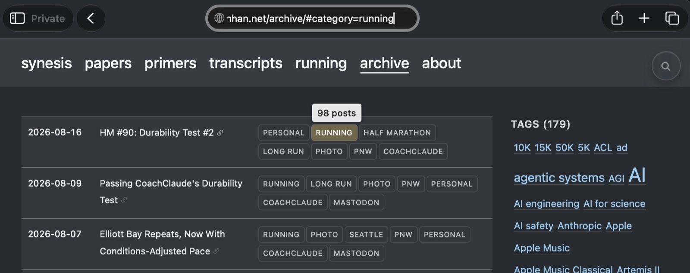{fig-align="center"}

A tag cloud sized by post count sits in the right sidebar on desktop, and in the bottom-sheet panel on phones. Clicking any tag applies it as a filter without leaving the page. Click the active chip again, or press `Esc`, to clear.

## Moving between posts

The home and archive pages carry a pagination bar so you can walk backward through the archive a page at a time. A small previous / next strip also appears below every post for linear reading.

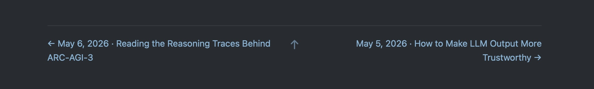{fig-align="center"}

The same motion is available from the keyboard. On a post, `j` or `←` goes to the newer post and `k` or `→` goes to the older one. On a listing page, the same keys turn pages. `↑` and `↓` walk a highlight through visible posts, and `Enter` opens the highlighted one.

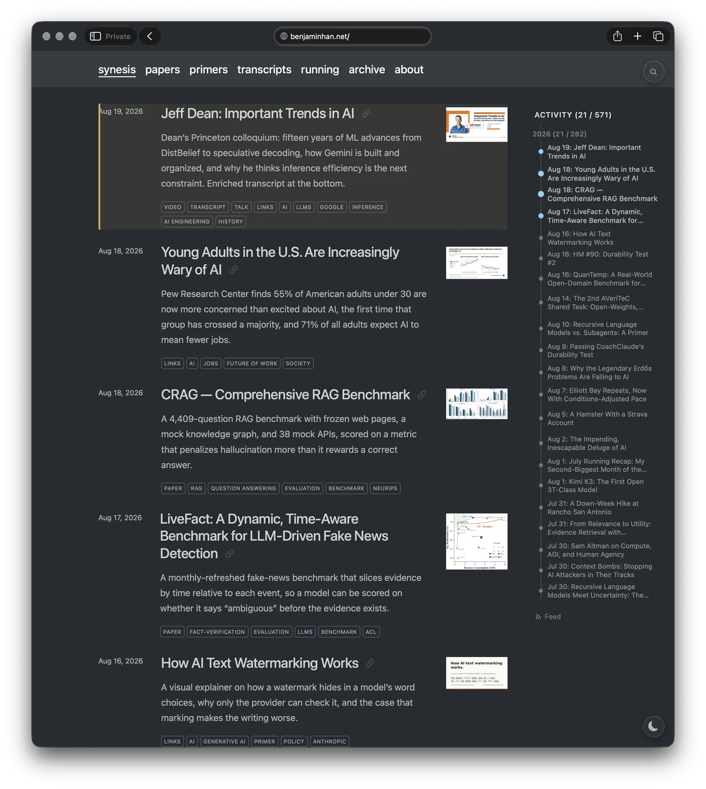{fig-align="center" data-lightbox-src="06-listing-focus-full.webp"}

## Activity timeline

The home page carries a right-side timeline: one dot per post, grouped by month, scaled by activity. Hovering a dot previews the post title, and clicking jumps to the post. It is meant for the "when did I write that one thing about…" lookup that search cannot quite answer.

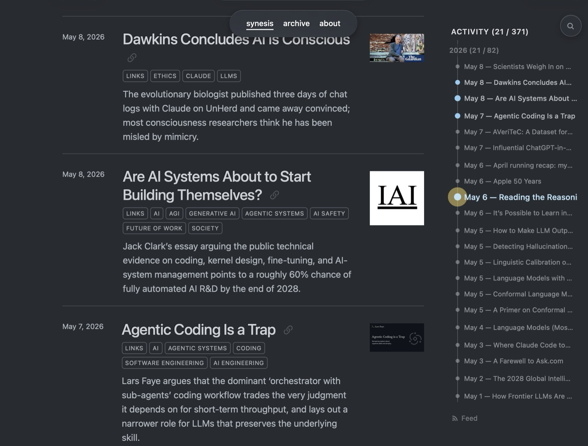{fig-align="center" data-lightbox-src="07-timeline-full.jpg"}

On archive pages the right sidebar becomes the tag cloud instead. On post pages it becomes the table of contents.

## Lightbox

Every figure in a post is clickable. The lightbox preserves the caption, including any "Watch on YouTube" or source-credit links, so you can click through to the source from the zoomed view.

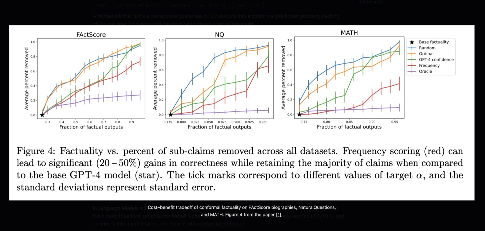{fig-align="center" data-lightbox-src="08-lightbox-full.jpg"}

`Esc` closes. Arrow keys walk through figures within the same post.

## Sharing and contact

Every post carries a small row of icons below the title: Mastodon, LinkedIn, Hacker News, Bluesky, a divider, then email.

{fig-align="center"}

The four share links carry a small tracking tag on the URL so I can tell which platform drove a click. Mastodon is the odd one out because the network is federated, so there is no universal share URL. The first Mastodon click asks for your instance (e.g. `mastodon.social`), and the answer is saved in your browser so later clicks skip the prompt.

The email icon opens your mail client with the subject pre-filled as `Re: <post title>` and the post's URL quoted in the body. Because there is no comment box, email is the primary channel for reader-to-author conversation. If something in a post is wrong, incomplete, or sparks a follow-up thought, that is the fastest path to me.

## Making it look right

Three appearance controls sit in the lower-right corner: a light/dark toggle, a font cycler, and a line-spacing cycler. Each also has a single-key shortcut: `d` for light/dark, `t` for theme, `f` for font, `l` for line spacing.

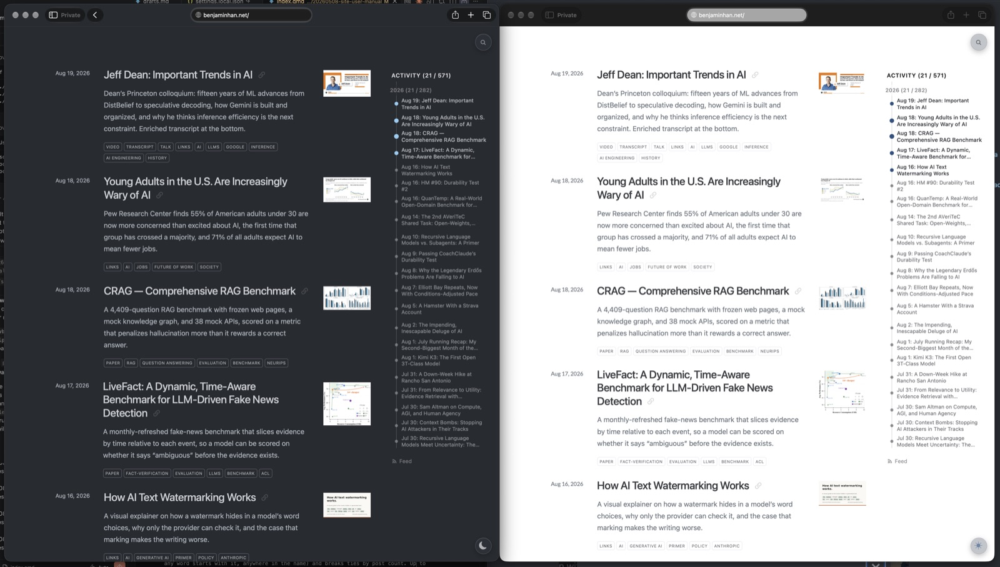{fig-align="center" data-lightbox-src="10-appearance-full.jpg"}

Your choice sticks across visits. Defaults track the system color scheme — if you have never pressed `d`, the site follows whatever your OS or browser is set to.

## Keyboard shortcuts at a glance

`?` toggles a modal listing every keyboard shortcut on the site. It is the only shortcut worth memorizing. The rest are one keystroke away from there.

{fig-align="center"}

The highlights, in rough order of usefulness:

- `/` search, `q` Ask AI, `#` jump to tag
- `s` home, `p` papers, `m` primers, `c` transcripts, `r` running, `a` archive, `b` about
- `j` / `←` newer, `k` / `→` older (works on posts and on paginated listings)
- `↑` / `↓` / `Enter` move the highlight and open
- `d` / `t` / `f` / `l` theme, font, line spacing
- `Esc` to close any overlay, clear search highlights, or drop a tag filter

The page keys follow the navbar left to right, and every shortcut on the site is a single unshifted key. One overlap: on a narrow window, `m` opens the bottom-sheet panel described below instead of going to Primers.

Same keys do different things depending on the page: `j`/`k` move post-to-post on a post, and page-to-page on a listing.

## On the phone

On phones and other narrow windows, the right sidebar will not fit. Instead, a corner button in the bottom-left opens a bottom-sheet panel with whatever the sidebar would have held: timeline on home, tag cloud on archive, table of contents on posts. Tap the button to open or close.

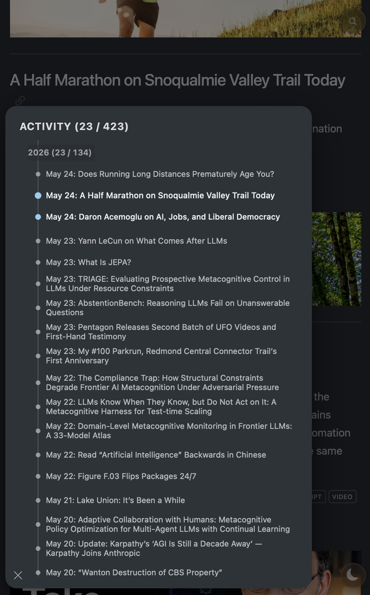{fig-align="center" data-lightbox-src="12-mobile-aside-full.jpg"}

Tap the dim area behind the sheet, or the corner button again, to close.

The navbar scrolls sideways when its items don't all fit. A chevron at either end shows there is more to reach that way, and the bar holds its position as you move between pages, so you can still see which page you're on.

## For agents and feed readers

Four routes exist for non-human readers:

- `/llms.txt` — a plain-text index of every post, regenerated on each build, aimed at AI agents
- `/posts/<slug>/index.qmd` — the raw Markdown source of every post, served alongside the rendered HTML
- `/index.xml`, `/feed-page-2.xml`, … — a full-content RSS feed, paginated, with math and diagrams pre-rendered so they show up even in readers that do not run JavaScript
- `/papers/index.xml`, `/primers/index.xml`, `/transcripts/index.xml`, `/running/index.xml` — the same feed narrowed to one kind of post, for subscribing to the paper write-ups without the running log, or the other way round

The RSS feed carries every post in full, with nothing truncated. The backlink sits at the top of each item so a reader who wants to comment or share has the canonical URL in hand before scrolling.

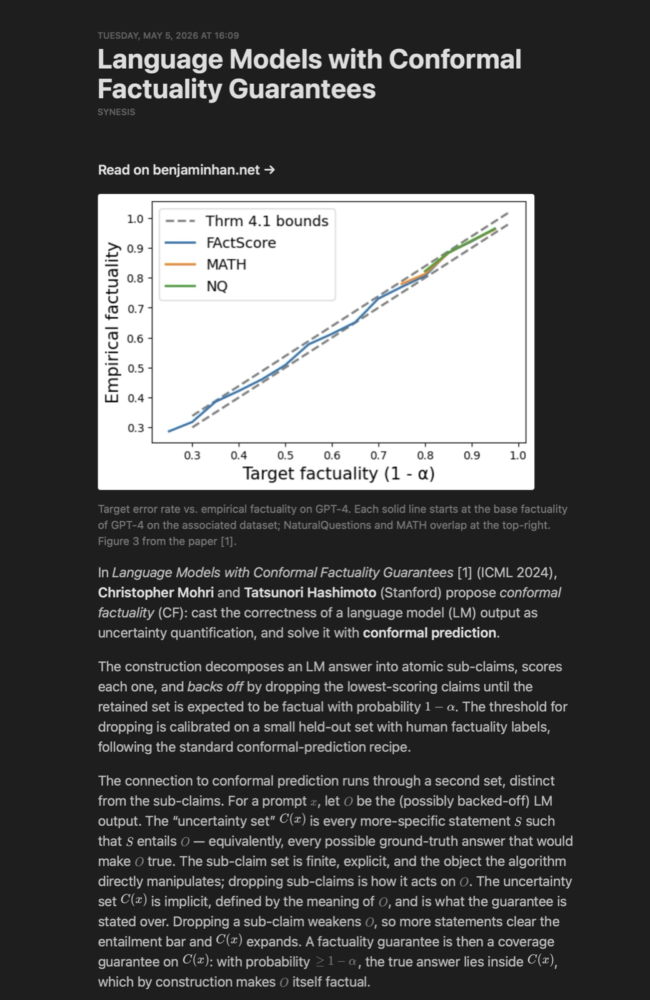{fig-align="center" data-lightbox-src="13-rss-full.jpg"}

The full agent-facing surface is broader than these three. [Making *synesis* Agent-Friendly](/posts/20260508-making-the-blog-agent-friendly/) covers all of it.

## Feedback welcome

If anything on the site is broken, missing, or could be better, the email icon under any post title is the fastest way to tell me. Curious to hear what you find.

---

## Related Posts

- [Making *synesis* Agent-Friendly](/posts/20260508-making-the-blog-agent-friendly/): the agent-facing half of this same site tour, covering the machine-readable surfaces behind the reader features here.
- [Making *synesis* Quick](/posts/20260511-site-efficiency/): the performance side of the same static-site build, how the reading experience this manual describes stays fast.
- [A New "Manuscript" Font Palette to the Site](/posts/20260525-a-new-manuscript-font-palette-to-the-site/): a follow-on to the font cycler described here, adding a new palette to the appearance controls.
