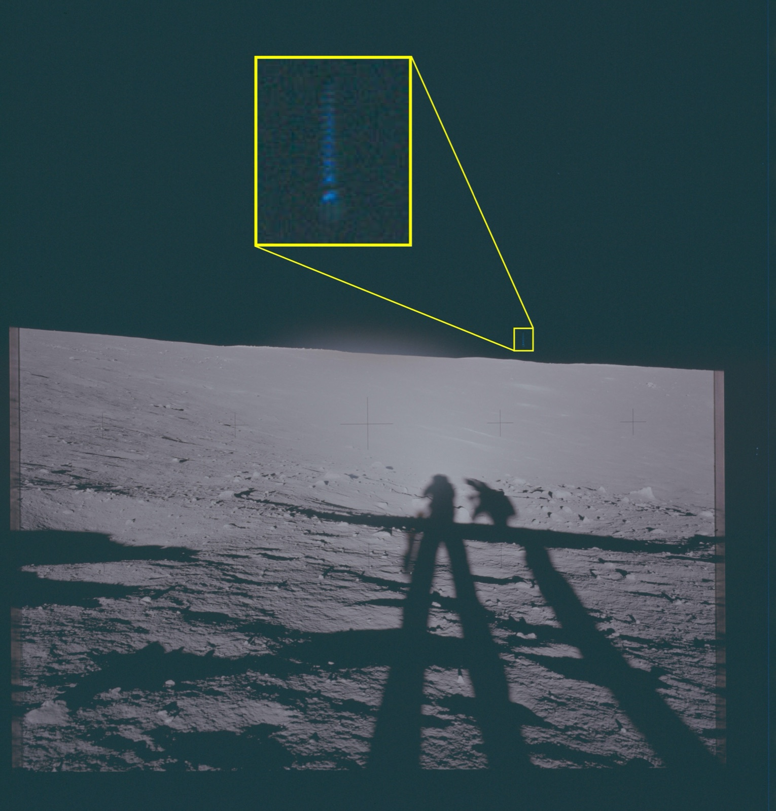

.](cover.jpg){fig-align="center"}

The Pentagon began [releasing its Unidentified Anomalous Phenomena (UAP) files](https://www.war.gov/UFO/) today, following a February executive order. A [government report](https://www.cbsnews.com/news/ufo-files-released-scientists-trump/) counts more than 750 new UAP sightings between May 2023 and June 2024. [CBS News canvassed six scientists](https://www.cbsnews.com/news/ufo-files-released-scientists-trump/) on what they expect to find. The consensus: don't expect alien technology, expect heavy redaction, and expect the conspiracy frame to survive contact with the documents no matter what they contain.

## [Sean Kirkpatrick](https://en.wikipedia.org/wiki/Sean_Kirkpatrick) — physicist, first director of AARO (July 2022 – December 2023)

On who will read the release and come away unhappy:

> There are going to be unsatisfied people. You're going to have a bunch of people who are going to continue to cry conspiracy, they're going to say there's a cover-up.

He views the release order as "a distraction for the administration." What AARO actually uncovered, he told CBS, ranged from "hazing" in the Air Force to what he called "deceptions" designed to hide secret defense programs. His office "had to stand up anything they could declassify," but proof of extraterrestrial life wasn't there:

> Nothing would have made me happier in that job but to have discovered alien technology and rolled it out. I don't expect to see anything new.

Kirkpatrick believes there's likely life somewhere in the universe, but "the probability that extraterrestrial intelligent life is here is little to none."

## [Federica Bianco](https://www.fbianco.com/) — associate professor at the University of Delaware, NASA UAP study team

On the prior:

> The probability that we are the only life form or even the only technical society in the universe is negligibly small.

On what the panel has seen so far:

> As a scientist and a member of the NASA UAP panel, I haven't seen anything that indicates that we have observed phenomena that violate the laws of physics and require an alien society visiting us to be explained.

## [Neil deGrasse Tyson](https://en.wikipedia.org/wiki/Neil_deGrasse_Tyson) — director of the Hayden Planetarium at the American Museum of Natural History

On what he'll actually look for in the files:

> An actual alien. If one is presented, then no documents are necessary at all.

On what the files may illuminate:

> [M]ost people who look at the sky (day or night) are unfamiliar with optical, climactic, and astronomical phenomena. When that's the case, a person is prone to report mysterious and unidentified objects.

On the jump from "unfamiliar" to "alien":

> The urge to have immediate answers drives many people to explain what they see as visiting space aliens from across the galaxy. I call this, "aliens of our ignorance."

On why a cover-up is unlikely to hold in the smartphone era:

> Billions of photos and a million hours of video are uploaded daily to the internet, and none of them contain images of actual aliens. […] The implicit assumption is that the government (somehow) has access to visiting aliens that no one else in the world with a smart phone has. And that the government has successfully kept it a secret among hundreds and possibly thousands of people. All the while, forgetting Benjamin Franklin's edict, "Three people can keep a secret if two of them are dead."

From the prologue of his forthcoming book, *Take Me To Your Leader: Perspectives on Your First Alien Encounter*:

> In science, skepticism is foundational to our profession, so we uphold standards of evidence that some interpret as disinterest or even denial. Don't take it personally, it's how any and all objective truths have ever been established in this world.

## [Shelley Wright](https://en.wikipedia.org/wiki/Shelley_Wright_(astrophysicist)) — observational and experimental astrophysicist at UC San Diego, NASA UAP study team

Wright says scientific inquiry into UAP and other life forms still triggers a "giggle factor" among the public, and that there needs to be more serious scientific work in this space. On the fundamental question people ask her — "Are we alone out here?":

> The possibility of other alien life existing is likely, but it doesn't mean it's near us.

She's "excited" about the release but doesn't expect to find much, based on her experience on the independent study team, which only viewed unclassified documents. She expects most of the release to be heavily redacted because of the sensitivity of the military surveillance equipment involved, and proposes an actionable alternative: declassify surveillance data from decades ago so scientists can reanalyze it with modern technology that wasn't available when it was collected — protecting current national security while still freeing historical data for study.

## [Janna Levin](https://en.wikipedia.org/wiki/Janna_Levin) — professor of physics and astronomy at Barnard College of Columbia University

Levin says that even as we learn more about the universe, "life still seems rare," which is why astronomers are "very excited" about the prospect that the documents may hold clues. Astronomers aren't looking for the little green men of 20th-century sci-fi; they're looking for microbes, the form of life that first took hold on Earth:

> Let's just get life started.

She notes that microbes from other planets might have been carried here via a natural object that plunged to Earth, and she'd like to keep "an open mind" about what the documents contain:

> If there is anything in them, it would be really thrilling.

But:

> If there are claims of actual technologies from other civilizations — I don't think anyone is actually expecting that, scientifically. I think if you're expecting that, you're going to be disappointed.

## [Avi Loeb](https://en.wikipedia.org/wiki/Avi_Loeb) — Harvard theoretical physicist, founder of the [Galileo Project](https://galileo.hsites.harvard.edu/)

Loeb says the key is to study the files from the vantage of known physics, and that in most incidents "something mundane might explain the data." He pointed to footage aired before Congress last summer that purported to show a missile being fired at what a congressman called an "orb" off the coast of Yemen in 2024; when he examined it, he concluded:

> I said, "No, it's not anomalous, it was just a drone."

What he's actually hunting for in the release is the small unexplainable residue:

> There might well be a few incidents out of hundreds that would really be anomalous, and that's what I'm looking for.

His test for each incident is a single "fundamental question":

> Are the objects we see as anomalous operating under the fundamental abilities of humans?

If not, he's intrigued — an object that appears to defy physics could be extraterrestrial. He has already written that he expects much of the classified material to be of no interest to him, because it likely conceals terrestrial military sensors and adversary hardware rather than anything from interstellar space:

> I am not interested in technologies manufactured by humans on Earth. The history of terrestrial technology does not interest me. I am far more curious about whether a more advanced civilization exists in interstellar space.

## Apollo 17

The cover image above is one concrete artifact already [out of the release](https://www.cbsnews.com/news/ufo-files-apollo-17-crew-mysterious-objects-1972-mission/): a NASA photograph from the December 1972 Apollo 17 mission, which the Defense Department says shows "three 'dots' in a triangular formation in the lower right quadrant of the lunar sky that is clearly visible upon magnification of the image." The Pentagon allows that "there is no consensus about the nature of the anomaly," but notes a preliminary analysis that it could be a "physical object." A second frame from the same release, below, shows what the Pentagon describes as multiple unidentified objects in the lunar sky.

{fig-align="center" data-lightbox-src="apollo-17-multiple-objects-full.jpg"}
