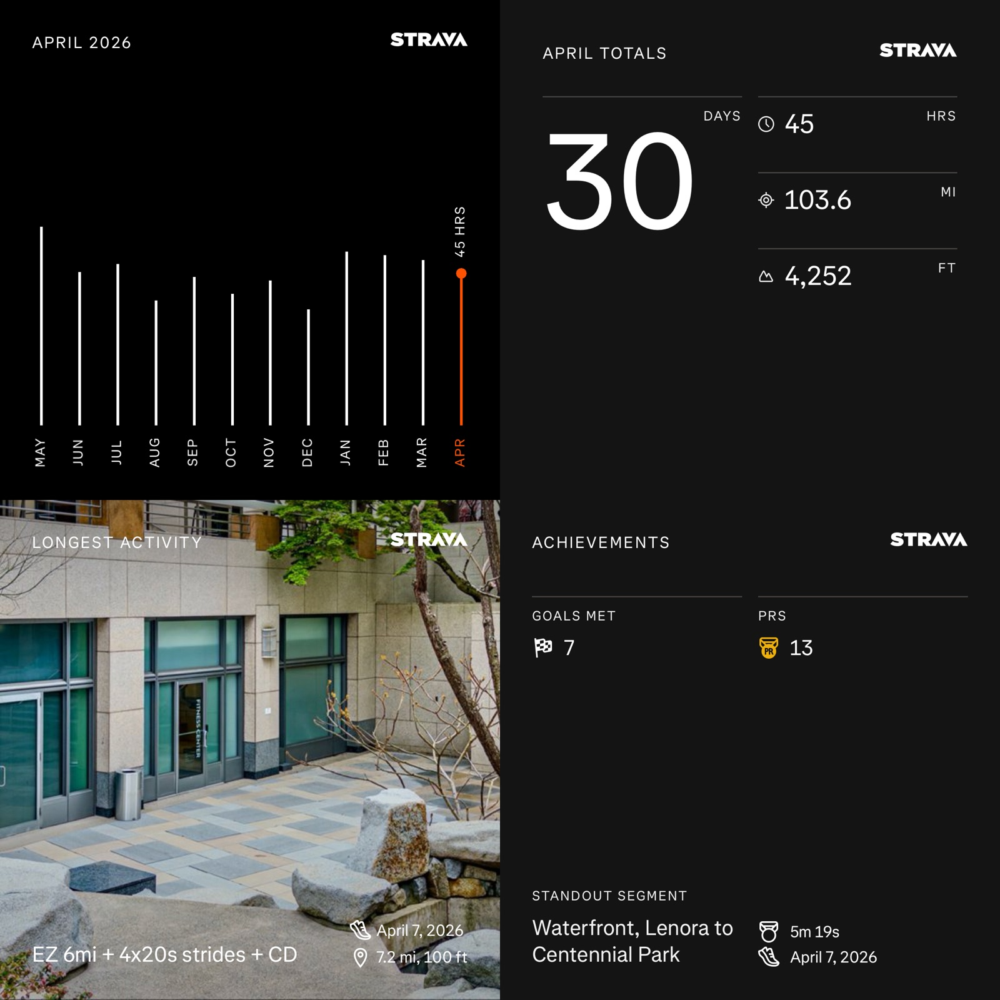

My bad, not good, very horrible running recap of April: mileage dropped hard, from 219.9 → 103.6mi, EG 5,142 → 4,252ft, time 37.5 → 21hrs.

This was a rough month: I sprained my LEFT ankle at Redmond City Marathon last month, then sprained my RIGHT ankle doing yard work, which triggered knee issues I'm still dealing with. VO2max tanked from 54 → 45.3. 😬

(But good thing is I still had so many beautiful memories during my runs this past month)

I'm now 154.9mi behind my 2,500mi yearly goal (708mi in). But my race calendar is clear until September. Time to recover & rebuild! 💪

::: {layout-ncol=2}
{data-lightbox-src="01-full.jpg"}

{data-lightbox-src="02-full.jpg"}

{data-lightbox-src="03-full.jpg"}

{data-lightbox-src="04-full.jpg"}

{data-lightbox-src="05-full.jpg"}

{data-lightbox-src="06-full.jpg"}

{data-lightbox-src="07-full.jpg"}

{data-lightbox-src="08-full.jpg"}

{data-lightbox-src="09-full.jpg"}

{data-lightbox-src="10-full.jpg"}
:::
