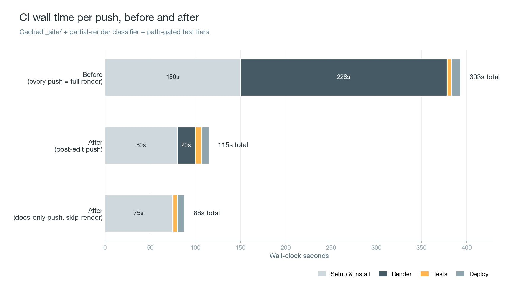

{fig-align="center"}

Two durations matter on a blog like this one. The first is the time between `git push` and the updated post being live. The second is the time between a reader clicking a link and the page being ready to read. On the baseline workflow, continuous integration (CI) was taking about six minutes per push, and every home or archive page was shipping a payload that grew with the corpus. This post walks through what that looked like, what was done about each, and why the specific fixes work.

## How the site is put together

*synesis* is a [Quarto](https://quarto.org) site. The source tree lives in a private GitHub repository, a GitHub Actions workflow builds the static `_site/` tree on every push to `main`, and a chain of downstream services hands that output to readers at `benjaminhan.net`. There is no database, no server-side rendering, no application runtime.

```{mermaid}
flowchart TB
    A[Source repo<br/>.qmd · CSS · includes · Python scripts]
    A -->|git push main| B[GitHub Actions workflow]

    subgraph build [" "]
        direction TB
        C[Install Quarto · uv · Playwright]
        D[Pre-render scripts<br/>tag counts · post index<br/>paginators · llms.txt]
        E[quarto render]
        F[Post-render scripts<br/>feed SVG · UTM tags<br/>feed pagination · CSS fingerprint]
        C --> D --> E --> F
    end

    B --> C
    F -->|force push _site/| G[Deploy repo<br/>GitHub Pages origin]
    G --> H[Cloudflare edge<br/>cache · TLS · Workers]
    H --> I[Reader<br/>benjaminhan.net]

    style build fill:none,stroke:none
```

Everything discussed below happens inside the GitHub Actions workflow, or in the HTML and JSON the workflow produces. GitHub Pages and Cloudflare are downstream of that.

## The build side

A full `quarto render` on this project renders a few hundred `.qmd` files at roughly 580 ms each on GitHub's runners. That is about 3 minutes 48 seconds of pandoc work on top of ~10 seconds of pre-render and post-render scripts, plus the runner's own setup and deploy overhead. Total wall time on the baseline workflow was around 6 minutes 23 seconds for a single-post publish.

Most pushes touch only a handful of files. A typical push edits one post's body, or adds a new post and leaves every other post alone. Rendering every file on every push spends almost all of that 3 minutes 48 seconds regenerating output that is byte-identical to what is already on disk.

Skipping that work requires two capabilities the default workflow does not have:

1. Somewhere to keep the previous `_site/` so it can be reused when unchanged.
2. A reliable way to know which source files actually changed since that previous `_site/` was built.

The four pieces below provide both, plus the supporting conditions that make them safe.

### Caching the previous `_site/`

The workflow uses `actions/cache@v4` to tar the `_site/` tree at the end of each successful run, keyed on the commit SHA. On the next run, the cache is restored at the top of the job. A one-line stamp file inside the tarball, `_site/.last-built-sha`, records which commit this `_site/` was built from. That stamp is the baseline everything else diffs against.

The stamp file is excluded from the deploy, so it never ships to the public repository. It is internal bookkeeping.

### Classifying the diff

The script `_scripts/render_diff.py` reads the baseline SHA from the stamp, runs `git diff` against it, and picks one of four modes for the render step:

- `skip-render` if every changed path is one that never reaches the deploy (`docs/`, `drafts/`, `.claude/`, `CLAUDE.md`). The workflow re-deploys the cached `_site/` as-is.
- `tags-only` if the only changed path is `_tags.yml`. The workflow regenerates `tag-counts.json` and `post-index.json`, copies them into the cached `_site/`, re-stamps cache-bust query strings on the JSON fetch URLs, and ships. Post HTML on disk does not change. The next subsection describes the source-of-truth move that this mode rests on.
- `incremental` if the changed paths are post bodies, post assets, or frontmatter. The workflow hands the changed `posts/<slug>/index.qmd` files to `quarto render` as explicit arguments. Quarto's listing tracker picks up affected listing pages automatically and regenerates `search.json`, `sitemap.xml`, and `listings.json`. Cached HTML for untouched posts is left alone. Typical wall time: around 20 seconds. Past a configurable batch ceiling (`INCREMENTAL_MAX_POSTS`, default 10), large multi-post pushes escalate to `full` because Quarto's internal parallelism beats per-file invocation at that scale.
- `full` if the change touches templates, includes, scripts, config files, or anything else whose output reaches every page. The workflow drops the cached `_site/` and runs a full render. Typical wall time: around 4 minutes.

The default when a path is unrecognized is `full`, not `incremental`. The classifier errs on the side of rebuilding too much rather than serving stale output.

### Keeping rendered HTML byte-stable

An incremental render only produces correct output if the HTML files it chose not to re-render are still valid. That requires every per-page output to depend only on inputs specific to that page, not on global state that changes when unrelated posts change.

Two global inputs in `<head>` broke this condition before the incremental work began:

- A `<script>window.__tagCounts = {...}</script>` block inlined the entire tag histogram into every page. Adding a new tag to one post changed the histogram, which changed the `<head>` of every other post.
- A similar inline block for the post index listed every post. Publishing a new post changed the listing, which changed the `<head>` of every post again.

Both were moved to external JSON files (`/tag-counts.json` and `/post-index.json`) fetched by a small loader stub at page load time. The stub itself is byte-stable. The corpus-wide data it fetches is not part of the HTML. After this change, a post's rendered HTML is a pure function of that post's source. Unrelated posts can come and go without invalidating the cache.

The pre-render scripts that produce these JSON files (`_scripts/tag-counts.py`, `_scripts/post-index.py`) compare their proposed output to what is already on disk before writing. If the content is unchanged, the file is not touched and its mtime does not advance. The same discipline applies to the paginators `_scripts/paginate-home.py` and `_scripts/paginate-archive.py`. Closed listing pages, which hold 25 posts on the home side and 50 on the archive side, are byte-identical run-to-run in steady state. Quarto's `freeze: auto` skips re-rendering them.

Without byte-stable pre-render outputs, every pre-render script would churn mtimes on every push, and Quarto's freeze cache would invalidate on every run. The byte comparison is what keeps the classifier's `incremental` decision safe.

### Lifting tags out of frontmatter

A single top-level file, `_tags.yml`, holds every post's tag set, keyed by slug. The pre-render scripts `_scripts/tag-counts.py` and `_scripts/post-index.py` read from it instead of from per-post `categories:` frontmatter. A tag rename or merge becomes a one-file commit.

The prior scheme stored tags inside each post. Renaming a tag, merging two near-duplicates, or dropping a stale singleton rewrote dozens of `.qmd` files in one commit. Every one of those files then went through `quarto render`, every page in the corpus picked up a new mtime, and the test tiers ran end to end. None of the work changed any prose.

The `tags-only` mode in the previous classifier list is what this enables on the build side. When the only changed path is `_tags.yml`, the workflow regenerates the two JSON artifacts, copies them into the cached `_site/`, re-stamps the cache-bust `?v=<sha>` markers on the JSON fetch URLs, and ships. Post HTML on disk does not change. Clients pick up the new tags via `_includes/hydrate-tags.html`, which reads `post-index.json` on next page load and injects the tag-chip DOM the original frontmatter would have produced.

A schema gate runs the contract tests for both JSON files before the tags-only deploy. Without it, a regression in either pre-render script would ship malformed JSON and silently break tag hydration on every page.

Drafts keep `categories:` in their own frontmatter during authoring. The `/publish-draft` flow strips that line and writes the slug → tag list into `_tags.yml` at promotion time.

### Gating the test tiers

The test suite is split into tiers: unit tests, contract tests, integration tests, smoke tests, and UI tests. The full suite runs in about 23 seconds, with the UI tier (Playwright-driven browser tests) accounting for roughly 14 of those. Content-only pushes do not change the UI, so the UI tier cannot regress as a result of those pushes.

A path gate inside the same workflow drops the UI and smoke tiers when the diff only touches post content, bringing the test wall down to about 8 seconds. A further gate drops the slow incremental-parity integration test, which runs two full `quarto render` invocations back-to-back, unless the render pipeline itself (the classifier, the paginators, `_quarto.yml`, or the workflow file) was modified in the same push. Any change that could actually break the tests still runs them. Changes that cannot, do not.

### Pinning Quarto

One risk the gated tests introduce is that Quarto's own output could drift between pushes without the gated tiers running to catch it. The workflow pins Quarto to version `1.9.37` to make that drift impossible without an explicit commit. A separate step compares the pin to the latest published Quarto release and emits a workflow warning when the pin lags, so bumps are a considered change, not a silent one.

### Where the time went

A content-only push now takes around 115 seconds end-to-end, down from around 6 minutes 23 seconds, as shown in the cover chart. A docs-only push deploys the cached `_site/` unchanged in around 88 seconds. A tag cleanup push lands close to the docs-only cost: it shares the no-render fast path, plus a few seconds to regenerate the JSON files and re-stamp cache-bust markers. A push that touches templates, scripts, or config still runs the full render and full test suite, because that is when the full cost is actually needed.

One post-render cost deserves a separate note. `_scripts/feed-render.py` uses headless Chromium to rasterize Mermaid diagrams and MathJax expressions into inline Scalable Vector Graphics (SVG) inside the Really Simple Syndication (RSS) feed. A full browser round-trip per item is slow, so the rendered SVGs are cached under `.feed-cache/svg/` keyed on a schema version. Repeat builds reuse the cached SVG. The schema version is bumped whenever the rendering pipeline changes in a way that affects output, which invalidates the whole cache at once.

## The read side

Page-load time on a static site comes from five phases: Domain Name System (DNS) lookup, Transport Layer Security (TLS) handshake, first-byte wait, payload download, and in-browser processing (parse, style, layout, JavaScript execution, subresource fetches). The first three are handled by Cloudflare's edge cache and are mostly out of the site's hands. Everything below addresses the last two: how much data a page carries, how much of it can be reused across pages, and what work can be moved from page-load time to build time.

### Bounding the page payload

A listing that grows with the corpus is the easiest way for a site to slow down over years. A 400-post home page is a 400-post payload on every visit. The goal is for each page's payload to be O(1) in the size of the corpus, not O(N).

Straight fixed-size pages would do that, but at a cost to the reader's first impression. Whenever a single new post pushed a page past capacity, a fresh page would open with that one post, leaving the landing briefly sparse until the next few publishes caught up. The compromise is an overflow band. Each home listing page holds 25 posts in steady state, with the newest allowed up to 12 overflow for 37 at most. The archive uses 50 and 25 for 75 at most. A new publish grows the newest page one post at a time until it hits the overflow ceiling. At that point the oldest 25 (or 50) close off into a page one step older, and the newest page re-opens at a comfortable size rather than at one.

A side effect of this design is URL stability. Once a page closes, the set of posts it holds does not shift again, so a bookmark to `/archive/page/5/` still points at the same 50 posts a year later. Only the newest page and the landing churn on every publish.

Older content is reached through [RFC 5005](https://www.rfc-editor.org/rfc/rfc5005) paginated archives. Each page's payload is bounded by the page size, not by the size of the corpus.

### Pre-computing the client-side search index

Quarto builds a JSON file, `search.json`, at deploy time that indexes every post's title, body, and code blocks. The in-page search overlay loads it once per session, indexes in memory, and answers every keystroke locally. There is no per-query network round-trip. The search also keeps working if the reader loses connectivity after the initial load.

Moving the index build to deploy time means the reader pays the indexing cost once, not per query. It also means there is no search server for the site to operate.

### Sharing cross-corpus data across pages

`/tag-counts.json` and `/post-index.json` are small files fetched once per session and reused on every subsequent page. The post index is about 74 KB: a flat array of `{slug, date, title, categories}` records that powers the home-page timeline, the archive tag cloud, pagination math, and previous/next navigation on every post.

Keeping this data in external JSON rather than inlining it into every page's `<head>` means the browser fetches it once, caches it under a stable URL with a long `Cache-Control` max-age, and reads from cache on the next page. The inline version made every page's `<head>` grow linearly with the corpus. The external version makes it fixed size.

The same choice enabled incremental render on the build side. A single change in how cross-corpus data is delivered fixed two problems at once.

### Fingerprinting the stylesheet

`_scripts/cache-bust-css.py` rewrites `styles.css` to `styles.<content-hash>.css` in the deployed HTML. The stylesheet ships with a one-year `Cache-Control` max-age, which means a returning reader downloads it at most once per release. When the stylesheet actually changes, the hash changes, the URL changes, and the browser fetches a new copy. Atomic invalidation is a property of content-addressed URLs. There is no separate cache-bust step to remember.

### Loading fonts only when they are used

The default reading palette is set by unconditional rules in `styles.css` over the system font stack. A reader who never presses `f` to cycle palettes fetches zero font bytes from the site. Each of the three alternative palettes (`reader`, `almanac`, `manuscript`) has its `@font-face` rules scoped to `html[data-font-palette="<slug>"]`. Browsers only fetch the woff2 files when the attribute matches, which it does only after the reader activates that palette. `font-display: swap` keeps text visible while the font is loading.

The general pattern is that optional features should be zero-cost until activated. Most readers will never activate them, and should not pay for them.

### Sizing images to the reader's screen

Source images arrive in a post directory at whatever resolution the capture device produced, often several thousand pixels wide. Post bodies render into a narrower column. Shipping the originals would waste bytes on the wire and decode work in the browser, for pixels the reader cannot see.

`_scripts/resize_images.py` runs as a pre-render sweep. For every referenced image above a size threshold, it renames the original to `<stem>-full.<ext>` and writes a display-size sibling at the original path. JPGs stay JPG, capped at 1600 pixels wide and re-encoded at quality 82. PNGs re-encode as WebP at quality 85. The body reference in `index.qmd` is rewritten to point at the display copy and tagged with `data-lightbox-src="<stem>-full.<ext>"` so the lightbox has a path to the hi-res. If the re-encoded display copy does not come out smaller than the original, the split is reverted. Some source files are already at the encoder's floor (the source was encoded tightly enough that re-encoding cannot win bytes back).

`_scripts/check-image-sizes.py` fails the CI build if any referenced image above the threshold is missing its `-full` sibling. The contract that every heavy image has a display copy is enforced mechanically rather than by discipline.

On the read side, the lightbox gates the hi-res fetch on viewport width. Screens narrower than 1024 Cascading Style Sheets (CSS) pixels receive only the 1600-pixel display copy, and the `-full` is never fetched. At those widths the display copy is already at or near the device's physical resolution, so the hi-res upgrade adds no visible detail. On wider screens the `-full` (itself capped at 3000 pixels wide) is fetched when the lightbox first shows that image, decoded off the main thread via `img.decode()`, and held in a per-session cache so returning to the same image does not trigger another decode.

### Not carrying weight that is not needed

Quarto's default behavior is to include Mermaid, MathJax, and syntax-highlighting bundles in every page, regardless of whether the page actually contains a diagram, an equation, or a code block. `_scripts/strip-unused-assets.py` scans each rendered page for references to each asset family and removes the unused script tags after render. A short plain-text post ships with none of the three.

`_scripts/strip-listing-titles.py` removes redundant H1 elements that Quarto emits on listing pages, for the same reason: less markup for the browser to parse, style, and lay out.

### Pre-rendering math and diagrams for the feed

Most RSS readers do not run JavaScript. A feed item containing `$\hat{y} = f(x)$` or a Mermaid block would arrive as unrendered source text, because MathJax and Mermaid both run client-side.

`_scripts/feed-render.py` replaces every math expression and every Mermaid block in the RSS feed with inline SVG at deploy time. The subscriber's client does no extra work, and the feed is self-contained. The same script is the one whose SVG cache was described earlier. It saves CI time on repeat builds and reader time on every subscribed fetch, from a single pass at deploy time.

## Where this leaves things

The build and read sides of this post use the same technique in different contexts: compute something once at the moment its inputs change, name the result under a stable address, and let every downstream reader of that result pick it up from cache. On the build side the cached result is `_site/`, or a pre-render JSON, or a frozen listing page. On the read side it is `search.json`, or a per-session JSON fetch, or a fingerprinted stylesheet, or a pre-rendered feed SVG.

What remains unsettled is where this breaks at scale. The post index is 74 KB today and will be several hundred kilobytes by the time the corpus crosses a thousand posts. `search.json` has the same shape. Neither is a problem today. Both are shapes to keep an eye on. The critical assumption behind every fix above is that the corpus changes slowly compared to the cache lifetimes. That assumption is a choice about how often to publish, not a property of the infrastructure.

Related reading: [A Rube Goldberg Pipeline for Sharing Links](/posts/20260420-rube-goldberg-publishing/) walks through how a captured link becomes a draft and then a post. [A User Manual for *synesis*](/posts/20260508-site-user-manual/) tours the reader-facing features. [Making *synesis* Agent-Friendly](/posts/20260508-making-the-blog-agent-friendly/) covers the machine-readable surfaces the site exposes.
