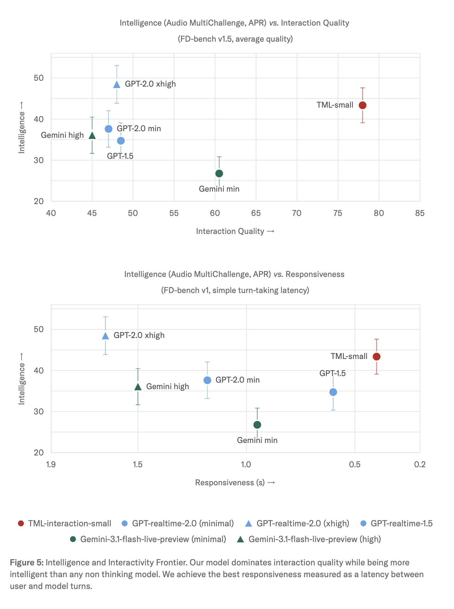

 from [Thinking Machines Lab](https://thinkingmachines.ai/blog/interaction-models/).](cover.jpg){fig-align="center" data-lightbox-src="cover-full.jpg"}

[Thinking Machines Lab](https://thinkingmachines.ai/), the OpenAI-alumni startup founded in February 2025 by former OpenAI CTO [Mira Murati](https://en.wikipedia.org/wiki/Mira_Murati) with OpenAI cofounder [John Schulman](https://en.wikipedia.org/wiki/John_Schulman), former OpenAI VP of Research [Barret Zoph](https://scholar.google.com/citations?user=NL_7iTwAAAAJ), and former OpenAI VP [Lilian Weng](https://scholar.google.com/citations?user=dCa-pW8AAAAJ) on its founding team, has [announced](https://thinkingmachines.ai/blog/interaction-models/) a research preview of *interaction models*: frontier models trained from scratch to take in audio, video, and text concurrently and to think, respond, and act in real time, without a surrounding orchestration harness handling turns, interruptions, or modality switches.

The argument the announcement makes:

- **The bottleneck is the turn.** Today's commercial general-purpose models experience the world as a single thread. They wait while the user is still typing or speaking, and they freeze perception while generating. That narrow channel forces humans out of the loop, not because the work is autonomous, but because the interface has no room for them.
- **Interaction should scale with intelligence.** Most real-time voice systems stitch components together to emulate interruptions, multimodality, and concurrency, a classic orchestration harness. The post invokes Sutton's bitter lesson [[1]](#ref-1) to argue that hand-crafted interaction systems will be outpaced by scale, so interactivity has to be part of the model itself.

## Method

### Capabilities

With interaction native to the model rather than the harness, one system provides what normally takes a stack of separate components:

- **Seamless dialog management** ([video](https://youtu.be/Ys6i_MGnjUA)). The model implicitly tracks whether the speaker is thinking, yielding, self-correcting, or inviting a response, without a separate turn-taking module.
- **Verbal and visual interjections** ([video](https://youtu.be/n2GXGjy41HQ)). It jumps in when context warrants ("interrupt when I say something wrong", "tell me when I've written a bug") rather than waiting for the user to finish.
- **Simultaneous speech** ([video](https://youtu.be/2ky5MXBvZP8)). User and model can talk at the same time, which makes live translation and live commentary straightforward.
- **Time awareness** ([video](https://youtu.be/sqJNfze19jA)). A direct sense of elapsed time, so "remind me to breathe every four seconds until I ask you to stop" is a first-class request.
- **Concurrent tools, search, and generative UI** ([video](https://youtu.be/ly3GtaiRFyo)). Web searches, tool calls, and UI generation can run while the model is still speaking and listening, with results folded into the conversation as they arrive.

### Approach

- **Time-aligned micro-turns.** Input and output are streams chunked into 200 ms windows and continuously interleaved, so silence, overlap, and interruption stay in the model's context instead of being flattened into an alternating token sequence.
- **Two-model split.** A real-time *interaction model* holds presence with the user; an asynchronous *background model* handles sustained reasoning, tool use, and longer-horizon work. The interaction model delegates with the full conversation as context and weaves background results back into dialog when the moment fits.
- **Encoder-free early fusion.** Audio enters as dMel [[2]](#ref-2) embeddings, images as 40×40 patches through a light hMLP [[3]](#ref-3), audio exits via a flow head [[4]](#ref-4), and every component is co-trained from scratch with the transformer. No standalone [Whisper](https://openai.com/index/whisper/)-style encoder or text-to-speech (TTS) decoder.
- **Streaming-session inference.** A custom inference path, upstreamed into [SGLang](https://github.com/sgl-project/sglang), appends each 200 ms chunk into a persistent GPU sequence to avoid per-chunk prefill overhead, paired with batch-invariant kernels for bitwise trainer-sampler alignment.

## Results

The benchmarks below:

- **FD-bench v1** [[6]](#ref-6): simple turn-taking latency in seconds; streaming audio, lower is better.
- **FD-bench v1.5** [[6]](#ref-6): average interaction quality across four scenarios: user interruption, user backchannel, talking to others, and background speech.
- **FD-bench v3** [[6]](#ref-6): response quality and pass@1 on audio + tool-use tasks.
- **Audio MultiChallenge** [[7]](#ref-7): turn-based intelligence and instruction-following, scored as Average Pass Rate (APR).
- **BigBench Audio** [[8]](#ref-8): turn-based accuracy on audio tasks.

{fig-align="center"}

- **TML-interaction-small leads interactivity by a wide margin.** On FD-bench v1.5 (interaction quality, average) it scores 77.8, versus 54.3 for the next best (Gemini-3.1-flash-live minimal) and 46–48 for the GPT-realtime-2.0 variants.
- **Lowest turn-taking latency measured.** FD-bench v1 puts it at 0.40 s, against 0.57 s for Gemini-flash-live minimal, 1.18 s for GPT-realtime-2.0 minimal, and 1.63 s for GPT-realtime-2.0 xhigh.
- **Instant-model Pareto frontier on intelligence too.** Audio MultiChallenge APR is 43.4%, the best among non-thinking realtime models; only thinking variants like GPT-realtime-2.0 xhigh (48.5%) score higher, at the cost of much larger latency.
- **Two new in-house proactive-audio benchmarks.** TimeSpeak tests whether the model initiates speech at a user-specified time with correct content; CueSpeak tests whether it speaks at the semantically right moment, including while the user is still talking.

Headline numbers, one flagship per lineage (excerpted from the [full table](https://thinkingmachines.ai/blog/interaction-models/)):

|                                             | TML-interaction-small* | GPT-realtime-2.0 (xhigh)† | Gemini-3.1-flash-live (high)† | Qwen 3.5 OMNI-plus-realtime* |
| ------------------------------------------- | ---------------------: | ------------------------: | ----------------------------: | ---------------------------: |
| FD-bench v1 turn-taking latency (s, ↓)      |               **0.40** |                      1.63 |                          0.94 |                         2.14 |
| FD-bench v1.5 interaction quality (avg, ↑)  |               **77.8** |                      47.8 |                          45.5 |                         39.0 |
| FD-bench v3 response quality / pass@1 (↑)   |        **82.8 / 68.0** |               81.0 / 58.0 |                   71.4 / 48.0 |                  60.0 / 50.0 |
| Audio MultiChallenge APR (%, ↑)             |                   43.4 |                  **48.5** |                          36.1 |                            – |
| BigBench Audio accuracy (%, ↑)              |        75.7 / **96.5** |                  **96.6** |                      **96.6** |                         73.0 |

*Instant (no thinking). †Thinking variant, higher reasoning budget and higher latency. Slashed values show response-quality / pass@1 for FD-bench v3, and "baseline / with background agent" for TML's BigBench Audio (the 96.5 uses background agent).

## My Notes

- **Human-in-the-loop latency deserves its own objective.** Most recent frontier work treats autonomy as the capability that matters and interaction as something you add afterward with voice-activity detection, turn routers, and interruption heuristics. Thinking Machines takes the opposite bet: the right architectural split is *human-in-the-loop latency* vs. *no-human-waiting latency*, and the first deserves its own training objective. That parallels [Ben Thompson's argument](/posts/20260511-the-inference-shift/) that the inference stack is already splitting into answer inference (human waits, latency premium) and agentic inference (no human waits, memory capacity wins), with different hardware and latency profiles. The claim here extends the same split up into training objectives and model families. The awkward case is the middle: today's chat interfaces, which are neither fully autonomous nor genuinely real-time.
- **In-model interaction isn't a new ambition.** Moshi [[5]](#ref-5) (Kyutai, 2024), [GPT-Realtime](https://platform.openai.com/docs/guides/realtime), and [Nemotron VoiceChat](https://developer.nvidia.com/nemotron-voicechat-early-access) trained full-duplex audio into the model rather than bolting it on. Rabbit Inc. pitched an analogous framing for UI actions with its ["Large Action Model"](https://rabbit.tech/research), though [how much of the shipped r1 was actually a trained action model versus scripted Android automation became contested](https://arstechnica.com/gadgets/2024/05/rabbit-r1-ai-box-is-just-an-android-app-and-the-software-can-run-on-a-phone/). The preview extends the in-model claim to video, text, and tool use alongside audio, with enough general capability to compete on intelligence benchmarks. The 200 ms micro-turn design is tuned for sub-second exchange; whether it also scales to agentic work running for minutes or hours is the open architectural question.
- **Pointing is the same question at the input layer.** [DeepMind's AI-enabled pointer](/posts/20260512-pointing-for-ai/), announced the day after this post, attacks the same bottleneck from the input side: today's chat box forces users to drag their world into a small window, so the fix is to let humans gesture at what they mean. Point at a PDF, say "summarize this"; hover over a table, say "pie chart." Thinking Machines trains interactivity into the model. DeepMind builds it into the input modality. Both bets assume today's text-prompt interface is the bottleneck, but they disagree on which layer to unbottleneck.
- **Evaluation is the hard part.** Every widely-used LLM benchmark is turn-based. The post introduces TimeSpeak, CueSpeak, and the FD-bench family as interactivity metrics, but these are in-house and not yet standard across labs. Without a cross-lab metric for "good collaborator," effort keeps flowing to the measurable thing (the existing intelligence benchmarks) and the interactivity side keeps being filed under "qualitative."
- **UX is the bottleneck; labor displacement is its consequence.** Today's chat UX fits turn-based question-and-answer, not continuous collaboration, so for work that would benefit from sustained human presence capable models default to autonomous use, which looks like labor substitution. Interaction models are Thinking Machines' attempt to change that bottleneck: a model trained for real-time collaboration recasts the [substitute-vs-augment debate](/posts/20260502-2028-intelligence-crisis/) as a UX problem that can be solved, not a capability fact that has to be accepted. The test is whether the result stays closer to ["a bicycle for the mind"](https://www.youtube.com/watch?v=ob_GX50Za6c), amplifying the human in the loop, or drifts into a tool that works best when the human is absent.
- **The founder's framing, a month on.** In a [June 2026 Bloomberg Tech interview](/posts/20260605-interaction-model-interviews/), Murati described interaction models as the first concrete step of Thinking Machines' human-in-the-loop bet and granted that the autonomy-first path is the faster way to advance AI — a useful gloss on why the lab is putting the interaction objective first.

---

## References

1. Sutton, Richard. "The Bitter Lesson." Personal blog, March 13, 2019. <http://www.incompleteideas.net/IncIdeas/BitterLesson.html>
2. Bai, Richard He, Tatiana Likhomanenko, Ruixiang Zhang, Zijin Gu, Zakaria Aldeneh, and Navdeep Jaitly. "dMel: Speech Tokenization made Simple." *arXiv preprint* (arXiv:2407.15835), July 22, 2024. <https://arxiv.org/abs/2407.15835>
3. Touvron, Hugo, Matthieu Cord, Alaaeldin El-Nouby, Jakob Verbeek, and Hervé Jégou. "Three things everyone should know about Vision Transformers." *arXiv preprint* (arXiv:2203.09795), March 18, 2022. <https://arxiv.org/abs/2203.09795>
4. Lipman, Yaron, Ricky T. Q. Chen, Heli Ben-Hamu, Maximilian Nickel, and Matt Le. "Flow Matching for Generative Modeling." *International Conference on Learning Representations (ICLR)*, 2023. arXiv:2210.02747. <https://arxiv.org/abs/2210.02747>
5. Défossez, Alexandre, Laurent Mazaré, Manu Orsini, Amélie Royer, Patrick Pérez, Hervé Jégou, Edouard Grave, and Neil Zeghidour. "Moshi: a speech-text foundation model for real-time dialogue." *arXiv preprint* (arXiv:2410.00037), September 17, 2024. <https://arxiv.org/abs/2410.00037>
6. Lin, Guan-Ting, Jiachen Lian, Tingle Li, Qirui Wang, Gopala Anumanchipalli, Alexander H. Liu, and Hung-yi Lee. "Full-Duplex-Bench: A Benchmark to Evaluate Full-duplex Spoken Dialogue Models on Turn-taking Capabilities." *arXiv preprint* (arXiv:2503.04721), March 6, 2025. <https://arxiv.org/abs/2503.04721>
7. Gosai, Advait, Tyler Vuong, Utkarsh Tyagi, Steven Li, Wenjia You, Miheer Bavare, Arda Uçar, Zhongwang Fang, Brian Jang, et al. "Audio MultiChallenge: A Multi-Turn Evaluation of Spoken Dialogue Systems on Natural Human Interaction." *arXiv preprint* (arXiv:2512.14865), 2025. <https://arxiv.org/abs/2512.14865>
8. Artificial Analysis. "Introducing Big Bench Audio: A new benchmark for large audio models." Hugging Face blog, December 2024. <https://huggingface.co/blog/big-bench-audio-release>

