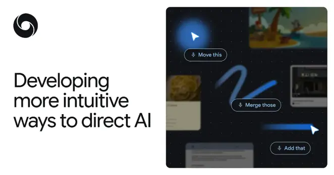

An interesting mode of interacting with our computers that humans long use naturally.

DeepMind: Reimagining the mouse pointer for the AI era
[https://deepmind.google/blog/ai-pointer/](https://deepmind.google/blog/ai-pointer/)

*Originally posted on [Mastodon](https://sigmoid.social/@BenjaminHan/116563547804178932).*
