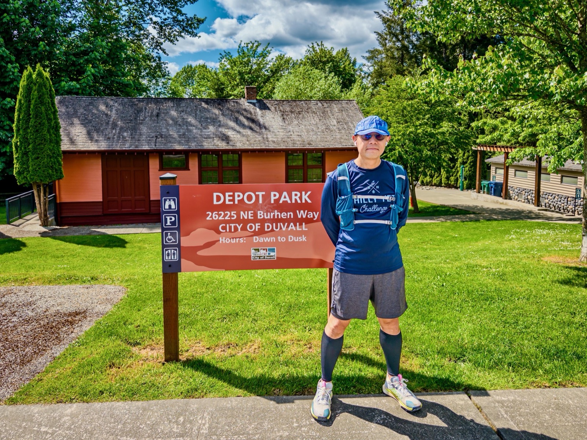
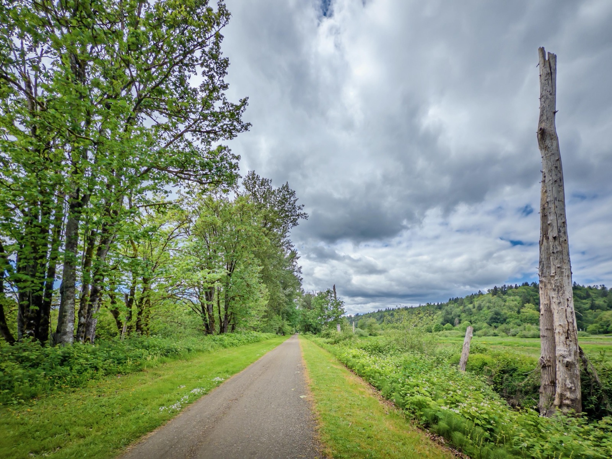

{data-lightbox-src="cover-full.jpeg"}

And, this Long Run Sunday I'm finally back on track, after the disastrous April. I ran 15K on the beautiful Snoqualmie Valley Trail from Duvall!

First 6mi was easy, but then I was spooked by a lady runner shadowing me and sped up in the last 3.3mi. Thank you unnamed fellow runner to get me off my lazy a*s!

Also cut a video recap — haven't done so in a while now.

](youtube-thumb.jpg){fig-align="center"}

{data-lightbox-src="image-2-full.jpeg"}

{data-lightbox-src="image-3-full.jpeg"}

{data-lightbox-src="image-4-full.jpeg"}

---

*Originally posted on [Mastodon](https://sigmoid.social/@BenjaminHan/116592749952225551).*
