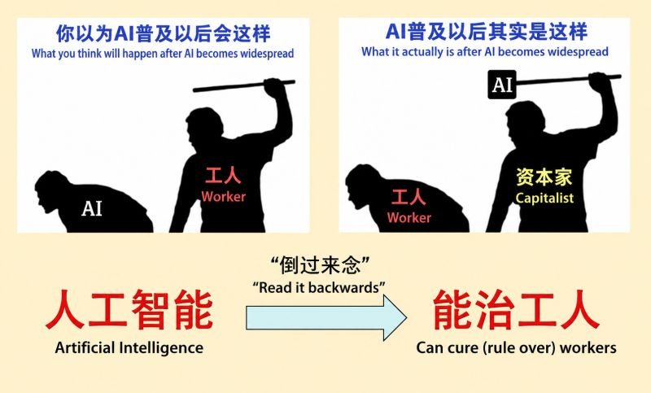

{fig-align="center"}

This meme has been circulating on Chinese social media since at least 2021.

The wordplay: read "人工智能" (artificial intelligence) backwards, and it becomes "能治工人" (can rule over workers).

---

*Originally posted on [LinkedIn](https://www.linkedin.com/posts/benjaminhan_tech-ai-meme-share-7463623221150388224-y9cJ).*

## Related Posts

- [GPTs Are GPTs: Labor Market Impact of Large Language Models](/posts/20230321-gpts-are-gpts-labor-market-impact/): the empirical underside of the meme's joke — which workers' tasks LLMs actually expose.
- [What Remains Scarce After AGI: Alex Imas and Phil Trammell on Labor, Capital, and Redistribution](/posts/20260608-alex-imas-phil-trammell/): takes up the same labor-versus-capital anxiety the meme voices and asks whether the labor share really collapses.
- [Karen Hao on Empire of AI: OpenAI, AGI Believers, and a New Colonialism](/posts/20260608-ai-cult-exposed/): the same power-over-workers framing, traced to the industry's hunger for cheap labor.
