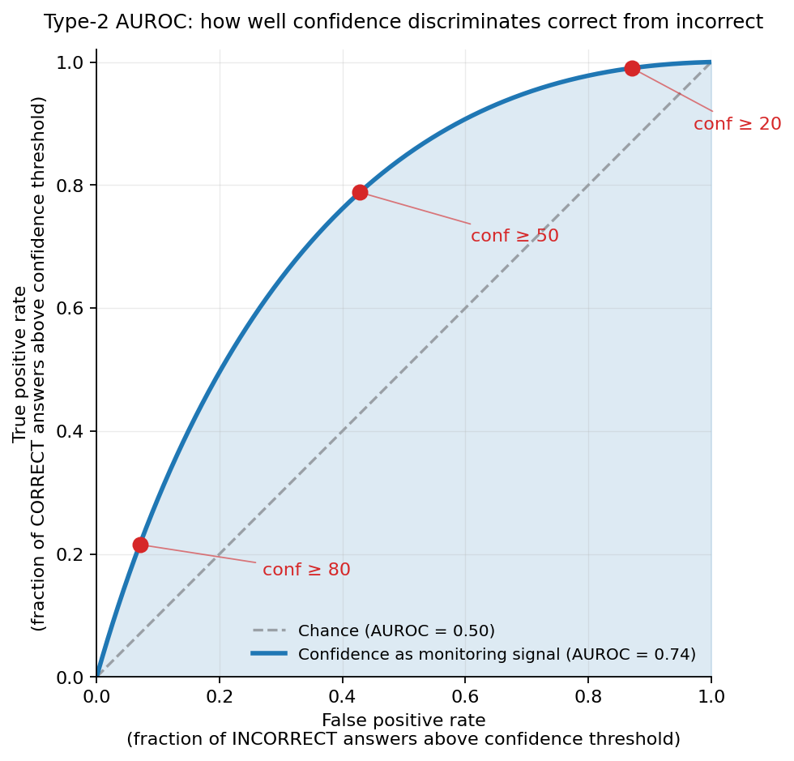

![Figure 1 from the paper [[1]](#ref-1).](cover.jpg){fig-align="center"}

In *Domain-level metacognitive monitoring in frontier LLMs: A 33-model atlas* [[1]](#ref-1), [Jon-Paul Cacioli](https://scholar.google.com/citations?user=L3xQLp0AAAAJ) (Independent Researcher) administers 1,500 MMLU items across six pre-grouped domains to 33 frontier models from eight families and shows that aggregate Type-2 AUROC scores conceal stable cross-domain variation in self-monitoring. Applied/Professional knowledge is reliably the easiest domain to monitor, while Formal Reasoning and Natural Science are reliably the hardest.

> Aggregate metacognitive quality scores mask within-model variation across MMLU benchmark domains. We administered 1,500 MMLU items (250 per domain, under an a priori six-domain grouping) to 33 frontier LLMs from eight model families and computed Type-2 AUROC per model-domain cell using verbalized confidence (0-100). Total observations: 47,151. *Every model with above-chance aggregate monitoring showed non-trivial domain-level variation.* Applied/Professional knowledge was reliably the easiest benchmark domain to monitor (mean AUROC = .742, ranked top-2 in 21 of 33 models); *Formal Reasoning and Natural Science were reliably the hardest* (one of the two ranked bottom-2 in 27 of 33 models). The three middle domains were statistically indistinguishable (Kendall's W = .164). A subject-level coherence analysis (within-domain similarity ratio = 0.95) confirms the six-domain grouping is a pragmatic benchmark taxonomy, not a validated latent construct. *Within-family profile-shape clustering is significant for Anthropic, Google-Gemini, and Qwen* (permutation $p<.0001$) but not DeepSeek, Google-Gemma, or OpenAI. Gemma 4 31B showed a +.202 AUROC improvement over Gemma 3 27B. Three models classified Invalid on binary KEEP/WITHDRAW probes produced normal profiles under verbalized confidence, confirming probe-format specificity. Bootstrap 95% CIs on 198 cells have median width .199. *Split-half aggregate stability $r = .893$; profile-level split-half is weaker (grand median $r = .184$).* These results show stable benchmark-domain variation obscured by aggregate metrics, and support benchmark-stage domain screening as a step before deployment in specific application areas.

## Methods

The atlas's substrate and pipeline:

- **Items.** 1,500 MMLU [[2]](#ref-2) [[2]](#ref-2) questions split 250-per-domain across six a priori groupings (Applied/Professional, Factual recall, Formal reasoning, Humanities/Comprehension, Natural science, Social/Moral). Per-domain sampling drawn from a much larger MMLU pool:

  ![Table 1 from the paper [[1]](#ref-1).](table1.png){fig-align="center"}

- **Models.** 33 frontier LLMs across 8 families:
  - Anthropic
  - OpenAI
  - Google-Gemini
  - Google-Gemma
  - DeepSeek
  - Qwen
  - Mistral
  - Zhipu
- **Elicitation.** Each model answers each item and emits a verbalized confidence in 0–100.
- **Metric.** Type-2 AUROC measures how well the model's verbalized confidence discriminates its own correct from incorrect answers. Sweep the confidence threshold from 0 to 100; the y-axis is the fraction of correct answers above threshold (true-positive rate), the x-axis is the fraction of incorrect answers above threshold (false-positive rate). AUROC is the area under that curve: 0.5 means confidence carries no signal about correctness, 1.0 means every correct answer got higher confidence than every incorrect one.

  {fig-align="center"}
- **Inference.** Each (model, domain) pair — 33 × 6 = 198 in total — gets its own AUROC plus a 95% **confidence interval (CI)** — the range of values consistent with the data. The interval is built by resampling that pair's items 1,000 times with replacement and taking the middle 95% of the resulting AUROCs. So every model-domain pair carries a real uncertainty bar, not just a point estimate (median CI width across the panel: .199).

## Results

Across 47,151 observations, every model with above-chance aggregate monitoring shows non-trivial domain-level variation. The figures unpack the picture row by row.

- **The full atlas at a glance.** Figure 1 (the cover above) is the whole picture in one frame: 33 rows (one per model) × 6 columns (one per domain), colored by Type-2 AUROC against a chance midpoint of .50. Reading across a row shows how a single model's self-monitoring varies by knowledge domain. Reading down a column shows how a single domain is monitored across the panel. Black horizontal lines group sibling models within each of the 8 families. Every subsequent figure in this section is a slice of this same data.

- **Some knowledge is easier to monitor than others.** Ask 33 frontier models how confident they are and check whether their answers were actually right, and the gap between domains is large. Applied/Professional questions — medicine, law, business — are reliably the easiest: mean AUROC = .742, top-2 in 21 of 33 models. Formal Reasoning and Natural Science (math, physics, logic) are reliably the hardest, with one of the two landing in the bottom-2 for 27 of 33 models. The middle three (Factual, Humanities, Social) are statistically indistinguishable from each other.

  ![Figure 2 from the paper [[1]](#ref-1).](figure2.png){fig-align="center"}

- **Family lineage matters as much as model size.** Anthropic models (n=8) average .778 with a tight range (.708–.806), the top of the panel. DeepSeek (n=3) is second at .740. Google-Gemma (n=5) averages .574 at the bottom, but with a wide range (.498–.771): some Gemma models are competitive, others sit near the chance line (.500). OpenAI's panel (n=5) is similarly wide (.530–.793), with GPT-oss-20B at the top (.793, second-best in the entire 33-model panel) and GPT-oss-120B near chance (.530), same vendor, same release, six-times scale difference, dramatically different self-monitoring. Two families with similar overall capability can have very different metacognitive averages. DeepSeek beats both Gemini and Qwen here despite a smaller panel.

  ![Figure 3 from the paper [[1]](#ref-1).](figure3.png){fig-align="center"}

- **Some families share monitoring fingerprints; others don't.** A *fingerprint* is the per-domain shape vector: peaks where the model knows-what-it-knows well, troughs where its confidence isn't useful. Subtract each model's overall average AUROC from its per-domain scores so models with different overall levels can be compared on the same footing. What's left is the relative-strength pattern (which domains the model is above-average on, which below). Anthropic, Google-Gemini, and Qwen sibling models cluster tightly: their relative-strength patterns are recognizably similar within each family (permutation $p<.0001$). DeepSeek, Google-Gemma, and OpenAI don't — within-family pattern spread is comparable to cross-family spread. A model's overall AUROC across domains (its *level*) is also much easier to measure than its per-domain pattern (its *shape*): split each model's items in half and the level reproduces at $r=.893$, but the shape only at $r=.184$. So 250 items per domain pin down each model's average score, but not a stable fingerprint.

  ![Figure 4 from the paper [[1]](#ref-1).](figure4.png){fig-align="center"}

- **Generations move differently for different families.** Anthropic's curve climbed from Opus 4.1 to 4.5, then plateaued: 4.5, 4.6, and 4.7 are essentially flat across Opus, Sonnet, and Haiku. Gemma 4 produces the largest within-family generational jump in the atlas — Gemma 4 31B is +.202 above Gemma 3 27B at comparable parameter count, suggesting the new training pipeline shifted metacognitive monitoring directly rather than just scaling capability. DeepSeek's V3.1 → V3.2 → R1 shows steady improvement release-over-release. A single number per family hides which families are *still moving*.

  ![Figure 5 from the paper [[1]](#ref-1).](figure5.png){fig-align="center"}

- **Aggregate scores are reproducible.** Split each model's 1,500-item pool into two random halves and compute AUROC on each. Almost every model lands on the diagonal — half-1 score predicts half-2 score with cross-model $r = .893$. Three models sit conspicuously below the line (Opus 4.7, Gemini 3 Flash, GLM-5), so their aggregate scores are noisier than typical, but at the panel level the level estimate is solid. Without this check, the headline rankings — Anthropic on top, Gemma at the bottom — could just be a fluke of which questions landed in the sample. At $r=.893$, they're not: split the items in half and the same rankings emerge.

  ![Figure 6 from the paper [[1]](#ref-1).](figure6.png){fig-align="center"}

- **Three models look "broken" on a binary probe but fine on a continuous one.** Cacioli's earlier *KEEP/WITHDRAW battery* [[3]](#ref-3) is a different kind of metacognitive probe: after the model produces an answer, it's asked one binary question — "would you KEEP this answer, or WITHDRAW it?" — yes or no. That probe flagged three models as Invalid. DeepSeek-R1 said WITHDRAW *more often when its answer was correct* than when it was wrong (an inverted signal, the opposite of useful). Gemini 3.1 Pro and Qwen Think said KEEP for almost everything regardless of correctness (a blanket-yes pattern that carries no information). Run the same three models through the atlas's verbalized 0–100 confidence probe and the profiles come out normal: MMLU AUROCs of .769, .765, and .745 respectively, all well above chance. So "this model can't self-monitor" can mean "the forced-binary probe breaks for this model"; switching probe format recovers the signal.

  ![Table 5 from the paper [[1]](#ref-1).](table5.png){fig-align="center"}

- **Probe-format specificity is the broader pattern across the panel.** Plot the verbalized-confidence MMLU AUROC against the binary battery AUROC for the 20 overlapping models, and there's almost no correlation ($r = -.136$ full sample, $r = .030$ after dropping the three Battery-Invalid models). A model's score on one probe format does not predict its score on another. The atlas's headline numbers therefore measure *this elicitation* — verbalized 0–100 confidence on MMLU — not some platonic "metacognitive ability" of each model. Practitioners should treat the elicitation prompt as a hyperparameter, not a transparent window onto the model's self-knowledge.

  ![Figure 7 from the paper [[1]](#ref-1).](figure7.webp){fig-align="center" data-lightbox-src="figure7-full.png"}

Three reproducibility checks — random-sample variance (Figure 6), per-cell uncertainty (Method's CIs), and cross-probe transfer (Table 5 + Figure 7) — together say what's transferable: **Anthropic on top and Gemma at the bottom holds up, but only as a family-level ranking on this exact test.** Reshuffle which 1,500 questions you ask, and the same family ordering emerges ($r=.893$). Compare two models within a family (Sonnet 4.6 vs Opus 4.5, say) and the answer gets noisier — individual-model rankings can shift between samples (median CI width .199). Switch the test format entirely — binary KEEP/WITHDRAW instead of 0–100 confidence — and the rankings dissolve ($r=-.136$). For any deployment that doesn't match MMLU-verbalized confidence at the family level, re-measure on the actual evaluation.

## My Notes

- **Picking a base model needs both accuracy *and* metacognitive numbers, and the atlas supplies the metacognitive half at domain resolution.** Aggregate AUROC said Gemma 4 31B is +.202 better than Gemma 3 27B, a real number, but it doesn't tell you whether the gain is concentrated in one domain or spread evenly across all six. The atlas's per-domain breakdown answers that, but for *metacognition only*. It measures how reliably the model recognizes its own correctness across knowledge domains, **not how often it's actually correct**. A practitioner picking a base model for medical QA or legal reasoning needs both signals; the atlas supplies the metacognitive one at domain resolution, while raw accuracy is a separate input it doesn't replace.

- **The atlas is the empirical case for per-domain calibration in deployment loops.** Aggregate AUROC is too coarse to predict domain-level signal reliability. Any system that conditions on metacognitive signals at inference needs to calibrate per domain, not just per model. The recent [metacognitive harness for Sonnet-4.6](/posts/20260522-metacognitive-harness/) [[4]](#ref-4) takes half this step with a per-model SVM, but Cacioli's data points to per-(model, domain) as the floor.

- **One reading: family-level clustering tracks alignment-pipeline consistency, not architecture.** The atlas observes which families share fingerprints (Anthropic, Gemini, Qwen) and which don't (DeepSeek, Gemma, OpenAI), but it can't intervene on the training stack. The causal direction is interpretation, not test. The simplest explanation is alignment-pipeline behavior: where the post-training recipe is stable across sibling models, monitoring fingerprints rhyme; where it shifts, they diverge. Anthropic's publicly documented Constitutional AI [[5]](#ref-5) is the firmest anchor on the stable side. The three non-clustering families all show publicly documented pipeline shifts this generation: DeepSeek's V→R reasoning-model split, Gemma 3→4's training overhaul, OpenAI's o-series running alongside GPT-5.

- **An open extension: how do these profiles change under adversarial elicitation?** [The Compliance Trap](/posts/20260522-compliance-trap/) [[6]](#ref-6) shows that 8 of 11 frontier models lose up to 30.2 accuracy points when instructed to commit to a confident answer with no abstention path, while Anthropic models stay immune. The atlas measures monitoring on standard verbalized-confidence prompts. Whether the family-level clustering signature survives the same compliance-forcing pressure that wrecks accuracy is a sharper test of how robust each family's monitoring profile actually is, and the natural follow-up to running the atlas under non-adversarial conditions only.

---

## References

1. [Cacioli, J.-P.](https://scholar.google.com/citations?user=L3xQLp0AAAAJ) "Domain-level metacognitive monitoring in frontier LLMs: A 33-model atlas." *arXiv preprint* (arXiv:2605.06673), April 21, 2026. <https://arxiv.org/abs/2605.06673>
2. [Hendrycks, D.](https://people.eecs.berkeley.edu/~hendrycks/), Burns, C., Basart, S., Zou, A., Mazeika, M., Song, D., and Steinhardt, J. "Measuring Massive Multitask Language Understanding." *ICLR 2021* (arXiv:2009.03300). <https://arxiv.org/abs/2009.03300>
3. [Cacioli, J.-P.](https://scholar.google.com/citations?user=L3xQLp0AAAAJ) "Before You Interpret the Profile: Validity Scaling for LLM Metacognitive Self-Report." *arXiv preprint* (arXiv:2604.17707), April 20, 2026. <https://arxiv.org/abs/2604.17707>
4. [Cao, Q.](https://scholar.google.com/citations?user=46U_bhgAAAAJ), [Wang, Y.](https://www.semanticscholar.org/author/2108111686), [Qin, P.](https://scholar.google.com/citations?user=BnkNS80AAAAJ), [Zhang, S.](https://scholar.google.com/citations?user=Rj13ryoAAAAJ), and [Xie, P.](https://pengtaoxie.github.io/) "LLMs Know When They Know, but Do Not Act on It: A Metacognitive Harness for Test-time Scaling." *arXiv preprint* (arXiv:2605.14186), May 13, 2026. <https://arxiv.org/abs/2605.14186>
5. [Bai, Y.](https://yuntaobai.com/), [Kadavath, S.](https://www.linkedin.com/in/saurav-kadavath/), Kundu, S., [Askell, A.](https://www.amandaaskell.com/), Kernion, J., Jones, A., Chen, A., Goldie, A., Mirhoseini, A., McKinnon, C., Chen, C., [Olsson, C.](https://www.catherineolsson.com/), [Olah, C.](https://colah.github.io/), Hernandez, D., Drain, D., [Ganguli, D.](https://deepganguli.com/), Li, D., Tran-Johnson, E., [Perez, E.](https://ethanperez.net/), Kerr, J., Mueller, J., Ladish, J., Landau, J., Ndousse, K., Lukosuite, K., Lovitt, L., Sellitto, M., Elhage, N., Schiefer, N., Mercado, N., DasSarma, N., Lasenby, R., Larson, R., Ringer, S., Johnston, S., Kravec, S., El Showk, S., Fort, S., Lanham, T., Telleen-Lawton, T., Conerly, T., Henighan, T., Hume, T., [Bowman, S. R.](https://cims.nyu.edu/~sbowman/), Hatfield-Dodds, Z., Mann, B., [Amodei, D.](https://en.wikipedia.org/wiki/Dario_Amodei), Joseph, N., McCandlish, S., Brown, T., and [Kaplan, J.](https://sites.krieger.jhu.edu/jared-kaplan/) "Constitutional AI: Harmlessness from AI Feedback." *arXiv preprint* (arXiv:2212.08073), December 15, 2022. <https://arxiv.org/abs/2212.08073>
6. Kumar, R. "The Compliance Trap: How Structural Constraints Degrade Frontier AI Metacognition Under Adversarial Pressure." *arXiv preprint* (arXiv:2605.02398), May 14, 2026. <https://arxiv.org/abs/2605.02398>
