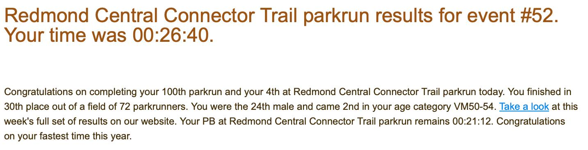
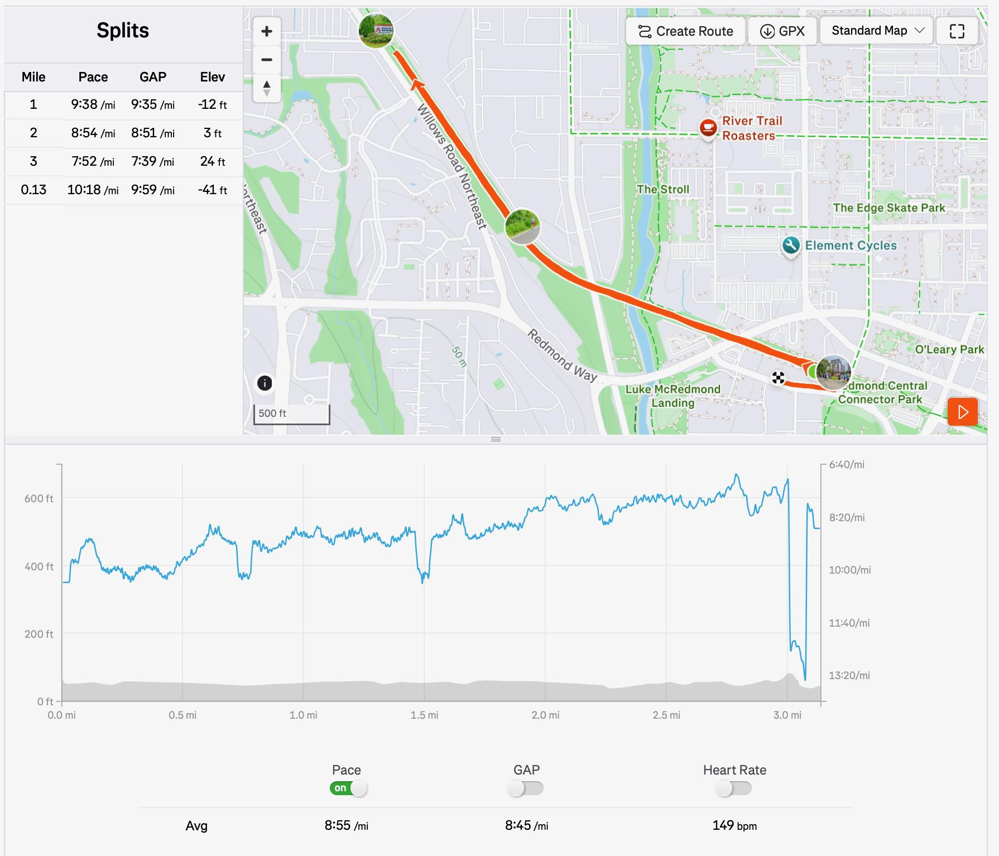
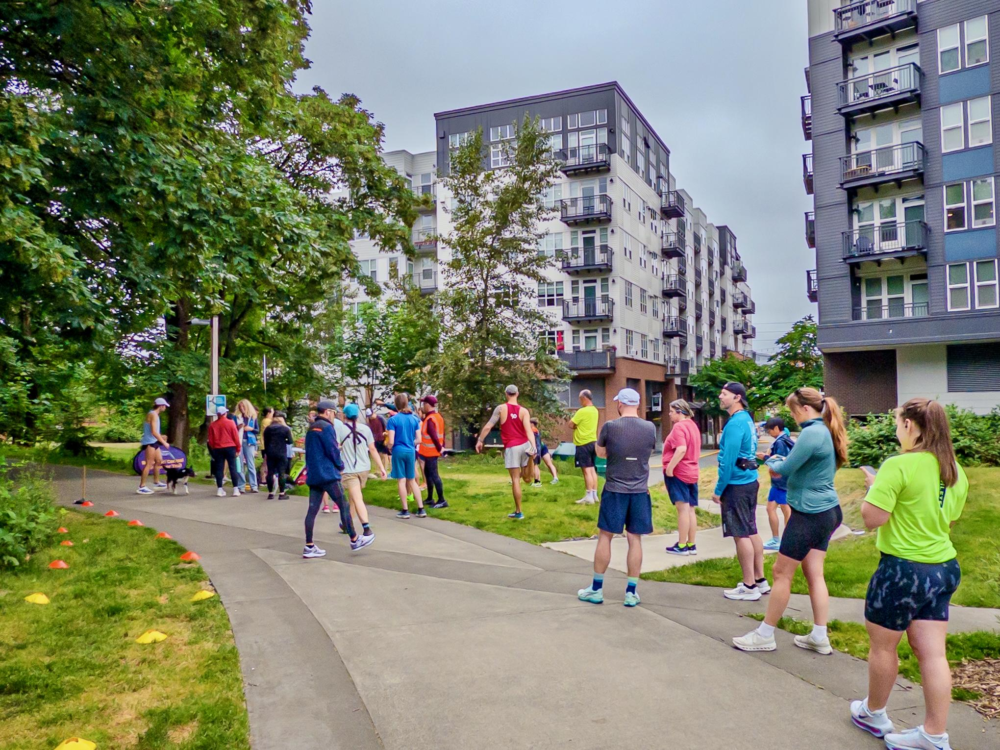
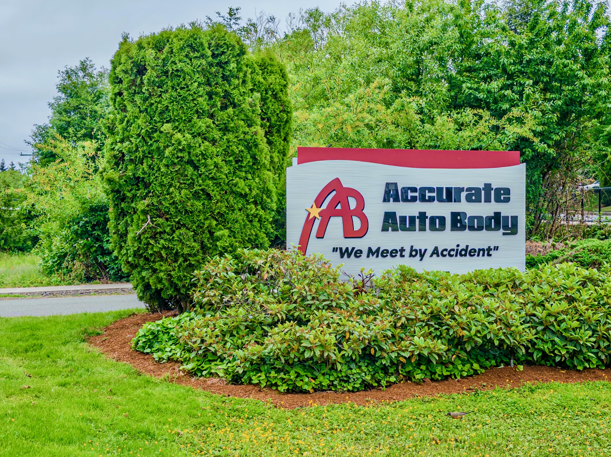

So I did it! I ran my 100th parkrun today, and it happened to be the one-year anniversary of the Redmond Central Connector Trail Parkrun!

Still far away from my prime days of Parkrun racing, but at least I'm faster than last week, and I finally made it back to sub-8' this time!

{data-lightbox-src="image-1-full.jpeg"}

{data-lightbox-src="image-2-full.jpeg"}

{data-lightbox-src="image-3-full.jpeg"}

{data-lightbox-src="image-4-full.jpeg"}

---

*Originally posted on [Mastodon](https://sigmoid.social/@BenjaminHan/116628280333438528).*
