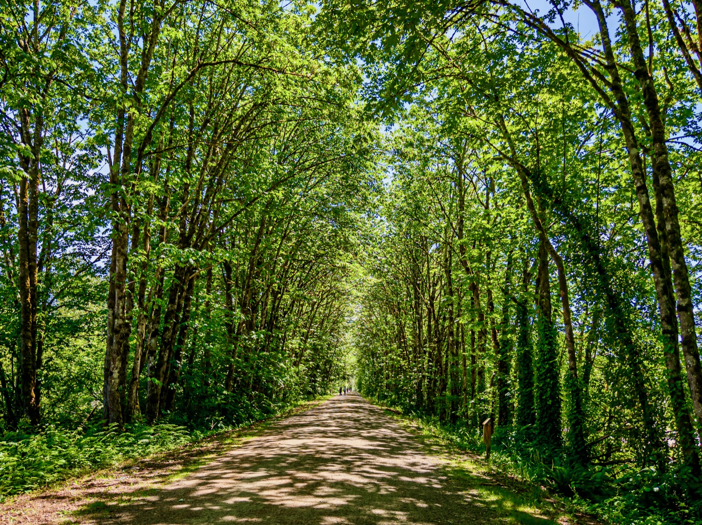
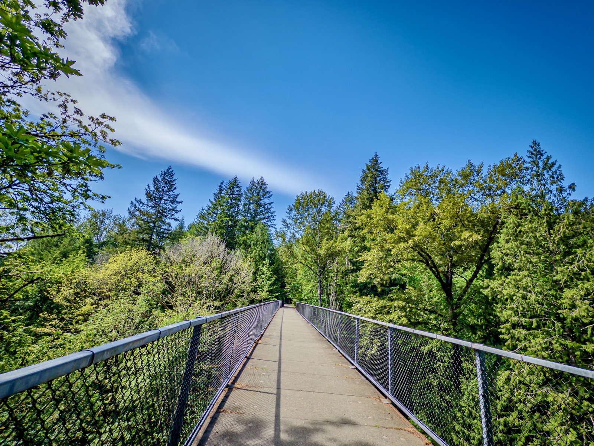
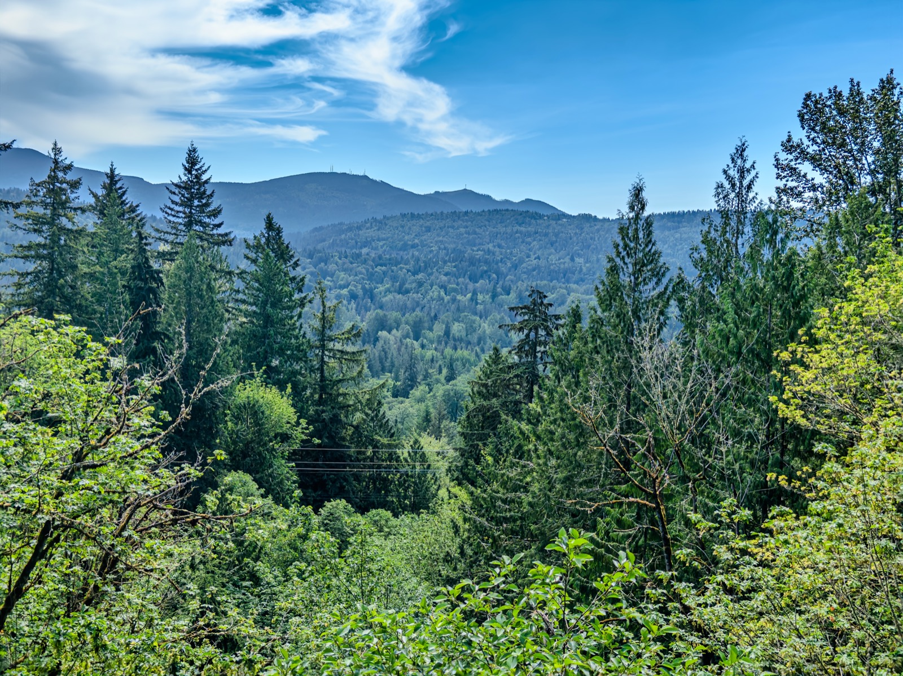
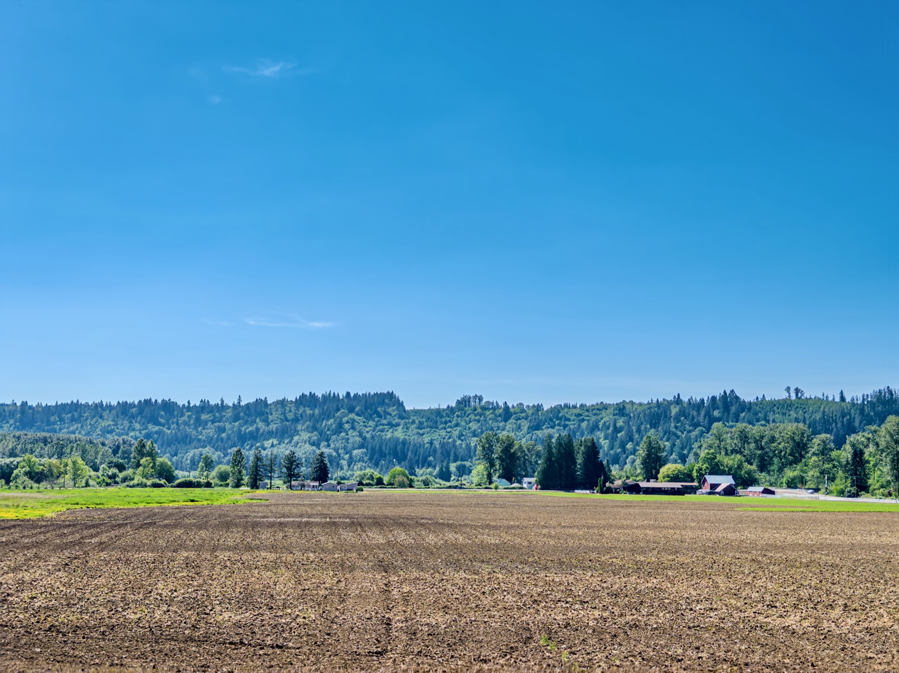
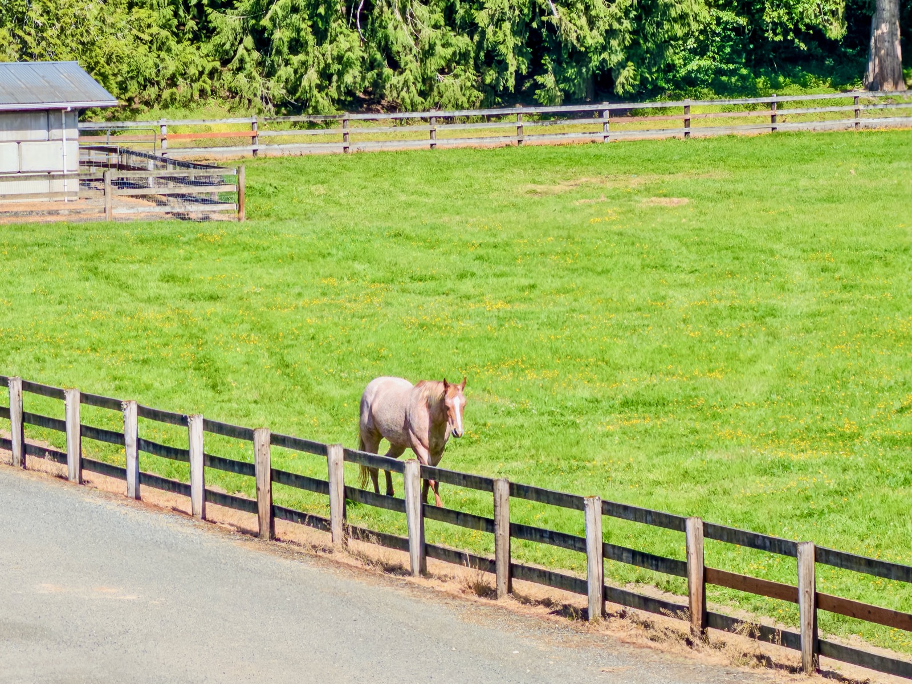
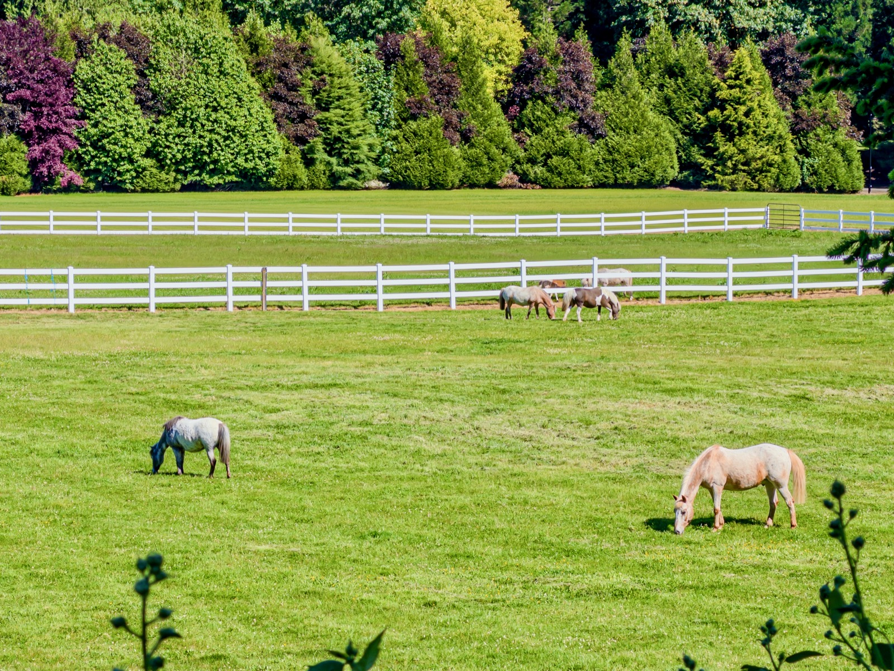
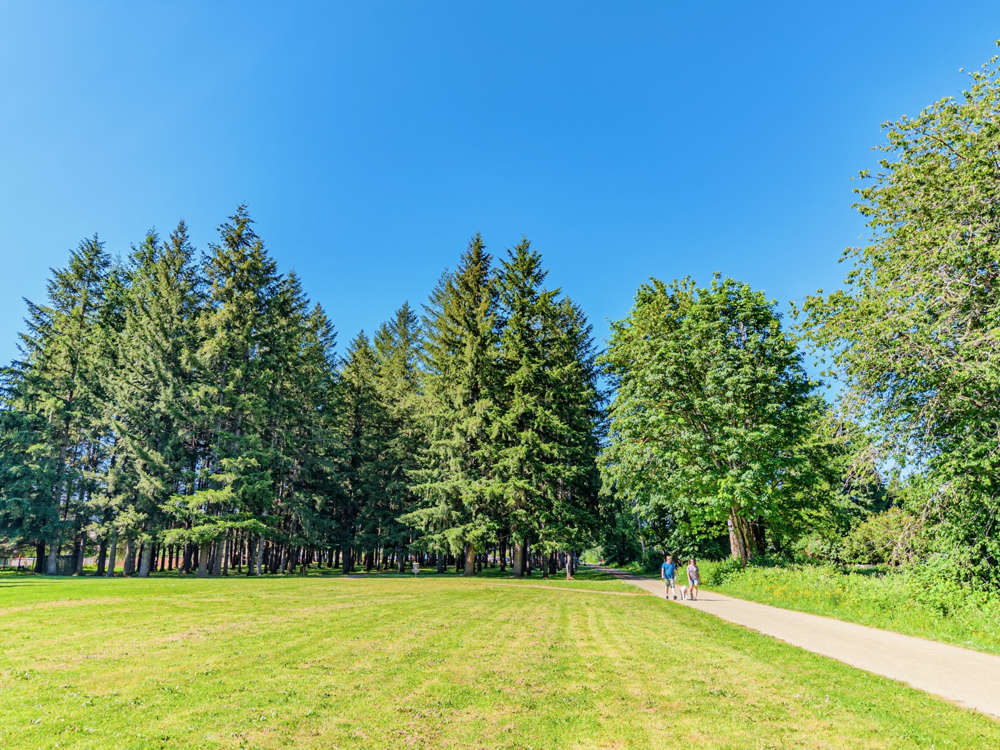
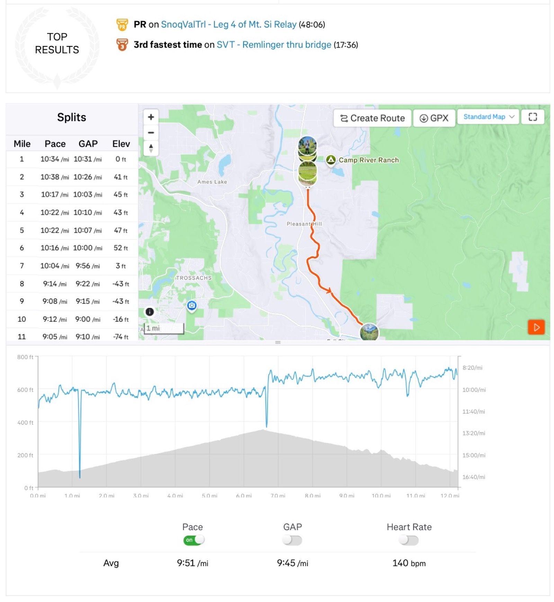

{data-lightbox-src="cover-full.jpeg"}

This Long Run Sunday I'm back to Snoqualmie Valley Trail, but starting from Carnation southbound and ran a half marathon: 6.6mi up and 6.6mi down, but walking the last mile for recovery. Pace: 10'27”/mi up and 9’09”/mi down.

This is the longest distance I've run in the past couple months due to injury. VO2max finally started climbing back a little to 46.4.

{data-lightbox-src="image-2-full.jpeg"}

{data-lightbox-src="image-3-full.jpeg"}

{data-lightbox-src="image-4-full.jpeg"}

{data-lightbox-src="image-5-full.jpeg"}

{data-lightbox-src="image-6-full.jpeg"}

{data-lightbox-src="image-7-full.jpeg"}

{data-lightbox-src="image-8-full.jpeg"}

Video recap:

](video-dDwljQWGe1w.jpg){fig-align="center"}
