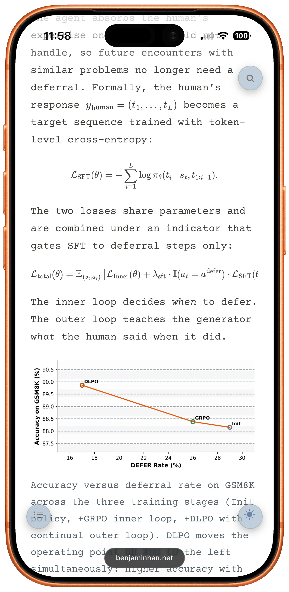
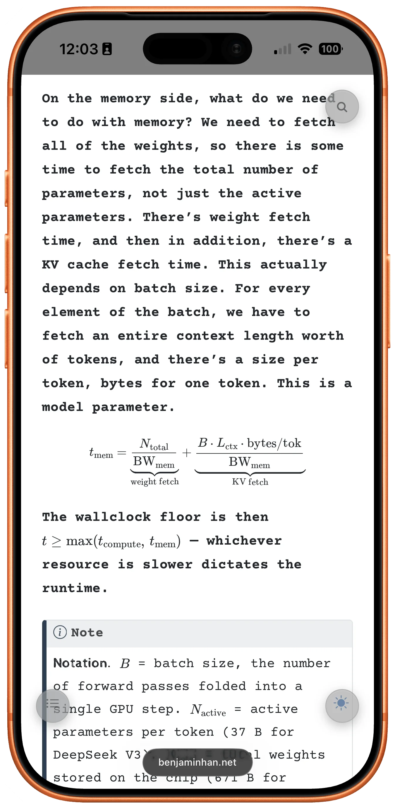
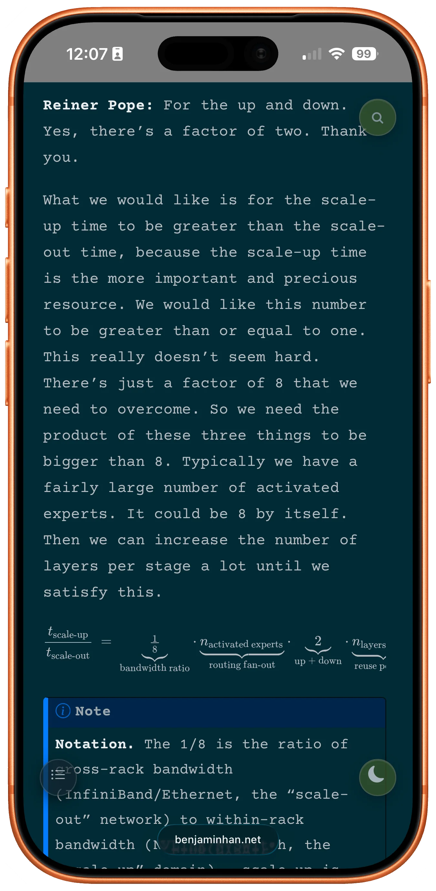

Just added a “manuscript” font palette to my blog [https://benjaminhan.net](https://benjaminhan.net) and man these look so sexy, esp the dark mode — looks like blackboard!

{data-lightbox-src="cover-full.png"}

{data-lightbox-src="image-2-full.png"}

{data-lightbox-src="image-3-full.png"}

*Originally posted on [Mastodon](https://sigmoid.social/@BenjaminHan/116636803161522655).*
