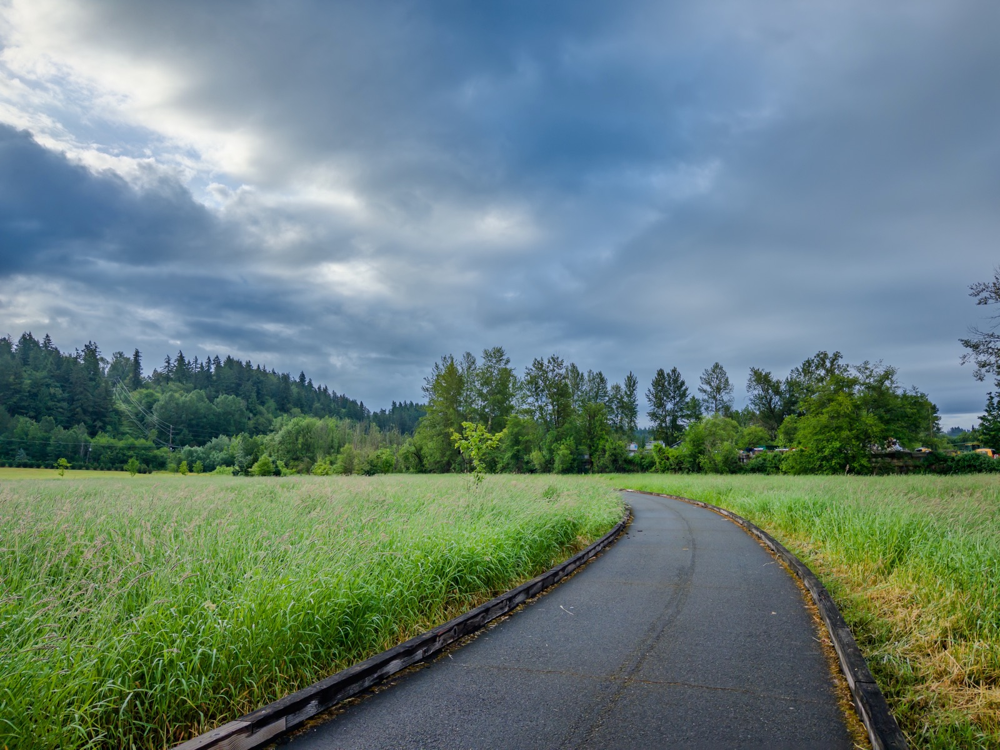
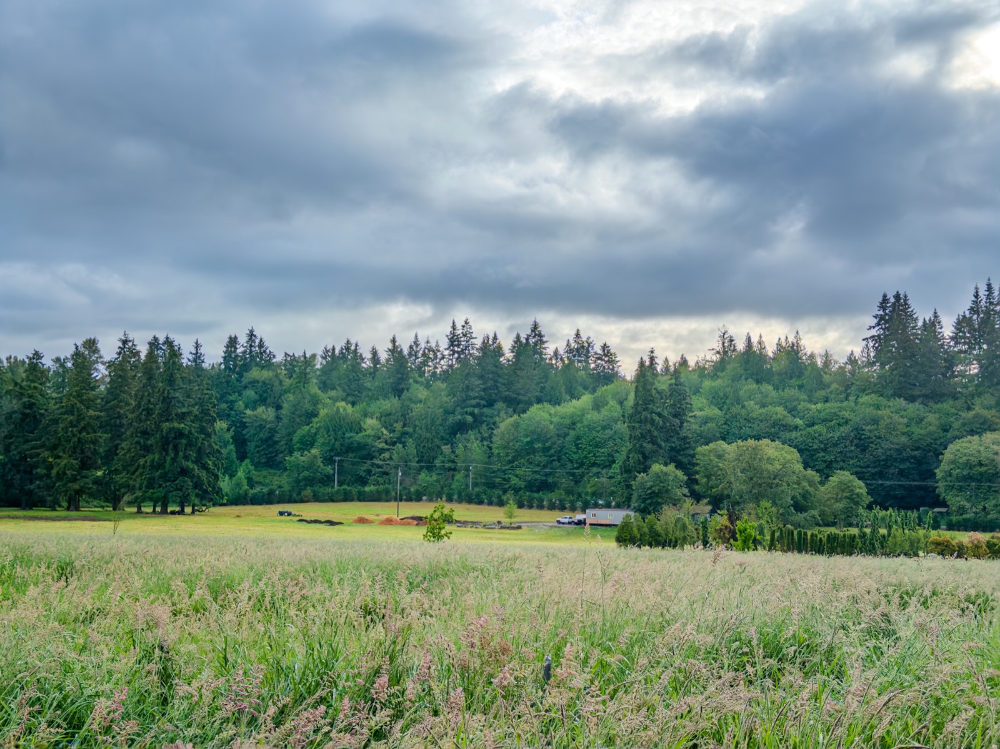
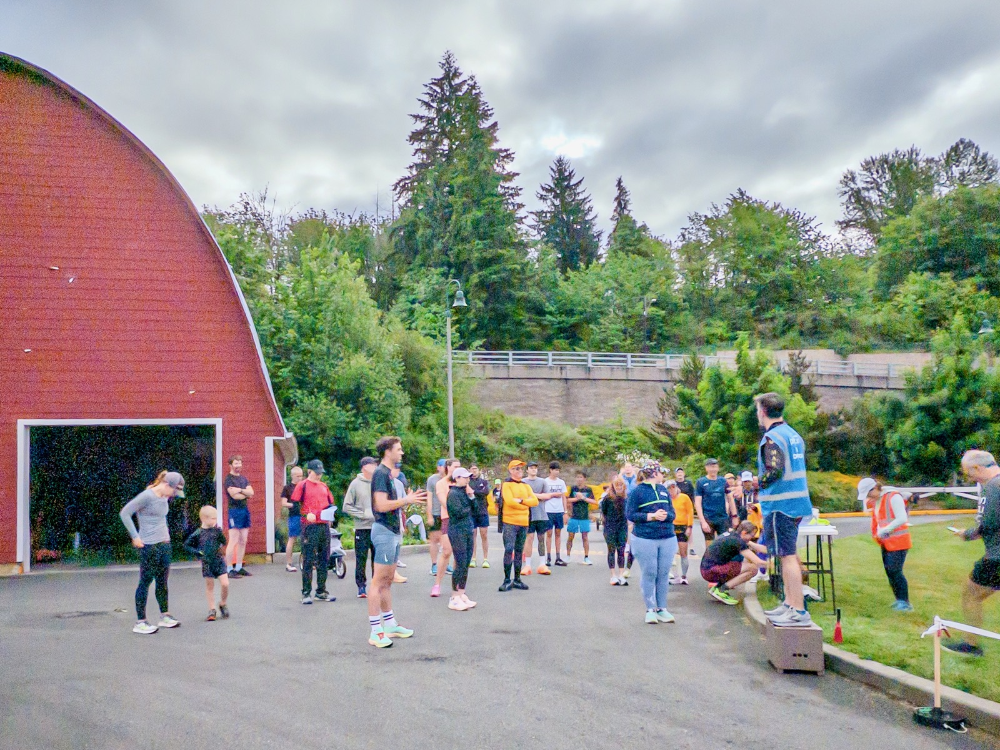
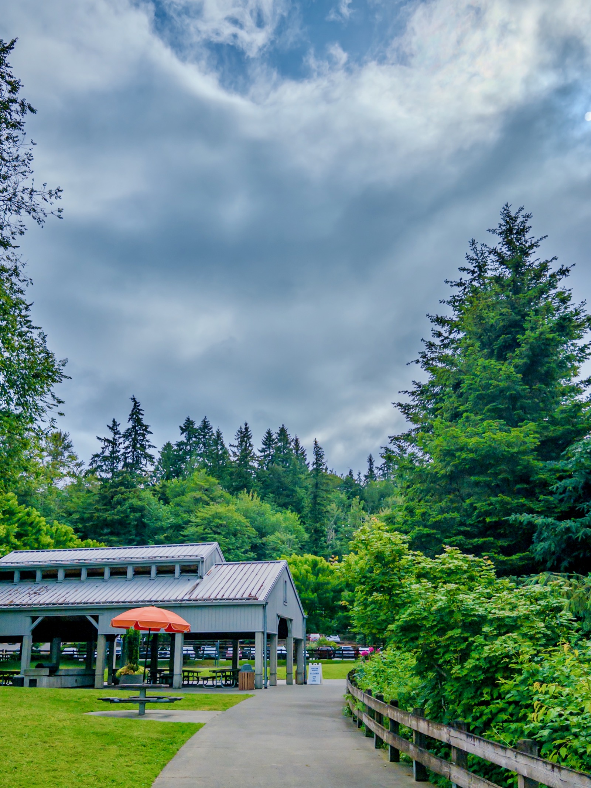

My 101st parkrun today -- 45F in the morning!

Getting faster now, but still a long way to climb back to sub 22' since injuries. My VO2max recovered from rock bottom 45.3 to today's 48.6 in two weeks though!

{data-lightbox-src="image-1-full.jpeg"}

{data-lightbox-src="image-2-full.jpeg"}

{data-lightbox-src="image-3-full.jpeg"}

{data-lightbox-src="image-4-full.jpeg"}

---

*Originally posted on [Mastodon](https://sigmoid.social/@BenjaminHan/116665493976464225).*
