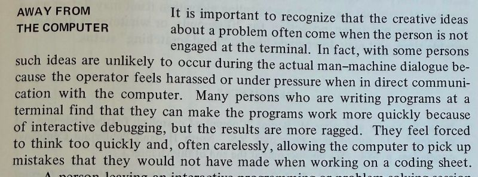

Wisdom from 53 years ago: don't be forced into fast and careless thinking by machines.

Source: Design of Man-Computer Dialogues, James Martin, Prentice-Hall, 1973.

Credit goes to <https://hachyderm.io/@thomasfuchs/116669585909479539>

---

*Originally posted on [LinkedIn](https://www.linkedin.com/posts/benjaminhan_ai-futureofwork-cognition-activity-7466886924000006144--lKB).*

## Related Posts

- [AI Assistance Reduces Persistence and Hurts Independent Performance](/posts/20260528-ai-assistance-reduces-persistence/): randomized-trial evidence for the 1973 warning, showing AI help lowers later unaided performance and raises the give-up rate.
- [Is AI Cannibalizing Human Intelligence?](/posts/20260426-ai-cannibalizing-human-intelligence/): the same worry about machines quietly degrading human judgment, framed as incremental outsourcing too small to notice.
- [Humans Need Rest, Even When Machines Don't](/posts/20260119-burning-out-with-ai-coding-agents/): the workplace version, where machine pace pushes knowledge workers past sustainable thinking.
- [Agentic Coding Is a Trap](/posts/20260507-agentic-coding-is-a-trap/): the same trade of judgment for throughput, argued for the case of coding agents.
