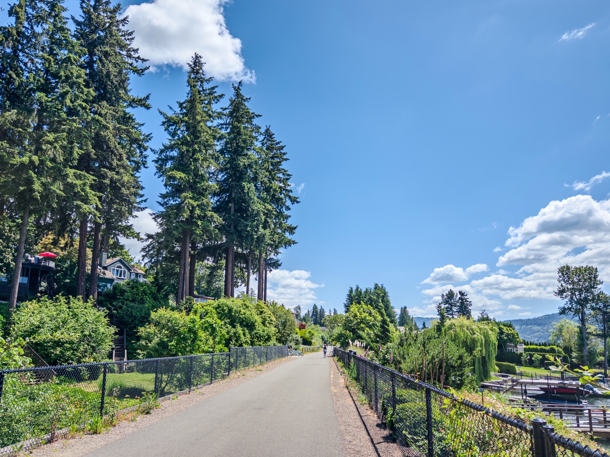
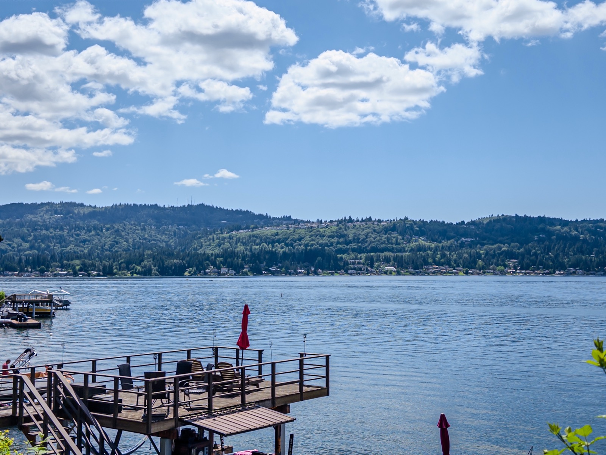
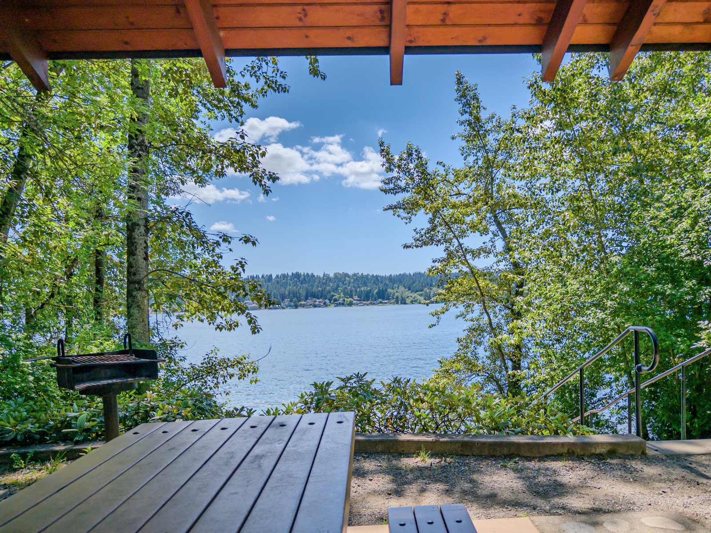
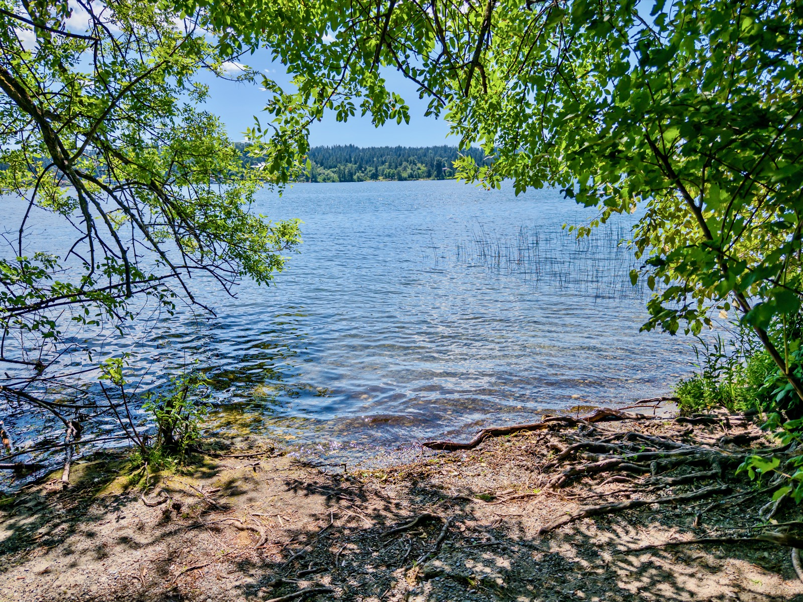
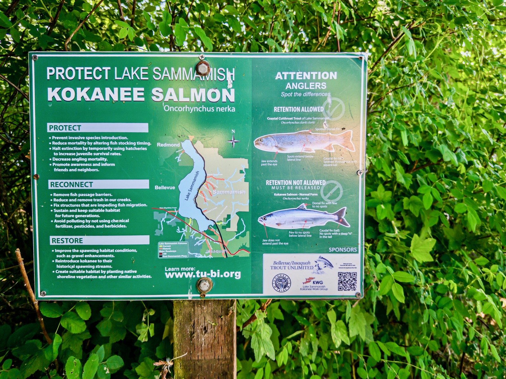
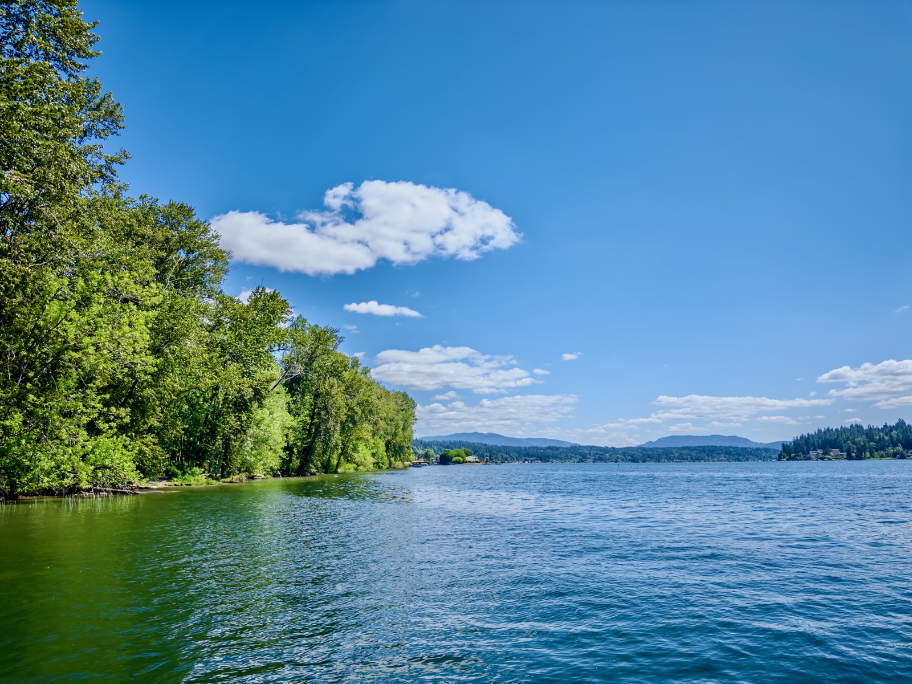
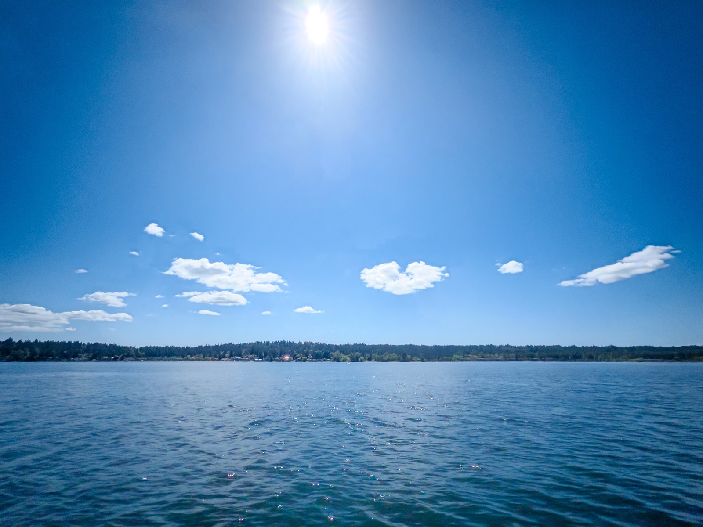
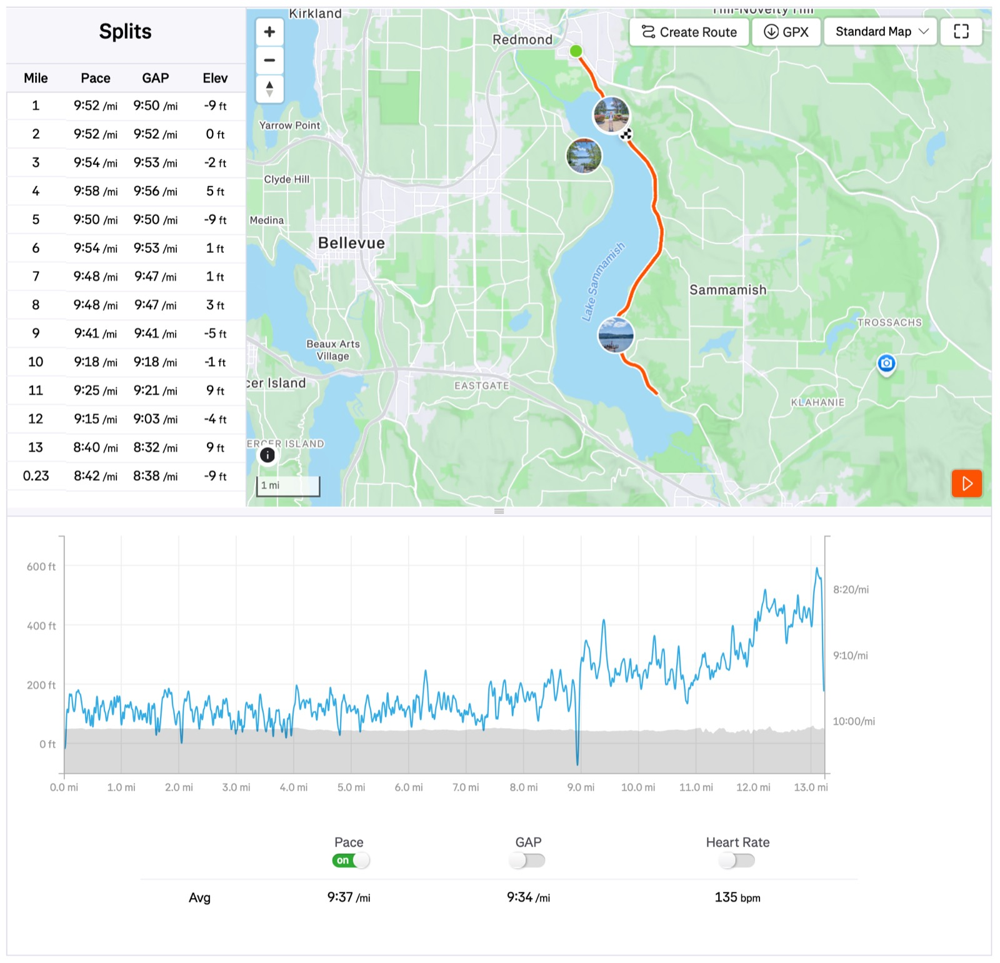

This long run Sunday I went for a flatter easy road run on East Sammamish Lake Trail to run my 80th half marathon: time 2:07:13 pace 9'37"/mi.

It's a sunny day, felt like 62F w/ mild breeze 3.8mph NNW. I consumed ~600cc electrolyte and two gels during the run.

This is the longest run in the past month, and also since my injuries a couple months ago. I'm feeling stronger each day w/ VO2max now recovered to 48.7 (still a long way to all-time high 54).

I'll leave my monthly running recap to tomorrow. I'm giving myself the month of June to decide if I want to revise down my annual target of 2,500mi (I'm behind 150mi so far).

{data-lightbox-src="cover-full.jpeg"}

{data-lightbox-src="image-2-full.jpeg"}

{data-lightbox-src="image-3-full.jpeg"}

{data-lightbox-src="image-4-full.jpeg"}

{data-lightbox-src="image-5-full.jpeg"}

{data-lightbox-src="image-6-full.jpeg"}

{data-lightbox-src="image-7-full.jpeg"}

{data-lightbox-src="image-8-full.jpeg"}

---

*Originally posted on [Mastodon](https://sigmoid.social/@BenjaminHan/116672387640676425).*
