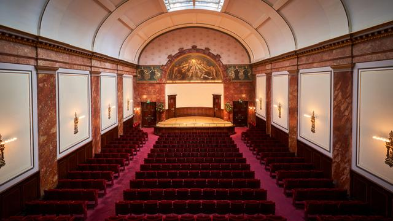

> Wigmore Hall Live relaunches as a digital-only platform in partnership with Apple Music Classical as part of the Hall’s 125th Anniversary celebrations this year.

[https://www.gramophone.co.uk/content/news/wigmore-hall-and-apple-music-classical-announce-new-partnership](https://www.gramophone.co.uk/content/news/wigmore-hall-and-apple-music-classical-announce-new-partnership)

*Originally posted on [Mastodon](https://sigmoid.social/@BenjaminHan/116686588599882730).*
